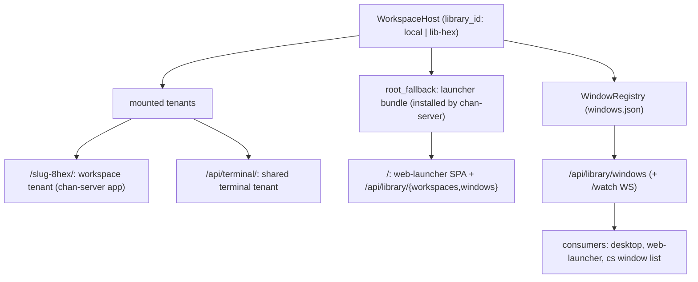

# chan-library design

The orchestration layer that mounts many tenants under one server and is the single source of truth for "what windows exist", whether local or remote.

## What it provides

- **`WorkspaceHost`** mounts workspace tenants at the keyed pathspec `/{slug}-{8hex}/` (`allocate_workspace_prefix`: basename slug + 8 hex of the canonical-root hash) and the shared terminal at `/api/terminal/`; `host_dispatch` routes by prefix. When no tenant prefix matches `/`, it serves an install-once **`root_fallback`** router; the higher layer (chan-server) installs the launcher bundle there (`install_root_fallback` / `install_launcher_root_fallback`), so the library root serves the `web-launcher` SPA + `/api/library/*` instead of 404ing. The hook keeps the frontend bundle out of this low-level crate while letting the root live in `host_dispatch` (chan-server depends on chan-library, not the reverse).
- **`WindowRegistry`** + the **window feed** `/api/library/windows` (+ `/watch` WS): the authoritative `WindowRecord` set, keyed by `library_id` (`local` vs `lib-<hex>`).
- **`/api/library/workspaces`** (list + add/on/off/rm) over the `WorkspaceHost` pub API (`open_registered_workspace`, `close_workspace`, ...). Mutation requires the surface bearer (loopback) or a signed gateway assertion (tunnel), the owner's or a grantee's alike since a grant is all-or-nothing; a tunnel caller without a verifiable assertion is refused (401), and a tunnel-only devserver with no local bind has nowhere to mount (503).
- **Library-owned lifecycle**: first-open one-terminal marker, workspace on/off overlay (path-keyed + shared so standalone and devserver-restart reuse a persisted index without rebuilding), terminal persistence.
- **Reverse-tunnel registry slot**: the host holds the `chan_revtunnel::TunnelRegistry` and exposes it through `HostControl::tunnel_registry`; chan-server's control socket and tunnel WS legs consume it (same inversion seam as the launcher root).

Registered workspace opens run `Library::open_workspace` on Tokio's blocking pool with an owned root and cloned library handle. Permit waits, writer-lock acquisition, canonicalization and trash cleanup therefore do not park a runtime worker. The optional registration mutex is asynchronous and stays on the caller; no synchronous host guard crosses the await. Tenant mounting resumes on the runtime after a successful open, and typed workspace failures remain `Error::Core`.

A user-intent close commits when it detaches the runtime and records off in the workspace overlay, before asynchronous teardown. Cancelling teardown aborts tenant tasks and clears the transient closing state with a feed notification; the off intent remains persisted. Shutdown closes preserve the overlay's desired state.

The window registry, workspace overlay, and local color store stamp save snapshots under their data locks and serialize disk writes separately. A snapshot older than the latest attempted save is skipped, even if that save reports a directory-sync error after publication, so delayed writers cannot roll persisted state back while readers remain independent of disk I/O. JSON saves use `chan_workspace::fs_ops::atomic_write` for unique temporary files and file/directory fsync.

## Boundaries

- No HTTP frontend bundle lives here. chan-library exposes the `root_fallback` *slot*; chan-server (the higher layer) fills it. Same dependency direction as the rest of the stack.
- The on/off overlay + persistence are this crate's; consumers (the launcher routes in chan-server) go through the `WorkspaceHost` pub API rather than the persistence internals.
