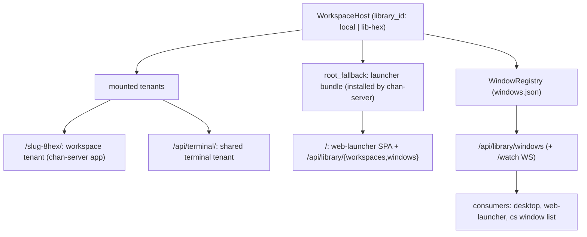

# chan-library design

The orchestration layer that mounts many tenants under one server and is the single source of truth for "what windows exist", whether local or remote.

## What it provides

- **`WorkspaceHost`** mounts workspace tenants at the keyed pathspec `/{slug}-{8hex}/` (`allocate_workspace_prefix`: basename slug + 8 hex of the canonical-root hash) and the shared terminal at `/api/terminal/`; `host_dispatch` routes by prefix. When no tenant prefix matches `/`, it serves an install-once **`root_fallback`** router; the higher layer (chan-server) installs the launcher bundle there (`install_root_fallback` / `install_launcher_root_fallback`), so the library root serves the `web-launcher` SPA + `/api/library/*` instead of 404ing. The hook keeps the frontend bundle out of this low-level crate while letting the root live in `host_dispatch` (chan-server depends on chan-library, not the reverse).
- **`WindowRegistry`** + the **window feed** `/api/library/windows` (+ `/watch` WS): the authoritative `WindowRecord` set, keyed by `library_id` (`local` vs `lib-<hex>`).
- **`/api/library/workspaces`** (list + add/on/off/rm) over the `WorkspaceHost` pub API (`open_registered_workspace`, `close_workspace`, ...). Mutation requires the surface bearer (loopback) or a signed gateway assertion (tunnel), the owner's or a grantee's alike since a grant is all-or-nothing; a tunnel caller without a verifiable assertion is refused (401), and a tunnel-only devserver with no local bind has nowhere to mount (503).
- **Library-owned lifecycle**: first-open one-terminal marker, workspace on/off overlay (path-keyed + shared so standalone and devserver-restart reuse a persisted index without rebuilding), terminal persistence.
- **Reverse-tunnel registry slot**: the host holds the `chan_revtunnel::TunnelRegistry` and exposes it through `HostControl::tunnel_registry`; chan-server's control socket and tunnel WS legs consume it (same inversion seam as the launcher root).

Registered workspace opens run `Library::open_workspace` on Tokio's blocking pool with an owned root and cloned library handle. Permit waits, writer-lock acquisition, canonicalization and trash cleanup therefore do not park a runtime worker. An in-process `WorkspaceAlreadyOpen` retries at 25 ms intervals for up to one second, keeping the status `Starting` while the prior owner releases. After that first conflict, `WorkspaceLocked` also retries within the same budget: dropping the prior owner clears its lock record before releasing the flock. A `WorkspaceLocked` seen before any in-process conflict returns immediately. The retry budget bounds waiting between opens, not a synchronous filesystem operation already in progress. Tenant mounting resumes on the runtime after a successful open, and typed workspace failures remain `Error::Core`.

An idempotent registration, a close by root and a removal each hold an asynchronous lock keyed by the root's canonical key across the open, the release budget and the blocking hops; no synchronous host guard crosses the await. The key is computed on the blocking pool before the lock is awaited, so two spellings of one root share a lock and a caller whose root hangs while its key is computed holds none. Callers of one root serialize; callers of different roots never wait on each other, so at the host one root's release budget, open or stalled filesystem call holds up only that root's callers. A caller holds at most one root lock, and a root's entry goes when its last caller does. The only lock a caller may already hold when it takes one is the devserver's mount-attempt lock for that root's prefix, which the devserver keeps per prefix in the same kind of map (`KeyedLocks`) and holds from an attempt's intent check through its adoption or cleanup; every other lock on the path is taken after the root lock, and nothing that holds a root lock takes an attempt lock. Cancelling the caller sets a shared flag so the blocking closure stops before its next open attempt. A successful open abandoned by the caller stops and joins its startup recovery before dropping the workspace, including when a completed blocking result is dropped without being received. An open already in progress and the recovery join can outlast the retry budget.

A cancelled registered mount or an in-process writer-handle conflict that survives the release budget settles `Starting` into `Error` with `workspace is still releasing; retry`, unless the root is actually mounted, in which case its transient state is cleared. Cancellation uses the retry state because an already-running blocking open can retain the writer handle until it returns. A later successful mount reports `Running`.

A failed unregister settles `Removing` into `Error` with the returned failure reason and a status-feed notification, so a retained registration can be retried. A removal the caller abandons at any point ends in one of two states and never a third: the workspace is still registered with a retryable `Error` row (`workspace removal cancelled; retry`, or `panicked` on an unwind), or every step has completed. The overlay forget and the window purge run first, without awaiting, both keyed and idempotent so a retry repeats them harmlessly; the unregister runs last on the blocking pool and clears the mount-state row in the same closure. A blocking hop cannot be cancelled, so the pool finishes an unregister whose caller is gone, and because no await separates the unregister from that clear, it leaves no row naming a workspace the launcher can no longer list.

A user-intent close commits when it detaches the runtime and records off in the workspace overlay, before asynchronous teardown. Cancelling teardown aborts tenant tasks and clears the transient closing state with a feed notification; the off intent remains persisted. Shutdown closes preserve the overlay's desired state. Teardown stops and joins tenant tasks, drops socket and other keepalive owners, then clears the workspace cell and waits for the writer lock to release. An in-flight blocking operation, including an MCP tool call, can retain its workspace handle until that operation returns.

The window registry, workspace overlay, and local color store stamp save snapshots under their data locks and serialize disk writes separately. A snapshot older than the latest attempted save is skipped, even if that save reports a directory-sync error after publication, so delayed writers cannot roll persisted state back while readers remain independent of disk I/O. JSON saves use `chan_workspace::fs_ops::atomic_write` for unique temporary files and file/directory fsync. The window registry reads its store row by row: a row the running build cannot read (a `kind` or `origin` tag from another release, or a damaged row) is logged, kept out of the window set and the feed, and written back by every save, so a later build that opens the same library afterwards finds them.

Each hosted runtime stores its normalized canonical root before publication. By-root lookups canonicalize only the caller's target, outside the workspace-map lock, and compare it with those stored keys so a mounted root's filesystem cannot block lookup while the shared routing map is locked. After tenant construction, root validation runs on the blocking pool without the map lock. Publication then checks both prefix and canonical root under the write lock; a losing runtime shuts down after releasing that guard, which is what settles two different roots racing onto one prefix, since their mounts hold different locks and run at once. The root's lock serializes idempotent registrations of that root across the open and mount. Closing and removing by root compute the caller's key on the blocking pool before any lock is taken, and the registry lookup and unregister behind them run there too; the transient mount state works from that key or from the runtime's stored one, so neither path canonicalizes on a runtime worker. The window purge matches each record by the path it stores, lexically normalized, against that key and the path the removal was asked for, and resolves no record's path, so a removal never waits on the filesystem of another workspace that has a window; a record minted with some other alias of the root is left. Only the root's lock is held across those hops, as it is across a mount's open, and the hopped work takes no host guard except the removal's unregister, which takes the mount-state mutex alone after the registry call has returned. The stores these paths write for every root, the overlay, the window registry and the library registry, serialize their writes under locks of their own, and none of those locks is held across a root's filesystem. A library registry lookup canonicalizes its target before taking the registry's mutex; when no row's cached canonical path matches (and for a removal always, so a stale duplicate goes too), it copies out the other rows' stored roots, re-resolves them without the mutex, each on a thread that concurrent lookups of that root share, and waits at most two seconds for them, then takes the mutex again and re-checks the match against the rows as they are. A root that has not answered within the wait is taken not to be the one looked up, so a registration, open or removal waits at most that long on another root that has stopped answering and holds up no other registry call while it waits. Loading and reloading the registry prime each row's cached path from the canonical root it stores. Resolving a registered workspace's prefix, as the launcher's and the devserver's routes do, hashes that stored root (`registered_workspace_prefix`) rather than resolving it again.

An idempotent registration that finds the root already mounted revalidates it on the blocking pool before handing that tenant back, so a caller learns from the workspace's status that the root has gone away or been replaced without waiting for the next health probe tick. Both the probe and this pre-check fold their result into the same degraded state: a reachable root clears it, and every failure over a root that is still mounted records `Unavailable` with the reason a row displays. Neither tears a tenant down, and neither turns an unusable root into a mount failure, which would record a tenant as gone while it is still serving routes and holding live terminals. Closing the workspace clears the state.

Cancelling a mount does not stop an already-running blocking root check: its workspace handle retains the writer lock until `ensure_root_available` returns, indefinitely if the root hangs. The host settles the cancelled registered mount into `Error` with `workspace is still releasing; retry`.

## Boundaries

- No HTTP frontend bundle lives here. chan-library exposes the `root_fallback` *slot*; chan-server (the higher layer) fills it. Same dependency direction as the rest of the stack.
- The on/off overlay + persistence are this crate's; consumers (the launcher routes in chan-server) go through the `WorkspaceHost` pub API rather than the persistence internals.
