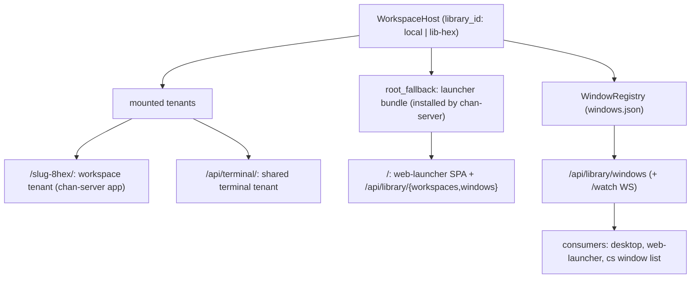

# chan-library design

The orchestration layer that mounts many tenants under one server and is the single source of truth for "what windows exist", whether local or remote.

## What it provides

- **`WorkspaceHost`** mounts workspace tenants at the keyed pathspec `/{slug}-{8hex}/` (`allocate_workspace_prefix`: basename slug + 8 hex of the canonical-root hash) and the shared terminal at `/api/terminal/`; `host_dispatch` routes by prefix. When no tenant prefix matches `/`, it serves an install-once **`root_fallback`** router; the higher layer (chan-server) installs the launcher bundle there (`install_root_fallback` / `install_launcher_root_fallback`), so the library root serves the `web-launcher` SPA + `/api/library/*` instead of 404ing. The hook keeps the frontend bundle out of this low-level crate while letting the root live in `host_dispatch` (chan-server depends on chan-library, not the reverse).
- **`WindowRegistry`** + the **window feed** `/api/library/windows` (+ `/watch` WS): the authoritative `WindowRecord` set, keyed by `library_id` (`local` vs `lib-<hex>`).
- **`/api/library/workspaces`** (list + add/on/off/rm) over the `WorkspaceHost` pub API (`open_registered_workspace`, `close_workspace`, ...). Mutation requires the surface bearer (loopback) or a signed gateway assertion (tunnel), the owner's or a grantee's alike since a grant is all-or-nothing; a tunnel caller without a verifiable assertion is refused (401), and a tunnel-only devserver with no local bind has nowhere to mount (503).
- **Library-owned lifecycle**: first-open one-terminal marker, workspace on/off overlay (path-keyed + shared so standalone and devserver-restart reuse a persisted index without rebuilding), terminal persistence.
- **Reverse-tunnel registry slot**: the host holds the `chan_revtunnel::TunnelRegistry` and exposes it through `HostControl::tunnel_registry`; chan-server's control socket and tunnel WS legs consume it (same inversion seam as the launcher root).

```mermaid
flowchart TB
  Host["WorkspaceHost (library_id: local | lib-hex)"]
  Host --> Reg["WindowRegistry (windows.json)"]
  Host --> Mounts["mounted tenants"]
  Host --> Root["root_fallback: launcher bundle (installed by chan-server)"]
  Mounts --> WsT["/slug-8hex/: workspace tenant (chan-server app)"]
  Mounts --> TermT["/api/terminal/: shared terminal tenant"]
  Root --> Launch["/: web-launcher SPA + /api/library/{workspaces,windows}"]
  Reg --> Feed["/api/library/windows (+ /watch WS)"]
  Feed --> Consumers["consumers: desktop, web-launcher, cs window list"]
```

Registered workspace opens run `Library::open_workspace` on Tokio's blocking pool with an owned root and cloned library handle. Permit waits, writer-lock acquisition, canonicalization and trash cleanup therefore do not park a runtime worker. An in-process `WorkspaceAlreadyOpen` retries at 25 ms intervals for up to one second, keeping the status `Starting` while the prior owner releases. After that first conflict, `WorkspaceLocked` also retries within the same budget: dropping the prior owner clears its lock record before releasing the flock. A `WorkspaceLocked` seen before any in-process conflict returns immediately. The retry budget bounds waiting between opens, not a synchronous filesystem operation already in progress. Tenant mounting resumes on the runtime after a successful open, and typed workspace failures remain `Error::Core`.

An idempotent registered open, a close by root and a removal serialize under an asynchronous lock keyed by the root's canonical key. The caller owns that lock through lifecycle settlement and releases it when its future is dropped; blocking filesystem work does not own it. Resolving the key runs on the blocking pool before the lock is taken. One computation per spelled path is in flight, with its answer cloned to callers waiting for it. Two spellings can each hold a key-computation thread because their canonical identity is not yet known. Lifecycle bookkeeping and mounted-runtime lookups use stored keys without resolving the root on a runtime worker.

Separate call permits bound filesystem work by canonical root and call kind. A mount permit covers a registered mount from its filesystem open through tenant construction, the post-build root check and settlement. A registered open marks the mount `Starting`, then waits for its permit at most the open's release budget of one second; a permit still held then answers `WorkspaceAlreadyOpen`, as for an in-process owner that has not released, the host's row settles into the retry state below, and an idempotent caller gives its root lock back; on a devserver the failed attempt then writes the error's own sentence over that row and into its record. A granted permit does not end the wait for an owner: the in-process retry above keeps a budget of its own, so a caller can wait two budgets, about two seconds, before it answers. The answer does not say whether the permit's holder has taken the writer lock; a holder still stuck before it draws the same error, whose words say the workspace is already open in this process. The launcher's add and on answer that error with HTTP 503, `Retry-After: 1` and the row's words, and the desktop's open with the row's words; a lock another process holds keeps its own answers. The already-open `open_workspace` API resolves the root's key before it builds its tenant, permits concurrent tenant construction, then waits for the same mount permit with no budget before dispatching its root check and keeps it through publication or disposal: it holds no root lock, so no close or removal waits behind it, and giving up would mean shutting down the tenant it has built. Mounted-root revalidation has a separate permit. That permit is held beside a free root lock only by a revalidation whose caller left, and an idempotent open that finds it held returns the mount without a check of its own and publishes nothing; the launcher's add and on then answer with the health last published, so a root that has stopped answering reads running until the health probe marks it. A caller waiting for a permit holds no blocking thread. A later caller that gets a permit performs fresh work with its own arguments; it adopts neither an abandoned result nor its cancellation flag. Mount and revalidation can each retain one blocking thread for a canonical root.

When a caller leaves, what keeps its permit depends on where the call is. An abandoned filesystem open stops and joins startup recovery and releases its workspace before releasing its call permit, including when its completed result is never received. A result that had completed when the caller left is dropped on the thread that drops the caller, a runtime worker in the servers, which then joins that recovery; one that completes after the caller left is dropped on the blocking pool's thread that ran it. An abandoned root check or revalidation drops its own workspace clone before its permit. A caller that leaves while its tenant is built drops the permit with its frame, and one that leaves during the root check leaves the permit with the check; either way the tenant it built is dropped without a shutdown, its tasks aborted without a join and its open-time recovery worker not stopped, and either can retain the workspace after the permit is released. A caller that leaves while a failed mount's tenant shuts down drops its permit while that teardown finishes on a thread of its own. The next permit holder meets such references through the in-process release retry. Cancellation sets that open's own flag, stopping further attempts when control returns from the filesystem. An operation already in progress and recovery disposal can outlast the caller's bound. A panic releases the call permit as the blocking task unwinds; the idempotent caller retains its root lock until it settles the mount's error. The non-idempotent raw registered API and the already-open API do not take lifecycle root locks.

A close or removal can proceed after an abandoned open or revalidation releases its caller's root lock, subject to its own filesystem hops and teardown, and a live caller waiting for a mount permit gives that lock back within the release budget. An abandoned open that already holds the writer lock makes a removal fail with `WorkspaceAlreadyOpen`, which the launcher's delete and the devserver's forget answer with HTTP 500; the removal fails at its unregister, after it has forgotten the overlay rows and purged the window records. A mounted close beside an abandoned revalidation reports completed once its release check's deadline passes, while the stat's clone can still hold the writer lock. The host supplies no deadline for the rest of a lifecycle call; each caller that holds a root's lock across a call to the root's filesystem brings its own, the devserver mount's bound of 60 seconds (`WORKSPACE_MOUNT_TIMEOUT`), counted from the request's start. The devserver's mount bounds its key, its registration and its host mount call, though its prefix-attempt wait and stale cleanup have no such bound; the launcher's add bounds its registration and its open, the launcher's on bounds its open or a mounted root's revalidation, and the desktop's embedded open bounds all its attempts and the waits between them. A live caller holds the root lock across its own filesystem open, tenant build and root check, and across the revalidation of a mounted root, so on a root that stops answering a second open, a close and a removal of that root wait behind it for at most the rest of that bound. At the bound the caller's future is dropped and gives its root lock back, a first open's row settles into the retry state below, and the call on the filesystem runs on with its permit. The launcher answers the expiry with HTTP 503 and no `Retry-After`, since nothing says when the root will answer, and the launcher and the desktop both say `mount timed out after 60 seconds: <root> did not answer`. Mounted close finds its tenant by stored keys after its initial key resolution and uses the teardown behavior described below.

The permits cover the filesystem open, its post-build root check and mounted-root revalidation. Serve/add registration, the close/removal registry lookup and unregister can still retain one blocking thread per cancelled caller. Startup restore registration and external callers of `Library` remain separate; registered opens have no admission barrier against an outstanding registry write. Background health checks retain at most one thread per mounted root, registry alias probes one per probed path while outstanding, and teardown and open-time recovery have their own thread lifetimes. These threads are additional to the key computation and call permits.

The devserver's prefix-attempt lock precedes the root lock, and call permits follow it. No blocking call acquires a root or prefix lock. A caller holds at most one root lock. The short maps of keyed locks contain weak references; a final borrowed guard removes its unused entry, and a later lookup prunes an entry left by a detached guard or cancelled waiter. Each entry-map mutex is held only for lookup and bookkeeping, across no await or filesystem work.

A cancelled registered mount, a mount permit not granted within the release budget, or an in-process writer-handle conflict that survives that budget settles `Starting` into `Error` with `workspace is still releasing; retry`, unless the root is actually mounted, in which case its transient state is cleared. That is the host's row; a devserver's mount attempt that fails with the error then writes the error's own sentence over it. Cancellation uses the retry state because an already-running blocking open can retain the writer handle until it returns. A later successful mount reports `Running`.

A failed unregister settles `Removing` into `Error` with the returned failure reason and a status-feed notification, so a retained registration can be retried. A removal the caller abandons at any point ends in one of two states and never a third: the workspace is still registered with a retryable `Error` row (`workspace removal cancelled; retry`, or `panicked` on an unwind), or every step has completed. The overlay forget and the window purge run first, without awaiting, both keyed and idempotent so a retry repeats them harmlessly; the unregister runs last on the blocking pool and clears the mount-state row in the same closure. A blocking hop cannot be cancelled, so the pool finishes an unregister whose caller is gone, and because no await separates the unregister from that clear, it leaves no row naming a workspace the launcher can no longer list.

A user-intent close commits when it detaches the runtime and records off in the workspace overlay, before asynchronous teardown. Cancelling teardown aborts tenant tasks and clears the transient closing state with a feed notification; the off intent remains persisted. Shutdown closes preserve the overlay's desired state. Teardown gives tenant tasks a five-second shutdown grace, aborts and awaits unfinished tasks, and drops socket and other keepalive owners before clearing the workspace cell and checking writer-lock release in one blocking hop. The awaits after abort finish at each task's next yield because tenant tasks perform their user-root I/O on the blocking pool. The hop shares one five-second deadline (`WORKSPACE_SHUTDOWN_RELEASE_TIMEOUT`), starting at dispatch, between the clear and the lock check. An individual close awaits cell teardown even if it exceeds that deadline, then uses any remaining time for the lock check. Host shutdown drains run tenants in parallel and wait at most five seconds for each hop, proceeding when its deadline expires. A cancelled or unstarted shutdown dispatches its remaining clear off the dropping thread. The shared terminal tenant's Files watch manager requests worker shutdown when its last handle drops and waits at most two seconds (`WATCH_SHUTDOWN_TIMEOUT` in chan-server); a worker still inside a filesystem call is left running with its watch registrations until that call returns or the process exits. An abandoned teardown can leave a blocking thread joining recovery or the watcher, with workspace handles and the writer lock retained until the root answers or the process exits. Open-time recovery only reads the user root and writes derived state under the chan home, so abandoning it loses no user content; the next open schedules recovery again from the durable metadata. If process exit interrupts a document or scene save to a stalled root before its atomic rename, the file keeps its previous contents and a temporary file can remain beside it; a usable dirty recovery record for that edit under the same root's `.chan/editor-sessions/` seeds a reopened session as dirty when disk matches its baseline, clean when disk matches the edit, or conflicted otherwise. Dropping the keepalive ends the root's MCP sessions, which cancels their requests after the tenant tasks' up-to-five-second grace. A peer that closes its transport without a cancel notification instead gives rmcp up to five seconds to drain responses before service drop cancels its requests. JSON tool bodies stop at their next walked entry, report file or search seed after their flag is set, including when their request future is dropped. A seed includes all its hops; work between checks, individual blocking calls and lock waits can retain the workspace (see [MCP cancellation](../chan-llm/design.md)).

The window registry, workspace overlay, and local color store stamp save snapshots under their data locks and serialize disk writes separately. A snapshot older than the latest attempted save is skipped, even if that save reports a directory-sync error after publication, so delayed writers cannot roll persisted state back while readers remain independent of disk I/O. JSON saves use `chan_workspace::fs_ops::atomic_write` for unique temporary files and file/directory fsync. The window registry reads its store row by row: a row the running build cannot read (a `kind` or `origin` tag from another release, or a damaged row) is logged, kept out of the window set and the feed, and written back by every save, so a later build that opens the same library afterwards finds them.

Each hosted runtime stores its normalized canonical root before publication. By-root lookups canonicalize only the caller's target, outside the workspace-map lock, and compare it with those stored keys so a mounted root's filesystem cannot block lookup while the shared routing map is locked. After tenant construction, root validation runs on the blocking pool without the map lock. Workspace publication then checks the prefix against all runtimes and the canonical root against workspace runtimes under the write lock; a losing runtime shuts down after releasing that guard, which is what settles two different roots racing onto one prefix, since their mounts hold different locks and run at once. Publication also checks, under the same lock, that the host's last shutdown sweep has not begun: `shutdown_all` closes publication under the write guard it drains the map under, so a mount from any entry point that reaches publication after it is refused, before its tenant is built or, when the tenant was built before it, at insertion, where it shuts that runtime down the same way; either way it reports that the host is shutting down, and no tenant publishes after it. `shutdown_mounted` drains the map and leaves publication open, for the devserver's first sweep, beside which the registrations it accepted before its stop still publish, for its second sweep to take. The root's lock serializes idempotent registrations of that root across the open and mount. Closing and removing by root compute the caller's key on the blocking pool before any lock is taken, and the registry lookup and unregister behind them run there too; the transient mount state works from that key or from the runtime's stored one, so neither path canonicalizes on a runtime worker. The window purge matches each record by the path it stores, lexically normalized, against that key and the path the removal was asked for, and resolves no record's path, so a removal never waits on the filesystem of another workspace that has a window; a record minted with some other alias of the root is left. Only the root's lock is held across those hops, as it is across a mount's open, and the hopped work takes no host guard except the removal's unregister, which takes the mount-state mutex alone after the registry call has returned. The stores these paths write for every root, the overlay, the window registry and the library registry, serialize their writes under locks of their own, and none of those locks is held across a root's filesystem. A library registry lookup canonicalizes its target before taking the registry's mutex; when no row's cached canonical path matches, a removal included, it copies out the other rows' stored roots, re-resolves them without the mutex, each on a thread that concurrent lookups of that root share, and waits at most two seconds for them, then takes the mutex again and re-checks the match against the rows as they are. A root that has not answered within the wait is taken not to be the one looked up, so one lookup waits at most that long on another root that has stopped answering and holds up no other registry call while it waits. The bound is per lookup: a removal makes several, one for each registry step it takes, and a removal whose own row's cached path is stale can wait that long at each of them. Loading and reloading the registry prime each row's cached path from the canonical root it stores. Resolving a registered workspace's prefix, as the launcher's and the devserver's routes and chan-desktop's window command do, hashes that stored root (`registered_workspace_prefix`) rather than resolving it again. The devserver's mounts and the launcher's add derive the prefix they mount a workspace at the same way, so one workspace has one prefix whichever spelling of it a request names. Listing workspaces, serving the window feed and preparing startup restore resolve no root either, a root another process holds included. A row's status comes from the canonical root and metadata key its registry row stores (`registered_workspace_status`, or `canonical_root_status` for a caller holding only the key). The probe behind a row's `locked` status opens the writer lock under the chan home, and when another process holds it, compares the holder's record, which names the root the holder canonicalized when it took the lock, with the row's stored root as it is (`chan_workspace::lock::probe_foreign_holder`), so a held root whose filesystem hangs reads `locked` and holds up no row. That comparison does not see through a relinked root: when a root's path resolves elsewhere since it was registered, its holder's record names the new location, so the holder reads as another process even when it is this one or has provably died, and such a row reads `locked` where a probe that resolved the root could read `stopped`. The devserver's list copies its records out of its record map before it builds any row, so no row's probe runs while it holds the map the mount, on, off and forget paths take. Only a workspace runtime is found by its canonical root or by the root it was opened at, the registry's stored root, so a root whose path resolves elsewhere since it was registered reads mounted by the path its row stores, and a status asked by that path reads the lifecycle row the host keeps under the runtime's canonical root. A workspace window minted by a key its caller holds, as the devserver's serve handoff and the launcher's window route and command action mint one, goes through `WorkspaceHost::mint_workspace_window`, which stores the root the workspace's runtime was opened at, the registry row's stored root, which is the path the launcher lists the workspace by and nests its windows under. When no workspace runtime goes by the key, as when a serve handoff answers for a mount still pending, it stores the stored root of the registry row that goes by the key (`registry_row_keys`), found without asking any filesystem, and the key itself only when no row does. chan-desktop's serve handoff and `cs window new` mint through it as well, and its New Window and Open in Browser menu commands copy the path of the window they start from, so a window an earlier build stored under the canonical path, and a copy of it, is in the feed and outside its row. A window record is matched lexically against both of a runtime's roots, and restore prepares each persisted row from the root the overlay stores, the root of the record that saved it, which is its registry row's stored root, grouping with that row the rows an earlier build saved under the canonical path the row resolves to and the off rows the host's close or removal by root writes there, and restoring the group on when any of its rows is on, at its highest generation and at least 1, registering on the blocking pool only the rows the registry lacks, within one mount bound. A request's own root, as a serve request, the devserver's open and on routes, the launcher's add and a window mint name it, is resolved through the host's key hop and registered on the blocking pool; the devserver runs both inside the attempt's mount bound, so a request for a root that stopped answering answers when the bound expires, and it settles a record's lifecycle row by the key the record stores.

The fd-store import restores a parked terminal session into the tenant mounted at the prefix its restart manifest names. Where no tenant is mounted there, as when this build derives a workspace's prefix differently from the build that parked the session, the session goes to the one workspace runtime its window's stored path goes by, the lookup the window feed makes for that window (`window_path_runtimes`), so it lands in the tenant the window's panes dial; the lookup compares stored keys under the routing map's lock and asks no filesystem, and each session moved this way is logged at warn with the two prefixes and its window. A terminal window, a workspace row without a path, and a path that no mounted workspace or more than one goes by leave the session skipped, and the devserver ends it as it ends any skipped session. The sessions whose own prefix is mounted are restored first and stay in that tenant whatever workspace their window names. The window decides, not the workspace the session ran in, which the import cannot tell from what it holds in memory, so three kinds of session land in another workspace than their own, each where the feed shows its window: one whose window stores the canonical path of a root whose path has since been pointed at another folder, when that canonical path is registered as a workspace of its own; one a client attached naming a window of another workspace, since an attach binds a session to the window it names; and one whose window was kept after its workspace was forgotten by another process, when the same path was registered again. A moved session keeps the environment it was spawned with, so its `$CHAN_CONTROL_SOCKET` names the old prefix's socket, which nothing binds; `cs` in it finds the tenant that serves its workspace among the devserver's stable sockets beside that one (`crates/chan-shell/design.md`, section 5), and a terminal opened after the restart reaches the tenant directly. That tenant need not be the one that holds the session: `cs` goes by the path its workspace resolves to now, so for the first of the three kinds it reaches the tenant of the folder that path points to, and not the tenant of the canonical path the session's window stores, which holds it.

The health probe checks every mounted root at once, each on a thread of its own, and a tick waits at most two seconds for the answers; a check that has not answered keeps its thread, and the workspace it holds, until the root answers, and later ticks wait on it instead of starting another, so a root that stops answering holds up no other root's row. A check still running when a second tick's budget runs out, about one probe interval after it first missed one, records `Unavailable` with a reason that says the root is not answering; one missed budget records nothing, so a root that is only slow keeps its row, and the check answering healthy clears the state as any healthy answer does, whenever it answers: a check that answers after every tick that joined it has returned folds its own answer in, so a root that is only slow, and misses each tick's budget, clears as soon as a check answers healthy. An idempotent registration that finds the root already mounted revalidates it on the blocking pool before handing that tenant back, so a caller learns from the workspace's status that the root has gone away or been replaced without waiting for the next health probe tick, unless a revalidation whose caller left is still in flight: it then hands the tenant back without a check, and the status is the one the probe publishes. Both the probe and this pre-check fold their result into the same degraded state: a reachable root clears it, and every failure over a root that is still mounted records `Unavailable` with the reason a row displays. Neither tears a tenant down, and neither turns an unusable root into a mount failure, which would record a tenant as gone while it is still serving routes and holding live terminals. Closing the workspace clears the state.

Cancelling a mount does not stop an already-running blocking root check: its workspace handle retains the writer lock until `ensure_root_available` returns, indefinitely if the root hangs. The host settles the cancelled registered mount into `Error` with `workspace is still releasing; retry`.

## Boundaries

- No HTTP frontend bundle lives here. chan-library exposes the `root_fallback` *slot*; chan-server (the higher layer) fills it. Same dependency direction as the rest of the stack.
- The on/off overlay + persistence are this crate's; consumers (the launcher routes in chan-server) go through the `WorkspaceHost` pub API rather than the persistence internals.
