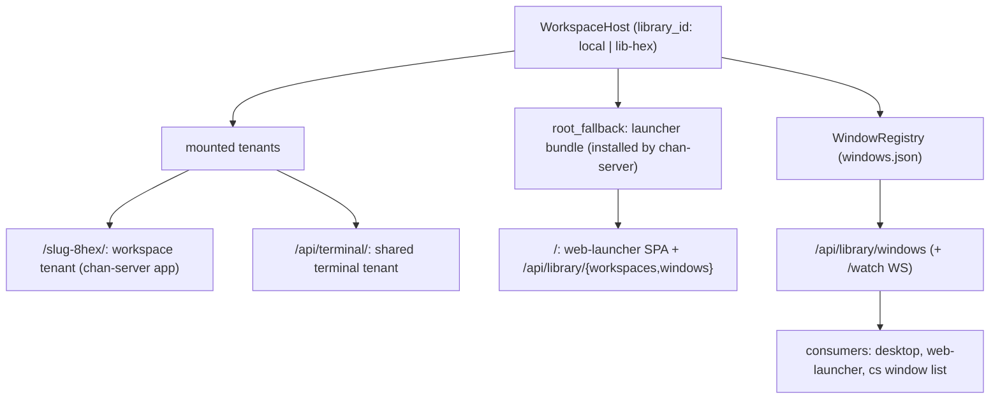

# chan-library design

The orchestration layer that mounts many tenants under one server and is the single source of truth for "what windows exist", whether local or remote.

## What it provides

- **`WorkspaceHost`** mounts workspace tenants at the keyed pathspec `/{slug}-{8hex}/` (`allocate_workspace_prefix`: basename slug + 8 hex of the canonical-root hash) and the shared terminal at `/api/terminal/`; `host_dispatch` routes by prefix. When no tenant prefix matches `/`, it serves an install-once **`root_fallback`** router; the higher layer (chan-server) installs the launcher bundle there (`install_root_fallback` / `install_launcher_root_fallback`), so the library root serves the `web-launcher` SPA + `/api/library/*` instead of 404ing. The hook keeps the frontend bundle out of this low-level crate while letting the root live in `host_dispatch` (chan-server depends on chan-library, not the reverse).
- **`WindowRegistry`** + the **window feed** `/api/library/windows` (+ `/watch` WS): the authoritative `WindowRecord` set, keyed by `library_id` (`local` vs `lib-<hex>`). A record's `connected` is true while any `/ws` socket is live for its window id on the serving tenant, and its `holders` lists the tags those sockets came with, each once and sorted, so a client that tagged its socket reads whether its own is live where another client holds the same window. Both come from one read of the tenant's `WindowPresence`, which counts a window's sockets for each holder beside its untagged ones; an untagged socket counts toward `connected` and is in no list. `holders` is optional on the wire: this library always sends it, empty when no tagged socket is live, and a record without the field is one whose sender cannot say, which a record relayed from a connected devserver's feed can be. The presence wakes the feed when a window's first socket arrives or its last one leaves, and when a holder's first socket for a window arrives or its last one leaves. The host also addresses one window's own `/ws` socket, as a `window_command` frame whose `window_id` is that window: `window_discarded` whenever a record is discarded, `window_hidden` on every hide, `window_shown` when a hidden record becomes visible by any path, and `window_labeled` with its caption. Each goes out once on every mounted tenant's event broadcast and only the pump serving that window id forwards it; nothing is parked for a window with no socket at that moment, so a page whose socket is down then learns nothing of it later. A live socket can likewise lose a frame when its pump falls behind the tenant channel's bound. Two visibility writes of one record in flight together can send frames in the opposite order to their writes, leaving the page's cover out of step with the record until that record changes again or the page reloads.
- **`/api/library/workspaces`** (list + add/on/off/rm) over the `WorkspaceHost` pub API (`open_registered_workspace`, `close_workspace`, ...). Mutation requires the surface bearer (loopback) or a signed gateway assertion (tunnel), the owner's or a grantee's alike since a grant is all-or-nothing; a tunnel caller without a verifiable assertion is refused (401). With a local bind, the devserver serves the same app over TCP and the tunnel; tunnel-only mode has no local TCP listener, and workspace mutations needing its bound address answer 503.
- **Library-owned lifecycle**: first-open one-terminal marker, workspace on/off overlay (path-keyed + shared so standalone and devserver-restart reuse a persisted index without rebuilding), terminal persistence.
- **Reverse-tunnel registry slot**: the host holds the `chan_revtunnel::TunnelRegistry` and exposes it through `HostControl::tunnel_registry`; chan-server's control socket and tunnel WS legs consume it (same inversion seam as the launcher root).

```mermaid
flowchart TB
  Host["WorkspaceHost (library_id: local | lib-hex)"]
  Host --> Reg["WindowRegistry (windows.json)"]
  Host --> Mounts["mounted tenants"]
  Host --> Root["root_fallback: launcher bundle (installed by chan-server)"]
  Mounts --> WsT["/slug-8hex/: workspace tenant (chan-server app)"]
  Mounts --> TermT["/api/terminal/: shared terminal tenant"]
  Root --> Launch["/: web-launcher SPA + /api/library/{workspaces,windows}"]
  Reg --> Feed["/api/library/windows (+ /watch WS)"]
  Feed --> Consumers["consumers: desktop, web-launcher, cs window list"]
```

Registered workspace opens run `Library::open_workspace` on Tokio's blocking pool with an owned root and cloned library handle. Permit waits, writer-lock acquisition, canonicalization and trash cleanup therefore do not park a runtime worker. An in-process `WorkspaceAlreadyOpen` retries at 25 ms intervals for up to one second, keeping the status `Starting` while the prior owner releases. After that first conflict, `WorkspaceLocked` also retries within the same budget: dropping the prior owner clears its lock record before releasing the flock. A `WorkspaceLocked` seen before any in-process conflict returns immediately. The retry budget bounds waiting between opens, not a synchronous filesystem operation already in progress. Tenant mounting resumes on the runtime after a successful open, and typed workspace failures remain `Error::Core`.

An idempotent registered open serializes under an asynchronous lock keyed by the root's canonical key; a close by root and a removal serialize under that lock keyed by the key of the workspace they name (`WorkspaceHost::workspace_key`), which is the root's canonical key for a path that no registry row stores and, for a path that a row stores, can be the canonical root of the runtime opened at it or the canonical path the row last resolved to. The caller owns that lock through lifecycle settlement and releases it when its future is dropped; blocking filesystem work does not own it. Resolving the key runs on the blocking pool before the lock is taken. One computation per spelled path is in flight, with its answer cloned to callers waiting for it. Two spellings can each hold a key-computation thread because their canonical identity is not yet known. Lifecycle bookkeeping and mounted-runtime lookups use stored keys without resolving the root on a runtime worker. A close or a removal of a root no runtime holds finds its registry row by the keys the row stores, the root it stores and the canonical path it last resolved to, compared with the root's key and with the path as given, and reads and clears the root's lifecycle row under the root's key and both of the row's, since a devserver marks a mount attempt under the root a row stores. A close by root and a removal go by the key of the workspace they name (`WorkspaceHost::workspace_key`): a path that a registry row stores names that row, as the launcher's off and delete and the devserver's forget send it, so its key is the canonical root of the runtime opened at that root, read without resolving it, or with none the path's canonical key, unless another workspace goes by that key through its row or its runtime, and then the canonical path the row last resolved to; any other path goes by its canonical key. While the root and the registry stay as they are from the key's computation to the end of the close, or of the removal's unregister, a root pointed at another registered workspace's folder since it was registered, or at nothing, so closes or removes its own workspace and leaves the other; the key is computed before the root's lock is taken and the close finds its runtime or its row again under that lock, so a relink or a registration that lands between the two is outside what this establishes. That key is the one an open of the same root takes, except for a stored root that resolves elsewhere than it: one pointed elsewhere since its runtime was opened, or pointed at another workspace's folder with no runtime opened at it. A close or a removal of such a root and an open of it do not serialize. The removal then unregisters the row its close closed or found, by the root that row stores, resolving no path to find it (`Library::unregister_workspace_row`), with its key as the writer lock's holder, and a close that found no row leaves nothing to unregister. A close that takes a mounted root down clears its lifecycle under the runtime's key and under the root the runtime was opened at, for the same reason. A removal marks itself and writes its failure under the root's key.

Separate call permits bound filesystem work by canonical root and call kind. A mount permit covers a registered mount from its filesystem open through tenant construction, the post-build root check and settlement. A registered open marks the mount `Starting`, then waits for its permit, and holding it for a registry write of the root that is outstanding, at most the open's release budget of one second in all; either still held then answers `WorkspaceAlreadyOpen`, as for an in-process owner that has not released, the host's row settles into the retry state below, and an idempotent caller gives its root lock back; on a devserver the failed attempt then writes the error's own sentence over that row and into its record. A granted permit does not end the wait for an owner: the in-process retry above keeps a budget of its own, so a caller can wait two budgets, about two seconds, before it answers. The answer does not say whether the permit's holder has taken the writer lock; a holder still stuck before it draws the same error, whose words say the workspace is already open in this process. The launcher's add and on answer that error with HTTP 503, `Retry-After: 1` and the row's words, and the desktop's open with the row's words; a lock another process holds keeps its own answers. The already-open `open_workspace` API resolves the root's key before it builds its tenant, permits concurrent tenant construction, then waits for the same mount permit with no budget before dispatching its root check and keeps it through publication or disposal: it holds no root lock, so no close or removal waits behind it, and giving up would mean shutting down the tenant it has built. Mounted-root revalidation has a separate permit. That permit is held beside a free root lock only by a revalidation whose caller left, and an idempotent open that finds it held returns the mount without a check of its own and publishes nothing; the launcher's add and on then answer with the health last published, so a root that has stopped answering reads running until the health probe marks it. A caller waiting for a permit holds no blocking thread. A later caller that gets a permit performs fresh work with its own arguments; it adopts neither an abandoned result nor its cancellation flag. A close or a removal asks the root's filesystem which registry row it is only when no row goes by the keys above: for a path no row goes by, or for a root that resolves elsewhere than the root its row stores, asked by the path it resolves to now, which is what `chan close` and the desktop's handoff send, unless a registration of this process has resolved it since the registry was loaded. That lookup holds a lookup permit taken without waiting; every lookup runs under the root's lock, so a caller that finds the permit held has met a lookup whose caller left. Only a request a server dropped leaves one: the control socket's close and removal and the desktop's handoff, which send the path a root resolves to now, never give up, so a second close of that path waits at the root's lock behind the first, and among the callers that start a lookup the one a server can drop is a devserver's forget of a record whose root no registry row goes by. A close then answers `NotFound` and records no off, and a removal answers `WorkspaceAlreadyOpen` having changed nothing but the root's lifecycle row, which it writes in the retry state below, since neither can tell under which spelling the row's on-row is kept. Registration and a removal's unregister share a registry-write permit. The removal waits for it after its close and before it forgets or purges anything, at most the open's release budget; not granted, it changes nothing more and answers the same. Mount, revalidation, lookup and registry write can each retain one blocking thread for a canonical root.

When a caller leaves, what keeps its permit depends on where the call is. An abandoned filesystem open stops and joins startup recovery and releases its workspace before releasing its call permit, including when its completed result is never received. While the runtime runs, no runtime worker joins that recovery, whose worker can be inside a filesystem call on the root. A result that had completed when the caller left is dropped on the thread that drops the caller, a runtime worker in the servers, which hands the workspace and the permit to the blocking pool, where a thread stops and joins the recovery, releases the workspace and then the permit; an open that finds its caller gone when its filesystem call returns stops its recovery on the blocking pool's thread that ran it. A runtime that is shutting down takes no new blocking task, and may run or drop one already queued; either way the release is made outside the blocking pool's lock and in the same order: the recovery stopped and joined, the workspace released, then the permit. The runtime refuses a new task inside its spawn and drops it there under the blocking pool's own lock, which every blocking spawn of that runtime takes, so the task is not the release's only owner: the thread that drops the result, a runtime worker in the servers, makes the release itself once the spawn has returned, and joins the recovery holding no lock of the runtime. A task that was already queued is run by a thread of the pool that is still working through the queue, or dropped by one that drains the queue once it has seen the shutdown, in both cases under no lock: the release is made on that thread, or, when the task is dropped while the thread that drops the result still owns the release, on that thread once its spawn has returned. Outside any runtime the dropping thread does the same. When the OS gives the pool no thread and it has none, the release stays queued for the first thread the pool gets, and the drop logs that and does not unwind. An abandoned root check or revalidation drops its own workspace clone before its permit. A caller that leaves while its tenant is built drops the permit with its frame, and one that leaves during the root check leaves the permit with the check; either way the tenant it built is dropped without a shutdown, its tasks aborted without a join and its open-time recovery worker not stopped, and either can retain the workspace after the permit is released. A caller that leaves while a failed mount's tenant shuts down drops its permit while that teardown finishes on a thread of its own. The next permit holder meets such references through the in-process release retry. Cancellation sets that open's own flag, stopping further attempts when control returns from the filesystem. An operation already in progress and recovery disposal can outlast the caller's bound. A panic releases the call permit as the blocking task unwinds; the idempotent caller retains its root lock until it settles the mount's error. The non-idempotent raw registered API and the already-open API do not take lifecycle root locks.

A close or removal can proceed after an abandoned open or revalidation releases its caller's root lock, subject to its own filesystem hops and teardown, and a live caller waiting for a mount permit gives that lock back within the release budget. An abandoned open that already holds the writer lock makes a removal fail with `WorkspaceAlreadyOpen` at its unregister, which has then forgotten nothing and purged nothing, and so does any other handle of the root this process still holds, such as a revalidation's clone or a tenant the already-open `open_workspace` API is still building. A removal beside an abandoned unregister answers the same error once the release budget has passed, and one beside an abandoned lookup at once; either has forgotten no overlay row, purged no window record and unregistered nothing, and the first has recorded the off in its close where the second has not. That off lasts until the unregister it waited behind returns, which forgets the workspace's overlay rows again once the registry has answered it. Each of the three writes the retry state below under the root's key, which a listing reads for a workspace whose row stores that key and not for one whose root moved behind a symlink since it was registered. A retry once the earlier call lets go runs anew: it completes, or, behind an unregister that removed the workspace, finds nothing to remove. The launcher's delete and the devserver's forget answer them as the launcher's add and on answer an open's: HTTP 503, `Retry-After: 1` and those words; the control socket's removal, which `chan workspace forget` sends to the process serving the workspace, answers the words after the path. On Windows a lock sidecar that a crash left, naming this process's reused pid beside a foreign holder, reads as the same error, which a retry does not end; the removal then says the words, as an open does. A close beside an abandoned lookup answers at once that nothing is mounted and records no off, where a close whose lookup answers records it: for a path no row goes by that changes nothing, and for a relinked root asked by the path it resolves to now the off lands only when the user closes it again once the root answers, and until then a devserver's pending mount of that root is not stood down by it. A mounted close beside an abandoned revalidation, whose clone still holds the workspace when the close's teardown reaches its bound, answers `WorkspaceAlreadyOpen` with the workspace out of the host and its off recorded, and writes the retry state under the runtime's canonical root and under the root it was opened at, the registry row's stored root, which is the key a listing reads. A removal whose close answers so stops there, with nothing forgotten, purged or unregistered. Until that teardown returns, an off or a removal of the root answers the same error, records nothing more and clears no row, without asking the root's filesystem when it is asked by the stored root; the launcher's off, the devserver's off and the control socket's close answer it as the removals above are answered. A close marks `Closing` under each key its runtime goes by, the canonical root and the stored root when they differ, as its teardown permits are taken under those keys. While that close awaits teardown, an off by either path records off without answering from the teardown, leaves the other close's `Closing` marks alone, and a status read by either key reads closing. Once the close answers still releasing, or its caller leaves, a later look by either key writes the retry words while the permit remains held. A close that answers still releasing through an earlier teardown's permit, holding none of its own, leaves the retry words under the key that permit is held under and no `Closing` mark under a key whose permit is free. The host supplies no deadline for the rest of a lifecycle call; each caller that holds a root's lock across a call to the root's filesystem brings its own, the devserver mount's bound of 60 seconds (`WORKSPACE_MOUNT_TIMEOUT`), counted from the request's start. The devserver's mount bounds its key, its registration and its host mount call, though its prefix-attempt wait and stale cleanup have no such bound; the launcher's add bounds its registration and its open, the launcher's on bounds its open or a mounted root's revalidation, and the desktop's embedded open bounds all its attempts and the waits between them. A live caller holds the root lock across its own filesystem open, tenant build and root check, and across the revalidation of a mounted root, so on a root that stops answering a second open, a close and a removal of that root wait behind it for at most the rest of that bound. At the bound the caller's future is dropped and gives its root lock back, a first open's row settles into the retry state below, and the call on the filesystem runs on with its permit. The launcher answers the expiry with HTTP 503 and no `Retry-After`, since nothing says when the root will answer, and the launcher and the desktop both say `mount timed out after 60 seconds: <root> did not answer`. Mounted close finds its tenant by stored keys after its initial key resolution and uses the teardown behavior described below.

The permits cover the filesystem open, its post-build root check, mounted-root revalidation, a close's or removal's registry lookup, serve/add registration, a removal's unregister and a close's teardown. A close takes teardown permits under the runtime's canonical root and the root it was opened at when it detaches the runtime, and its hop keeps them until the workspace is let go: no strong reference and a free writer lock, or a lock whose record names another process. That permit is taken and looked at without waiting, under the mount-state mutex. A registered open waits inside its release budget for the hop to return, under its canonical key and the keys of its registry row, before its filesystem open, so a later mount of this host does not take the writer lock between two looks of the hop, and an open beside a teardown that still runs answers `WorkspaceAlreadyOpen` at that budget having asked the root nothing. A runtime mounted by a path whose row keys its open could not name can still meet an earlier teardown's permit; its close then runs its hop to the deadline with no permit and answers from it. `WorkspaceHost::register_workspace_keyed` takes a canonical key resolved inside the caller's request bound and waits at most the open's one-second release budget for the registry-write permit. The blocking registration keeps the permit until it returns, even when its caller gives up, so another registration or unregister waits without starting a blocking call. A refused registration answers `WorkspaceAlreadyOpen` and writes no registry or lifecycle row. The launcher's add maps that refusal to HTTP 503, `Retry-After: 1` and `workspace is still releasing; retry`; the devserver's open and on routes answer HTTP 503, `Retry-After: 1` and `workspace is still releasing; retry`, while the discovery handoff and startup restore note keep the error's own sentence. Registration holds no root or prefix lock. Its permit is released when its blocking call returns, so a caller that awaits its registration finds the permit released before its own open, while an open of the root by another caller waits for that permit meanwhile. Startup restore registers each row the registry lacks through the same method, every such row at once and inside the restore's one mount bound, so a restore that expires on a root leaves that one registration behind and a later registration of the root waits for it without starting another. Rows that resolve to one key, two spellings of one root, share one registration and its outcome, so neither waits at the other's permit. A row is left out only when its root's key or its registration fails or does not answer inside the bound, or when a registry write of the root that was already running holds the permit past the release budget, and the restore's note says which. External callers of `Library` remain separate. A registered open does not read its root's registry row beside an outstanding registry write whose permit is held under a key the open can name without asking the filesystem: once it holds its mount permit it waits, inside the same release budget, for the registry-write permit under the root's canonical key and then under the two keys its registry row stores (the row whose cached canonical path is that key, else the row that stores the path as given), one at a time, and lets each go at once, before it dispatches its filesystem open. It reads the row's keys before its wait under the canonical key and again once that wait has ended, and waits under each key of either reading once: a registration that finds a relinked row replaces the cached path the row is found by, so a row that a registration outstanding under that key resolves is named, and its stored root waited under, only once the registration has returned, while the cached path that registration replaces, under which a removal of a runtime mounted at that path holds its permit, is a key the row has only before. A registration holds its permit under the canonical key and a removal under the key of the workspace it names, which for a root mounted before it was relinked is the root its row stores, so the open waits for both. It does not wait for a removal keyed by none of the three: one whose runtime was mounted at a resolution its row never recorded, one of a row whose root resolves elsewhere than the cached path the open found it by, and one of a relinked row asked by a path the row does not store before any registration has resolved it. Not granted in the budget, the open answers `WorkspaceAlreadyOpen` and its row settles into the retry state, as for a mount permit not granted, having started no call on the root. The cost falls on an open beside a live registration of the same root that outlasts the budget: the launcher's on then answers HTTP 503 with `Retry-After: 1` where the open would have gone ahead. The open holds the permit across nothing, so a close and a removal are neither refused nor delayed by an open, and a write that starts after the open has passed its key, or dispatched, is not excluded. A registration only adds or touches the row. A removal can start one only once the open's caller has left, when the open's result is discarded; such an open, if it read its row before the unregister dropped it, can still recreate the removed workspace's metadata directories under the chan home. Background health checks retain at most one thread per mounted root, registry alias probes one per probed path while outstanding, and teardown and open-time recovery have their own thread lifetimes. These threads are additional to the key computation and call permits.

The devserver's prefix-attempt lock precedes the root lock, and lifecycle call permits follow it. Registration and the public open of an already-open workspace take their permits without a root lock; neither holds a permit while awaiting one. A registered open holds its mount permit, and no registry-write permit, while it awaits each registry-write permit in turn, which closes no cycle: such a permit's holder is a blocking registration or unregister, or an open that lets it go at once, and none of them awaits a permit or a lock. No blocking call acquires a root or prefix lock. A caller holds at most one root lock. The short maps of keyed locks contain weak references; a final borrowed guard removes its unused entry, and a later lookup prunes an entry left by a detached guard or cancelled waiter. Each entry-map mutex is held only for lookup and bookkeeping, across no await or filesystem work.

A cancelled registered mount, a mount permit not granted within the release budget, or an in-process writer-handle conflict that survives that budget settles `Starting` into `Error` with `workspace is still releasing; retry`, unless the root is actually mounted, in which case its transient state is cleared. That is the host's row; a devserver's mount attempt that fails with the error then writes the error's own sentence over it. Cancellation uses the retry state because an already-running blocking open can retain the writer handle until it returns. A later successful mount reports `Running`.

A failed unregister settles `Removing` into `Error` with the returned failure's sentence, or with the retry state's words when the failure is a handle of the root this process still holds, and a status-feed notification, so a retained registration can be retried. A removal the caller abandons at any point ends in one of two states: the workspace is still registered with a retryable `Error` row (`workspace removal cancelled; retry`, or `panicked` on an unwind), or every step has completed. A removal whose close found the workspace still held at the close's bound, or that met an earlier close's teardown still running, has forgotten, purged and unregistered nothing: the workspace is registered and off, and its row reads the retry words until that teardown returns. After its close the removal waits for its registry-write permit; the unregister then runs on the blocking pool, and nothing keyed by the workspace changes before the registry has answered it: an unregister refused by another process's writer lock, or by a handle of the root this process still holds, leaves the overlay's rows, the off its close recorded among them, and the workspace's window records as they were, beside the registration it keeps. Once the registry has answered that it removed the row or held none, the same closure forgets the overlay rows, clears the root's mount-state rows and purges the window records, reaching the host through the handle `install_self` registered; a host with no such handle purges on the caller's side after the closure has answered, so a removal of its whose caller leaves during the unregister keeps the window records. A blocking hop cannot be cancelled, so the pool finishes an unregister whose caller is gone, and because no await separates the unregister from that forget, that clear and that purge, it leaves no row naming a workspace the launcher cannot list. The purge runs under the registry-write permit, so an open, registration or second removal of the root waits behind its I/O within the release budget and answers `WorkspaceAlreadyOpen` if it outlasts that budget. A removal refused at the registry-write permit beside it recorded its off while that closure held the permit, so the closure's forget removes it. A close by root of a root no runtime holds reads the registry's row and then records its off with no root lock shared with that closure, whose caller has left, so the unregister can drop the row and forget the overlay rows between the two. The close therefore reads the registry again after its write and forgets what it wrote when the row is gone: whichever of the registry's drop and that second read comes first, one of the two forgets follows the write, and no off of a close outlives the registry's row, where a devserver's start would register the workspace again. The same holds for a close whose runtime was gone by the time it closed it. A close that takes a runtime down itself records its off while that runtime still holds its workspace, which refuses an unregister, so a forget of an unregister that then succeeds follows the write.

A user-intent close commits when it detaches the runtime and records off in the workspace overlay, before asynchronous teardown. Cancelling teardown aborts tenant tasks and clears the transient closing state with a feed notification; the off intent remains persisted. Shutdown closes preserve the overlay's desired state. Teardown gives tenant tasks a five-second shutdown grace, aborts and awaits unfinished tasks, and drops socket and other keepalive owners before clearing the workspace cell and checking writer-lock release in one blocking hop. The awaits after abort finish at each task's next yield because tenant tasks perform their user-root I/O on the blocking pool and the terminal pruner awaits its chan-home window save beside the stop signal. The hop shares one five-second deadline (`WORKSPACE_SHUTDOWN_RELEASE_TIMEOUT`), starting at dispatch, between the clear and the lock check, looking every 2 ms while the workspace or lock remains held. An individual close of a workspace awaits the hop for that budget too, so its bound is the tenant tasks' grace of five seconds from the stop signal, the keepalive's drop, and five seconds from the hop's dispatch. A workspace still held then, by a clear that has not returned or by an owner that keeps a reference or the lock, makes the close answer `WorkspaceAlreadyOpen` with the retry state written. Its hop keeps the root's teardown permit; once its clear has returned it looks every 250 ms until the workspace is let go, then removes the retry state where a row still reads it, releases the permit and notifies the status feed, so its thread lasts as long as the last owner's drop. A `Starting` or `Unavailable` row written under the key meanwhile is left. A close cancelled before its hop is dispatched clears the cell on a thread of its own, which holds no permit. Host shutdown drains run tenants in parallel and wait at most five seconds for each hop, proceeding when its deadline expires. A cancelled or unstarted shutdown dispatches its remaining clear off the dropping thread. The shared terminal tenant's Files watch manager requests worker shutdown when its last handle drops and waits at most two seconds (`WATCH_SHUTDOWN_TIMEOUT` in chan-server); a worker still inside a filesystem call is left running with its watch registrations until that call returns or the process exits. An abandoned teardown can leave a blocking thread joining recovery or the watcher, with workspace handles and the writer lock retained until the root answers or the process exits. Open-time recovery only reads the user root and writes derived state under the chan home, so abandoning it loses no user content; the next open schedules recovery again from the durable metadata. If process exit interrupts a document or scene save to a stalled root before its atomic rename, the file keeps its previous contents and a temporary file can remain beside it; a usable dirty recovery record for that edit under the same root's `.chan/editor-sessions/` seeds a reopened session as dirty when disk matches its baseline, clean when disk matches the edit, or conflicted otherwise. Dropping the keepalive ends the root's MCP sessions, which cancels their requests after the tenant tasks' up-to-five-second grace. A peer that closes its transport without a cancel notification instead gives rmcp up to five seconds to drain responses before service drop cancels its requests. JSON tool bodies stop at their next walked entry or report file, or at a search's next flag read (after each of its catalog's graph queries, before each seed and at each hop of a seed), once their flag is set, including when their request future is dropped. One query with the pass over its rows runs to its end; work between checks, individual blocking calls and lock waits can retain the workspace (see [MCP cancellation](../chan-llm/design.md)).

The window registry, workspace overlay, and local color store stamp save snapshots under their data locks and serialize disk writes separately. A snapshot older than the latest attempted save is skipped, even if that save reports a directory-sync error after publication, so delayed writers cannot roll persisted state back while readers remain independent of disk I/O. JSON saves use `chan_workspace::fs_ops::atomic_write` for unique temporary files and file/directory fsync. The window registry reads its store row by row: a row the running build cannot read (a `kind` or `origin` tag from another release, or a damaged row) is logged, kept out of the window set and the feed, and written back by every save, so a later build that opens the same library afterwards finds them.

Each hosted runtime stores its normalized canonical root before publication. The restart manifest compares a parked shell's kernel directory with that stored canonical root under the routing lock without asking a root's filesystem; if a symlink used to mount the root is retargeted, a shell still under the original target keeps its kernel directory while one under the new target gets its spawn directory until the tenant remounts. By-root lookups canonicalize only the caller's target, outside the workspace-map lock, and compare it with those stored keys so a mounted root's filesystem cannot block lookup while the shared routing map is locked. After tenant construction, root validation runs on the blocking pool without the map lock. Workspace publication then checks the prefix against all runtimes and the canonical root against workspace runtimes under the write lock; a losing runtime shuts down after releasing that guard, which is what settles two different roots racing onto one prefix, since their mounts hold different locks and run at once. Publication also checks, under the same lock, that the host's last shutdown sweep has not begun: `shutdown_all` closes publication under the write guard it drains the map under, so a mount from any entry point that reaches publication after it is refused, before its tenant is built or, when the tenant was built before it, at insertion, where it shuts that runtime down the same way; either way it reports that the host is shutting down, and no tenant publishes after it. `shutdown_mounted` drains the map and leaves publication open, for the devserver's first sweep, beside which the registrations it accepted before its stop still publish, for its second sweep to take. The root's lock serializes idempotent registrations of that root across the open and mount. Closing and removing by root compute the caller's key on the blocking pool before any lock is taken, and the registry lookup, when no row goes by the stored keys, and the unregister behind them run there too; the transient mount state works from that key, the registry row's stored keys or the runtime's stored one, so neither path canonicalizes on a runtime worker. The window purge matches each record by the path it stores, lexically normalized, against that key, the path the removal was asked for and the root the removed row stores, under which the launcher and the desktop store a workspace's windows, and resolves no record's path, so a removal never waits on the filesystem of another workspace that has a window; a record minted with some other alias of the root is left. Only the root's lock is held across those hops, as it is across a mount's open, and the hopped work takes no host guard except the removal's unregister, which takes the mount-state mutex alone after the registry call has returned. The stores these paths write for every root, the overlay, the window registry and the library registry, serialize their writes under locks of their own, and none of those locks is held across a root's filesystem. A library registry lookup canonicalizes its target before taking the registry's mutex; when no row's cached canonical path matches, a removal included, it copies out the other rows' stored roots, re-resolves them without the mutex, each on a thread that concurrent lookups of that root share, and waits at most two seconds for them, then takes the mutex again and re-checks the match against the rows as they are. A root that has not answered within the wait is taken not to be the one looked up, so one lookup waits at most that long on another root that has stopped answering and holds up no other registry call while it waits. A registration that appends a row beside a root that had not answered keeps that root with the row, in memory, and a later registration that lands on the row asks it again within the same two seconds: once it resolves into the row's directory the registration drops the appended row and wipes its state as an unregister does, unless this process holds its workspace open or another process holds its writer lock, where it answers the row and a later registration tries again; a root that answers into another directory, or that no row stores, is forgotten. No other lookup asks or drops. The costs are two: while such a root still does not answer, each registration of the appended row's directory waits up to those two seconds; and a row a user registered on purpose beside a slow relinked root that later resolves into it is dropped with what it had gathered, its state wiped under the root's registry-write permit, on which an open of that root can wait its release budget meanwhile. What a row keeps of such roots survives the reload that follows a registry save and is not saved, so two rows a restart finds for one directory stay two, and so do the two rows of a root relinked onto another registered root's directory; the devserver lists both and its on route answers the workspace's row from either. The bound is per lookup; a removal makes at most one, when no runtime holds its root and no row goes by the keys it stores, and its unregister makes none. Loading and reloading the registry prime each row's cached path from the canonical root it stores. Resolving a registered workspace's prefix, as the launcher's and the devserver's routes and chan-desktop's window command do, hashes that stored root (`registered_workspace_prefix`) rather than resolving it again. The devserver's mounts and the launcher's add derive the prefix they mount a workspace at the same way, so one workspace has one prefix whichever spelling of it a request names. Listing workspaces, serving the window feed and preparing startup restore resolve no root either, a root another process holds included. A row's status comes from the canonical root and metadata key its registry row stores (`registered_workspace_status`, or `canonical_root_status` for a caller holding only the key). The probe behind a row's `locked` status opens the writer lock under the chan home, and when another process holds it, compares the holder's record, which names the root the holder canonicalized when it took the lock, with the row's stored root as it is (`chan_workspace::lock::probe_foreign_holder`), so a held root whose filesystem hangs reads `locked` and holds up no row. That comparison does not see through a relinked root: when a root's path resolves elsewhere since it was registered, its holder's record names the new location, so the holder reads as another process even when it is this one or has provably died, and such a row reads `locked` where a probe that resolved the root could read `stopped`. The devserver's list copies its records out of its record map before it builds any row, so no row's probe runs while it holds the map the mount, on, off and forget paths take. Only a workspace runtime is found by its canonical root or by the root it was opened at, the registry's stored root, so a root whose path resolves elsewhere since it was registered reads mounted by the path its row stores, and a status asked by that path reads the lifecycle row the host keeps under the runtime's canonical root. A workspace runtime reads mounted by those stored keys whatever its cell holds (`is_workspace_mounted_by_key`, `is_canonical_root_mounted`): while a storage reset or a metadata import holds the cell, and when a reopen that failed left it empty, its prefix still serves, and the desktop lists a workspace on by that answer. The host's own looks into a tenant's cell do not wait for it: a held cell hands out no workspace and its reindex cancel is skipped, so a window discarded during the hold is not reaped from that tenant by that pass, and a teardown that meets a held cell cancels its reindex at the cell's clear. A workspace window minted by a key its caller holds, as the devserver's serve handoff and the launcher's window route and command action mint one, goes through `WorkspaceHost::mint_workspace_window`, which stores the root the workspace's runtime was opened at, the registry row's stored root, which is the path the launcher lists the workspace by and nests its windows under. When no workspace runtime goes by the key, as when a serve handoff answers for a mount still pending, it stores the stored root of the registry row that goes by the key (`registry_row_keys`), found without asking any filesystem, and the key itself only when no row does. chan-desktop's serve handoff and `cs window new` mint through it as well, and so do its New Window and Open in Browser menu commands, with the path of the window they start from as the key, so a copy of a window an earlier build stored under the canonical path is stored under the row's root; that window itself keeps its path, and is in the feed and outside its row. A window record is matched lexically against both of a runtime's roots, and restore prepares each persisted row from the root the overlay stores, the root of the record that saved it, which is its registry row's stored root, grouping with that row the rows an earlier build saved under the canonical path the row resolves to and the off rows the host's close or removal by root writes there, and restoring the group on when any of its rows is on, at its highest generation and at least 1, registering on the blocking pool only the rows the registry lacks, within one mount bound. A request's own root, as a serve request, the devserver's open and on routes, the launcher's add and a window mint name it, is resolved through the host's key hop and registered on the blocking pool; the devserver runs both inside the attempt's mount bound, so a request for a root that stopped answering answers when the bound expires, and it settles a record's lifecycle row by the key the record stores.

A graceful fd-store detach broadcasts `closed{parked}` to attached terminals without killing the PTY or removing its stored descriptors. The devserver drain and terminal-tenant teardown broadcast `closed{shutdown}` and kill their PTYs. The two reasons distinguish a session retained for restoration from one that has ended.

The fd-store import restores a parked terminal session into the tenant mounted at the prefix its restart manifest names. Where no tenant is mounted there, as when this build derives a workspace's prefix differently from the build that parked the session, the session goes to the one workspace runtime its window's stored path goes by, the lookup the window feed makes for that window (`window_path_runtimes`), so it lands in the tenant the window's panes dial; the lookup compares stored keys under the routing map's lock and asks no filesystem, and each session moved this way is logged at warn with the two prefixes and its window. A terminal window, a workspace row without a path, and a path that no mounted workspace or more than one goes by leave the session skipped, and the devserver releases its stored descriptors and signals its child only after verifying the recorded identity. The sessions whose own prefix is mounted are restored first and stay in that tenant whatever workspace their window names. The window decides, not the workspace the session ran in, which the import cannot tell from what it holds in memory, so three kinds of session land in another workspace than their own, each where the feed shows its window: one whose window stores the canonical path of a root whose path has since been pointed at another folder, when that canonical path is registered as a workspace of its own; one a client attached naming a window of another workspace, since an attach binds a session to the window it names; and one whose window was kept after its workspace was forgotten by another process, when the same path was registered again. A moved session keeps the environment it was spawned with, so its `$CHAN_CONTROL_SOCKET` names the old prefix's socket, which nothing binds; a devserver-spawned session also keeps `$CHAN_LIBRARY_ID`, so a same-root devserver of a different library is not a fallback candidate when it reports its id; `cs` in it finds the tenant that serves its workspace among the devserver's stable sockets beside that one (`crates/chan-shell/design.md`, section 5), and a terminal opened after the restart reaches the tenant directly. That tenant need not be the one that holds the session: `cs` goes by the path its workspace resolves to now, so for the first of the three kinds it reaches the tenant of the folder that path points to, and not the tenant of the canonical path the session's window stores, which holds it.

A restored Linux terminal with a recorded child PID is adopted only after its recorded boot id and start time match a process pinned by a pidfd. Its controller retains that descriptor for HUP, TERM and KILL and observes exit by polling it, without reaping or consulting the numeric PID again. Missing or mismatching evidence, or a failed identity check, skips the session before its ring or threads are rebuilt. An import without a child PID has no process to signal. Fresh children have their start time captured once before their owner can reap them; imports retain the recorded value, and later manifests copy it, including a failed capture's absence. A fresh shell's exit removes its store names while an attached session and its replay can remain; that terminal is not carried across a restart. A skipped restore releases its PTY and replay and removes a standalone terminal window, while workspace windows remain. Skipped-child cleanup checks the same identity independently, so a transient import refusal can be followed by cleanup that obtains a verified pin and sends HUP and TERM.

The health probe checks every mounted root at once, each on a thread of its own, and a tick waits at most two seconds for the answers; a check that has not answered keeps its thread, and the workspace it holds, until the root answers, and later ticks wait on it instead of starting another, so a root that stops answering holds up no other root's row. A check still running when a second tick's budget runs out, about one probe interval after it first missed one, records `Unavailable` with a reason that says the root is not answering; one missed budget records nothing, so a root that is only slow keeps its row, and the check answering healthy clears the state as any healthy answer does, whenever it answers: a check that answers after every tick that joined it has returned folds its own answer in, so a root that is only slow, and misses each tick's budget, clears as soon as a check answers healthy. An idempotent registration that finds the root already mounted revalidates it on the blocking pool before handing that tenant back, so a caller learns from the workspace's status that the root has gone away or been replaced without waiting for the next health probe tick, unless a revalidation whose caller left is still in flight: it then hands the tenant back without a check, and the status is the one the probe publishes. A root whose workspace cell a storage reset or a metadata import holds is skipped by that tick and by that pre-check, without waiting for the cell. Both the probe and this pre-check fold their result into the same degraded state: a reachable root clears it, and every failure over a root that is still mounted records `Unavailable` with the reason a row displays. Neither tears a tenant down, and neither turns an unusable root into a mount failure, which would record a tenant as gone while it is still serving routes and holding live terminals. Closing the workspace clears the state.

Cancelling a mount does not stop an already-running blocking root check: its workspace handle retains the writer lock until `ensure_root_available` returns, indefinitely if the root hangs. The host settles the cancelled registered mount into `Error` with `workspace is still releasing; retry`.

## Boundaries

- No HTTP frontend bundle lives here. chan-library exposes the `root_fallback` *slot*; chan-server (the higher layer) fills it. Same dependency direction as the rest of the stack.
- The on/off overlay + persistence are this crate's; consumers (the launcher routes in chan-server) go through the `WorkspaceHost` pub API rather than the persistence internals.
