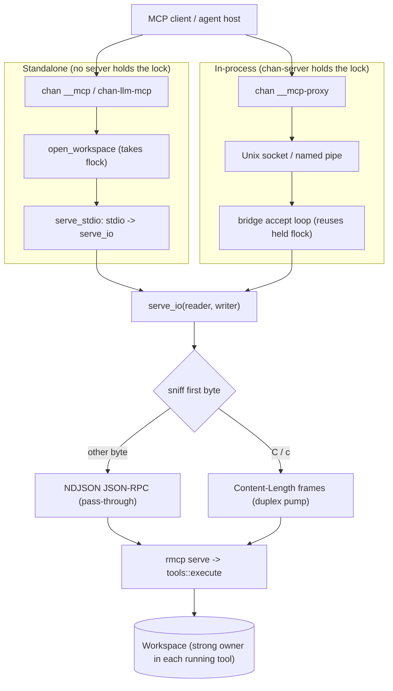

# chan-llm design

`chan-llm` is the MCP-facing tool sandbox for chan workspaces: shared tool descriptions, JSON tool dispatch, and an MCP server that exposes both to external agents. It does not own an in-app chat session, transcript persistence, agent subprocess management, or app settings.

## Scope

In scope:

  - Shared tool descriptions for chan workspace access: one description constant per tool, used by the standard tool schemas and the MCP server alike.
  - Direct tool dispatch through `tools::execute`.
  - MCP stdio / async-I/O hosting behind the optional `mcp` feature, including the standalone `chan-llm-mcp` binary.
  - Media reads for MCP clients, capped by server policy.
  - Typed error passthroughs for chan-workspace write conflicts, write-size limits, listing limits, and refused paths.

Out of scope:

  - HTTP routes, WebSocket events, and frontend state.
  - API key storage and model/provider configuration.
  - Agent transcript/history storage.
  - Spawning or supervising model CLIs.

## Architecture

Both transport entry paths converge on `serve_io`, which sniffs the framing and dispatches JSON tool calls through `tools::execute` on the blocking pool.

`mcp::Server` stores a workspace resolver. `Server::new(Arc<Workspace>)` captures an owner for `chan __mcp` and `chan-llm-mcp`; the tenant bridge uses `Server::from_resolver` with its workspace cell lookup. JSON tool calls and `read_media` resolve only inside their `spawn_blocking` closures and release the strong handle when the tool body returns. The resolver reads the cell only long enough to clone its current workspace: a tool call waits behind a reset or metadata import's cell write guard, then uses the replacement workspace. Waiting requests, idle sessions, response serialization and stalled response writes do not retain the bridge workspace. A cleared cell returns the MCP error `workspace is closed` without touching the workspace. Synchronous reads, writes, graph, search and report work stay off the async transport worker, and `read_media` opens its file through `Workspace::read_bytes_bounded`, with the same path sandbox and regular-file checks as the editor.

Tool bodies check the MCP request cancellation token before resolving the workspace and again after a potentially blocked cell read. A cancelled request returns `request cancelled` before starting its workspace operation. Once a JSON tool body runs, `run_tool` sets the body's cancel flag (`ToolContext::with_cancel`) when the token fires or the request future is dropped, including during runtime shutdown. A dropped MCP service cancels its requests. If the peer closes the transport without a cancel notification, rmcp first drains handler responses for up to five seconds. A root close gives tenant tasks up to five seconds of shutdown grace before dropping the bridge keepalive and aborting its sessions, which drops their services and cancels requests.

`list_files`, `workspace_search` and `repo_report` read the flag at walked-entry, report-file and search-seed boundaries. A body stopped there answers `request cancelled` and has dropped its workspace by the reply. A body that finishes answers its result, so a write that landed is reported even when its request was cancelled. A failed body answers `request cancelled` while its flag is set; chan-llm does not log the replaced failure.

Cancellation is cooperative. A search reads the flag at each entry of its tree walk and each file of a report rescan, after each of the catalog's graph queries, before content retrieval, entity matching and seed resolution, before each seed, at each hop of a seed and before a seed's closure work, and before the final induced-relationship query. One graph or search query, with the pass over the rows it returns, runs without a flag read, as does the report cache's load or snapshot. Measured in a release build on a generated workspace of 20,000 notes and 100,000 links, no such unit took longer than 91 milliseconds. At 200,000 notes and 1,000,000 links the longest hop took 1.1 seconds, the catalog's three graph queries 1.0 second together, and the induced-relationship pass 0.4 seconds; no flag read bounds a unit, so a cancelled search can delay its root's close by that long. Cell lock waits, the workspace's write serialization lock wait before a report rescan, individual filesystem calls, and whole reads and writes also run to completion. This includes the one bounded read `read_file` makes for each page and the one read `read_media` makes of a file; neither read gains in-flight cancellation, and each is bounded by its tool's cap rather than by the file's size. These operations can delay workspace release.

`serve_stdio` is used by the standalone `chan-llm-mcp` binary and by `chan __mcp`. `serve_io` is used by chan-server's MCP bridge: the server already holds the workspace lock, so it hosts the MCP service in-process over a Unix-domain socket and lets child processes proxy stdio to that socket (`chan __mcp-proxy`).

Both transports sniff the first bytes of the stream and accept either newline-delimited JSON-RPC or LSP-style `Content-Length` framing; framed clients are adapted through an internal duplex pump, so clients of either convention connect without configuration.

## Tools

Text tools are defined as `StandardTool` and dispatched by name:

  - `read_file`
  - `write_file`
  - `list_files`
  - `resolve_path`
  - `workspace_search`
  - `repo_report`

`read_media` is exposed only by the MCP server because it returns MCP image content blocks or embedded PDF blob resources rather than a JSON text result. Supported media matches chan-workspace's Image and Pdf classes: `.png`, `.jpg`, `.jpeg`, `.gif`, `.webp`, `.svg`, `.avif`, and `.pdf`.

Writes are full-file replacements. `write_file` accepts `expected_mtime_ns` for compare-and-swap semantics and maps chan-workspace conflicts into `LlmError::WriteConflict`. `resolve_path` is metadata-only: it maps a chan public path to the physical host path (for shell tools that need a cwd) without reading or writing content.

`workspace_search` is the one active-workspace retrieval surface. It accepts typed selector objects and mechanically converts `WorkspaceSearchParams` into the core request; it does not select or fan out across tenants. The same `JsonSchema` type generates the standard tool schema and rmcp input schema, and the parity test compares them exactly. Results are serialized from the core result unchanged.

Responses are capped so a runaway call cannot bloat a model turn: `read_file` pages text at at most 256 KiB per call (with `truncated` and `next_offset` when bytes follow), `read_media` refuses a file past its cap (10 MiB unless the host sets another) with `media too large`, `list_files` caps at 2,000 entries, workspace search applies the core content/node/edge caps, `repo_report` returns at most 200 per-file rows, and `write_file` rejects content above the 2 MiB chan-workspace text-write limit before crossing the dispatch boundary. A tool's read of one file is bounded by its cap, and a file is not read to learn its size, which comes from the stat of the open handle: `read_media` reads none of a file over its cap, and `read_file` reads no more than its cap (`Workspace::read_text_with_stat_bounded_from`), cuts back to a character boundary, and answers the whole file's size. A caller passes the returned `next_offset` to read another page; an offset inside a character is refused with that character's first byte, and an offset at or past the end answers empty content with the current size. Each page has the open handle's `mtime_ns`, when available, so a caller can detect a change between pages. `read_file` validates the page bytes it returns and checks the boundary prefix of a later page; it does not validate bytes outside the page. A file whose text is valid up to the first cap and whose bytes past it are not UTF-8 is answered with its text up to that cap, not refused. Neither read takes in bytes a file gains after it is opened.

Tool descriptions live as constants in the shared prompt catalog and are duplicated as string literals inside the MCP `#[tool(description = ...)]` attributes (the rmcp macros only accept literals); the `mcp_descriptions_match_prompts` test pins the copies together and also pins the generated workspace-search schemas, so drift breaks the build.

## Configuration

The library has no model/provider config. MCP media size is server policy:

  - default: `DEFAULT_MCP_MEDIA_MAX_BYTES` (10 MiB)
  - override: `Server::with_max_media_bytes(bytes)`
  - standalone binary: `--max-media-bytes <N>`

`chan-llm-mcp --config <path>` points at the chan-workspace registry config, not an LLM settings file.

## Error Boundary

`LlmError` is intentionally small:

  - `Tool`
  - `Core`
  - `WriteConflict`
  - `WriteTooLarge`
  - `ListingTooLarge`
  - `PathRefused`
  - `Io`
  - `Mcp`

Public error variants stay matchable for hosts while preserving the original chan-workspace display text for user-facing messages.

The MCP layer additionally scrubs outgoing error strings (`mcp_safe_message`): chan-workspace Display text can carry host absolute paths (`SpecialFile`, `SymlinkEscape`), and the MCP client may be a third-party process. Across that boundary errors surface as the variant category plus model-actionable numbers (sizes, mtimes, caps), never the host filesystem layout.
