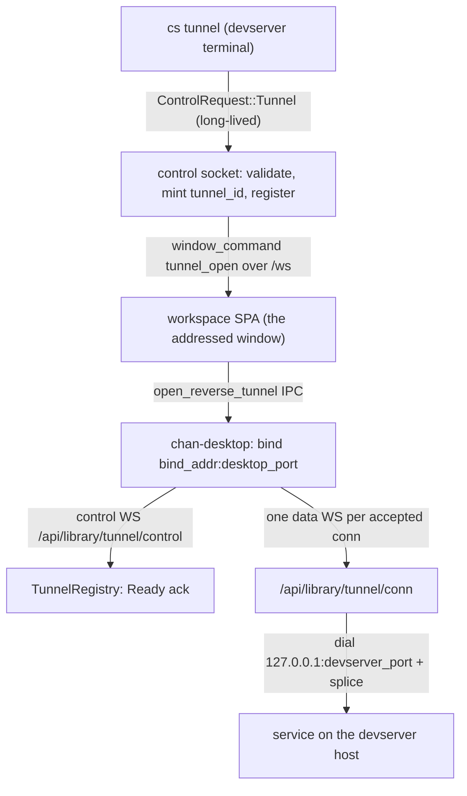

# chan-revtunnel design

Reverse port forwarding from a chan devserver to a connected chan-desktop: `cs tunnel [bind:]desktop-port:devserver-port`, run in a devserver terminal, asks the desktop that owns the terminal's window to listen on a desktop-machine port and forward every connection back to a port on the devserver host. It is `ssh -R` with the roles the chan topology already has: the devserver can never dial the desktop, so it asks over a channel the desktop already holds open. The name disambiguates on purpose: the `chan-tunnel-*` crates are the dial-out gateway tunnel; this crate is the desktop-facing reverse port forward.

## What it provides

- **Spec parsing** (`spec`): `Proto` (`Tcp`, `Udp`), `TunnelSpec {proto, bind_addr, desktop_port, devserver_port}`, and `parse_spec` with a last-two-colons rule so `::1:8080:3000` and `[::1]:8080:3000` both parse. `bind_addr` defaults to loopback; a non-loopback bind parses deliberately (policy lives at the edges: the CLI and the desktop warn, nothing hard-blocks). `SpecError` names the offending field so a typo fails CLI-side with no round-trip.
- **Wire contract** (`wire`): the two WebSocket legs `CONTROL_PATH` (`/api/library/tunnel/control?tunnel=<id>`) and `CONN_PATH` (`/api/library/tunnel/conn?tunnel=<id>&conn=<id>`), the `TunnelOpen` trigger payload, the serde-tagged `ControlFrame` (`Ready{bound}` / `Failed{message}` / `Close{reason}`), `TunnelEnd` close reasons, `READY_TIMEOUT_SECS` (10), and `MAX_DATA_FRAME_BYTES` (64 KiB). Data frames are raw TCP bytes, both directions. The paths live under `/api/library/*` because `/api/devserver/*` is 404'd on the gateway public wildcard; a gateway-attached desktop must be able to reach them.
- **Devserver registry** (`server`): `TunnelRegistry` (held by the `WorkspaceHost`) with register/attach/dial-port lookups. `Registration` is a guard whose Drop is the single teardown path on every exit; `ControlAttach` reports Ready/Failed and treats an un-detached socket drop as desktop-gone. Deliberately unbounded (no cap on tunnels, connections, or bytes) with the TODO recorded in-code.
- **Byte pump** (`bridge`): `splice(tcp, to_peer, from_peer)`, a library-agnostic pump over mpsc byte channels; both directions drop together, no half-close relay.
- **Desktop client** (`client`, a default-on cargo feature chan-server opts out of): `open(ClientConfig)` dials the control socket BEFORE binding the listener so a bind failure is reported to the devserver as `Failed`, sends `Ready{bound}` with the resolved authority, pings every 30s to stay under the gateway's 300s WS idle cut, and owns per-connection bridges in a JoinSet so ending the tunnel aborts in-flight connections.

## Boundaries

- The crate owns the spec, wire, registry, pump, and desktop client. Everything else lives with its owner: the category-5 control-socket conversation in chan-shell/chan-server, the WS routes and `require_tunnel_owner` gate in chan-server's launcher router, the window-addressed trigger in the SPA store, and the credential resolution in chan-desktop (`revtunnel.rs` resolves the dial target from the invoking window's own connection record, never from the payload).
- The unguessable 32-char `tunnel_id` is the only capability naming a tunnel on the two public paths; over the gateway the legs additionally pass the browser-session cookie, the exact Origin, and the owner gate (a grantee's valid session is not authority to open sockets on the owner's desktop).
- A refused devserver-side dial closes that one data socket and leaves the tunnel up; client EOF, desktop disconnect, window close, or a devserver restart end the tunnel (the registry is in-memory only). A gateway session's absolute expiry (max one hour) force-closes bridged sockets; grace-window redial by tunnel id is an open TODO on both ends.
