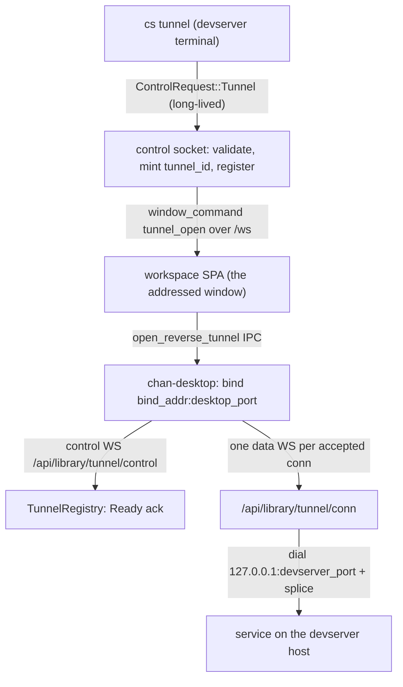

# chan-revtunnel design

Reverse port forwarding from a chan devserver to a connected chan-desktop: `cs tunnel [bind:]desktop-port:devserver-port`, run in a devserver terminal, asks the desktop that owns the terminal's window to listen on a desktop-machine port and forward every connection back to a port on the devserver host. It is `ssh -R` with the roles the chan topology already has: the devserver can never dial the desktop, so it asks over a channel the desktop already holds open. The name disambiguates on purpose: the `chan-tunnel-*` crates are the dial-out gateway tunnel; this crate is the desktop-facing reverse port forward.

## What it provides

- **Spec parsing** (`spec`): `Proto` (`Tcp`, `Udp`), `TunnelSpec {proto, bind_addr, desktop_port, devserver_port}`, and `parse_spec` with a last-two-colons rule so `::1:8080:3000` and `[::1]:8080:3000` both parse. `bind_addr` defaults to loopback; a non-loopback bind parses deliberately (policy lives at the edges: the CLI and the desktop warn, nothing hard-blocks). `SpecError` names the offending field so a typo fails CLI-side with no round-trip.
- **Wire contract** (`wire`): the two WebSocket legs `CONTROL_PATH` (`/api/library/tunnel/control?tunnel=<id>`) and `CONN_PATH` (`/api/library/tunnel/conn?tunnel=<id>&conn=<id>`), the `TunnelOpen` trigger payload, the serde-tagged `ControlFrame` (`Ready{bound}` / `Failed{message}` / `Close{reason}`), `TunnelEnd` close reasons, `READY_TIMEOUT_SECS` (10), and `MAX_DATA_FRAME_BYTES` (64 KiB). Binary data frames are raw TCP bytes in both directions. A devserver advertises half-close support as `TunnelOpen.half_close`; a supporting desktop adds `half_close=true` to the data-leg query, and only that mutually advertised leg uses the `half_close` Text frame as the sender's end-of-stream marker. Binary data after that marker is discarded. A peer that omits either advertisement keeps the both-directions-close contract. The paths live under `/api/library/*` because `/api/devserver/*` is 404'd on the gateway public wildcard; a gateway-attached desktop must be able to reach them. The gateway closes a bridged data leg after its shared 300-second both-directions idle window sees no frames either way; the reverse-tunnel adapters impose no idle deadline on a direct leg.
- **Devserver registry** (`server`): `TunnelRegistry` (held by the `WorkspaceHost`) with register/attach/dial-port lookups. `Registration` is a guard whose Drop is the single teardown path on every exit; `ControlAttach` reports Ready/Failed and treats an un-detached socket drop as desktop-gone. Deliberately unbounded (no cap on tunnels, connections, or bytes) with the TODO recorded in-code.
- **Byte pump** (`bridge`): `splice(tcp, to_peer, from_peer)` is the library-agnostic both-directions pump over mpsc byte channels. `splice_half_close` treats an empty chunk as directional end-of-stream, relays the other direction until its own marker, and still ends both directions on a channel close or I/O error.
- **Desktop client** (`client`, a default-on cargo feature chan-server opts out of): `open(ClientConfig)` dials the control socket BEFORE binding the listener so a bind failure is reported to the devserver as `Failed`, sends `Ready{bound}` with the resolved authority, pings every 30s to stay under the gateway's 300s WS idle cut, and owns per-connection bridges in a JoinSet so ending the tunnel aborts in-flight connections. `ClientConfig.half_close` adds the data-leg advertisement and selects marker translation plus `splice_half_close`; false selects the both-directions contract.

## Boundaries

- The crate owns the spec, wire, registry, pump, and desktop client. Everything else lives with its owner: the category-5 control-socket conversation in chan-shell/chan-server, the WS routes and `require_owner_desktop` gate in chan-server's launcher router, the window-addressed trigger in the SPA store, and the credential resolution in chan-desktop (`revtunnel.rs` resolves the dial target from the invoking window's own connection record, never from the payload).
- The unguessable 32-char `tunnel_id` is the only capability naming a tunnel on the two public paths; over the gateway the legs additionally pass the gateway-session cookie, the exact Origin, and the owner-desktop gate. That gate admits a leg only when the assertion names the owner on a desktop session; it refuses a grantee's desktop session and the owner's browser session. An extension frame's opaque Origin fails the exact-Origin check before that gate.
- A main-frame script at the tenant origin inside the owner's desktop app can open either tunnel leg. The native client caches the desktop session, and the session publisher installs the same cookie values in the webview cookie store, so the script presents the exact Origin and the admitted owner-desktop session. A leg binds nothing on the desktop: a control leg can win the first attachment or send a fake `Ready`, while a data leg can reach only a loopback port on the devserver host whose terminal surface that session already reaches.
- The owner-desktop gate classifies tunnel legs, not the window-addressed trigger. Anyone with a shell on the devserver, including a grantee, can select the owner's `CHAN_WINDOW_ID` and ask that desktop window to open a tunnel; the SPA forwards the request without a prompt, and the desktop binds the requested address after only warning about a non-loopback host. The desktop then dials the gateway with its owner session, so the leg gate is not a boundary against a devserver shell.
- A refused devserver-side dial closes that one data socket and leaves the tunnel up; client EOF, desktop disconnect, window close, or a devserver restart end the tunnel (the registry is in-memory only). A gateway session's absolute expiry (max one hour) force-closes bridged sockets; grace-window redial by tunnel id is an open TODO on both ends.
