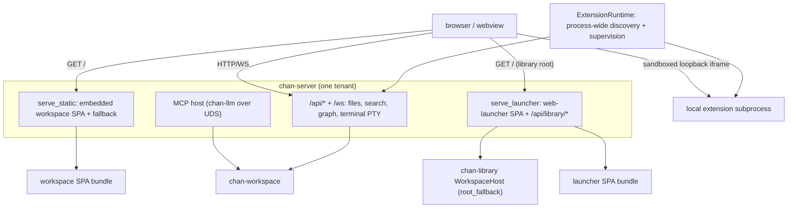

# chan-server design

The serving layer: turns a workspace (or a terminal) into a web app, hosts the MCP sandbox, and builds the devserver. Per tenant it builds `Router::new().merge(api).fallback(serve_static)`.

## What it provides

- **Request tracing**: tenant request spans redact extension path capabilities and every `t=` query bearer; other query parameters retain their bytes and order.
- **Per-tenant API**: files, search, graph, drafts, and the terminal PTY WebSocket: thin HTTP/WS over a `chan-workspace` handle.
- **`serve_static`**: serves the embedded workspace SPA per tenant with SPA fallback + `inject_chan_meta` (the `chan-prefix` / `chan-settings-disabled` / `chan-files` / `chan-drafts` / `chan-webgl-renderer` meta).
- **Launcher root**: embeds the launcher SPA and assembles the launcher bundle (the `/` SPA plus the `/api/library/{workspaces,windows}` data routes). `install_launcher_root_fallback` installs that bundle on the `chan-library` `WorkspaceHost` root fallback, so the library/devserver root serves the launcher instead of 404ing. The install is **per-surface**: the desktop loopback installs it bearer-`Some` (a minted loopback token) with full workspace mutation; the devserver installs it bearer-`Some` too (its rotatable devserver token), and tunnel-origin requests bypass the local bearer because they already passed the gateway edge. A grant is all-or-nothing on the devserver: a signed grantee assertion gets the same launcher as the owner's, the full surface meta and every `/api/library/*` mutation included, and the reverse-tunnel legs are the one launcher route it does not share; over the gateway they are the owner's desktop app's alone. A tunnel request with a missing or unverifiable assertion is refused with 401 before it reaches the launcher.
- **MCP host**: hosts `chan-llm` in-process over a Unix socket (+ `chan __mcp-proxy`). The Unix proxy requires a real socket owned by its effective uid, without following symlinks, on both the configured endpoint and discovered fallback candidates. Fallback retains `/tmp` for servers started without `XDG_RUNTIME_DIR`; candidates are checked again before connecting. The bridge accept task owns and reaps its sessions; unmount aborts them before the host waits for the workspace writer lock. A blocking tool call already executing can retain the workspace until it returns.
- **Graph adapter**: assembles the visualization graph while delegating authored link and mention/contact normalization to `chan-workspace`.
- **Workspace search adapter**: `POST /api/search/workspace` accepts the shared typed request and returns the core result unchanged. The legacy `/api/search/content` route is a projection over the same effective-mode policy. Control-socket `workspace_search` uses the same contract for `cs`. Both transports run workspace search on the blocking pool so content scanning and ranking do not stall the async executor.
- **Excluded-directory updates**: PUT persists the workspace policy and synchronously refreshes a warm report on the blocking pool, then requests the indexer rebuild and reads the updated view there. GET only reads the current view.
- **Workspace open pressure**: `WorkspaceFdPressure` maps to HTTP 503 with `Retry-After: 3`, including launcher add/on routes. It identifies temporary resource pressure and tells callers to close a workspace or retry.
- **Degraded mounts on the launcher routes**: the list route, `add` and `on` build their row through one builder over the host's live workspace status, so a mounted tenant whose root is unreachable, gone or replaced reports `unavailable` with its reason instead of `running`, and the three answers cannot disagree about the same workspace. `add` and `on` both answer 200 with that row: one idempotent verb, one answer, healthy or degraded, so a caller reads the condition off the row instead of taking a bare 204 for health. Both stay idempotent registrations that never tear a tenant down, leaving live terminals and dirty buffers for `off` or `chan close` to clear. `on` keeps the refusals that are not a row: 404 for an id no workspace maps to, a plain-text 409 when another process holds the writer flock, and the shared fd-pressure 503. A degraded local row keeps `on: true`, matching what a connected devserver reports for the same condition, so the power control offers turning it off, the one action that helps. The connected-devserver turn-on, `POST /api/library/devservers/{id}/workspaces/on`, answers 200 with that same row shape: the desktop bridge carries the row the devserver answered with and tags it with the devserver's id, so one turn-on verb reads the same everywhere and a degraded remote mount needs no second request either. It answers 204 where the desktop holds no row to report: a devserver that answered the turn-on without one, or a local devserver whose toggle failed with something other than a refusal. The `off` and `forget` routes ride the same desktop bridge and keep their 204. The row is only as fresh as something that re-checks the root, and nothing in the request path runs while the user is idle, so every process that serves these routes drives the same root health probe: `spawn_root_health_probe` ticks `WorkspaceHost::probe_mounted_roots` on one shared cadence, on the blocking pool because it stats real roots, and both the devserver and chan-desktop's embedded host start it. That is what makes `unavailable` appear, and clear, without an operator verb on either surface; a process that served these routes without it would report a gone or replaced root as `running` until the next redundant `add` or `on`. A row whose writer lock could not be probed reports `unknown`, with the probe's reason in `error`, rather than `locked` or `stopped`: a lock file the process could not open, as under file descriptor exhaustion, establishes neither that another process holds the workspace nor that none does.
- **Workspace readiness envelope**: `/api/index/status`, `/api/indexing/state`, `/api/preflight`, and `/api/search/content` each carry a `WorkspaceReadiness` ready/recovering envelope. A content query issued during recovery returns an explicit not-ready/recovering result rather than a fresh-looking empty one.
- **Recovery coordinator**: whichever open-time pass the indexer claims runs its action and, only when that action succeeds, runs the workspace's shared persisted-report refresh before `finish_recovery`. Installing the driver announces a pass parked between `Workspace::open` and `Indexer::spawn`, including one left by a stopped startup worker. A failed refresh gets one retry per coordinator activation, which starts with a wake the idle coordinator receives and absorbs every wake it drains while it runs, its own retry's included; the second failure completes the generation while retaining the refresh obligation, and a failed action between the two does not buy another retry. That bounds coordinator work per wake without treating the stale report as refreshed, but not over the life of the process: while the refresh keeps failing, every later activation that claims a pass spends up to one extra pass on it. A pass whose action fails is requeued and not claimed again until the rebuild cooldown (30 s) has passed, so a reconcile, replay or rebuild that keeps failing is retried once per cooldown rather than back to back; a failed refresh keeps its own bound and is not spaced, and between passes that do not fail the cooldown still holds back only full rebuilds. While a pass keeps failing, the workspace publishes an `error` index status carrying the last failure's message (`/api/index/status`, and `error` in the indexer part of `/api/health`) together with a `recovering` readiness envelope that names the pending pass; a full rebuild shows `building` for the length of each attempt, and the first pass that succeeds returns the status to idle. Dropping an `Indexer` aborts its coordinator but not a blocking run already in flight, so the claimed pass travels with that run and is handed back as a retry when it ends: a later indexer over the same workspace claims it instead of waiting on a slot nobody will release.
- **Transfer backpressure**: file and archive sends and terminal, workspace and standalone Files multipart upload receives share a cancellation-aware wait on the dedicated bulk lane. A full send or empty receive parks until channel readiness; a retained wake prevents a notification between polling and parking from being lost. Standard-library wall-clock waits check cancellation at most every 100 ms, so lane shutdown can join workers even while a current-thread Tokio runtime is stopped in that join. No channel progress for `[transfer].stall_timeout_secs` in `server.toml` aborts the job and returns its lane slot even while the response stays unpolled. The default is 300 seconds; zero selects that default and positive values are preserved. Each tenant captures it at startup, like the terminal registry idle timeout, so file edits apply when that tenant next starts. The section is file-only and survives config PATCH saves without changing the preferences wire shape. Download responses check the job outcome after draining queued bytes and end with an error on abort, including when the full channel could not carry an error item. Upload handlers race multipart input against the job outcome, so a stalled sender receives a failed response without sending more bytes; the atomic writer discards the partial temporary file.
- **Download archives**: terminal and workspace tar streams store symlinks as symlinks, including top-level links to files, directories, or missing targets. The shared builder disables symlink following; workspace archives read stored link targets through the facade and preserve their listing filters. For regular files whose metadata length matches their content, preflight counts an encoded archive bound including headers, long-name and long-link extensions, content padding, and termination blocks. Terminal regular files use their logical metadata length, which bounds a sparse file's tar entry when every hole the filesystem reports spans at least one 512-byte tar block. A tree that changes after preflight, or a sparse file whose smaller holes cost more in extension headers than they save, can still exhaust the ceiling mid-body. Standalone download commands classify with lstat and request archive filenames for links.
- **Metadata import and storage reset**: hold the workspace-cell write guard through drain, flush/close, mutation, and restoration. A missing or undrainable cell returns Busy before closing document, scene, or terminal sessions. Once drained, flush document and scene authorities against the retained old workspace, close all sessions, then release its writer lock and run the operation. A Busy drain restores the original workspace with a fresh watcher/indexer. The blocking worker drives flush futures using the retained workspace, without reacquiring the cell.
- **Standalone mutation attribution**: a mutation ticket remains in flight until commit or cancellation, regardless of idle age. Commit emits attributed frames and starts the 1.5-second idle suppression tail; per-path echo allowances still apply. Dropping an uncommitted ticket removes its state immediately, including cancellation or unwinding, so abandoned writers cannot pin suppression indefinitely.
- **Attachment uploads**: names are claimed with `Workspace::create_bytes`, whose exclusive publication cannot replace an existing entry. Collisions retry numbered suffixes through 1000 and one timestamp fallback; the fallback also refuses collisions. Each failed attempt cancels its self-write reservation.
- **Streamed text writes**: disk-only PUT checks the requested mtime token before reading the body and again after consuming it, inside the workspace atomic-stream callback before self-write reservation and publication. A conflict discards the temporary file and returns 409 with the disk token. The final check, sink validation/fsync, and rename remain separate steps; an external write in that remaining window can still race publication. Tokenless writes retain last-write-wins behavior.
- **Live editor authority**: document and Excalidraw WebSockets share one server-side authority per path. Clean external edits fold into that authority; overlapping dirty edits retain a three-way conflict until an explicit reload or overwrite via `POST /api/session-conflicts/resolve`. Each authority writes a bounded recovery record under `.chan/editor-sessions/v1/` through the workspace atomic stream writer. On restart, dirty/conflicted authority, durable baseline, versions, and the current disk side rehydrate before any flush can run, so stale authority cannot silently replace a newer disk file.
- **Desktop handoff**: every Unix client verb (open/close workspace, register/control devserver, upgrade) shares an owner-socket gate and newline request exchange. Refused nodes return each verb's no-desktop outcome. The connect-only liveness probe uses the same gate with its 250 ms bound. Requests retain the 1.5 s connect timeout, 3 s normal IO timeout, request-specific control reply budgets and distinct `NoReply`, and 15 s upgrade budget. The Unix and Windows listeners share a ten-second total first-line deadline and a 1 MiB request cap. Expiry closes without a reply; a request line without its terminating newline is refused before dispatch. Dispatched handlers retain their own lifetimes. Devserver registration listeners use the same limits and framing check.
- **Fdstore restart manifest**: server-owned atomic writes set mode 0600 on the temporary file before publishing terminal replay and sync the parent directory once. Replacement does not inherit a permissive target mode. Each snapshot records the Linux boot id and each child's `/proc` start time. Explicit cleanup signals require both identities to match, with a pidfd pinning the process across validation and signalling. Orphan names, inconsistent metadata, old manifests without identity, and unavailable identity checks authorize no explicit signal; skipped reasons explain the refusal. PTY liveness-based restore is independent of these optional fields. Removing invalid entries from systemd and releasing inherited masters still closes those PTYs; the last master close hangs up the controlling foreground process group. Legacy cleanup therefore keeps normal PTY hangup while forgoing explicit termination of unverifiable stragglers.
- **Devserver builder**: `build_devserver_app` composes the `WorkspaceHost` + per-tenant apps into one merged router for `run_devserver`; `chan devserver` and the desktop loopback run the same app. Cancelling a mounted workspace's off request after host detachment settles its record to off, clears the token and transient lifecycle, and persists the desired state. A still-mounted root or a newer intent generation prevents that cancellation guard from overwriting current intent; refused and completed closes disarm it. A mount attempt is bounded, and an expired bound undoes nothing: the host publishes a tenant and returns without awaiting, so an attempt that reached its timeout never published one, and any tenant at that prefix belongs to another caller. The expiry records the attempt's own failure and marks the root failed only when nothing is serving it; a row whose root is mounted reports that mount rather than the failed attempt.
- **Local extension runtime**: one process-owned `ExtensionRuntime` scans `CHAN_HOME/extensions`, starts valid subprocess declarations, supervises their process groups, and injects one immutable ready catalog into every workspace tenant. `GET /api/extensions` exposes only capability-scoped tenant paths; `/_chan/extensions/<id>/<capability>/*` reverse-proxies HTTP to the process-private loopback URL with the extension token added upstream. The same path works through standalone, desktop, devserver, and gateway-tunnel serving modes without exposing a second port.
- **Control connection lifetime**: the tenant accept task owns its connection tasks. The first request line has a ten-second total deadline, including partial input; expiry closes the connection without a reply. Dispatched handlers, including handover and `cs tunnel`, retain their own lifetimes. A survey or requester-side handover carrying `cancel_on_eof` races its parked reply against client EOF, biased toward a reply that is ready when its arm is polled. A completion accepted after that poll can race a ready EOF or deadline; the winning EOF or deadline branch owns cleanup, and leadership moves only when the handover reply branch wins. Survey EOF releases its turn and, once the overlay is open, cancels the bus entry and closes the overlay; handover EOF cancels its bus entry and clears the pending slot. Requests without the flag ignore EOF, preserving half-closed client behavior. Unmount aborts idle requests, parked handlers, and `cs tunnel` connections. A decoded `Close` operation retains only its teardown scope and reply half until teardown finishes, then gets five seconds to write the reply; it can acknowledge the unmount that drops its own tenant.
- **Reverse-tunnel legs**: two GET WebSocket routes on the launcher router (`/api/library/tunnel/{control,conn}`, bearer-gated with `?t=` accepted, and restricted over the gateway to the owner's desktop app: `require_owner_desktop` 403s every tunnel caller whose assertion does not name the owner on a `desktop` client, so a grantee on any client, the owner on a browser session, and the owner through a gateway that states no client are all refused. A reverse tunnel dials out through an addressed app window whose host can be the owner's own machine, outside the devserver a grant covers, and only chan-desktop dials the legs, natively, on the session the gateway's desktop entry route minted; a browser session, or a stolen browser cookie, cannot open a listener. The refusal is logged as `reverse tunnel leg refused` with the subject, whether it is the owner, and the client). The control socket carries the long-lived `cs tunnel` conversation: validate the spec server-side, mint an unguessable tunnel id, register in the host's `chan_revtunnel::TunnelRegistry`, trigger the addressed window over `/ws` (`window_command: tunnel_open`), race the 10s ready report against client EOF, then hold until either side ends. A refused devserver-side dial closes one data socket without ending the tunnel. See [`crates/chan-revtunnel/design.md`](../chan-revtunnel/design.md).

## Boundaries

- chan-server depends on `chan-library`, so the launcher assets + handlers live here (the higher layer) and are injected into chan-library's root fallback; chan-library never references a frontend bundle.
- Launcher builds are wired into the root web build so clean CI/release builds embed a real launcher, not an empty bundle.
- Search ranking, selector resolution, traversal, normalization, limits, and structured partial errors stay in `chan-workspace`; HTTP and control-socket handlers only deserialize, choose the active tenant, and serialize.
- `Identify` reports `workspace_root` and `metadata_key` for a workspace tenant and omits both for terminal-only processes. Multi-workspace CLI routing must match both fields (plus pid) and never fall back to another same-pid tenant.
- Extension discovery and child ownership stay above per-tenant `build_app`: standalone serve, devserver, and desktop each create exactly one runtime and pass only its immutable catalog into tenant route builders. Extension endpoints are independent loopback trust domains, never workspace filesystem authorities.
- **Route authority table**: `src/route_authority.rs` is a test-only ratchet, compiled only under `cfg(test)`; nothing in the built server reads it. It holds one table per route table chan-server assembles (`router_with_extensions`, `terminal_router`, `launcher_router`, `build_devserver_app`) with one row per mounted `(verb, path)`, recording what each kind of caller meets on that route in the code as it stands: `Public` (answered before any caller authority), `NonOwner` (every caller reaches the handler), `DesktopOwner` (only the owner on a desktop session and a local caller reach it; the owner on a browser or unknown client and a grantee on any client are refused with 403; the two reverse-tunnel legs), or `Local` (only the devserver's local bearer, so no tunnel caller). The caller model: a local caller carries no `TunnelOrigin`; the owner is a tunnel caller whose verified subject is the devserver's owner, and the assertion also names the client the owner's gateway session was minted for (desktop, browser, or unknown); a grantee is a tunnel caller with any other verified subject, on any client, and because a grant is all-or-nothing (`gateway/migrations/0014_drop_devserver_grant_roles.sql`) it meets what the owner meets everywhere except the reverse-tunnel legs. There is no anonymous tunnel caller: the gateway forwards nothing without a signed-in principal, binding extension frame links to the user who opened them, and `mark_tunnel_origin` refuses an assertion whose subject is nil or empty with 401 before any router runs. One test walks each assembled router and fails on a mounted route with no row or a row with no route, so a new route cannot land unclassified; a second sends every row through its router as a local caller, the owner on a desktop session, the owner on a browser session and a grantee on a desktop session, and fails where the router's answer contradicts the row.
