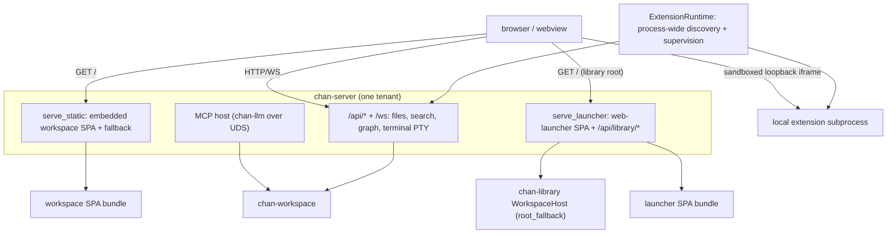

# chan-server design

The serving layer: turns a workspace (or a terminal) into a web app, hosts the MCP sandbox, and builds the devserver. Per tenant it builds `Router::new().merge(api).fallback(serve_static)`.

## What it provides

- **Request tracing**: tenant request spans redact extension path capabilities and every `t=` query bearer; other query parameters retain their bytes and order.
- **Per-tenant API**: files, search, graph, drafts, and the terminal PTY WebSocket: thin HTTP/WS over a `chan-workspace` handle.
- **`serve_static`**: serves the embedded workspace SPA per tenant with SPA fallback + `inject_chan_meta` (the `chan-prefix` / `chan-settings-disabled` / `chan-files` / `chan-drafts` / `chan-webgl-renderer` meta).
- **Launcher root**: embeds the launcher SPA and assembles the launcher bundle (the `/` SPA plus the `/api/library/{workspaces,windows}` data routes). `install_launcher_root_fallback` installs that bundle on the `chan-library` `WorkspaceHost` root fallback, so the library/devserver root serves the launcher instead of 404ing. The install is **per-surface**: the desktop loopback installs it bearer-`Some` (a minted loopback token) with full workspace mutation; the devserver installs it bearer-`Some` too (its rotatable devserver token), and tunnel-origin requests bypass the local bearer because they already passed the gateway edge. A grant is all-or-nothing on the devserver: a signed grantee assertion gets the same launcher as the owner's, the full surface meta and every `/api/library/*` mutation included, and the reverse-tunnel legs are the one launcher route it does not share; over the gateway they are the owner's desktop app's alone. A tunnel request with a missing or unverifiable assertion is refused with 401 before it reaches the launcher.
- **MCP host**: hosts `chan-llm` in-process over a Unix socket (+ `chan __mcp-proxy`). The Unix proxy requires a real socket owned by its effective uid, without following symlinks, on both the configured endpoint and discovered fallback candidates. Fallback retains `/tmp` for servers started without `XDG_RUNTIME_DIR`; candidates are checked again before connecting.
- **Graph adapter**: assembles the visualization graph while delegating authored link and mention/contact normalization to `chan-workspace`.
- **Workspace search adapter**: `POST /api/search/workspace` accepts the shared typed request and returns the core result unchanged. The legacy `/api/search/content` route is a projection over the same effective-mode policy. Control-socket `workspace_search` uses the same contract for `cs`.
- **Workspace readiness envelope**: `/api/index/status`, `/api/indexing/state`, `/api/preflight`, and `/api/search/content` each carry a `WorkspaceReadiness` ready/recovering envelope. A content query issued during recovery returns an explicit not-ready/recovering result rather than a fresh-looking empty one.
- **Live editor authority**: document and Excalidraw WebSockets share one server-side authority per path. Clean external edits fold into that authority; overlapping dirty edits retain a three-way conflict until an explicit reload or overwrite via `POST /api/session-conflicts/resolve`. Each authority writes a bounded recovery record under `.chan/editor-sessions/v1/` through the workspace atomic stream writer. On restart, dirty/conflicted authority, durable baseline, versions, and the current disk side rehydrate before any flush can run, so stale authority cannot silently replace a newer disk file.
- **Desktop handoff**: every Unix client verb (open/close workspace, register/control devserver, upgrade) shares an owner-socket gate and newline request exchange. Refused nodes return each verb's no-desktop outcome. The connect-only liveness probe uses the same gate with its 250 ms bound. Requests retain the 1.5 s connect timeout, 3 s normal IO timeout, request-specific control reply budgets and distinct `NoReply`, and 15 s upgrade budget. Windows named-pipe behavior is independent.
- **Fdstore restart manifest**: server-owned atomic writes set mode 0600 on the temporary file before publishing terminal replay and sync the parent directory once. Replacement does not inherit a permissive target mode.
- **Devserver builder**: `build_devserver_app` composes the `WorkspaceHost` + per-tenant apps into one merged router for `run_devserver`; `chan devserver` and the desktop loopback run the same app.
- **Local extension runtime**: one process-owned `ExtensionRuntime` scans `CHAN_HOME/extensions`, starts valid subprocess declarations, supervises their process groups, and injects one immutable ready catalog into every workspace tenant. `GET /api/extensions` exposes only capability-scoped tenant paths; `/_chan/extensions/<id>/<capability>/*` reverse-proxies HTTP to the process-private loopback URL with the extension token added upstream. The same path works through standalone, desktop, devserver, and gateway-tunnel serving modes without exposing a second port.
- **Reverse-tunnel legs**: two GET WebSocket routes on the launcher router (`/api/library/tunnel/{control,conn}`, bearer-gated with `?t=` accepted, and restricted over the gateway to the owner's desktop app: `require_owner_desktop` 403s every tunnel caller whose assertion does not name the owner on a `desktop` client, so a grantee on any client, the owner on a browser session, and the owner through a gateway that states no client are all refused. A reverse tunnel dials out through an addressed app window whose host can be the owner's own machine, outside the devserver a grant covers, and only chan-desktop dials the legs, natively, on the session the gateway's desktop entry route minted; a browser session, or a stolen browser cookie, cannot open a listener. The refusal is logged as `reverse tunnel leg refused` with the subject, whether it is the owner, and the client). The control socket carries the long-lived `cs tunnel` conversation: validate the spec server-side, mint an unguessable tunnel id, register in the host's `chan_revtunnel::TunnelRegistry`, trigger the addressed window over `/ws` (`window_command: tunnel_open`), race the 10s ready report against client EOF, then hold until either side ends. A refused devserver-side dial closes one data socket without ending the tunnel. See [`crates/chan-revtunnel/design.md`](../chan-revtunnel/design.md).

## Boundaries

- chan-server depends on `chan-library`, so the launcher assets + handlers live here (the higher layer) and are injected into chan-library's root fallback; chan-library never references a frontend bundle.
- Launcher builds are wired into the root web build so clean CI/release builds embed a real launcher, not an empty bundle.
- Search ranking, selector resolution, traversal, normalization, limits, and structured partial errors stay in `chan-workspace`; HTTP and control-socket handlers only deserialize, choose the active tenant, and serialize.
- `Identify` reports `workspace_root` and `metadata_key` for a workspace tenant and omits both for terminal-only processes. Multi-workspace CLI routing must match both fields (plus pid) and never fall back to another same-pid tenant.
- Extension discovery and child ownership stay above per-tenant `build_app`: standalone serve, devserver, and desktop each create exactly one runtime and pass only its immutable catalog into tenant route builders. Extension endpoints are independent loopback trust domains, never workspace filesystem authorities.
- **Route authority table**: `src/route_authority.rs` is a test-only ratchet, compiled only under `cfg(test)`; nothing in the built server reads it. It holds one table per route table chan-server assembles (`router_with_extensions`, `terminal_router`, `launcher_router`, `build_devserver_app`) with one row per mounted `(verb, path)`, recording what each kind of caller meets on that route in the code as it stands: `Public` (answered before any caller authority), `NonOwner` (every caller reaches the handler), `DesktopOwner` (only the owner on a desktop session and a local caller reach it; the owner on a browser or unknown client and a grantee on any client are refused with 403; the two reverse-tunnel legs), or `Local` (only the devserver's local bearer, so no tunnel caller). The caller model: a local caller carries no `TunnelOrigin`; the owner is a tunnel caller whose verified subject is the devserver's owner, and the assertion also names the client the owner's gateway session was minted for (desktop, browser, or unknown); a grantee is a tunnel caller with any other verified subject, on any client, and because a grant is all-or-nothing (`gateway/migrations/0014_drop_devserver_grant_roles.sql`) it meets what the owner meets everywhere except the reverse-tunnel legs. There is no anonymous tunnel caller: the gateway forwards nothing without a signed-in principal, binding extension frame links to the user who opened them, and `mark_tunnel_origin` refuses an assertion whose subject is nil or empty with 401 before any router runs. One test walks each assembled router and fails on a mounted route with no row or a row with no route, so a new route cannot land unclassified; a second sends every row through its router as a local caller, the owner on a desktop session, the owner on a browser session and a grantee on a desktop session, and fails where the router's answer contradicts the row.
