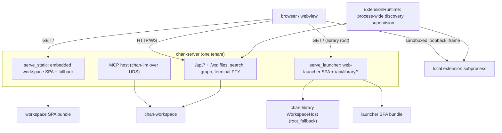

# chan-server design

The serving layer: turns a workspace (or a terminal) into a web app, hosts the MCP sandbox, and builds the devserver. Per tenant it builds `Router::new().merge(api).fallback(serve_static)`.

## What it provides

- **Request tracing**: tenant request spans redact extension path capabilities and every `t=` query bearer; other query parameters retain their bytes and order.
- **Per-tenant API**: files, search, graph, drafts, and the terminal PTY WebSocket: thin HTTP/WS over a `chan-workspace` handle.
- **Terminal WebSocket replay**: `/api/terminal/ws` sends a `session` control frame, the retained ring's replay as binary frames, the alternate-screen prelude when applicable, the private-mode reassert when nonempty, then `ready`. Every `session` frame carries numeric `replay_bytes`: the sum of the byte lengths of the attach handle's replay chunks, sent immediately after that frame. The count excludes the alternate-screen prelude and mode reassert; it is zero for an alternate-screen session, an empty ring, or a cursor at the ring's end. Initial, resumed and in-place restarted attaches use the same builder and prelude. A restart's reset bytes precede its `session` frame and are outside the count; live output follows `ready`.
- **`serve_static`**: serves the embedded workspace SPA per tenant with SPA fallback + `inject_chan_meta` (the `chan-prefix` / `chan-settings-disabled` / `chan-files` / `chan-drafts` / `chan-webgl-renderer` meta).
- **Launcher root**: embeds the launcher SPA and assembles the launcher bundle (the `/` SPA plus the `/api/library/{workspaces,windows}` data routes). `install_launcher_root_fallback` installs that bundle on the `chan-library` `WorkspaceHost` root fallback, so the library/devserver root serves the launcher instead of 404ing. The install is **per-surface**: the desktop loopback installs it bearer-`Some` (a minted loopback token) with full workspace mutation; the devserver installs the same bundle bearer-`Some` too (its rotatable devserver token), through `admitting_launcher_router` with the mount admission its stop refuses by, and tunnel-origin requests bypass the local bearer because they already passed the gateway edge. A grant is all-or-nothing on the devserver: a signed grantee assertion gets the same launcher as the owner's, the full surface meta and every `/api/library/*` mutation included, and the reverse-tunnel legs are the one launcher route it does not share; over the gateway they are the owner's desktop app's alone. A tunnel request with a missing or unverifiable assertion is refused with 401 before it reaches the launcher.
- **MCP host**: hosts `chan-llm` in-process over a Unix socket (+ `chan __mcp-proxy`). The Unix proxy requires a real socket owned by its effective uid, without following symlinks, on both the configured endpoint and discovered fallback candidates. The fallback is the private `/tmp/chan-control-<uid>` directory; candidates are checked again before connecting. The bridge accept task owns and reaps its sessions. Unmount gives tenant tasks up to five seconds of shutdown grace, then aborts the sessions before the host waits for the workspace writer lock. Dropping a session cancels its requests; a peer transport close without a cancel notification first gives rmcp up to five seconds to drain responses. JSON tool bodies stop at their next walked entry or report file, or at a search's next flag read (after each of its catalog's graph queries, before each seed and at each hop of a seed), once their flag is set, including when their request future is dropped. One query with the pass over its rows runs to its end; work between checks, blocking calls and lock waits can retain the workspace (see [MCP cancellation](../chan-llm/design.md)).
- **Local control sockets**: on Unix, the control and MCP listeners bind only inside a real directory owned by the effective uid with mode exactly 0700; a symlink, other node type, foreign owner or different mode is refused with the directory and reason. A valid `XDG_RUNTIME_DIR` is used as given. An absent, empty or rejected one selects the fixed `/tmp/chan-control-<uid>` fallback, created owner-only and validated before binding. A rejected configured directory logs `local socket directory <path> rejected: <reason>; using <fallback>`. If the fallback also fails, binding logs `control socket bind failed at <path>: <reason>` and the tenant continues without a control socket or `$CHAN_CONTROL_SOCKET`; MCP bridge failure is also logged and that bridge is absent. A path beneath a user-writable ancestor can be replaced between validation and bind; the checks do not pin ancestors with descriptors. Windows named pipes are separate. A command that needs the tenant's workspace takes it from the workspace cell without waiting for it: while a storage reset or a metadata import holds the cell, the command answers `workspace busy: workspace state is temporarily unavailable; retry in a moment`, the sentence of the HTTP handlers' 503, from one constant, and keeps no runtime worker; a window close that could not look for the window's saved layout answers that sentence too, and not that no such window exists, unless the desktop closed a live window. `Identify` waits for the cell on the blocking pool instead and answers the workspace's root and metadata key once the cell is let go, since the CLI finds the process that serves a workspace by them. The standalone serve's stop looks into the cell without waiting, every 25 ms while it is held, and cancels the reindex of the indexer the cell holds once it can read it.
- **Graph adapter**: assembles the visualization graph while delegating authored link and mention/contact normalization to `chan-workspace`.
- **Workspace search adapter**: `POST /api/search/workspace` accepts the shared typed request and returns the core result unchanged. The legacy `/api/search/content` route is a projection over the same effective-mode policy. Control-socket `workspace_search` uses the same contract for `cs`. Both transports run workspace search on the blocking pool so content scanning and ranking do not stall the async executor.
- **Excluded-directory updates**: PUT persists the workspace policy and synchronously refreshes a warm report on the blocking pool, then requests the indexer rebuild and reads the updated view there. GET only reads the current view.
- **Workspace open pressure**: `WorkspaceFdPressure` maps to HTTP 503 with `Retry-After: 3`, including launcher add/on routes. It identifies temporary resource pressure and tells callers to close a workspace or retry.
- **Degraded mounts on the launcher routes**: the list route, `add` and `on` build their row through one builder over the host's live workspace status, so a mounted tenant whose root is unreachable, gone or replaced reports `unavailable` with its reason instead of `running`, and the three answers cannot disagree about the same workspace. `add` and `on` both answer 200 with that row: one idempotent verb, one answer, healthy or degraded, so a caller reads the condition off the row instead of taking a bare 204 for health. Both stay idempotent registrations that never tear a tenant down, leaving live terminals and dirty buffers for `off` or `chan close` to clear. `on` keeps the refusals that are not a row: 404 for an id no workspace maps to, a 409 in the error envelope when another process holds the writer flock, and the shared fd-pressure 503. That 409 carries one sentence, "This workspace is open in another chan process. Quit it and try again.", and `add` and the launcher's delete answer the same status and sentence for that lock. So do the devserver's own management routes, its add (`POST /api/devserver/workspaces`), its turn-on and its forget, from the one builder both routers call; a turn-off takes no writer lock and cannot meet it. The devserver's handoff socket answers a registration of such a workspace with the same sentence as its error message, from the same constant. The sentence names the common case and the 409 covers more: chan-workspace's lock answers that error for every writer lock it cannot prove this process holds. That is a lock whose record is missing or torn, as this process's own is between a release clearing its record and letting the flock go, and while an acquire that has taken it has not yet written one; a lock whose record names another path, as this process's own does on a root relinked since it took the lock; and a dead holder's lock that cannot be stolen, because its record was read from the sidecar, as a contended lock's always is on Windows, or names another path, or because the holder's liveness cannot be established. A lock this process holds under a record that names it and the root is not that error: it is the still-releasing 503 below. `on` and `add` both answer 503 with `Retry-After: 1` and the words `workspace is still releasing; retry` for a root an earlier open of this process has not let go of, and 503 with no `Retry-After` and `mount timed out after 60 seconds: <root> did not answer` for a root that does not answer within the devserver mount's bound, counted from the request's start. `off` answers the same 503, `Retry-After: 1` and those words when its close's teardown has not let the workspace go at the close's bound, and for as long as that teardown runs: the workspace is off and unmounted behind the answer, and its row reads the words until the teardown returns. On a mutable devserver launcher with a filled serve address, `add` and `on` ask mount admission before registration or mounting, after the add's request extraction and the on's workspace lookup. From the stop signal on, that admission answers 503 in the envelope with no `Retry-After` and `the devserver is stopping; <root> was not mounted`: `add` names the path it was given and `on` the root the library stored. An `on` of a workspace that is still mounted is refused in the same words, leaves that mount in place until the sweep, and writes no overlay row. A read-only surface answers 403, an unfilled serve address answers 503 `launcher not ready`, and an unknown on id answers 404 before admission. The launcher's `DELETE` and the devserver's forget name a workspace by the root its registry row stores, which the host's removal takes to that row when the root resolves to another registered workspace's folder or nowhere, as long as the root and the registry stay as they are while the removal runs. They answer a removal that meets an earlier call of this process on the root with the same 503, `Retry-After: 1` and those words, from the one builder both routers call. A devserver forget whose removal the host fails leaves its record off whatever its mount's state was and whichever error it is; any error but the still-releasing one and that lock's answers 500 with its sentence. Most of those errors come after the removal's close (the registry-write permit not granted in time, the unregister failing), and the workspace is then off in the host. One that comes before the close has changed anything (the root's key resolution ending without an answer, the lookup of a root no registry row goes by failing or still held by an earlier lookup, a poisoned lock of the host) leaves nothing of a registered root mounted except behind a poisoned lock; the record is turned off there too, since its user asked for the removal and a record left desired on would mount the workspace at the next start. On a devserver the launcher's `DELETE` runs that forget, so it leaves the record the same way. A pending mount stands down when it lands. One that had already read the forget closes what it mounted and removes nothing while the registry still holds the workspace, since the forget's own removal is the one its caller is answered by; it runs the host's removal only for a workspace the registry has dropped. A forget that live terminals refuse leaves the record as it was. A degraded local row keeps `on: true`, matching what a connected devserver reports for the same condition, so the power control offers turning it off, the one action that helps. The connected-devserver turn-on, `POST /api/library/devservers/{id}/workspaces/on`, answers 200 with that same row shape: the desktop bridge carries the row the devserver answered with and tags it with the devserver's id, so one turn-on verb reads the same everywhere and a degraded remote mount needs no second request either. It answers 204 where the desktop holds no row to report: a devserver that answered the turn-on without one, or a local devserver whose toggle failed with something other than a refusal. The `off` and `forget` routes ride the same desktop bridge and keep their 204. The row is only as fresh as something that re-checks the root, and nothing in the request path runs while the user is idle, so every process that serves these routes drives the same root health probe: `spawn_root_health_probe` ticks `WorkspaceHost::probe_mounted_roots` on one shared cadence, on the blocking pool because it stats real roots, and both the devserver and chan-desktop's embedded host start it. That is what makes `unavailable` appear, and clear, without an operator verb on either surface; a process that served these routes without it would report a gone or replaced root as `running` until the next redundant `add` or `on`. A row whose writer lock could not be probed reports `unknown`, with the probe's reason in `error`, rather than `locked` or `stopped`: a lock file the process could not open, as under file descriptor exhaustion, establishes neither that another process holds the workspace nor that none does.
An add or on that passed admission before the stop signal can finish afterwards: an add registers its root, and either route can mount it and write an on overlay row if publication is still open. The stop's sweep closes that mount, while the on row makes the next start mount it again. If the host has closed publication before the open finishes, the request is refused and the add's registration remains without a mount or on row. The devserver's own open asks the coordinator again after registration, so an open that spans the signal leaves its registered row but mounts nothing.

The same watch stop signal wakes the coordinator's stop task, axum's accept loop and each loopback connection's graceful shutdown; it also ends the tunnel run loop. By scheduling inference, on a loopback connection a refusal reaches a client only when its request is dispatched after the coordinator enters `Stopping` and before the connection shuts down. By inference from these concurrent shutdown paths, most clients of a stopping devserver meet a closed or refused connection instead of the gate's or launcher's 503.

- **Workspace readiness envelope**: `/api/index/status`, `/api/indexing/state`, `/api/preflight`, and `/api/search/content` each carry a `WorkspaceReadiness` ready/recovering envelope. A content query issued during recovery returns an explicit not-ready/recovering result rather than a fresh-looking empty one.
- **Recovery coordinator**: whichever open-time pass the indexer claims runs its action and, only when that action succeeds, runs the workspace's shared persisted-report refresh before `finish_recovery`. Installing the driver announces a pass parked between `Workspace::open` and `Indexer::spawn`, including one left by a stopped startup worker. A failed refresh gets one retry per coordinator activation, which starts with a wake the idle coordinator receives and absorbs every wake it drains while it runs, its own retry's included; the second failure completes the generation while retaining the refresh obligation, and a failed action between the two does not buy another retry. That bounds coordinator work per wake without treating the stale report as refreshed, but not over the life of the process: while the refresh keeps failing, every later activation that claims a pass spends up to one extra pass on it. A pass whose action fails is requeued and not claimed again until the rebuild cooldown (30 s) has passed, so a reconcile, replay or rebuild that keeps failing is retried once per cooldown rather than back to back; a failed refresh keeps its own bound and is not spaced, and between passes that do not fail the cooldown still holds back only full rebuilds. While a pass keeps failing, the workspace publishes an `error` index status carrying the last failure's message (`/api/index/status`, and `error` in the indexer part of `/api/health`) together with a `recovering` readiness envelope that names the pending pass; a full rebuild shows `building` for the length of each attempt, and the first pass that succeeds returns the status to idle. Dropping an `Indexer` aborts its coordinator but not a blocking run already in flight, so the claimed pass travels with that run and is handed back as a retry when it ends: a later indexer over the same workspace claims it instead of waiting on a slot nobody will release. Dropping an `Indexer` also uninstalls its own recovery driver, never one a later indexer installed, and a driver whose coordinator has stopped reports itself closed, so a pass with no live coordinator reads as unowned rather than as recovery in progress.
- **Transfer backpressure**: file and archive sends and terminal, workspace and standalone Files multipart upload receives share a cancellation-aware wait on the dedicated bulk lane. A full send or empty receive parks until channel readiness; a retained wake prevents a notification between polling and parking from being lost. Standard-library wall-clock waits check cancellation at most every 100 ms, so lane shutdown can join workers even while a current-thread Tokio runtime is stopped in that join. No channel progress for `[transfer].stall_timeout_secs` in `server.toml` aborts the job and returns its lane slot even while the response stays unpolled. The default is 300 seconds; zero selects that default and positive values are preserved. Each tenant captures it at startup, like the terminal registry idle timeout, so file edits apply when that tenant next starts. The section is file-only and survives config PATCH saves without changing the preferences wire shape. Download responses check the job outcome after draining queued bytes and end with an error on abort, including when the full channel could not carry an error item. Upload handlers race multipart input against the job outcome, so a stalled sender receives a failed response without sending more bytes; the atomic writer discards the partial temporary file. The NDJSON streams (the workspace and standalone `?stream=1` text reads, the report, graph and backlinks streams) and the raw byte reads behind the workspace and standalone binary GETs keep their producers on the blocking pool, since each is a handful of frames, but reach the response body through one `StreamBridge` (`stream_bridge.rs`, a sibling of the lane, which pins its own production half free of the blocking pool) whose every send waits under the same bound, minted from the tenant's `stall_signal` so no route holds a bound of its own: a client that stops reading releases the producer's pool thread within the bound, and the abandoned body ends as an error rather than as a stream that looks complete. The file of a multipart upload takes the last component of the name the client sent, cut at `/` and at `\` on every platform (`upload_leaf_filename`, which the terminal, workspace and standalone Files receives share): the cut at a backslash stays as a guard, so a client that sends a Windows path as the name stores the file under its last component, and no upload creates a file whose name holds a backslash.
- **Download archives**: terminal and workspace tar streams store symlinks as symlinks, including top-level links to files, directories, or missing targets. The shared builder disables symlink following; workspace archives read stored link targets through the facade and preserve their listing filters. For regular files whose metadata length matches their content, preflight counts an encoded archive bound including headers, long-name and long-link extensions, content padding, and termination blocks. Terminal regular files use their logical metadata length, which bounds a sparse file's tar entry when every hole the filesystem reports spans at least one 512-byte tar block. A tree that changes after preflight, or a sparse file whose smaller holes cost more in extension headers than they save, can still exhaust the ceiling mid-body. Standalone download commands classify with lstat and request archive filenames for links.
- **Metadata import and storage reset**: hold the workspace-cell write guard through drain, flush/close, mutation, and restoration. A missing or undrainable cell returns Busy before closing document, scene, or terminal sessions. Once drained, flush document and scene authorities against the retained old workspace, close all sessions, then release its writer lock and run the operation. The count that drains the workspace does not see a weak reference, so an owner that upgrades one after it can become the workspace's last: the route waits within a bound for that owner to let go, and within a second bound, from the moment no owner is left, for the drop it started to release the lock. A Busy drain restores the original workspace with a fresh watcher/indexer. When the tenant has been told to stop by then, the route also flushes and closes the document and scene sessions before it releases the cell: the tenant's task owner aborts a flusher that has not ended by the end of its shutdown grace, and a hold that begins at the stop can outlast that grace. A workspace no owner holds cannot be put back: when chan-workspace still refuses the operation over the held lock, the reopen waits for the lock within its own bound and the answer is Busy over the reopened workspace. The blocking worker drives flush futures using the retained workspace, without reacquiring the cell.
- **Standalone mutation attribution**: a mutation ticket remains in flight until commit or cancellation, regardless of idle age. Commit emits attributed frames and starts the 1.5-second idle suppression tail; per-path echo allowances still apply. Dropping an uncommitted ticket removes its state immediately, including cancellation or unwinding, so abandoned writers cannot pin suppression indefinitely.
- **Attachment uploads**: names are claimed with `Workspace::create_bytes`, whose exclusive publication cannot replace an existing entry. Collisions retry numbered suffixes through 1000 and one timestamp fallback; the fallback also refuses collisions. Each failed attempt cancels its self-write reservation.
- **Streamed text writes**: disk-only PUT checks the requested mtime token before reading the body and again after consuming it, inside the workspace atomic-stream callback before self-write reservation and publication. A conflict discards the temporary file and returns 409 with the disk token. The final check, sink validation/fsync, and rename remain separate steps; an external write in that remaining window can still race publication. Tokenless writes retain last-write-wins behavior.
- **Live editor authority**: document and Excalidraw WebSockets share one server-side authority per path. Clean external edits fold into that authority; overlapping dirty edits retain a three-way conflict until an explicit reload or overwrite via `POST /api/session-conflicts/resolve`. Each authority writes a bounded recovery record under `.chan/editor-sessions/v1/` through the workspace atomic stream writer. On restart, dirty/conflicted authority, durable baseline, versions, and the current disk side rehydrate before any flush can run, so stale authority cannot silently replace a newer disk file. The first message of each socket after an accepted upgrade is a `{"type":"hello"}` frame, sent before the session is attached: the page counts any frame it can parse as its socket's first and stops its attach timer of five seconds there, so the time a large snapshot takes to build and to send is not read as a failed dial. The snapshot follows it, or for a document dialled with a usable `?version=` the catch-up, or the error frame and the close of a dial the route refuses.
- **Desktop handoff**: every Unix client verb (open/close workspace, register/control devserver, upgrade) shares an owner-socket gate and newline request exchange. Refused nodes return each verb's no-desktop outcome. The connect-only liveness probe uses the same gate with its 250 ms bound. Requests retain the 1.5 s connect timeout, 3 s normal IO timeout, request-specific control reply budgets and distinct `NoReply`, and 15 s upgrade budget. The Unix and Windows listeners share a ten-second total first-line deadline and a 1 MiB request cap. Expiry closes without a reply; a request line without its terminating newline is refused before dispatch. A listener that refuses a line stops reading it, so a client whose write then fails still reads one reply line within its budget, and a reply that parses answers the request: an over-cap request reports the listener's refusal, not the no-desktop outcome. Dispatched handlers retain their own lifetimes. Devserver registration listeners use the same limits and framing check. The devserver closes its registration listener before it shuts its tenants down; the registrations it accepted finish beside that shutdown, within 30 seconds rather than the 75-second reply budget ahead of it, and a second sweep shuts down a tenant one of them published after the first.
- **Fdstore restart manifest**: server-owned atomic writes set mode 0600 on the temporary file before publishing terminal replay and sync the parent directory once. Replacement does not inherit a permissive target mode. Each snapshot records the Linux boot id. A child's start time is captured once while its spawning owner holds it, or retained from its import; manifest writes copy that value, including absence after a failed capture, without reading procfs for any child. A PID-bearing import and explicit skipped-child cleanup require the recorded boot id and start time to match, with a pidfd opened before the start-time read. An imported controller retains that descriptor for every close signal and exit observation, with no numeric-PID fallback. Missing or mismatching identity, or inability to obtain the pin, skips the PID-bearing restore and records the refusal. Cleanup independently applies the same check: a transient import refusal can be followed by a successful cleanup check, which authorizes HUP and TERM through its verified pin. Orphan names and inconsistent metadata authorize no explicit signal. A descriptor-only import with no child PID needs no process pin. Removing invalid entries from systemd and releasing inherited masters still closes those PTYs; the last master close hangs up the controlling foreground process group. A fresh shell's exit removes its store names even while its attached session and replay remain, so it is not carried across a restart. A skipped restore releases its PTY and replay, removes its standalone terminal window and preserves workspace windows. A session whose manifest prefix no tenant is mounted at is restored in the tenant its window is shown under, and skipped when its window names no single mounted workspace (see `crates/chan-library/design.md`); it keeps the control socket path of its spawn, which nothing binds; `cs` in it finds the tenant that serves its workspace beside that path (`crates/chan-shell/design.md`, section 5), and a terminal opened after the restart reaches it directly. Terminal WebSockets serialize the library's close reason directly: `closed{parked}` names an fd-store detach that preserves the PTY, while `closed{shutdown}` names a terminal kill, including the devserver drain endpoint.
- **Devserver builder**: `build_devserver_app` composes the `WorkspaceHost` + per-tenant apps into one merged router for `run_devserver`; `chan devserver` runs that app; the desktop's loopback does not go through this builder: its embedded server serves the host's own router (`WorkspaceHost::router`). Its management list (`GET /api/devserver/workspaces`) has one row per registry row. A mount record joins the row that goes by its root, the row's stored root or the canonical path the row last resolved to (`chan_library::host::registry_row_keys`), without touching any filesystem, and the row lists the stored root and its label with the record's prefix, token, `on` and status. A workspace has one record: the serve handoff, the open route and the on route register the path they were given and go by the root the registration's registry row stores, keying the record and its attempt by that stored root; the handoff and the open route mount at the prefix derived from it, and the on route at the prefix it was asked, which is that prefix whenever it names the registry row the registration answers. Asked at the prefix of another registry row, one whose stored root resolves into the directory the answered row holds, the on route mounts at the prefix derived from the answered row's stored root, as the open route does, so the directory is mounted once while the registry holds two rows for it. After a registration drops the appended row, an on asked at its old prefix also mounts at the surviving row's prefix, and the old prefix serves no tenant. The launcher's add on the devserver's launcher surface mounts at the prefix derived from the root its registration's row stores too, so a devserver mount after it finds the add's tenant at its own prefix. The lookup by prefix then finds the record another entry point made, and the attempt reads the overlay row its record writes and publishes its lifecycle where the row's status reads it. A workspace is therefore served at one prefix, derived from its registered root, whichever spelling of it a request names and across restarts: a root that moved behind a symlink since it was registered, or a registered root handed off by an alias whose last component differs from the root's own, is served at the registered root's prefix. A restore groups the overlay's rows by the registry row each path names and makes one record per group, desired on when any of the group's rows is, at the highest generation among them and at least 1. An overlay an earlier build wrote can hold a workspace's rows under both of its keys, whose generations are two counters that order nothing between them, and that build's own restart served the workspace wherever one of its rows was on; the host's close or removal by root writes an off row under each key. A workspace whose rows disagree therefore comes back on, one turned off from its row after a failed restore and a `chan serve` among them, since its rows are those of a workspace served after an on and a `chan serve`. The first save writes one row back under the stored root at the record's generation, which a save keeps, so the mount the restore starts stands. When two records join one row, either while two registry rows name one directory or after a registration drops an appended row but keeps its record, the row shows the one whose prefix the host serves, read from the host's map while the record map is held, as the save reads it; then the one desired on; then the one keyed by the stored root; then the one whose prefix sorts first; the other is not listed. A record that joins no row is listed only while it is on, so a live mount whose root left the library does not vanish. The on route answers with the row the list shows for the registry row that the record it mounted joins, through the same function, so a client that takes the answer as the row holds what its next list holds; that row can be another record's, and it is another registry row's than the asked one where the two name one directory: the asked row then stays off, and the list shows both rows. A record that joins no row is answered at its own root. Cancelling a mounted workspace's off request after host detachment settles its record to off, clears the token and transient lifecycle, and persists the desired state. A still-mounted root or a newer intent generation prevents that cancellation guard from overwriting current intent; refused and completed closes disarm it. A close the host answers still releasing leaves it armed with the lifecycle row kept: the record is turned off and saved with its token cleared, the turn-off answers 503 with `Retry-After: 1` and the words, and the row reads them until the host's teardown returns. A turn-off after it finds the record off, asks the host by the record's root whether that teardown still runs, and answers the same refusal without clearing the row. A turn-on of a root still releasing keeps the error's own sentence. A mount attempt is bounded, and an expired bound undoes nothing: the host publishes a tenant and returns without awaiting, so an attempt that reached its timeout never published one, and any tenant at that prefix belongs to another caller. The expiry records the attempt's own failure and marks the root failed only when nothing is serving it; a row whose root is mounted reports that mount rather than the failed attempt. The startup restore runs the desired-on rows' attempts at most four at a time, admitted in the order the rows were prepared, and admits the next row when one settles; the attempts run inside the restore's own future, which the start joins before it returns, and before `Ready` unless one mount bound passes first. Each attempt is bounded by the mount timeout or by what is left of the restore's eight-minute budget when it starts, whichever is less, and rows still queued when the budget ends fail with the budget's reason and no attempt. A root that does not answer therefore holds one slot until its bound ends while the rows behind it mount through the others; a row queued behind four such roots waits for a slot, so every four of them ahead of a row cost that row's own mount one bound, and cost no other tenant and not `Ready` anything. A stop drops the attempts in flight, cancels them and the queued rows, and leaves a row that has settled as it settled. The restore opens its tenants one by one. Before it begins the startup gate refuses every mounted tenant; from then on it refuses a tenant only while inherited terminal sessions that name it are still to be restored. The shared terminal tenant's are restored before the restore runs, and a restored workspace's when its own attempt has mounted it, so a root that does not answer delays its own row and no other. The sessions of a row that did not mount, the cleanup of what cannot live on and the activation of parking follow the whole restore. `Ready`, the banner and the notification to systemd come once every startup attempt has settled, after that rest and the activation, or one mount bound after the restore began, whichever is first; past the bound they do not wait, and the rest follows the restore's end. The costs: a terminal created in a tenant that opened before parking is active is parked at activation, and ends with its tenant at a stop before then; `Ready` can be notified while a row still reads starting, whose tenant opens once it has mounted and its sessions are restored; a row whose attempt failed and whose inherited sessions are still to be restored keeps its prefix refused until the restore's end, a tenant a request mounts there meanwhile included; and a start whose restart manifest names a tenant no startup attempt mounts, as a session an earlier build parked under a prefix derived differently, opens no tenant before `Ready` and waits for the whole restore. A stop before the restore's end applies nothing more and leaves the inherited manifest as it is, and its seal detaches the sessions already restored, which that manifest still describes. The shutdown task stops the startup coordinator before the host shuts down. The devserver open and per-prefix on routes, and discovery registration, ask the coordinator before registering a root or reusing a pending attempt. The launcher's add and on on the devserver's launcher surface ask it too, through the mount admission the devserver hands its launcher router: the add before it registers its root, the on before it asks the host to mount. The desktop's loopback installs the launcher with no admission, and its add and on answer as they do on any surface without a stop. In `Stopping` and `Stopped` it returns `Error::ShuttingDown`: HTTP answers 503 with the refusal envelope, and discovery answers its error reply, each saying that the devserver is stopping and naming what was not mounted. A request refused by this first check leaves no new library row. A mount admitted before the signal can finish registration and then be refused by tracking or by the host after its last sweep. A launcher add admitted before the signal has no tracking: it registers and mounts until the host's last sweep takes its tenant down, or the host refuses it after that sweep, and its row stays either way. That registration stays, because unregistering would erase the workspace's state; the check and registration are not one atomic operation.
- **Window holders**: a window's event socket says who holds it, `GET {tenant}/ws?w=<window_id>&h=<holder>`. The tag is opaque to the server: 1 to 64 characters of `[A-Za-z0-9_-]`. A socket whose `h` is missing, empty, repeated or not such a tag is not refused: it counts toward the window record's `connected` and adds no holder. The record lists the distinct tags of the window's live sockets, sorted, as `holders` (chan-library's design has the record and the counts), a holder's first socket for a window and its last one wake the window feed as a change of `connected` does, and the scoped command snapshot's row copies the record's list, omitted where the record has none to give. The capability launch route, `GET /api/library/command-capabilities/{capability}/windows/{window_id}/launch`, copies a well-formed `h` from its own query into the tenant URL it redirects to, so the page it opens can tag its socket; any other `h` is left out and the redirect is made all the same. With two clients on one window id, each reads in `holders` whether its own socket is live; a record without `holders` comes from a server that does not count them, and `connected` is then all it says.
- **Local extension runtime**: one process-owned `ExtensionRuntime` scans `CHAN_HOME/extensions`, starts valid subprocess declarations, supervises their process groups, and injects one catalog into every workspace tenant. Its entries stay fixed, while each entry shares a `running` flag with its supervisor. `GET /api/extensions` always serializes that boolean beside `singleton`: it is true until the supervisor observes the child exit or stops it at shutdown, and does not promise that the upstream answers requests. An exited extension remains in the catalog with `running: false`. `GET /api/extensions` exposes only capability-scoped tenant paths; `/_chan/extensions/<id>/<capability>/*` reverse-proxies HTTP to the process-private loopback URL with the extension token added upstream. Once `running` is false the proxy sends nothing upstream, a plain request and a WebSocket upgrade alike, and answers the 502 `extension_unavailable` a failed forward answers; a port another process takes between the exit and the supervisor observing it is still forwarded to. The same path works through standalone, desktop, devserver, and gateway-tunnel serving modes without exposing a second port.
- **Control connection lifetime**: the tenant accept task owns its connection tasks. The first request line has a ten-second total deadline, including partial input; expiry closes the connection without a reply. Dispatched handlers, including handover and `cs tunnel`, retain their own lifetimes. A survey or requester-side handover carrying `cancel_on_eof` races its parked reply against client EOF, biased toward a reply that is ready when its arm is polled. A completion accepted after that poll can race a ready EOF or deadline; the winning EOF or deadline branch owns cleanup, and leadership moves only when the handover reply branch wins. Survey EOF releases its turn and, once the overlay is open, cancels the bus entry and closes the overlay; handover EOF cancels its bus entry and clears the pending slot. Requests without the flag ignore EOF, preserving half-closed client behavior. Unmount aborts idle requests, parked handlers, and `cs tunnel` connections. A decoded `Close` operation retains only its teardown scope and reply half until teardown finishes, then gets five seconds to write the reply; it can acknowledge the unmount that drops its own tenant.
- **Survey overlays**: a `cs terminal survey` reaches the SPA as `/ws` window commands addressed to each target window. `open_survey` carries the `SurveySpec` under `survey`, plus `tabName` when the survey targets one terminal (absent for a group survey, which takes the window-wide slot); `close_survey` carries `surveyId`, a `reason` (`cancelled`, `timed_out` or `answered_elsewhere`) and the same `tabName`. Each rides the event broadcast once, so a window whose socket is down when one goes out, or whose receiver lags and skips it, never gets it. `survey_sync` covers both: its `surveys` lists every survey still open in that window, oldest first, each as `{survey, tabName}` in the `open_survey` shape, and is empty when none is. It goes straight to one socket, never through the broadcast: on every attach of a tagged socket (`/ws?w=<window>`), after the roster and any parked window commands, and after that socket's pump sees `RecvError::Lagged`: at once when no lag sync went out in the last second, ahead of the frames still buffered, and otherwise when that second ends, with the buffered frames forwarded meanwhile, so a socket that keeps lagging gets one sync a second. A survey absent from the list has no request behind it, so its reply route answers 404. A listed one was open when the frame was built; if it closes after that, its close is on the way to that socket. That holds because the survey bus records a survey as open from before its `open_survey` push until its reply is accepted or just before any `close_survey` push, and the sync is built after the socket subscribed to the broadcast. A close after a reply goes to every target window, the one that answered included: another SPA instance can share that window id and still shows the survey, and the answering instance finds nothing left to close by that id. In the window that answered, a sync built before its reply was accepted, or an `open_survey` still buffered for its socket when it answered from a sync, can reach it after that reply and raise the survey there again; the close pushed after the reply was accepted reaches that socket after either. Survey ids are never reused, so a client can drop an id it has answered. A client applies `open_survey` and `close_survey` in arrival order and never filters them against the last sync: a survey that opens after a sync was built arrives as an `open_survey`, and possibly its `close_survey`, after a sync that does not list it. Two group surveys over different window sets can both hold one window's window-wide slot, so a sync can list two entries without `tabName`; the later entry wins, as the later `open_survey` does live. The frame is what lets the SPA converge its overlays on the server's set without a reload.
- **Reverse-tunnel legs**: two GET WebSocket routes on the launcher router (`/api/library/tunnel/{control,conn}`, bearer-gated with `?t=` accepted, and restricted over the gateway to the owner's desktop app: `require_owner_desktop` 403s every tunnel caller whose assertion does not name the owner on a `desktop` client, so a grantee on any client, the owner on a browser session, and the owner through a gateway that states no client are all refused. A reverse tunnel dials out through an addressed app window whose host can be the owner's own machine, outside the devserver a grant covers, and only chan-desktop dials the legs, natively, on the session the gateway's desktop entry route minted; a browser session, or a stolen browser cookie, cannot open a listener. The refusal is logged as `reverse tunnel leg refused` with the subject, whether it is the owner, and the client). The control socket carries the long-lived `cs tunnel` conversation: validate the spec server-side, mint an unguessable tunnel id, register in the host's `chan_revtunnel::TunnelRegistry`, trigger the addressed window over `/ws` (`window_command: tunnel_open`), race the 10s ready report against client EOF, then hold until either side ends. A refused devserver-side dial closes one data socket without ending the tunnel. See [`crates/chan-revtunnel/design.md`](../chan-revtunnel/design.md).

```mermaid
flowchart TB
  subgraph chan-server["chan-server (one tenant)"]
    API["/api/* + /ws: files, search, graph, terminal PTY"]
    Static["serve_static: embedded workspace SPA + fallback"]
    Launcher["serve_launcher: web-launcher SPA + /api/library/*"]
    MCPsvc["MCP host (chan-llm over UDS)"]
  end
  Extensions["ExtensionRuntime: process-wide discovery + supervision"] --> Child["local extension subprocess"]
  Extensions --> API
  API --> WS["chan-workspace"]
  Launcher --> Host["chan-library WorkspaceHost (root_fallback)"]
  MCPsvc --> WS
  Static --> Bundle["workspace SPA bundle"]
  Launcher --> LBundle["launcher SPA bundle"]
  Client["browser / webview"] -->|HTTP/WS| API
  Client -->|"sandboxed loopback iframe"| Child
  Client -->|GET /| Static
  Client -->|"GET / (library root)"| Launcher
```

## HTTP refusals

The refusal envelope for JSON clients is an object with a string `error` containing a sentence the client can display as received. A refusal with a stable machine identifier also carries a nonempty string `code`; other refusals omit it. Typed details sit beside those fields and do not reuse their names. The helpers in `src/error.rs` preserve the requested HTTP status for valid envelopes. The coded helper rejects an empty code, non-object or unserializable details, and details containing `error` or `code` with a JSON 500; these construction errors cannot overwrite the envelope or panic on an empty code. An unknown survey reply uses `survey_not_found` and keeps the words "no survey parked" in its sentence. A missing link target uses `link_not_found`. Missing file and directory reports use `report_not_found`. The directory report's sentence includes "not found" because its clients choose a report fallback by message text; the file report's reader branches on status.

Devserver management and tunnel refusals, and the startup gate's refusal while the devserver starts, use the envelope without codes. The launcher and surface bearer gates, command capability policy and resolution, owner-desktop and session-leader gates, shared desktop window operation dispatcher, and workspace mutation gate also use it without codes. Their HTTP statuses and display sentences are unchanged; capability refusals keep `Cache-Control: no-store, private` and `Referrer-Policy: no-referrer`. The command action, launch and terminal-count handlers, window handlers, connected-devserver workspace bridge handlers and folder picker use the envelope without codes too. The handlers' missing-window 404s read "window not found" on every route; a missing workspace in a command action reads "workspace not found". The dispatcher and direct bridge handlers preserve the desktop bridge's sentence. The startup gate reads the coordinator's phase once and refuses only a path still owned by a mounted tenant. Before `Ready`, while the devserver starts, it answers 503 with `devserver is restoring terminal sessions`, `Retry-After: 1` and no code, since the tenants' routes open once the inherited terminal sessions are adopted. In `Ready` it lets every request through. In `Stopping`, from the stop signal while the host still owns a mounted tenant at that path, it answers 503 with `the devserver is stopping`, the code `devserver_stopping` and no `Retry-After`. After a sweep removes that tenant, a request that still reaches the app follows the launcher fallback: a workspace's health path answers 200 with the launcher shell when its bundle is present and a shared terminal API path answers 404. In `Stopped` no tenant remains for the gate to refuse, although the launcher's add and on can still be refused by their mount admission. The same signal begins a stop and the first half of a restart, so `devserver_stopping` says only that this process is closing its tenant routes; it cannot tell a client to give up on the devserver. None of the current clients reads the code on this refusal. The tunnel 401 carries `error: "unauthorized"`. The extension proxy's own 502s use `extension_unavailable`, `extension_websocket_url_invalid`, `extension_scope_invalid` or `extension_origin_invalid`, with the display sentence in `error`. Workspace lifecycle, gateway and devserver registry mutations, and the local-color, local-theme and collapsed-machine stores use the envelope without codes. Missing workspaces read "workspace not found", missing devservers read "devserver not found", and missing gateways read "gateway not found". A registry or store absent from the serving surface has a sentence naming that unavailable service. The locked-workspace 409 of the launcher's add, on and delete, and of the devserver's add, turn-on and forget, carries "This workspace is open in another chan process. Quit it and try again." as its `error` sentence. Missing semantic models use `model_not_downloaded`, standalone directory and protected-path conflicts use `directory_not_empty` and `protected_path`, write preconditions use `write_conflict` for both 409 and 428, and a missing workspace root uses `workspace_root_missing` for its 404. The launcher's and the devserver's live-terminal 409s use `live_terminals` and keep the `active_terminals` count, and a stale configuration write uses `config_conflict` and keeps `current`. These coded refusals put a display sentence in `error` and retain their typed details.

The workspace tenant, the terminal tenant, the launcher's router with the reverse-tunnel legs it mounts, and the devserver's management routes take their JSON, query, path, buffered-body, multipart and extension extractors from `src/extract.rs`. Its `Json`, `Query`, `Path`, `Bytes`, `Multipart` and `Extension` wrap the framework's extractors of the same names; both tenants' draft-create handlers take its `Bytes`. A rejection keeps the framework's status and answers, in the envelope without a code, one fixed sentence for its kind: a body that is not JSON, a body of the wrong shape, a missing or wrong content type, a body over the limit, a body that could not be read, a query or a path that does not match, a multipart request without a boundary. It names no field and no Rust type, and displays as the same sentence. A rejection the framework gives a server status (a wrong number of path parameters, an extension no layer carries) answers "this route cannot read its request". What the framework said, which can repeat serde's message, is logged where the rejection is made: at debug for a 4xx, at error for a 500. The search route keeps its 400 for every JSON rejection, with the rejection's sentence. The launcher's off route buffers its optional body through `Bytes` and reads it leniently: a body that is not its JSON reads as no force, and only a body the framework cannot buffer is refused. When their gates admit a request, the same four routers answer a method a route does not serve with 405 and the envelope's "method not allowed" (`method_not_allowed` in `src/error.rs`, taken by each router after its last route); the framework adds the `Allow` header to that answer. A gate answers a wrong method on its routes before the 405, and its refusal keeps the gate's status and body and carries the route's `Allow` header, which the framework adds to whatever a route's method router answers to a method the route does not serve. A gate's refusal may name the route's methods: the public source lists them, no handler has run and nothing has changed. That holds for every gate. The gates placed with `route_layer`, the devserver's bearer check, the tenant's settings-write gate and the launcher's bearer, surface-bearer and owner-desktop gates, each wrap the 405, which their sub-routers take before the gate. The gates placed with `layer` wrap each route's method router as well: each tenant's bearer check, and the tunnel's assertion layer on the routes the devserver's app mounts itself, its public probes included. A gate's refusal of a method the route serves carries no `Allow`. The launcher's capability routes take the 405 before the layer that sets their `Cache-Control` and `Referrer-Policy` headers, so their 405 carries both.

A static asset or SPA navigation 404, including a missing frontend bundle, stays outside the envelope because the browser loads it as a resource or a page. A WebSocket extractor rejection can stay outside because the browser's WebSocket API exposes connection failure without exposing the HTTP body; the exception recognizes the framework's fixed rejection texts, not arbitrary handler text on an upgrade route. An empty 416 from a binary resource or download also stays outside: its Content-Range, Accept-Ranges and ETag describe the unsatisfied byte range, and no JSON body reader consumes it. A HEAD refusal has no body, as required by HTTP. An unknown API path is a JSON refusal even when the static fallback handles it. An extension's upstream response body and status belong to the extension's protocol; the proxy preserves them with its existing response-header policy and Location rewriting. A unit-test-only provenance mark admits upstream responses through the checker without buffering their bodies or relying on their path.

In chan-server's own unit-test build, a response-inspecting layer surrounds each of the four assembled routers and rejects a 4xx or 5xx body outside the structural envelope and the explicit exceptions in `src/refusal_check.rs`. It leaves other responses unbuffered and preserves inspected refusal bytes, status and headers. An inspected refusal carries a unit-test-only response mark, so an outer check passes it through without reading it again. The tenant or launcher check judges its own paths; the devserver check does not classify uninspected prefixed 404s as navigation pages. The shared tunnel composition places a check outside its assertion middleware, so production and test composition reach the same five refusal arms under inspection in the unit-test build. The `cfg(test)` hooks and marks are absent from integration tests and from other crates' tests, which compile chan-server as a dependency. A direct `oneshot` sees a checker panic; a test using a spawned HTTP server must assert request completion to expose the resulting dropped connection. The check covers only requests tests actually send and cannot distinguish a machine token from a display sentence in a nonempty `error` string.

No launcher route is exempt from the refusal checker. chan-library's host dispatch answers its lock failure, `config: workspace host lock poisoned`, as a 500 in the envelope with no `code`, built in chan-library because the crate dependency flows from chan-server to it. The checker admits none of the framework's extractor texts and no empty 405, so such an answer through an assembled router fails the test that provoked it. Three walks provoke them: the authority walk sends every route of the four tables a malformed JSON body, the method walk sends each route every verb it does not name, and the launcher's refusal walk sends each of its routes a JSON body of the wrong type, the same body with no content type, a body over the default limit and a capture that is not UTF-8, and requires 400, 413, 415 and 422 each to come back in the envelope.

## Boundaries

- chan-server depends on `chan-library`, so the launcher assets + handlers live here (the higher layer) and are injected into chan-library's root fallback; chan-library never references a frontend bundle.
- Launcher builds are wired into the root web build so clean CI/release builds embed a real launcher, not an empty bundle.
- Search ranking, selector resolution, traversal, normalization, limits, and structured partial errors stay in `chan-workspace`; HTTP and control-socket handlers only deserialize, choose the active tenant, and serialize.
- `Identify` reports `workspace_root` and `metadata_key` for a workspace tenant and omits both for terminal-only processes. Multi-workspace CLI routing must match both fields (plus pid) and never fall back to another same-pid tenant.
- Extension discovery and child ownership stay above per-tenant `build_app`: standalone serve, devserver, and desktop each create exactly one runtime and pass only its catalog and shared running flags into tenant route builders. Extension endpoints are independent loopback trust domains, never workspace filesystem authorities.
- **Route authority table**: `src/route_authority.rs` is a test-only ratchet, compiled only under `cfg(test)`; nothing in the built server reads it. It holds one table per route table chan-server assembles (`router_with_extensions`, `terminal_router`, `launcher_router`, `build_devserver_app`) with one row per mounted `(verb, path)`, recording what each kind of caller meets on that route in the code as it stands: `Public` (answered before any caller authority), `NonOwner` (every caller reaches the handler), `DesktopOwner` (only the owner on a desktop session and a local caller reach it; the owner on a browser or unknown client and a grantee on any client are refused with 403; the two reverse-tunnel legs), or `Local` (only the devserver's local bearer, so no tunnel caller). The caller model: a local caller carries no `TunnelOrigin`; the owner is a tunnel caller whose verified subject is the devserver's owner, and the assertion also names the client the owner's gateway session was minted for (desktop, browser, or unknown); a grantee is a tunnel caller with any other verified subject, on any client, and because a grant is all-or-nothing (`gateway/migrations/0014_drop_devserver_grant_roles.sql`) it meets what the owner meets everywhere except the reverse-tunnel legs. There is no anonymous tunnel caller: the gateway forwards nothing without a signed-in principal, binding extension frame links to the user who opened them, and `mark_tunnel_origin` refuses an assertion whose subject is nil or empty with 401 before any router runs. One test walks each assembled router and fails on a mounted route with no row or a row with no route, so a new route cannot land unclassified; a second sends every row through its router as a local caller, the owner on a desktop session, the owner on a browser session and a grantee on a desktop session, and fails where the router's answer contradicts the row.
