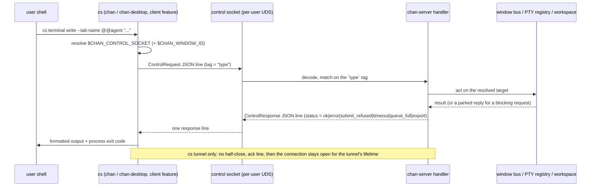
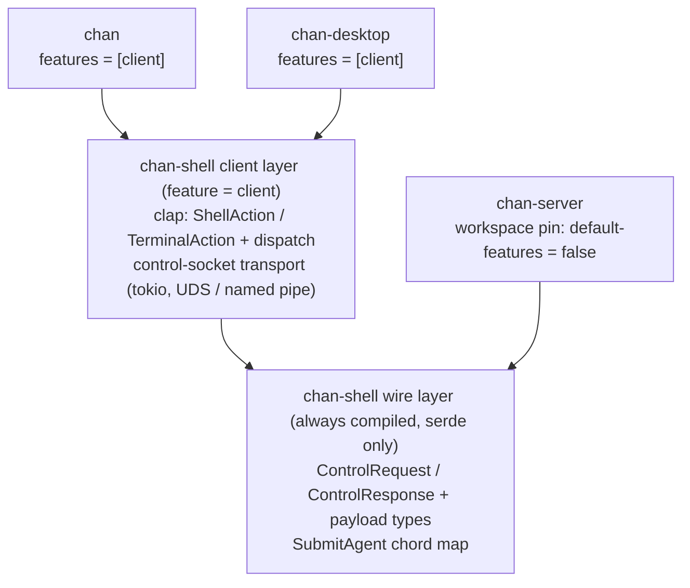
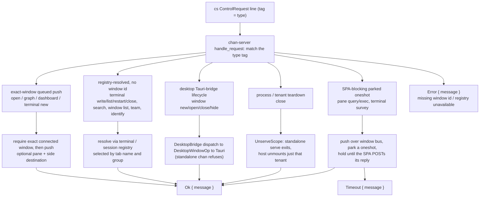

# chan-shell: design

## 1. Problem and scope

chan-shell is the crate behind `cs`, the control client a chan terminal uses to drive the chan-server it is running under. `cs open notes.md`, `cs terminal write`, `cs pane new right`, `cs window list`, and `cs terminal survey` all reach the serving process over its control socket and act on the window, the live PTY sessions, or the workspace that process owns. The crate owns BOTH halves of that conversation: the wire contract (the request / response types) AND the client that speaks it. Defining the contract once is the point -- the same `ControlRequest` / `ControlResponse` types are linked by the `cs` client and by chan-server's socket handler, so a tag or field rename moves on both sides in one edit instead of compiling green on one side and breaking every `cs` command at runtime.

The second reason the crate exists is packaging: the `chan` binary and chan-desktop both ship `cs`. Lifting the `cs` CLI and transport out of the `chan` binary into chan-shell lets chan-desktop drive the identical `cs` command tree (and the MCP discovery it carries) without a separate `chan` install on PATH.

In scope:

  - The control-socket wire types: `ControlRequest` / `ControlResponse` and the payload types they carry (`PaneOp`, `PaneSide`, `TabDestination`, `SurveySpec`, `SurveyReply`, `TeamOp`, `SplitDir`, `Identity`, `ServeKind`, and the shared workspace-search request). serde-only, no transport, no clap, always compiled.
  - The `cs` clap surface (`ShellAction` / `TerminalAction` and their subcommand trees) and the `dispatch` that turns each parsed action into one control-socket round-trip.
  - The control-socket transport: connect, write one JSON request line, read one JSON response line, over a per-user Unix-domain socket on unix and a named pipe on windows. `cs tunnel` is the one long-lived exception (below).
  - The agent submit-chord map: the per-agent PTY byte sequences that make a coding agent submit its compose buffer hands-free, plus the spawn-command -> agent derivation. Compiled even without the client feature, because chan-server's team spawner applies the chord server-side.
  - Named client exit codes (the 124 timeout path and the 69 submit-refused path) and the typed errors that carry them to the dispatch edge.
  - The `arg0` stem checks (`invoked_as_cs` / `invoked_as_chan`) so the `cs` / `chan` alias rewrite is recognized identically by the `chan` binary and by chan-desktop, including under an AppImage `exec -a` shim.

Out of scope, owned by chan-server:

  - Every handler. chan-shell defines the request and response shapes; the server decodes a request, resolves the target window / PTY session / workspace, runs the work (window bus push, PTY write, content search, team generation), and encodes the reply. No handler logic, registry, or window bus lives here.
  - The PTY, the SPA window bus, the workspace store. `cs` is a thin client over them.
  - Control-socket creation, lifetime, and access. The server owns and binds the socket; `cs` only reads its path from the environment a chan terminal exports.

## 2. Architecture overview

A `cs` invocation is one synchronous line-framed round-trip. The client resolves the terminal environment, serializes a `ControlRequest`, writes it as a single JSON line, and reads back a single `ControlResponse` line, which it formats for the user. The one exception is `ControlRequest::Tunnel` (`cs tunnel`, the long-lived category): the client does NOT half-close, the first response line is the ack (an `Ok` naming the resolved desktop bind authority) or a refusal, the server then holds the connection for the tunnel's lifetime, and a second `Error` line arrives only if the tunnel dies before the client does. The client's EOF (Ctrl-C, killed shell) IS the teardown signal; `send_control_request_streaming` + `TunnelSession` carry this shape, and the response vocabulary is unchanged (`Ok`, `Error`, and the typed `Timeout` mapping to exit 124).

  - The client reads two environment values a chan terminal sets: `$CHAN_CONTROL_SOCKET` (which server to reach) and `$CHAN_WINDOW_ID` (the default window to act on). Tab openers and `cs pane` can override the default with `--window`; session-scoped actions (`cs terminal list`, `cs search`, `cs window list`) need only the socket, because the server resolves their target through its own registry.
  - Tab openers return after checking the exact target window is currently connected, then queuing the command; this exact-window check is strictly better than a blind fire-and-forget, but "queued" means queued to a window that was live at the moment of dispatch, not a guaranteed delivery -- a window disconnecting or a lagging receiver at that instant can still miss the frame while another live window keeps the broadcast send returning `Ok`. Pane operations are atomic and blocking: one invocation sends one query or mutation and waits for the SPA result. Surveys and window-close confirmations block in the same way. The single-round-trip transport is what makes the dedicated `Timeout` response shape necessary -- a parked request that never gets answered must surface as a typed timeout rather than a dropped connection.
  - Relative paths are absolutized against the client's cwd before they cross the wire, so `cs open .` and `cs upload sub/` resolve where the user typed them, not where the server runs.

## 3. The feature split: wire-only vs client

chan-shell has two layers behind one `client` Cargo feature. The wire types and the submit-chord map compile with serde alone; the `client` feature adds clap, tokio, and the rest of the CLI and transport stack.

The split exists so chan-server can share the wire contract WITHOUT linking clap or a control-socket client it never uses. The mechanics:

  - chan-shell's own `default` feature is `client`, so a standalone `cargo build -p chan-shell` and the crate's own tests get the full surface.
  - The workspace dependency pin sets `default-features = false`. Every consumer therefore starts wire-only and opts the client layer back in explicitly. chan-server depends with the bare workspace pin (`chan-shell = { workspace = true }`) and gets just the serde types; `chan` and chan-desktop add `features = ["client"]`.
  - The `client` feature gates the only heavy deps: clap, tokio, serde_json, anyhow, toml, and base64. Wire-only chan-server pulls serde and nothing else, which keeps clap and the tokio transport out of the server binary.
  - The submit module is deliberately NOT behind `client`: `SubmitAgent`, `ResolvedSubmit`, the input-plan builder, `apply_submit_chord`, and `submit_writes` compile unconditionally, because the wire, terminal queue, and chan-server's direct team spawner share the same map. Only the `ValueEnum` parse impl for the `--submit` flag is `client`-gated, inside the module.

## 4. The wire model

`ControlRequest` is one internally-tagged enum (`#[serde(tag = "type", rename_all = "snake_case")]`); `ControlResponse` is another (`#[serde(tag = "status", ...)]`). The serde tags ARE the wire format: the JSON `"type"` string is what the server matches a request on, and the `"status"` string is what the client matches a reply on. Both sides are the same Rust type, so the tags move in lockstep, and a dedicated test module pins the exact bytes of a core set of variants so a rename that drifts those bytes is a failing test rather than a green build that breaks at runtime.

Rather than enumerate every variant, the requests group into a handful of families by how the server resolves their target:

Each family resolves its target a different way -- window-id push, registry lookup, a parked SPA round-trip, the desktop bridge, or teardown -- and only the SPA-blocking family can answer `Timeout`. The breakdown:

  - Open a UI tab in one exact connected window. `cs open`, `cs graph`, `cs dashboard`, `cs terminal new`, and real `cs terminal team new|load` accept the same `--window`, `--pane`, and `--side a|b` coordinates. `TabDestination` omits unspecified pane/side axes so the SPA resolves its active pane and visible side when it dequeues the command. These calls queue one command and return; they do not wait for rendering. Upload and download remain window-id actions without pane placement.
  - Act on or inspect live PTY sessions and tenant state through the server's registry. No window id; selected by tab name and/or group. `cs terminal write` / `list` / `restart` / `close` / `scrollback`, `cs search`, `cs window list`, `cs terminal team`, and `chan ps`'s `Identify`. `cs search` sends `WorkspaceSearch { request }` and renders the typed core result as compact/pretty JSON or sectioned markdown; the markdown form prepends a `Workspace recovery is in progress; derived results are not ready.` banner when the `WorkspaceReadiness` is `Recovering`. Structured result errors make the command nonzero without changing the JSON payload.
  - Blocking round-trips to a SPA window's frontend. The layout lives only in the browser, so the server pushes a query / exec over the window bus, parks a oneshot, and holds the connection until the SPA replies. `cs pane list` reports both permanent Hybrid sides, and each canonical command (`new`, `focus`, `resize`, `equalize`, `swap`, `close`, plus `close-tab` and `close-all` for the tab/window-wide closes) is one atomic invocation. The bare query form (no subcommand) stays, and two hidden compatibility aliases remain: `split` (of `new`, kept for parity with `cs window new` and `cs terminal new` rather than preserving any distinct split behavior) and `close-pane` (of `close`). `cs terminal survey` also blocks until the user answers, defers, or dismisses.
  - Desktop window lifecycle through the in-process Tauri bridge the embedded server installs. `cs window new` / `open` / `rm` / `hide`. A standalone `chan open` has no desktop attached and refuses them.
  - Process and tenant teardown. `chan close` sends `Close { path, remove }`; the server decides scope from the path (a standalone serve exits; a multi-tenant host unmounts just that tenant).

The response side is intentionally narrow: `Ok { message }`, `Error { message }`, `SubmitRefused { message }` (exit 69), `Timeout { message }`, `QueueFull { message }`, and `Export { out_path }`. Structured replies (the `Identity` JSON for `chan ps`, the window-list rows, the session roster rows and the `session self` whoami record, the search hits, the pane layout, the pane-exec result, the team bootstrap script) ride as JSON or raw text inside `Ok.message`, and the CLI formats them -- markdown by default, `--json [--pretty]` for machine output. `Timeout` is split out from `Error` so the client maps an elapsed reply window to its own exit code instead of inferring it from a generic failure or a dropped socket.

`Identity` includes optional `workspace_root` and `metadata_key` fields. They are present for a mounted workspace tenant and omitted for terminal-only servers; old decoders tolerate their absence. The pair is the exact tenant identity used by `chan workspace search/graph` when a single process serves several roots.

Two serde conventions recur because byte-compatibility with the SPA and the server matters. Optional request fields carry both `#[serde(default)]` (the server tolerates an omitted key) and `skip_serializing_if = "Option::is_none"` (the client omits `None`), keeping the emitted JSON minimal while staying loss-tolerant on decode. The SPA-facing payloads (`SurveySpec`, `SurveyReply`) use camelCase. `SurveySpec` is the JSON the SPA renders, and its one nullable field (`title`) carries `#[serde(default)]` with no `skip_serializing_if`, so it serializes as explicit `null` when unset, because the SPA's TypeScript type mirrors the struct field for field and expects a `string | null` shape. `SurveyReply` is camelCase too, with no nullable fields: every variant carries only required keys (`surveyId`, plus the option index and label on an option reply).

## 5. The control-socket transport

The client transport layer resolves the environment, makes paths absolute, and round-trips one request. `OpenEnv` carries the `(window id, $CHAN_CONTROL_SOCKET)` pair a window-targeting action needs; the window id can be explicit `--window` or the `$CHAN_WINDOW_ID` default. `control_socket_env` resolves just the socket for a session-scoped action. The env lookups are split from the validation (`open_env_from`) so the validation is unit-testable without mutating the process environment.

`send_control_request` is platform-neutral over a small `transport` module -- the only `#[cfg]`-split surface. On unix it connects a `UnixStream`; on windows it opens a named-pipe client (retrying `ERROR_PIPE_BUSY` and a momentarily-absent pipe under a bounded deadline so a genuinely-missing server still fails fast). Above that split the protocol is identical: serialize the request, append a newline, write it, half-close the write side, then read one response line. The `\n` frames the request, so the half-close is belt-and-suspenders rather than load-bearing. `cs tunnel` rides the same transport through `send_control_request_streaming`, which skips the half-close: the open write side is how the server distinguishes a live tunnel client from a finished one-shot request.

A `ControlResponse::Timeout` is converted into a typed `ControlTimeout` error instead of a generic `anyhow` bail. The dispatch edge downcasts it, prints the elapsed-window line, and exits `CONTROL_TIMEOUT` (124, matching GNU `timeout(1)`), so a caller can tell "no answer in time" apart from a real failure (exit 1) and a delivered answer (exit 0).

A connect that fails because the socket file is gone or refused means the chan window or server that spawned the terminal has exited, leaving a stale `$CHAN_CONTROL_SOCKET` (common after a devserver restart). The client reports that in plain words rather than surfacing a raw connect trace for a path the user never set by hand.

### Command availability by tenant

The control socket serves two server tenants, and a command's availability follows from what it needs. The server enforces it in one chokepoint (`terminal_tenant_refusal`) so the policy is table-testable in isolation:

- Standalone (runs on both a standalone terminal and a workspace window): `dashboard`, `upload`, `download`, `copy`, `paste`, pathless `terminal new`, `terminal write`/`list`/`restart`/`close`/`scrollback`/`survey`, `window list`, and `pane`. Uploads and downloads are cwd/shell-uid scoped on a standalone terminal and workspace-relative in a workspace window.
- Workspace-only (refused on a standalone terminal, which has no workspace): `open`, `graph`, `search`, `export`, `terminal new --path`, every `session` subcommand, and every `terminal team` form including `--script`. The refusals share one message family via `workspace_only_refusal`, and `cs open` additionally points at `chan open PATH`.
- Desktop-only (a separate axis): `window new`/`open`/`rm`/`hide` need the chan desktop app. `tunnel` runs from any terminal window but needs a devserver or desktop HOST (a standalone `chan open` server refuses it) plus a chan-desktop-opened window to answer the trigger; a browser-only viewer times out the ready wait (exit 124) with a message naming the desktop as the only capable client.

The server gate reaches old `cs` binaries immediately (it lives server-side); only the friendlier client wording for a stale socket needs the new binary.

## 6. The agent submit-chord map

A coding agent running inside a chan terminal submits its compose buffer on a different byte sequence depending on which agent it is, so the hands-free completion poke (`cs terminal write --submit=<agent>`) has to use the right one. The submit-chord layer owns that map and the command -> agent derivation, and is the single source of truth mirrored by the SPA's TypeScript detection.

`SubmitAgent::derive` maps a spawn command, with an optional `CHAN_AGENT` env override, to the agent whose encoding it uses. The override wins when it names a known agent or an explicit shell (`none` / `shell`); otherwise a loose whole-word sniff of the command recognizes `agy` / `claude` / `codex` / `gemini` / `kimi` / `opencode` anywhere as a word, so `claude --resume`, `/usr/local/bin/codex-cli`, `/home/user/.kimi-code/bin/kimi`, `/home/user/.local/bin/agy`, and `opencode-ai` resolve while `claudette`, `kimiko`, `stagy`, and `myopencode` do not. `CHAN_AGENT` is the variable, read from the TARGET session's spawn environment; `CHAN_MODE` is read by nothing.

Each agent has a `{}`-templated chord whose built-in default reproduces the live-probed submit bytes: claude appends the xterm modifyOtherKeys Cmd+Enter CSI (`\x1b[27;9;13~`); agy, codex, kimi, and opencode wrap the text in bracketed paste then a CR; gemini appends a plain CR. Codex needs the wrap because a bare trailing CR gets coalesced into its paste burst and lands as a literal newline. Kimi treats a bare CR as an editor newline. Agy (Google Antigravity, gemini's successor) accepts a CR coalesced, separate, or after bracketed paste, but only the bracketed form's one-message guarantee is independent of its burst-coalescing timing. Agy, Kimi, and OpenCode each keep their own built-in template even though the current byte sequence is shared, so one client can change independently. The template is overridable at runtime: env `CHAN_SUBMIT_<AGENT>` beats a process-global map loaded from `<config>/chan/submit.toml`, which beats the default. Override strings carry C-style escapes (`\e`, `\xHH`, `\r`, ...) so a config value can express control bytes as text.

The sender selects the chord on the write path; the server owns its encoding. `cs terminal write` carries logical text plus the sender's request over the control wire (whether to submit, and the agent NAME to encode for; the wire still decodes the former fully-resolved client shape, using only its agent field). At enqueue, the server resolves THAT agent's template in the SERVER's environment (env `CHAN_SUBMIT_<AGENT>` > the server's `<config>/chan/submit.toml` > built-in), so a `CHAN_SUBMIT_*` value in the writer's environment has no effect. One chord is encoded per command, so a mixed-agent group write delivers the same chord to every member and such a group is targeted per session instead.

The server still derives each MATCHED session's own agent from its spawn command and `CHAN_AGENT`, but only to report a disagreement in the control reply next to the queue position; it does not override the request. Derivation cannot be authoritative because it reads the string a session was spawned with rather than the process now running: a session spawned as a shell whose operator then started an agent by hand derives nothing, forever, and no live session can be corrected short of restarting it. Making the sender authoritative is what lets that session be reached at all, at the cost that a wrong name now delivers a wrong chord instead of being fixed silently. `cs terminal list` exposes each session's derived agent as the value to name by default. Rich Prompt resolves the same metadata server-side and enters the queue as one logical message. Every logical write, raw or submitted, is capped at 4096 UTF-8 bytes by both the CLI and the queue; larger content belongs in a file named by a short poke. Refusal never truncates or partially enqueues a message. The queue holds ENTRIES and bounds them at 100: every entry is exactly one raw write, so a Gemini message occupies two and everything else occupies one. Depth counts logical messages (one per tail entry), and that is the number the SPA badge, the `cs terminal list` markdown table's `queue` column, `cs terminal list --json`, and a `cs terminal write` queue position all report.

`plan_submitted_input` is the drain-time byte source of truth. Every non-empty submitted body is normalized as `trim_end_matches('\n')` plus exactly one `\n` ahead of the chord; an empty body stays chord-only. Raw writes are byte-identical end to end. Gemini remains the split-write agent: a 2026-07-20 live sweep on Gemini 0.51 found no fixed sub-idle gap safe for the required 64 KiB batch. At 400 ms the CR still became Shift+Return; at 700 ms the body submitted but the five-block content oracle was not preserved, leaving only 100 ms below the queue's idle threshold. A Gemini message therefore takes TWO queue entries (body, then bare CR) that the normal idle gate separates. The compatibility helpers `apply_submit_chord` and `submit_writes` remain for direct team-spawn callers, which own their own inter-write gap and apply the same newline normalization.

At one safe idle opportunity, the terminal drainer selects the maximal consecutive prefix of submitted `cs terminal write` messages with one identical proven built-in submit spec. Two or more messages become one ASCII-framed chronological prompt capped at 64 KiB; one message keeps its exact singleton bytes. Rich Prompt, raw unsubmitted input, Gemini, runtime overrides, agent/spec changes, and the byte ceiling are FIFO boundaries, and the selector never skips them. Agy, Codex, Kimi, and OpenCode accept the framed batch in their normal bracketed-paste-plus-CR write. Claude receives the batch body and submit CSI as two atomic controller parts, separated by a gap measured against Claude Code 2.1.215, so paste handling cannot swallow the submit chord.

## 7. Interface contracts

The serde wire contract is always compiled and independent of the `client` feature: request tags use `type`, responses use `status`, and the response vocabulary is `ok`, `error`, `submit_refused`, `timeout`, `queue_full`, and `export`. SPA-facing payloads keep their camelCase/nullability rules from section 4.

The submit-chord map is also wire-layer state, not client-only code. chan-server applies the same agent derivation and write splitting that the `cs` client exposes, so server-spawned teams and terminal-side `cs terminal write --submit` stay byte-compatible.

The `client` feature owns the clap surface and transport. Its flag names, `infer_subcommands` behavior, `$CHAN_CONTROL_SOCKET` / `$CHAN_WINDOW_ID` environment contract, path-absolutization before send, and alias detection for `cs` / `chan` are runtime-visible behavior. All current tab openers share `--window`, `--pane`, and `--side a|b`; team `--script` conflicts with those coordinates because preview mode opens no tabs. `cs pane list` and `cs terminal list` expose side A/B placement, with terminal sessions refreshing their pane/side/tab identity over the live terminal WebSocket when a mounted tab moves. A control request returning `Timeout` maps to the dedicated control-timeout exit code (124); `Ok.message` remains the carrier for formatted text or embedded JSON.
