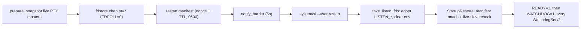

# chan-systemd -- design

The systemd boundary crate: chan's only fd-adoption seam and the single owner of the canonical `chan-devserver.service` unit text. Everything systemd-shaped (readiness, watchdog, fdstore, inherited descriptors, unit rendering and classification) goes through here; no other crate talks to `NOTIFY_SOCKET` or `LISTEN_*`.

## What it provides

- **sd_notify**: `notify_ready` (`READY=1`), `notify_watchdog` (`WATCHDOG=1`), and `notify_barrier` (`BARRIER=1` carrying one end of a socketpair as SCM_RIGHTS; blocks until systemd closes it, so the caller KNOWS prior notify messages were consumed). Transport is an unbound UnixDatagram to `NOTIFY_SOCKET` (abstract sockets supported); with no socket every notify is a silent Ok no-op, so the same binary runs unsupervised.
- **Watchdog cadence**: `watchdog_interval` returns `WATCHDOG_USEC / 2` (`None` when unset, zero, or `WATCHDOG_PID` names another process). The unit pins `WatchdogSec=30`, so a healthy devserver pings every 15s; the ping loop lives in the consumer and starts only after READY.
- **fdstore**: `fdstore(name, fd)` sends `FDSTORE=1` + `FDNAME=` + `FDPOLL=0` with the fd as SCM_RIGHTS (`FDPOLL=0` stops systemd from poll-closing an active PTY master); `fdstore_remove_many` sends best-effort `FDSTOREREMOVE=1` per name.
- **Inherited-fd adoption**: `take_listen_fds` converts `LISTEN_FDS`/`LISTEN_FDNAMES` (raw fds from 3) into typed `NamedFd`s with CLOEXEC. It refuses on a `LISTEN_PID` mismatch, and when `LISTEN_PIDFDID` is present it must match our pidfs inode (absent passes, so older systemds still adopt). All four `LISTEN_*` vars are removed unconditionally so children cannot re-adopt.
- **Supervision hygiene**: `scrub_child_supervision_env` strips `WATCHDOG_PID`, `WATCHDOG_USEC`, and `NOTIFY_SOCKET` from spawned children; `pty_master_has_live_slave` checks via /proc that a restored master still has a live slave before it is re-served.
- **Unit text**: `DevserverUnit` renders the canonical user unit (`Type=notify`, `NotifyAccess=main`, `FileDescriptorStoreMax=512`, `KillMode=process`, `TimeoutStartSec=10min`, `Restart=on-failure`, `WatchdogSec=30`, `WantedBy=default.target`); callers own only ExecStart and Environment. `classify_installed` compares an installed unit against the renderer's profiles: `Current` is left untouched, `KnownLegacy` (a prior chan-owned shape) is migrated, `Foreign` is refused. Whitespace and comments are inert; ExecStart must be a chan devserver invocation and Environment keys are limited to `CHAN_HOME` / `CHAN_TUNNEL_TOKEN` / `CHAN_TUNNEL_DEVSERVER_NAME`.

The PTY-preserving restart is the flow the crate exists for:

## Platform split

`linux.rs` implements everything; `unsupported.rs` keeps other targets honest: the notify helpers are silent Ok no-ops, `watchdog_interval` is `None`, and `scrub_child_supervision_env` still strips the vars. `NamedFd`, `take_listen_fds`, `fdstore*`, and `pty_master_has_live_slave` do not exist off Linux, so a consumer cannot compile a fake restore path; chan-server's non-Linux prepare route answers an explicit 400 instead. The crate depends only on rustix; `unsafe_op_in_unsafe_fn` is denied and the single unsafe block is the `OwnedFd::from_raw_fd` adoption inside `take_listen_fds`.

## Consumers

- `crates/chan-server/src/devserver/fdstore.rs`: the restart flow above. `POST /api/devserver/systemd-fdstore/prepare` (bearer-gated) uploads each master as `chan.pty.{nonce}.{idx}.{child_pid}`, writes the manifest under the chan config dir, waits the barrier, and schedules a 30s nonce-guarded cleanup for a restart that never happens. On the next boot `StartupRestore` adopts inherited fds before any route is exposed, pairs them with the manifest, skips dead sessions, and removes every consumed fdstore entry; each failure path removes fds and manifest rather than leaving systemd holding orphans. READY and the watchdog ping loop ride the same module.
- `crates/chan/src/lib.rs`: writes `~/.config/systemd/user/chan-devserver.service` via `DevserverUnit`, classifies before overwriting (Foreign refused with an actionable error, KnownLegacy migrated with rollback on failure), and `--service=systemd --restart` calls the prepare route first, downgrading to a destructive restart only with `--force`.
- `crates/chan-library/src/terminal_sessions.rs`: scrubs the supervision env from every spawned terminal child so PTY children cannot feed the watchdog or touch the fdstore.

## Boundaries

- No `STOPPING=1` is sent; stop semantics ride `KillMode=process` + `Restart=on-failure`.
- Real-systemd coverage is env-gated: `CHAN_SYSTEMD_FDSTORE_E2E=1` runs the fdstore and watchdog e2es against transient `systemd-run --user` units that re-invoke the test binary.
- The user-visible restart story (what survives a devserver bounce, what resets) lives in the root [design.md](../../design.md) devserver section; this crate is only the mechanism.
