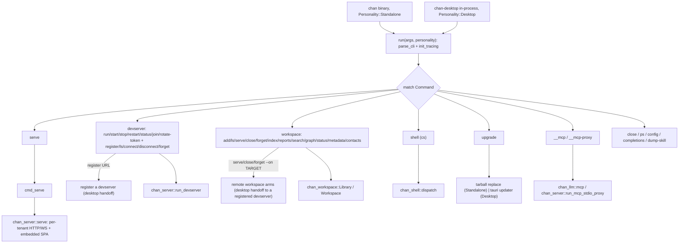
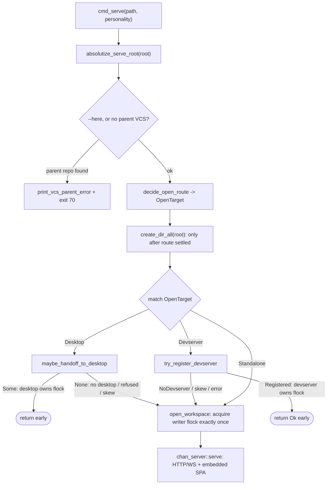

# chan design

## 1. Problem and scope

`chan` is the binary crate at the top of the workspace: the CLI entrypoint, the subcommand dispatcher, and the place that mounts the embedded `chan-server` for a local serve. It owns argument parsing, tracing setup, the dispatch `match`, the per-subcommand handlers, and self-upgrade. It deliberately owns almost no domain logic of its own; every registry mutation and workspace-content operation routes through `chan_workspace::Library` / `Workspace`, every HTTP / WebSocket / SPA concern routes through `chan-server`, every MCP concern routes through `chan-llm`, and the `cs` control surface lives in `chan-shell`. This crate is the thin seam that wires those libraries to a command line and to a process lifecycle.

In scope:

  - The `clap` surface: the top-level `Cli` / `Command` enums and their per-subcommand sub-enums, plus the help text that is the source of truth for options.
  - One async entry point, `run(args, Personality)`, dispatched in-process by both the standalone `chan` binary and `chan-desktop`.
  - The per-subcommand handlers (`cmd_*`), which are orchestration glue: resolve a workspace, call a library, print a result.
  - Mounting `chan-server` for `chan serve {PATH}` (a local serve) and for `chan devserver run` (the headless multi-workspace mode).
  - Self-upgrade: the startup update banner / probe and the `chan upgrade` archive replacement, plus the Windows `--service` devserver supervision backend.

Out of scope (owned by the libraries this crate drives):

  - Filesystem sandbox, registry, search, graph, watcher (`chan-workspace`).
  - HTTP / WebSocket routes, SPA serving, the in-process MCP host, the devserver builder, the desktop / devserver handoff transports (`chan-server`).
  - MCP tool schemas and stdio server (`chan-llm`).
  - The `cs` clap actions and the control-socket client (`chan-shell`).
  - The native window, webview, and `tauri-plugin-updater` (`chan-desktop`).

The dispatcher is organized strictly by subcommand dispatch: one `cmd_*` handler per branch of the `match`. This document stays at the dispatch level and does not enumerate every handler or every flag; the `_HELP` / `long_about` text in the clap structs is the authoritative reference for options.

## 2. Architecture overview

The whole CLI surface lives behind the same `run` function so two binaries can drive it: the standalone `chan` binary and `chan-desktop`, which dispatches `chan` in-process when it is invoked through a `~/.local/bin/chan` shim. The only behavioural fork between the two is the `Personality` value threaded into `run`.

The standalone binary builds one multi-threaded tokio runtime for the whole process (`serve` needs it; the sync subcommands run inline on it fine), `block_on`s `run`, and then calls `shutdown_background()` so the process can exit without waiting on `chan-workspace`'s uncancellable reindex pool after Ctrl-C. The runtime is built at the process edge because `run` is async and you cannot build a runtime from inside an async context.

## 3. Frontend boundary

This crate ships no frontend code. `chan serve` serves the SPA through `chan-server`'s build-time bundle, so the editor / terminal / launcher assets reach the user without this crate owning web assets.

## 4. Subcommand dispatch

The CLI entry point parses arguments, sets up tracing from `-v` count, and dispatches the parsed `Command` to a handler. The top-level surface is intentionally narrow: the noun families (`chan workspace`, `chan devserver`) are the structural layer, and exactly two family verbs carry elevated top-level spellings, `serve` and `close`, pinned by test (`flat_workspace_subcommands_are_rejected`) so the elevation list never grows by habit.

The real top-level set:

  - `serve {PATH}`: register a workspace and serve it, the elevated spelling of `chan workspace serve` (one flattened args struct, so the two spellings cannot drift). With `--on TARGET` it mounts PATH on a registered remote devserver through the desktop handoff instead of serving here; `--on` and `--devserver=<port|url>` are distinct flags, each refusing the other's value shape. A URL-shaped value (`://` with a non-empty scheme and authority, using a small string check rather than a URL crate) is refused with a pointer at `chan devserver register` rather than read as a relative path.
  - `close {PATH}`: stop serving, the elevated spelling of `chan workspace close` (one flattened args struct). With `--on TARGET` both unmount a workspace on a registered remote devserver through the desktop handoff, keeping it registered there; `chan workspace forget --on TARGET` drops it, and the devserver's own live-terminal refusal applies to both.
  - `devserver`: one noun, two faces, told apart by argument shape. The server-side verbs (`run`, `start`, `stop`, `restart`, `status`, `join`, `rotate-token`) manage this machine's headless multi-workspace server, dispatch to `chan_server::run_devserver` with the `--service` supervision and the tunnel options, and take no target, because the process is a per-CHAN_HOME singleton. The client-side verbs (`register`, `ls`, `connect`, `disconnect`, `forget`) manage the desktop launcher's registry of remote devservers over the CLI-to-desktop handoff socket; each requires a URL or label target and a running desktop.
  - `workspace {add,ls,serve,close,forget,index,reports,search,graph,status,metadata,contacts}`: the registry, lifecycle, and content operations, every one routed through `chan_workspace::Library` / `Workspace` so the sandbox, atomic writes, special-file refusal, and the cross-process writer lock apply uniformly. `forget` is the teardown-then-drop verb (the registry entry and chan's metadata go; the files never do).
  - `shell`: the `cs` control surface (`infer_subcommands`, so `cs o` / `cs g` resolve by first letter), dispatched to `chan_shell::dispatch`.
  - `ps`, `config`, `completions`, `dump-skill`: the served-workspace listing, persisted preferences, shell-completion generation, and the agent-facing manual rendered from chan's own help text.
  - `upgrade`: self-upgrade, forked by `Personality` (section 7).
  - `__mcp` and `__mcp-proxy`: hidden, internal-only. `__mcp` runs the `chan-llm` MCP server on stdio against a registered workspace (`chan_llm::mcp::Server::serve_stdio`); `__mcp-proxy` bridges an agent subprocess's stdio to the MCP server hosted in-process by a running `chan serve` (`chan_server::run_mcp_stdio_proxy`). The proxy exists so agent child processes reach the live workspace without trying to reopen it, which would deadlock against the per-workspace flock. Both are hidden because they are spawned by MCP clients, never typed by a user.

Each subcommand handler is orchestration only: it opens a `Library`, resolves a `Workspace` when needed, calls into the owning library, and prints text or `--json`. The handlers do not re-implement library invariants; they depend on them.

## 5. serve: mounting chan-server and the embedded frontend

`cmd_serve` is where `chan` becomes a running editor. It does more than bind a socket because a workspace has exactly one writer-lock holder, and `chan serve` has to cooperate with whatever might already own that lock on the box. The order of operations encodes that single-writer invariant:

*cmd_serve resolves one open route, then every handoff path returns early so only the standalone tail acquires the writer flock.*

  1. **Absolutize and gate.** The serve root is made absolute against the CLI's cwd (the desktop handoff runs with cwd `/`, and the registry is keyed by canonical path, so a relative root must not leak). Unless `--here` is passed, a root inside a Git / Mercurial / Subversion working tree is refused with a structured marker on stderr and exit 70, so a wrapping shell can offer the repo root instead.
  2. **Desktop handoff.** When the `Desktop` personality is active (or `CHAN_DESKTOP_HANDOFF=1` forces it, which is how the Windows desktop bundle re-execs the standalone console binary into a handoff), a same-user `chan-desktop` in a GUI session is asked to open the workspace in a native window, and the CLI exits. The desktop then owns the flock; the CLI must not also open it.
  3. **Devserver registration.** Otherwise, unless opted out, a same-user local `chan devserver` is offered the workspace; if it mounts it, the CLI prints a note and exits, again leaving one flock owner. This path runs for the standalone binary too and needs no GUI, because devservers are exactly where SSH-only boxes live.
  4. **Standalone serve.** When no handoff takes the workspace, the CLI registers and opens it itself and calls `chan_server::serve(lib, workspace, config)`, which mounts the per-tenant HTTP / WebSocket app and the embedded SPA. The update banner and the background probe fire here, a non-loopback bind prints a plaintext-exposure warning, and a bind collision on the shared default port (`8787`) against an already-running devserver is recognized and turned into an actionable hint rather than a bare "address already in use".

Every handoff path returns early, so a successful handoff never double-opens, and every failure mode (no desktop, refused, stale socket, version skew, GUI absent) drops through to the standalone serve. `chan devserver` reuses the same `chan-server` machinery through `run_devserver` for the multi-workspace case.

## 6. The Personality split

`Personality` exists because the same CLI code runs from two binaries that must behave differently in exactly two places, and threading one enum is cheaper and clearer than two code paths or a build flag. `Standalone` is the `chan` binary from `install.sh` or `install.ps1` (and their `cs` aliases); `Desktop` is `chan-desktop` dispatching `chan` in-process through its shim. The forks:

  - **`chan serve`**: `Standalone` always runs its own server (or registers with a local devserver) and never hands off to a desktop; `Desktop` integrates with the running desktop, handing the workspace to a native window.
  - **`chan upgrade`**: `Standalone` replaces its CLI archive in place, including the standalone Windows ZIP; `Desktop` drives the desktop's `tauri-plugin-updater`, since a desktop install is not a loose binary it can overwrite. The Windows NSIS install's console `chan.exe` carries `CHAN_DESKTOP_HANDOFF=1`, so it follows the desktop arm despite being the standalone binary.

Everywhere else the two personalities run identical code. Keeping the fork down to one threaded value is the reason the desktop can share the entire subcommand surface without forking the dispatcher.

## 7. Self-upgrade

The self-upgrade path keeps the running CLI current without a package manager. It has three pieces, all pointed at hardcoded `chan.app` metadata URLs in production builds (self-hosted mirrors are not supported for the CLI path). Native Windows CI uses a compile-time-only loopback metadata seam:

  - **Banner**: on `chan serve` startup, a one-line stderr notice is printed from a cached state file. No network access, so an air-gapped host pays nothing.
  - **Probe**: a detached tokio task on `chan serve` reads release metadata with short timeouts, refreshes the cache, and prints the banner inline when the fetched version is newer. Throttled to once per day across restarts; failures are swallowed at debug level. `CHAN_UPDATE_CHECK=0` disables the probe.
  - **`chan upgrade`** (`Standalone`): resolves the running binary via `current_exe`, reads metadata, downloads the target archive into a sibling temp file, verifies its SHA-256 against the metadata, and extracts the exact `chan` binary. Unix atomically renames the staged binary over the running executable; Windows renames the mapped executable aside, installs the staged binary, rolls back if that second rename fails, and schedules the old image for deletion after exit. Size-capped and proxy-aware via the standard `*_PROXY` env vars. A distro-packaged build refuses `chan upgrade` and defers to the package manager.

The self-managed `--service=chan` backend is the cross-OS analog of the systemd user service on Linux and the launchd LaunchAgent on macOS, used where no OS supervisor exists (Windows, other Unix) and available as the explicit portable choice everywhere. It runs a detached child command, `__devserver-daemon`, redirects stdout/stderr to `~/.chan/devserver/devserver.log`, and guards the child with a single-instance pidfile + flock (`daemon.json` + `daemon.lock`, the `chan-workspace` `daemon_lock` primitive). `chan devserver start --service=chan` starts that daemon in the background and returns idempotently (`run --service=chan` resolves the same way); `chan devserver join --service=chan` starts it if needed, then attaches as a health watchdog until Ctrl-C or its non-TTY stdin closes, which detaches without stopping the daemon. `stop` / `restart` / `status` act on the same pidfile, signalling the recorded pid only when the flock confirms a live daemon (so a `kill -9`-leaked pidfile plus a reused pid never SIGTERMs an innocent process); a hard stop is safe because the devserver drains HTTP per request and the writer lock self-heals. `--service` defaults to `auto`, which resolves per-OS at runtime: under a management verb it supervises under systemd (Linux), launchd (macOS), or the `chan` daemon (Windows), and under `run` it is the plain foreground server, so `chan devserver run` works on every host. `--service=none` forces that unsupervised foreground server and only `run` accepts it; `--service=systemd` / `--service=launchd` name a specific OS backend explicitly, each requiring a management verb (`start` / `stop` / `restart` / `status` / `join`). A management verb on a host where auto cannot resolve a manager (an unrecognized OS, or a Linux box with no `/run/systemd/system`) fails with a clear message pointing at `--service=chan`.
