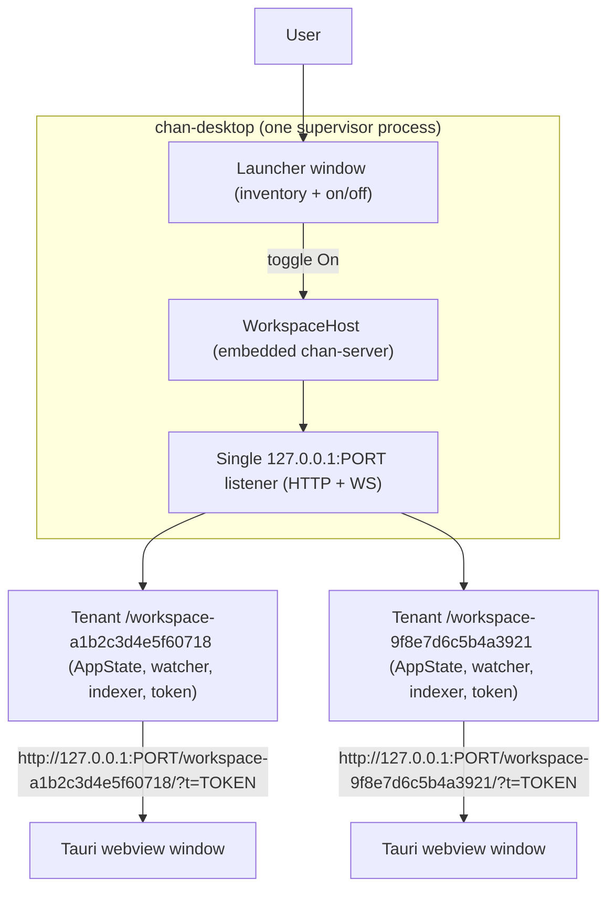
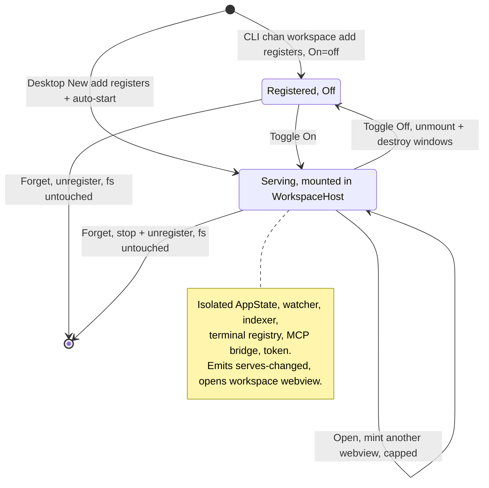
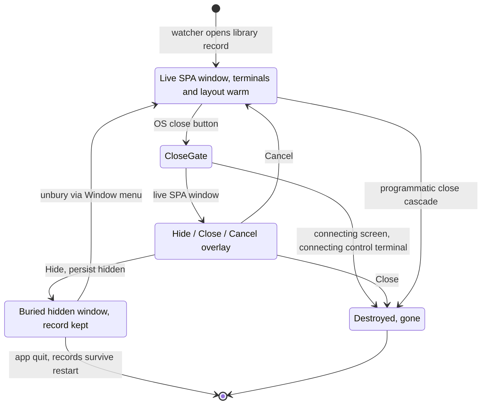

# chan-desktop design

This document is the source of truth for what chan-desktop is and is not. It is intentionally light on Rust / Tauri specifics and heavy on business logic. When the implementation drifts from this doc, fix one of the two.

## 1. Purpose

chan-desktop is the native desktop shell for chan. For normal local workspaces it embeds chan-server in the desktop process and serves the same Svelte editor on a loopback HTTP port. It links `chan-workspace` and `chan-server` directly, and registry mutations run in-process against the embedded `chan-workspace` `Library`. The same binary also IS the `chan` / `cs` command line: invoked through a `chan` or `cs` name (argv0, or `$ARGV0` inside an AppImage) it dispatches the CLI before any GUI init, and on boot it owns the `~/.local/bin/{chan,cs}` shims (section 7), so a desktop install ships the CLI *with* the app, nothing extra to download. The desktop app exists so that:

- a non-CLI user can install one signed bundle and open a folder through a familiar OS dialog instead of a terminal,
- multiple workspaces can be supervised at once, with one launcher window acting as the inventory and on/off control,
- local embedded workspaces and connected devservers share the same editor window model.

Non-goals:

- chan-desktop is not a second editor. The editor is the web app served by chan-server. The desktop manages workspaces and opens the editor in Tauri webview windows.
- chan-desktop is not a general web browser. Workspace windows are dedicated Tauri webviews served by the embedded host or a connected devserver.

## 2. Mental model

One desktop process hosts many running local workspaces:

*One supervisor embeds a WorkspaceHost that serves many local workspaces on a single 127.0.0.1 listener under per-path-hash prefixes, each opened in a Tauri webview via a tokened URL.*

There are three workspace attachment modes:

- **Local embedded**: a local registry entry opened by chan-desktop. The desktop mounts the workspace into its embedded `WorkspaceHost` and owns the runtime.
- **Devserver**: a headless `chan devserver` the desktop dials by URL (often over an `ssh -L` forward). The devserver owns the per-workspace runtimes and tokens; the desktop persists only the connection recipe and owns the windows.
- **Gateway roster**: an account-level gateway connection whose authenticated devserver roster the desktop projects into the launcher (section 6.7).

There is no fallback serve mode. A terminal `chan serve <path>` hands the workspace to a running desktop over the CLI handoff socket instead of racing it for the workspace lock. The same socket carries the remote workspace arms: `chan workspace serve|close|forget WS --on TARGET` resolve TARGET against the registry rows (`remote_workspace.rs` holds the pure resolvers) and act on a connected devserver's management API (mount, unmount, forget) with the devserver's own live-terminal refusal; a registered but disconnected row refuses with a pointer at `chan devserver connect`.

## 3. Workspace lifecycle

*Local-workspace lifecycle: desktop New auto-starts while CLI `chan workspace add` stays Off; Toggle On mounts an isolated runtime, Toggle Off unmounts and destroys windows, Forget unregisters and leaves the filesystem untouched.*

### 3.0 Source of truth

The `chan` registry at `~/.chan/config.toml` is the single source of truth for the set of known workspaces. Desktop-driven mutations (add, remove) run in-process against the embedded host's shared `chan_workspace::Library`, using the same code path the CLI uses, without spawning it. Routing everything through the one shared `Library` is what keeps a freshly-added workspace openable immediately: mutating only the on-disk registry would leave the host's in-memory snapshot stale.

The desktop owns a small config of its own at `~/.chan/desktop/config.json`, under the same `~/.chan` home as the CLI registry, not a separate OS app-data directory. It holds desktop-only state: devserver and gateway connection recipes, exact shared-devserver native-trust records `(gateway id, owner user id (UUID), full devserver id)` (the username rides along for config legibility only and never authorizes), per-window OS geometry, the local pane colour, launcher theme, and collapsed machine cards. Gateway rosters remain volatile and authenticated; persisted trust cannot manufacture a row that is absent from the current roster. The On column is derived live from the in-memory map of active local runtimes; the on-set persists to the library-owned overlay at `~/.chan/workspaces.json` (`{path, on}` rows, shared with the devserver) on every toggle and on clean shutdown, so a restart re-serves the workspaces the user left running (the section 3.2 boot matrix). Accepted trade-off: a crash with an entry persisted re-serves it next boot; a re-serve failure there surfaces a notice and is left off (it drops from the set on the next clean shutdown).

A filesystem watcher (`notify` + debounce) runs over `~/.chan/` for the lifetime of the process and emits a `registry-changed` Tauri event when the registry file itself changes (events are filtered to that file: `preferences.toml` churn from pane drags must not storm the launcher). On a registry change it also reloads the embedded library registry and signals the library change feed, so the launcher's `/api/library` watch re-renders. Concrete consequence: if the user runs `chan workspace add ~/notes` from a terminal, the row appears in the desktop window without any explicit refresh.

### 3.1 The launcher

The launcher (Tauri label `main`, title "Chan Desktop") is a singleton: it is never multiplied, its close button hides rather than destroys it, and reopening is instant. It renders collapsible machine cards: one local card plus one card per devserver, with gateway-rostered devservers listed beside the persisted rows. Each card lists its workspaces as expandable rows carrying an on/off toggle (a connection dot for remote rows), an Open action, and select-mode checkboxes for bulk actions; gateways are managed on their own launcher screen.

A local workspace can be named when it is added (the label rides the library add route); the watcher reflects registry changes made from a terminal.

The launcher SPA invokes only `restart_desktop_after_update` and `request_app_quit`, and it receives the core event listen grant (section 6.1). Its injected reload chord also tries `reload_window`; the loopback launcher is not granted that command, so the bridge falls back to `location.reload()`.

### 3.2 First launch and the [New] modal

A workspace is opt-in: chan-desktop never creates one on your behalf. There is no default workspace, no `~/Documents/Chan`, and no embedded manual seeded anywhere. Boot opens the launcher, mounts the shared `/terminal` tenant, and then follows the matrix:

- **Fresh library** (empty registry, first-open marker unset): the library's first-open rule mints one boot terminal, the workspace-less `kind=terminal` window of section 6.5, and persists the marker. With the marker set, an emptied registry never re-mints: a user who closes their only terminal reopens to none.
- **Workspaces were on at the last clean shutdown** (the `~/.chan/workspaces.json` overlay, section 3.0): each is re-served without minting new windows; the window watcher restores that workspace's persisted window records at their stable window ids (hidden stays hidden). A workspace that fails to re-serve surfaces a system notice and is left off.

The user creates or opens a workspace only when they want one, through the [New] dialog. Context-anchored entry points open it pre-set to one of three forms: Local directory, Devserver, or Gateway, with no in-dialog chooser:

- **Local directory**: native folder picker (a plain path input in a browser) plus an optional name, POSTed to the library add route (`POST /api/library/workspaces`), which registers the folder and immediately starts + opens it. There is deliberately NO desktop-side pre-flight scan or feature toggle here: chan's SPA owns first-boot readiness through its preflight overlay and the optional Semantic / Reports layers post-boot. A desktop scan dialog would duplicate and race the SPA boot surface.
- **Devserver**: an Address field (bare `host:port` or a full URL) plus optional label, connect script, and token; the control terminal runs the script and the desktop dials out.
- **Gateway**: identity origin URL plus optional label; sign-in runs at connect (section 6.7).

The auto-start on add is specific to the desktop UI: the user's intent there is "make this workspace usable now". `chan workspace add` from a terminal only registers; the desktop shows the new row with On = off.

### 3.3 Toggle On (serve)

Toggling On opens the workspace through the embedded chan-server `WorkspaceHost`. The desktop owns one loopback listener for the whole process and mounts each workspace under a distinct path prefix (derived from the hash of the canonical path). Each mounted workspace gets isolated AppState, watcher, indexer, terminal registry, MCP bridge, control socket, and token state.

Embedded local serving keeps chan-server's bearer token gate enabled. The desktop webview receives the token-bearing URL and the SPA stores the token in sessionStorage.

The local runtime:

- stores the URL in `AppState.serves` in memory only,
- emits a `serves-changed` Tauri event so the row re-renders with the Open button enabled,
- opens one workspace webview automatically, with additional Open clicks opening more windows for the same runtime (capped per workspace),
- closes all of the workspace's windows when the runtime is toggled off.

A workspace already open in another chan process (a standalone `chan serve`, or a second desktop) surfaces as a clear "open in another chan process" error and the toggle reverts; a quick off-then-on retries briefly so the previous handle can release its lock.

### 3.4 Toggle Off (stop)

Toggle Off closes the mounted workspace in WorkspaceHost and destroys its workspace windows. App exit runs the same stop path for every active local runtime.

### 3.5 Forget (remove)

Stops the serve (if running), then unregisters the workspace through `chan-workspace` in-process. The filesystem is untouched. The watcher fires and the row disappears. For a devserver's served workspace, Forget unmounts it on the devserver and drops the row. There is no "delete workspace" action in the desktop UI.

### 3.6 External changes

Anything that mutates `~/.chan/config.toml` shows up in the UI: `chan workspace add` / `chan workspace forget` from a terminal, a second chan-desktop process, or hand-editing the TOML.

For an external `chan serve` the registry only records that the workspace exists, not that a serve is running: the local On toggle stays off and no URL appears. The desktop does not adopt or attach to that server.

## 4. Validation

The desktop avoids inventing durable validation rules. It defers to chan-workspace where that surface already owns a contract, so anything the desktop accepts is also accepted by every other chan surface.

- **Workspace display name**: an optional label stored by the library add route through `register_workspace_with_name`. It is separate from the path-derived route prefix and is not checked with the tunnel protocol's workspace-name validator.
- **Path**: canonicalised via `std::fs::canonicalize` before being registered or opened, so the registry key the desktop uses matches what the user sees. When canonicalisation fails (broken symlink, asleep network mount), the literal path is used.

## 5. Self-contained runtime

chan-desktop is self-contained. It links `chan-workspace` and `chan-server` directly and embeds the web bundle at build time. On macOS and Linux no `chan` binary is shipped in the app bundle, and none is required at runtime; the Windows NSIS installer carries a separate signed `chan.exe` CLI as a resource.

Local workspaces open through the embedded chan-server `WorkspaceHost`, which owns a single `chan_workspace::Library`. Every registry mutation runs in-process against that `Library`.

The embedded server also owns one process-wide local extension runtime shared by every mounted workspace. It starts declarations once when the server starts and shuts their process groups down after hosted tenants drain. Extension HTTP is reverse-proxied under each workspace tenant, so webviews remain on the embedded server's existing origin and no loopback-any-port frame source is required. Note the configured Tauri CSP governs only the custom protocol: workspace windows load the SPA via `WebviewUrl::External` over `http://127.0.0.1`, so no CSP applies to those windows today; `'self'` was added to the configured `frame-src` purely as insurance against a future switch to the asset protocol.

The macOS artifact is a single codesigned and notarised app; Windows signs the desktop exe, the bundled CLI, and the installer. External `chan serve` processes remain independent; remote desktop connections use the devserver or gateway modes (section 11).

## 6. Window model

### 6.1 Window kinds

Every window is a Tauri webview with a label prefix that encodes its kind, and Tauri capabilities are granted by label glob:

- `main`: the singleton launcher (section 3.1). The `main-*` glob is also covered by the launcher capability so any launcher-class window inherits the same permission set.
- `local::<window_id>`: watcher-opened local workspace and standalone-terminal windows, labeled by the library-minted window record. A workspace's embedded route prefix stays `workspace-<hash>` (hash of the canonical path); it is a URL route, not a native window label.
- `lib-<hex>::<window_id>`: watcher-opened devserver windows, the same composite `{library_id}::{window_id}` label scheme with the SPA served by the remote devserver.
- `control-terminal-<devserver id>`: the embedded terminal-only window that runs a devserver's connect script.
- `about`: the bundled About window: singleton, same content on every platform (mirrors the SPA Dashboard About slide), and the target the macOS system About item is redirected to.

All library-watched SPA windows load with the bare `window_id` as their `?w=` session key, decoupled from the composite OS-window label, so per-window session state (`session.json` panes/tabs) is keyed by the record. Their title suffix uses the library's persisted ordinal, keeping the OS switcher and `cs window list` aligned. A control terminal is a desktop-built window over a transient in-memory `control: true` library record. Its row has no persisted ordinal, so the desktop-local lowest-free number is only internal bookkeeping and its title stays unsuffixed.

Capability grants are origin-aware as well as label-globbed: a capability reaches remotely-served content only when its `remote.urls` covers the loading origin, and reaches a bundled local app page only when it keeps the `local` grant Tauri defaults on. Every window that loads the SPA is remotely served, from the embedded server over loopback HTTP or from a devserver; the bundled connecting screen and the About window are local app pages. Every static capability that declares a remote scope lists exactly `http://127.0.0.1:*` and `http://localhost:*`. The loopback-served launcher (`main`, `main-*`) gets the event-listen, update-restart and confirm-then-quit grants (launcher-events.json, launcher-update.json, launcher-control.json); default.json's `main-window` set carries no remote scope, so those three grants are the launcher's whole native vocabulary. `capabilities/workspace.json` covers the `lib-*` glob, but its remote scope is those two loopback patterns, so a gateway-backed `lib-*` window holds a static grant only while it shows the bundled local connecting page; no static capability and no minted one names a wildcard host. After an authenticated entry response passes the full identity, exact-child namespace, scheme/port, same-origin entry URL, and refresh-origin checks, the desktop mints one runtime capability for that canonical exact origin. The grant carries the `gateway-window` command set, which is the `workspace-window` set without `probe_url` (it keeps `open_reverse_tunnel`, so `cs tunnel` reaches gateway-served `lib-*` windows), plus `gateway_csrf_token`, the native transfer commands, fullscreen, webview zoom, and opener. Official and custom gateways use this same entry-derived path. Each transfer command has its own permission entry, and the static local-transfer capability covers locally served and loopback-devserver window classes; gateway-served `lib-*` content is excluded by its loopback-only remote scope. `read_dropped_paths` is the standing exception on every origin: the macOS drag pasteboard is system-wide, so local-drop.json grants it only to locally-served `local::*` windows, never to `lib-*`. Runtime Tauri grants are additive: revocation closes managed windows and blocks reconnect immediately, while purging an already-minted origin from the process authority requires quitting and restarting Chan Desktop. serve.rs's origin-aware ACL tests pin the SPA invoke vocabulary and prove that no static or runtime grant contains a gateway wildcard.

The native watcher counts dispatched window builds as pending until they complete. A failed build clears its pending label and wakes reconciliation after a 15-second retry delay, even without a library feed change. Control-terminal creation reports success only after the native window has been built. If creation fails, it closes the unregistered control tenant before returning the original error.

### 6.2 Menus and the chord bridge

Workspace webviews get a native key bridge injected before any page script. It translates VS Code-style chords into the `chan:command` window event the SPA listens for, claiming each chord in capture phase so the SPA keymap cannot drift out from under it. The policy: chords whose actions are reachable through Hybrid Nav (Cmd+.) stay unbound, and the command-launcher chords stay page-owned because the SPA's inline command deck binds them identically on every surface; direct chords exist where Hybrid Nav is no substitute (tab close/reopen/jump/nav, find on page, search, splits, and the context-aware spawn family Cmd+T / Cmd+O / Cmd+P / Cmd+Shift+M). Cmd+R (reload) and Cmd+Opt+I (DevTools) bypass the SPA event bus and invoke Tauri IPC directly so a frozen SPA cannot lock the dev affordances away. Zoom chords (Cmd+= / Cmd+- / Cmd+0) ride the same IPC path. Linux/Windows variants avoid stealing terminal chords (plain Ctrl+W / Ctrl+R reach the shell; tab close is Ctrl+Shift+W, window close Ctrl+Alt+W, reload Ctrl+Shift+R).

The native menus route by the focused window's kind:

- File > New Terminal (Cmd+T): SPA window focused -> dispatch `app.terminal.toggle`; launcher or nothing focused -> open a standalone terminal window.
- File > Close Window (Cmd+W on macOS, Ctrl+Alt+W off macOS): SPA window focused -> `app.tab.close` on macOS, `app.window.close` off macOS (the connecting screen is the exception: the chord cancels and really closes); other windows close natively.
- Window > New Window (Cmd+Shift+N): asks the focused window's library to mint another record of the same kind. A focused standalone terminal opens another terminal window; the launcher (or nothing) focused opens a standalone terminal. Plain Cmd+N is deliberately left to the SPA's New Draft.
- Window > Computers: shows the launcher.

Quitting prompts for confirmation once (running terminals and workspace runtimes die with the process); a confirmed quit tears down every runtime and listener.

### 6.3 Bury-on-close and window restore

*OS close prompts Hide / Close / Cancel on a live SPA window; Hide buries with a persisted library record, Close destroys; connecting screens, connecting control terminals, and programmatic closes destroy outright; the next open restores the watcher-managed record.*

The OS close button on a live SPA window holds the close and evals a confirm into the webview: the SPA shows a Hide / Close / Cancel overlay. Hide *buries* the window, keeping its library record and server-side terminals and layout, and Close destroys it. Buried windows are listed in the Window menu and unburied from there. A window still on the connecting screen and a control terminal still connecting really close with no prompt. Programmatic closes (the SPA's empty-window cascade, workspace-off teardown) destroy outright and never bury.

The launcher's Computers > Windows > Close path has one separate in-SPA confirmation. It asks the library for the same live-terminal count as the `cs window rm` guard, names a known nonzero count, omits terminal wording for zero, and keeps the generic warning when a connected devserver's feed cannot supply a count. After confirmation the library close route dispatches the desktop destroy operation directly, including for a buried window; the desktop does not raise a second prompt. `cs window rm` instead refuses a window hosted here when it has live terminals unless `--force` is passed; a connected devserver's window is removed without that local check. Neither path changes the OS close-button behavior above.

Bury and restore route by window class. `local::` and `lib-` windows bury through their library's window watcher: the window record persists `hidden`, the reconcile closes the native window, and the next open (or relaunch) restores the record at its stable `window_id` so `?w=` re-hydrates the panes/tabs from `session.json`. A connected control terminal hides in place so its live endpoint stays warm. OS window geometry restores from a per-window, per-monitor-signature LRU in the desktop config.

### 6.4 The connecting screen

Devserver windows do not load the remote URL directly: a down remote would paint a blank white webview (WKWebView never finishes navigating). They load a bundled local connecting/retry page instead, which shows the attempt log, probes the remote through the `probe_url` IPC, and on success navigates the same window to the fully assembled tenant URL with its `?w=` and `?lib=` identity. That page is the only chan page that calls `probe_url`. It holds the command through `capabilities/workspace.json`, which sets no `local` key and so grants the `workspace-window` set both to local app pages and to the `http://127.0.0.1:*` and `http://localhost:*` origins it lists, in `control-terminal-*`, `local::*` and `lib-*` windows: any page served from those two origins into those windows holds the probe too. A gateway origin is outside that grant, and the runtime capability minted for it carries the `gateway-window` set, which omits `allow-probe-url`. A loopback target treats any HTTP response as reachable; a gateway target retries on 502, 503, 504, and transport failures. The Rust request carries the target origin's webview cookies when available so the probe can distinguish a registered-but-not-answering gateway devserver from a live one. The page cannot probe the remote itself because the strict CSP blocks cross-origin fetches, so Rust owns the per-attempt timeout. Cmd/Ctrl+W and the close button on the connecting screen cancel and really close.

### 6.5 Standalone terminal windows

Standalone terminal windows host the SPA in terminal-only mode (`kind=terminal`: no workspace fetch, terminal panes only). All of them load the one shared `/terminal` tenant of the embedded server, mounted on first use and never torn down per window: PTYs live in a single registry, so a terminal tab moved between windows keeps its live PTY, and orphaned PTYs idle-prune. Each terminal is a local library window record but has no workspace or On-toggle lifecycle. Sessions inherit chan-server's terminal contract, including the `cs` control socket, so `cs` works inside a desktop terminal exactly as under a standalone `chan serve`. The close button uses the same Hide / Close / Cancel flow as other live SPA windows.

### 6.6 Remote windows

Devservers own their window records and state server-side. The desktop subscribes to each connected devserver's `/api/library/windows/watch` feed and reconciles native `lib-<hex>::<window_id>` windows from those records. Hiding persists the record as hidden and closes the native surface; showing it lets the watcher rebuild the same composite label and session id.

### 6.7 Gateway roster devservers

A gateway is signed in once at the account level. Its authenticated roster is projected into the launcher as volatile devserver rows keyed by `(gateway id, owner, full devserver id)`. Owned rows may connect directly. Shared rows render a native-access warning and cannot connect until the user persists trust for that devserver's exact gateway identity `(gateway id, owner user id (UUID), full devserver id)`. The launcher orders the consent operation strictly: `PUT native-trust`, authoritative re-list, then ordinary connect. Revocation uses `DELETE native-trust`; the response waits for the connection and its managed windows to be torn down. The gateway side of this lifecycle (discovery, sign-in, roster, entry, and the data path) is designed in [`gateway/design.md`](../gateway/design.md).

The desktop enforces the same rule behind the UI. It refuses an absent roster row or an untrusted shared row before requesting an entry, serializes trust changes and connects per row, and rechecks a policy generation before registration and watcher startup. Roster removal prunes trust and tears the row down. An owned-to-shared role flip tears down unless exact trust already exists. This prevents an in-flight connect from surviving a removal, revocation, or policy downgrade.

For an allowed row, the desktop asks the gateway entry endpoint for that explicit owner and full id. It validates the response before making any request to `entry_exchange_url`, pins the first exact proxy origin for refreshes, and mints the exact-origin Tauri capability before starting the window watcher. Entry or capability-mint failure is fatal only to that row connection; the account gateway and roster poll remain live.

## 7. Power users and the CLI tool

On macOS, chan-desktop installation should be "drag Chan.app to /Applications". No installer or script is needed there.

chan-desktop is also the `chan` / `cs` command line: on boot it owns its command shims, so a desktop install gives you `chan serve` and the shell-first workflows with nothing extra to download. A standalone `chan` (the `chan.app/install.sh` or `install.ps1` installer, or a release archive) is still available and shares the same `~/.chan` registry. The Windows standalone installer refuses when the desktop install or its shims are present, keeping command ownership unambiguous.

The shims are installed on boot per package kind: a macOS `.app` or Linux deb/rpm gets real symlinks to the installed binary; a Linux AppImage gets tiny `exec -a` wrapper scripts, because `current_exe()` inside an AppImage is the ephemeral mount. Windows writes marked `.cmd` wrappers and extensionless Git Bash shims under `%LOCALAPPDATA%\chan\bin`, pointing at its bundled console `chan.exe` and setting `CHAN_DESKTOP_HANDOFF=1`. Both names resolve to the same install, and the argv[0] stem dispatch (`chan_shell::invoked_arg0`, which prefers `$ARGV0` over `argv[0]` so wrappers survive platform argv rewriting) selects the CLI / control-client / GUI path. The AppImage wrapper also exports `$CHAN_CALLER_PWD`: the bundler's inner `AppRun` chdirs into the mounted `<AppDir>/usr` before exec'ing this binary and exports no `OWD`, so `cs_install::restore_caller_cwd` moves back to the recorded directory at boot (and consumes the variable); otherwise a relative CLI path like `chan serve .` or `cs upload .` resolves inside the ephemeral `/tmp/.mount_*` squashfs. Best-effort, idempotent, and self-healing: a shim we wrote is re-pointed or rewritten on the next launch when it goes stale (the binary moved, the AppImage updated), and a `chan` / `cs` the user installed themselves is never clobbered.

AppImage installs replace a symlink only when its resolved target is a regular file in the same bin directory carrying the desktop wrapper marker (`# chan-desktop`); every other link is left alone. Windows shim installs leave all symlinks alone. Wrapper updates publish a complete sibling temporary file by rename, with Unix executable mode set before publication, so an update never writes through a link or truncates a running shim.

## 8. Distribution

The download entry point is https://chan.app/install. Desktop artifacts are built by the release workflow; the branch dry-run lane exercises the same artifact matrix:

- macOS arm64: notarised DMG containing `Chan.app`. Drag to /Applications. Signed and notarised in CI with the Developer ID identity imported from secrets.
- Linux: `.AppImage` plus distro packages (`.deb`, `.rpm`), unsigned.
- Windows x64: signed NSIS installer built from `tauri.windows.conf.json`, which bundles the signed `chan.exe` CLI as a resource, plus a signed CLI zip (`chan-x86_64-pc-windows-msvc.zip`). Signing runs through the SSL.com CodeSignTool lane in CI.

Cargo install (`cargo install chan-desktop`) builds the self-contained desktop from source, for contributors and packagers rather than end users. The README points end users at chan.app.

### 8.1 Linux AppImage GUI stack

The AppImage bundles its own GUI stack (libgtk-3, libwebkit2gtk-4.1) and the GL/EGL/gbm libraries `linuxdeploy-plugin-gtk` pulls in, built on the Ubuntu CI runner. On a host whose Mesa is newer than the bundle (rolling distros such as CachyOS / Arch on an AMD radeonsi iGPU), the bundled libgtk cannot create an EGL display against the host Mesa and the webview aborts at creation with `EGL_BAD_PARAMETER`. No single bundled GTK/Mesa works across every distro indefinitely; the host's GTK and Mesa are always built against each other.

The Linux GUI-stack bootstrap runs before webview creation. It prefers the host GUI stack, falling back to the bundle:

- It runs only inside an AppImage (keyed on `cs_install::appimage_path()`) and is a no-op on macOS / Windows / `.deb` / `.rpm` / `cargo run`.
- Presence gate: only when BOTH `libgtk-3.so.0` AND `libwebkit2gtk-4.1.so.0` resolve in the host `ldconfig -p` cache does it shadow the bundle (a partial shadow is worse than either stack alone).
- It discovers the host lib dir from `ldconfig -p` (correct on Arch `/usr/lib`, Fedora `/usr/lib64`, Debian/Ubuntu multiarch, x86_64 and arm64), prepends it to `LD_LIBRARY_PATH`, and re-execs the binary once. A re-exec is required because `libgtk` / `libEGL` are already loaded by the time `main()` runs, so rewriting the loader path only takes effect in a fresh process. The GTK module env the AppImage `AppRun` exported is inherited across the exec, so only the library path is rewritten.
- A `CHAN_LINUX_SYSTEM_GUI_APPLIED=1` marker set across the re-exec guards against a loop.
- Independent layer: under an AppImage it defaults `WEBKIT_DISABLE_DMABUF_RENDERER=1` only when the NVIDIA proprietary driver is present (`/proc/driver/nvidia/version` or `/sys/module/nvidia/version`), and never clobbers a value the user already set. dma-buf is how WebKit hands GPU buffers to the compositor, so disabling it drops the whole webview onto the legacy WPE/X11 path: measured on an AMD host, the WebGL layer then paints nothing at all while context creation still succeeds, which costs xterm.js its WebGL renderer and the terminal grid its box drawing. The fault being worked around is the NVIDIA driver's, upstream declined to detect it (WebKit bug 262607, WONTFIX), and Tauri's own guidance is that an unconditional override "disables a faster path for everyone, including users on working setups".

The `CHAN_LINUX_SYSTEM_GUI` env knob selects the policy:

- `auto` (default): prefer the host stack when present, else the bundle.
- `system`: force the host stack; exit with an error if it is unavailable.
- `bundled`: keep the bundle-first behavior, for debugging.

The `CHAN_LINUX_DMABUF` env knob selects the dma-buf policy independently:

- `auto` (default): disable dma-buf only for the NVIDIA proprietary driver.
- `on`: never disable it, whatever the driver. This is the knob for an NVIDIA user who wants to try xterm.js's WebGL renderer, and it is the only way to ask for the accelerated path: WebKit reads `WEBKIT_DISABLE_DMABUF_RENDERER` by PRESENCE rather than value, so setting it to `0` disables dma-buf exactly as `1` does (measured), and the variable can therefore only ever turn the fast path off.
- `off`: always disable it, the pre-detection behavior, for a host that needs the workaround without the NVIDIA driver loaded.

The AppImage terminal renderer follows the same dma-buf decision. After that bootstrap applies the policy, chan-desktop appends `chan-renderer=webgl|dom` to every native workspace URL, including remote devserver URLs. The serving tenant stamps that value into the SPA shell as `<meta name="chan-webgl-renderer" content="1|0">`, and xterm.js uses WebGL only when the native signal permits it. Other Linux packages do not run the AppImage policy, so they emit no renderer signal and stay on the fail-safe DOM renderer; non-Linux desktops carry WebGL. A browser keeps WebGL because the signal describes the native WebKit process, not the serving host. `chan:terminal-webgl` in localStorage (`"1"` on, `"0"` off) overrides the carried result for diagnostic pixel readings. On an NVIDIA AppImage, `CHAN_LINUX_DMABUF=on` keeps dma-buf active and therefore carries `webgl`; `off` and the auto-detected proprietary driver carry `dom`.

## 9. Self-upgrade

chan-desktop updates itself through `tauri-plugin-updater`, gated by the `updater:*` capabilities. Self-update runs where a signed updater payload and feed exist: the macOS `.app`, the Linux AppImage, and the Windows NSIS install. A Linux build that is not running from an AppImage (a `cargo run` binary, the Tauri deb/rpm that CI never publishes) and a Windows `chan-desktop.exe` that is not an NSIS install (a `cargo run` binary) do not self-update: there the on-launch check is a no-op and a hand `chan upgrade` answers a clear not-supported error. A distro-packaged desktop (COPR, PPA, AUR, Nix) never reaches the updater at all; the CLI refuses on the `CHAN_PACKAGED` marker first. A fire-and-forget check runs once per launcher process launch.

- Update bundles are verified with a minisign signature. The production public key is embedded in `src-tauri/tauri.conf.json` under `plugins.updater.pubkey`; the matching private key lives outside the repo in the release owner's secret store. The same key signs every payload shape: the macOS `.app.tar.gz`, each Linux `.AppImage`, and the Windows `-setup.exe`, each with a detached `.sig` release asset.
- The client probes a single static manifest at `https://chan.app/dl/desktop/latest.json`, generated at release time and deployed to GitHub Pages with the rest of chan.app; there is no dynamic `/dl` server. The manifest carries a top-level `version` plus a `platforms` map keyed by `{os}-{arch}` (`darwin-aarch64`, `linux-x86_64`, `linux-aarch64`, `windows-x86_64`); Tauri picks the running target's entry and compares `version`.
- On Linux the payload is the AppImage itself. The plugin resolves the running image from `$APPIMAGE` (not from `current_exe()`, which is the ephemeral `/tmp/.mount_*` path), moves it to a same-filesystem temp backup, writes the new bytes over the original path, and restores the backup on any failure; `app.restart()` then relaunches that same path. Because the path never changes, the `~/.local/bin/{chan,cs}` wrapper shims, which `exec -a` it, stay valid. An AppImage kept somewhere the user cannot write fails the update with a permission error rather than a partial install.
- On Windows the payload is the NSIS installer itself, and the install IS the process exit: the plugin writes the verified bytes to a temp file, launches them with `/P /R /UPDATE` (passive progress UI, relaunch when done, keep shortcuts; the `currentUser` install needs no elevation) and calls `std::process::exit(0)` itself. chan therefore downloads first and only then drains the embedded tenants through `begin_normal_shutdown` (`ShutdownAction::InstallUpdate`), handing the bytes to the installer after `serve::stop_all`; the relaunch is the installer's, not `app.restart()`. The on-launch check downloads and stages the bytes (`AppState.pending_update`) and asks through the launcher's dialog with `installed: false`, whose restart button runs the install; a dismissed dialog keeps nothing across launches, and the next launch downloads and asks again. If Windows refuses to start the installer (an AV quarantine of the temp file, a blocked `%TEMP%`), the plugin still exits and nothing relaunches: the desktop log ends at the "handing the verified installer" line and the staged installer under `%TEMP%` can be run by hand. A live self-managed devserver daemon (`chan devserver start --service=chan`) runs from the install's own `chan.exe`, which the installer cannot overwrite while it is mapped, so both update drivers refuse until `chan devserver stop`. A staged on-launch download is installed by the next handoff `chan upgrade` instead of being downloaded twice, and a restart that lands while another shutdown is already draining keeps the staged bytes and says so rather than dropping them.
- The two update drivers, the on-launch check and a handoff `chan upgrade`, serialize through one in-process gate, so two downloads never replace the same image at once (a `chan upgrade` that launched the desktop arrives while its on-launch check is already running); a handoff that finds the on-launch install already done relaunches instead of downloading again.
- One desktop install to upgrade. `chan upgrade` from the desktop-dispatched binary (`Personality::Desktop`) does not replace a CLI archive: it delegates over the well-known handoff socket to the running desktop, which drives this same `tauri-plugin-updater` (check -> download -> install -> `restart()`) on macOS and the AppImage, and check -> download -> drain -> install on Windows. If no desktop is running the CLI launches one first; after a successful install the desktop re-affirms the shims. `chan upgrade --check` reports availability synchronously without installing. On Windows the shims run the console `chan.exe` the install ships with `CHAN_DESKTOP_HANDOFF=1`, and that marker routes its `chan upgrade` to the desktop over the named pipe (`decide_upgrade_route`). A loose standalone Windows `chan.exe` has no marker and self-upgrades from the signed ZIP instead.

Key rotation and updater-payload signing/verification are documented in `.agents/desktop.md` ("Auto-upgrade signing") and the [`updater-bridge.md`](./updater-bridge.md) runbook.

## 10. Settings and developer controls

chan owns the Settings overlay per workspace. The Settings chord is handled in the SPA so user keymap assignments can replace it; pane side flip is a separate `app.pane.flip` command.

Maintainer controls stay native:

- Cmd+R (macOS) / Ctrl+Shift+R (Linux/Windows) reloads the focused workspace webview.
- Cmd+Opt+I / Ctrl+Alt+I opens webview DevTools (enabled in release builds via the `devtools` Cargo feature).
- `CHAN_LINUX_SYSTEM_GUI` (`auto` | `system` | `bundled`) selects the Linux AppImage GUI-stack policy; see 8.1.
- `CHAN_LINUX_DMABUF` (`auto` | `on` | `off`) selects the dma-buf policy; see 8.1.

Future global settings additions are deferred until they have concrete demand. Tunnel publishing belongs in the workspace attachment surface rather than a generic app settings page.

## 11. Remote workspaces

Remote workspaces enter the desktop through a configured devserver or an authenticated gateway roster (sections 3.2 and 6.7). They are not a fallback for failed embedded local serving, and the desktop does not attach directly to an arbitrary `chan serve` URL.

## 12. Native file integrations

- **Download**: the SPA gives a same-origin, tokenized file URL to a narrowly granted native command. Rust revalidates the invoking origin and workspace prefix, forwards the webview's authentication cookies, refuses redirects, and streams the response into a same-directory temporary file in Downloads before an atomic rename. Network bytes never cross webview IPC. The SPA polls only a bounded progress record at 10 Hz and cancellation removes the temporary file.
- **Upload / replace**: the native file picker and selected paths remain in Rust. Each regular, non-symlink file is streamed as a multipart body in 64 KiB chunks after the workspace-relative destination, invoking origin, cookies, and CSRF mirror are revalidated. The webview receives only final relative paths and progress snapshots, never file paths or file bytes.
- **Generated downloads**: bytes already produced by the SPA, such as a rendered PDF, cross IPC through an explicit 64 KiB chunk sink and use the same temp-file/atomic-rename commit discipline.
- **Scheduling**: each window runs at most two downloads and one upload. Extra transfers remain visible in a FIFO queue; queued and active operations are cancellable, and page teardown cancels both.
- **Export to PDF**: the SPA renders the PDF itself (the `pdf_export` engine: paginated A4 composition, each page rasterized and embedded through pdf-lib) on every surface. On desktop the bytes cross IPC through the generated-download sink into Downloads; in a browser they save as a normal download.
- **Reverse tunnel** (`open_reverse_tunnel`): the SPA only forwards the `tunnel_open` window command; the native side owns everything sensitive. `revtunnel.rs` validates the payload (UDP refused), resolves the devserver endpoint and credentials from the invoking window's OWN connection record, never from the payload, binds the requested desktop port (loopback default; a non-loopback bind logs a warning), and reports Ready/Failed back over the tunnel control WebSocket. A replayed trigger for the same tunnel id replaces the listener (newer wins, older stopped and awaited); ended tunnels stay in the process-local map as inert handles until exit.
