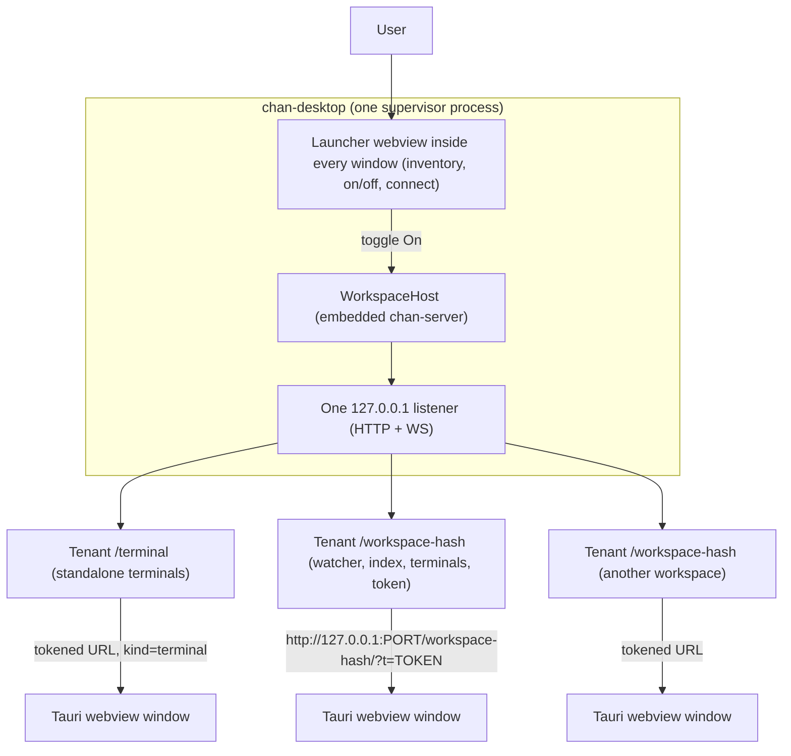
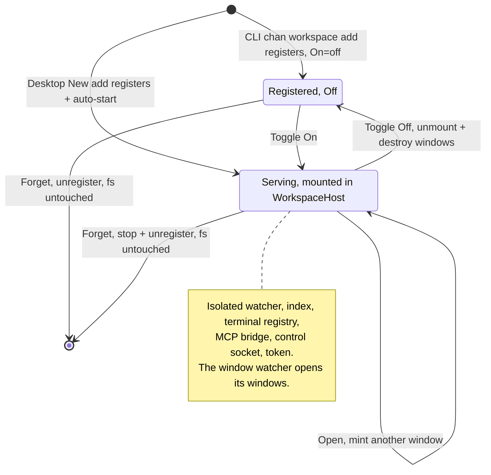
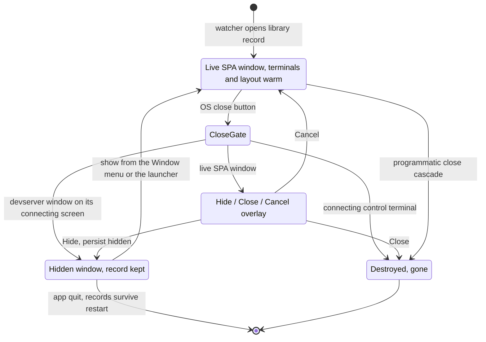
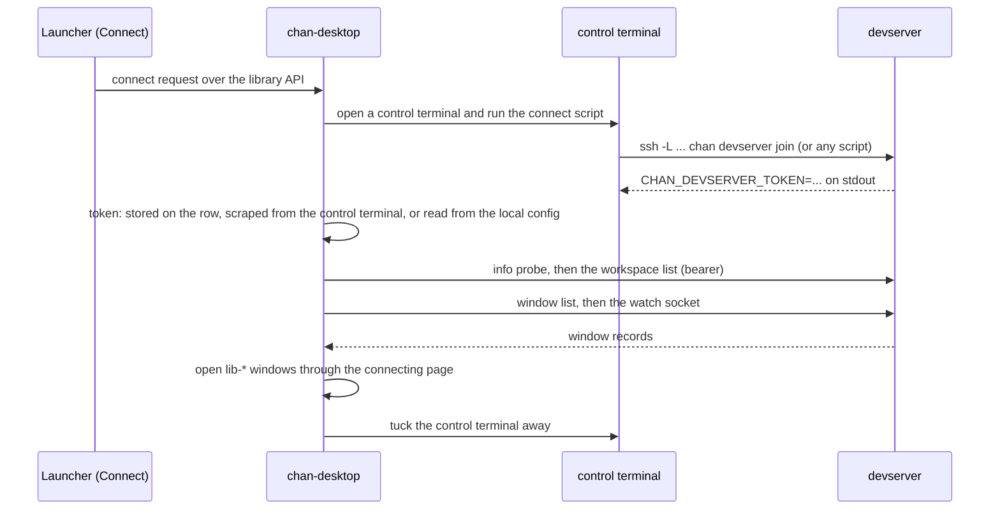

# chan-desktop design

chan-desktop is the desktop edition of chan, a supercharged terminal emulator. It is a Tauri shell: it puts chan's windows on the desktop, embeds the server for local work, reaches devservers over a TCP tunnel or through a self-hosted gateway, and is the `chan` and `cs` command line at the same time. This document says what the shell is, where it sits, which flows run through it, and why it is built the way it is. The product framing is in [../design.md](../design.md); the launcher page it shows is designed in [../web/packages/launcher/design.md](../web/packages/launcher/design.md); the gateway side is in [../gateway/design.md](../gateway/design.md).

## Purpose and non-goals

The desktop exists for three reasons:

- One signed bundle gives a user native windows, an app icon, OS file dialogs and the system clipboard, with no terminal to start a server from and nothing else to download.
- One process supervises every local workspace, every standalone terminal and every connected devserver at once, so their windows sit side by side in the OS window switcher and share one launcher.
- A desktop install is also the CLI. Invoked as `chan` or `cs`, the same binary runs the command line before any GUI code, so `chan serve`, `cs` and the shell-first workflows come with the app.

Non-goals:

- It is not a second frontend. Every window shows the workspace app that chan-server serves; the desktop adds native windows, menus, dialogs, transfers and trust around that page.
- It is not a browser. A window loads the embedded server, a configured devserver, or a gateway origin the desktop has authenticated. There is no "open this URL" mode, and the desktop never attaches to an arbitrary `chan serve`.
- It bundles no runtime: no Node.js, no sidecar server, no separate `chan` binary on macOS or Linux. The Windows installer carries a console `chan.exe` only because a GUI-subsystem executable cannot be a usable shell command there.

## Mental model

```mermaid
flowchart TD
    User["User"] --> Launcher
    subgraph Desktop["chan-desktop (one supervisor process)"]
        Launcher["Launcher webview inside every window (inventory, on/off, connect)"]
        Host["WorkspaceHost (embedded chan-server)"]
        Listener["One 127.0.0.1 listener (HTTP + WS)"]
        Launcher -->|"toggle On"| Host
        Host --> Listener
    end
    Listener --> T["Tenant /terminal (standalone terminals)"]
    Listener --> WS1["Tenant /workspace-hash (watcher, index, terminals, token)"]
    Listener --> WS2["Tenant /workspace-hash (another workspace)"]
    T -->|"tokened URL, kind=terminal"| View0["Tauri webview window"]
    WS1 -->|"http://127.0.0.1:PORT/workspace-hash/?t=TOKEN"| View1["Tauri webview window"]
    WS2 -->|"tokened URL"| View2["Tauri webview window"]
```

*One supervisor embeds a WorkspaceHost, serves every local tenant on a single loopback listener under a path prefix, and opens each window as a Tauri webview on a tokened URL.*

One desktop process embeds a `WorkspaceHost` (owned by chan-library, re-exported by chan-server), which owns the single `chan_workspace::Library`. The host binds one loopback listener for the whole process, preferring the port saved in the desktop config so origin-keyed browser storage survives a restart. Each local workspace is a tenant under a prefix hashed from its root, with its own watcher, index, terminal registry, MCP bridge, control socket and bearer token. A shared `/terminal` tenant hosts standalone terminals. The launcher is served at the root of the same listener behind a per-launch launcher token. Every window is a Tauri webview opened on a URL that carries its tenant's token.

There are three attachment modes, and every window belongs to exactly one:

- **Local embedded**: a registry row the desktop mounts into its own host. The desktop owns the runtime.
- **Devserver**: a headless `chan devserver` the desktop dials by address, usually over an `ssh -L` forward. The devserver owns the runtimes, the tokens and the window records; the desktop persists only the connection recipe and owns the native windows.
- **Gateway roster**: an account-level gateway sign-in whose devserver roster the desktop projects into the launcher. Each rostered devserver is reached at an exact proxy origin the gateway names.

The dependency direction is one way. The desktop links chan-server (and through it chan-library and chan-workspace), the `chan` CLI crate as a library, `chan-shell` for the `cs` client and `chan-revtunnel` for the tunnel client; the two web bundles are rust-embed inputs. Nothing depends on the desktop, and it adds no API to the server: what it adds is native, reached by the page through Tauri commands.

## The CLI personality

The binary decides what it is from its invoked name before any GUI or runtime setup. `chan_shell::invoked_arg0` prefers `$ARGV0` over `argv[0]`, because wrappers rewrite the latter. A `cs` name runs the control client and exits; a `chan` name runs the whole CLI in-process with `Personality::Desktop` and exits. That personality changes two verbs: `chan upgrade` upgrades the desktop install rather than a CLI archive, and `chan serve` hands a workspace to a running desktop.

On boot the desktop owns `~/.local/bin/{chan,cs}`, with the shim shape following the package kind. A macOS `.app` or a Linux deb or rpm gets real symlinks to the installed binary. A Linux AppImage gets small `exec -a` wrapper scripts, because `current_exe()` inside an AppImage is the ephemeral mount path; the wrapper also records the caller's working directory, which the AppImage's own `AppRun` loses, so `chan serve .` resolves against the invoking shell. Windows writes `.cmd` wrappers and Git Bash shims under `%LOCALAPPDATA%\chan\bin` that run the bundled console `chan.exe` with `CHAN_DESKTOP_HANDOFF=1`, the marker that routes its `chan upgrade` to the desktop. Installation is best-effort and idempotent: a shim the desktop wrote is repaired when it goes stale, and a `chan` or `cs` the user installed themselves is never replaced. The module is `src-tauri/src/cs_install.rs`.

## The handoff socket

The desktop binds a well-known per-user endpoint at boot, a Unix socket or a Windows named pipe, and answers the CLI over it; a bind failure is not fatal, the CLI then serves on its own. The requests are the reasons a terminal needs a running desktop:

- `chan serve PATH` opens the workspace in the desktop instead of racing it for the writer lock, and `chan workspace forget` closes and unregisters it there.
- `chan upgrade` asks the desktop to drive its own updater.
- The `chan devserver` verbs list, connect, disconnect and forget the desktop's devserver rows, and open a window on one.
- `chan workspace serve|close|forget WS --on TARGET` act on a connected devserver's workspaces. `remote_workspace.rs` resolves `TARGET` to one registered row and `WS` to one of its workspaces, refusing over guessing, and a registered but disconnected row is refused with a pointer at `chan devserver connect`. Every remote operation rides the connection the desktop already holds, because dialing on the CLI's behalf would have to guess at the sign-in and trust prompts the launcher owns.
- A plain default-terminal launch is handed over so the running desktop opens the terminal.

The protocol and the listener live in chan-server's `handoff` module; the desktop supplies the handlers.

## Local workspace lifecycle

```mermaid
stateDiagram-v2
    [*] --> Off : CLI chan workspace add registers, On=off
    [*] --> Serving : Desktop New add registers + auto-start

    Off : Registered, Off
    Serving : Serving, mounted in WorkspaceHost

    Off --> Serving : Toggle On
    Serving --> Off : Toggle Off, unmount + destroy windows
    Serving --> Serving : Open, mint another window

    Off --> [*] : Forget, unregister, fs untouched
    Serving --> [*] : Forget, stop + unregister, fs untouched

    note right of Serving
        Isolated watcher, index, terminal registry,
        MCP bridge, control socket, token.
        The window watcher opens its windows.
    end note
```

*A desktop New auto-starts, a terminal `chan workspace add` only registers; On mounts an isolated runtime, Off unmounts and destroys the windows, Forget unregisters and leaves the filesystem alone.*

The chan registry at `~/.chan/config.toml` is the only source of truth for which workspaces exist. Every desktop-driven mutation runs in-process against the host's shared `Library`, on the same code path the CLI uses; routing everything through the one `Library` is what makes a freshly added workspace openable at once. A filesystem watcher over `~/.chan/` reloads the library and wakes the launcher feed when the registry file itself changes, filtered to that one file because `preferences.toml` churn from pane drags must not storm the launcher. A `chan workspace add` typed in a terminal therefore appears in the launcher without a refresh.

The desktop keeps a small config of its own at `~/.chan/desktop/config.json`, under the same chan home rather than an OS app-data directory. It holds only desktop state: connection recipes for devservers and gateways, native-trust records for shared gateway devservers, window geometry, the preferred loopback port and the launcher's appearance. It carries devserver bearer tokens, so it is written atomically with owner-only permissions. Per-workspace serve URLs are deliberately not persisted, because tokens rotate and a saved URL would decay.

The On column is read live from the host. The on set persists to the `workspaces.json` overlay the host shares with the devserver, so a restart re-serves what the user left running; a workspace that fails to re-serve surfaces a notice and is left off. Boot mounts the shared `/terminal` tenant, re-serves that set, and always ends with a window and never with a launcher on its own: a fresh library mints one standalone terminal and persists a first-open marker, after which an emptied library is never re-seeded, and a boot that opened nothing opens one standalone terminal. A workspace is opt-in; there is no default workspace and nothing is created on the user's behalf.

The New dialog has three forms, a local directory, a devserver and a gateway, each preselected by its entry point. Adding a local directory registers, starts and opens it through the library's add route, with no desktop-side pre-flight scan: the workspace app owns first-boot readiness through its own overlay, and a second dialog would race it. Auto-start on add is specific to the desktop, where the user's intent is "make this usable now"; `chan workspace add` from a terminal only registers.

Toggle On mounts the workspace through the host with chan-server's bearer gate kept on. A workspace held by another chan process surfaces as an "open in another chan process" message and the toggle reverts. Toggle Off unmounts and destroys the workspace's windows. Forget stops the workspace if it runs, unregisters it in-process and purges its window records; the filesystem is untouched, and there is no delete action in the desktop. Validation is deferred to chan-workspace wherever it already owns a contract, so anything the desktop accepts is accepted by every other chan surface.

## The launcher

The launcher is shown inside a window, never in a window of its own. Every window that hosts the workspace app can toggle it over its whole content area while keeping its own title bar. It is a second webview in the same native window, built with wry directly rather than through Tauri: on macOS a subview laid over the window's own webview, on Windows a child of the window, and on the GTK desktops (Linux and FreeBSD) a GTK overlay holding both webviews. It is built outside Tauri because Tauri's multi-webview windows need its `unstable` feature, which changes the webview kind of every window and stops a window with two webviews from resolving as a `WebviewWindow`. It loads the embedded loopback launcher with the launcher token. The module is `src-tauri/src/launcher_panel.rs`.

The toggle is View > Toggle Launcher: Cmd+P on macOS, where one global menubar routes it by the focused window, and Ctrl+Shift+P elsewhere, where a window wears a menubar only while its launcher shows and the key bridge carries the chord the rest of the time; plain Ctrl+P stays with a focused shell. The toggle is a horizontal carousel driven by `launcher_transition.js`: the host page slides right as the Computers page enters from the left, each webview animating its own page from a shared start time so the two move as one; reduced motion switches without the slide.

The launcher webview has no Tauri IPC and no Tauri capability. `launcher_ipc.js` gives the page the `invoke` and `listen` calls it makes, over wry's message channel. The desktop accepts a message only from the launcher's loopback origin, answers a fixed list of commands (quit, restart after an update, reload, toggle, zoom), and forwards a fixed list of app events into every launcher; tests pin both lists against the launcher's source. A navigation off the loopback origin opens in the system browser instead.

What the launcher shows is the Computers screen, a deck of machine cards (this machine, each devserver, the gateway-rostered devservers, add a devserver), and the Gateways screen; its routes, decks and authority model are in the [launcher design](../web/packages/launcher/design.md).

## Window model

### Window kinds

Every window is a Tauri webview whose label prefix encodes its kind, and Tauri capabilities are granted by label glob:

- `local::<window_id>`: watcher-opened local workspace and standalone-terminal windows, labeled by the library's window record.
- `lib-<hex>::<window_id>`: watcher-opened devserver windows, the same composite label scheme with the page served by the remote devserver.
- `control-terminal-<devserver id>`: the terminal-only window that runs a devserver's connect script.
- `terminal-exec`: the one window of a default-terminal launch, in a process of its own.
- `about`: the bundled About window, a singleton the macOS system About item is redirected to.

The launcher is not a window kind: it has no label, no window record and no capability.

The desktop is a view of the library. Each connected library, the embedded one and every devserver, has a window watcher that reconciles the library's window records with the native surface: missing windows open, removed windows close, and hidden records and pending changes stay suppressed. The local feed is in-process from the host; a devserver's is its window list plus its watch socket; both drive the same reconcile. Every window-creation path mints a record first, so the watcher is the sole driver of native windows and a reconnect or relaunch cannot duplicate them. Windows are keyed by the record's id, so panes and tabs rehydrate per record, and titles follow the library's ordinal so the OS switcher and `cs window list` agree.

### Menus and the key bridge

Workspace windows get a native key bridge injected before any page script. It translates VS Code-style chords into the `chan:command` window event the page listens for, claiming each chord in the capture phase so the page's keymap cannot drift out from under it. Chords whose actions are reachable through the page's command deck stay page-owned; direct chords exist where a deck is no substitute, such as tab navigation, find, search and splits. Reload, DevTools and zoom invoke Tauri commands directly rather than going through the page's event bus, so a frozen page cannot lock the developer affordances away. Off macOS the bindings avoid terminal chords, and a focused terminal keeps the chords a shell needs.

The native menus route by the focused window's kind: New Terminal, Close Window, New Window and Open in Browser each ask the focused window's page or library, and fall back to a standalone terminal window from anywhere else; the Window menu lists hidden windows for restoring. A tmux window answers New Terminal and New Window by asking tmux, and the window tmux adds opens as a chan window through the watcher.

Quitting prompts once, because every terminal the process holds dies with it. Closing the last native window exits on every platform, and because that exit ends the hidden windows' shells too, the last shown window guard (`last_window.rs`) refuses to hide the last shown window while any terminal session of the library is alive, and refuses to close it while sessions other than its own are alive; the refusal says to show or open another window first.

### Close, hide and restore

```mermaid
stateDiagram-v2
    [*] --> Live: watcher opens library record
    Live: Live SPA window, terminals and layout warm
    Buried: Hidden window, record kept
    Destroyed: Destroyed, gone

    Live --> CloseGate: OS close button
    state CloseGate <<choice>>
    CloseGate --> Prompt: live SPA window
    CloseGate --> Buried: devserver window on its connecting screen
    CloseGate --> Destroyed: connecting control terminal
    Prompt: Hide / Close / Cancel overlay
    Prompt --> Buried: Hide, persist hidden
    Prompt --> Destroyed: Close
    Prompt --> Live: Cancel
    Live --> Destroyed: programmatic close cascade

    Buried --> Live: show from the Window menu or the launcher
    Buried --> [*]: app quit, records survive restart
    Destroyed --> [*]
```

*The OS close button on a live window asks Hide, Close or Cancel; Hide keeps the record and its server-side terminals, Close discards them; a devserver window still connecting hides without a prompt, a connecting control terminal closes outright, and the next open restores a hidden record.*

Hide keeps the window's library record and its server-side terminals and layout; the native window is destroyed and rebuilt at its stable id when shown again, so the page rehydrates its panes and tabs. A tmux window's prompt adds Detach, which ends the tmux connection and leaves tmux running. A connected control terminal hides in place so its live endpoint stays warm. Programmatic closes, the page's empty-window cascade and a workspace turned off, destroy outright.

Hidden-and-rebuilt windows need the desktop to remember their OS geometry, so it records a window's rectangle on every hide and reapplies it on rebuild, keyed by label under a monitor-signature LRU in its config. Geometry is handled in logical points, because on macOS a hidden window has no screen and a physical-pixel size would be converted through the wrong display's scale; points are the only unit that round-trips across mixed-DPI monitors.

### The connecting screen

A devserver window does not load its remote URL directly: a down remote would paint a blank webview, since WKWebView never finishes the navigation. It loads a bundled local connecting page instead, which shows the attempt log, probes the remote through the `probe_url` command, and on success navigates the same window to the fully assembled tenant URL. Rust owns the probe because the local page's CSP blocks cross-origin fetches, and it sends the target origin's webview cookies so the probe can tell a registered gateway devserver that is not answering from a live one. Reload of a devserver window asks its watcher to retarget the existing native window the same way: a ready target navigates in place, a not-ready one keeps the current page and the watcher retries.

### Standalone terminal windows

Standalone terminal windows host the workspace app in terminal-only mode (`kind=terminal`): no workspace, terminal panes only. All of them load the one shared `/terminal` tenant, mounted on first use and never torn down per window, so PTYs live in one registry, a terminal tab moved between windows keeps its PTY, and orphans idle-prune. Sessions inherit chan-server's whole terminal contract, including the `cs` control socket, so `cs` works in a desktop terminal exactly as under `chan serve`.

Terminal background opacity is the desktop's own setting, the `terminal.background_opacity` key of the desktop's `server.toml`, and reaches every terminal tab of every window the desktop builds, whatever tenant the window shows. A window's transparency cannot change after it is built, so every window is built transparent and its URL says so; the page paints the tint and cuts a see-through hole only behind panes that show a terminal, so frames, tab strips and overlays stay as they are, and at full opacity every window reads as opaque. On macOS the title bar keeps an opaque layer of its own, because a transparent window would otherwise clear it.

### The default-terminal launch

chan-desktop is a terminal emulator for the xdg-terminal-exec contract: `chan-desktop [--dir=PATH] [--app-id=ID] [--title=TITLE] [--hold] [-e CMD ARGS... | -- CMD ARGS...]`. Any terminal flag opens one `terminal-exec` window in its own process and skips the whole launcher boot (no shims, library stores, handoff listener, window watcher, gateways or update check), so a launch beside a running chan-desktop leaves it alone; the command's exit code, the held window, the app id and the fixed title belong to the launching process. The exception is a launch that only runs the user's shell, a bare `chan-desktop` or one with `--dir` alone: that is first offered to a running desktop over the handoff socket, which opens a throwaway terminal window there, never saved, and the launching process exits; `CHAN_NO_DESKTOP_HANDOFF` opts out. The shared desktop entry carries the `X-TerminalArg*` keys that map xdg-terminal-exec's options onto these flags.

## Devserver connections

A devserver row stores an address, an optional label, an optional connect script and an optional token. Connecting runs the script in a control terminal, a standalone terminal window whose PTY runs the script so an interactive ssh session can prompt the user there. The token comes from one of three places: a token stored on the row wins once the script is running, so a tunnel script can be just `ssh -N`; otherwise a scripted connect scrapes the `CHAN_DEVSERVER_TOKEN=` line the devserver's `join` prints into the control terminal; a local devserver with neither reads the live token and port from its own config under the chan home. The desktop then probes the devserver's info route, records the connection, opens a standalone terminal on the devserver, tucks the control terminal away, and from then on polls the devserver's workspace list for the launcher and follows its window feed for native windows.

```mermaid
sequenceDiagram
  participant L as Launcher (Connect)
  participant D as chan-desktop
  participant C as control terminal
  participant S as devserver
  L->>D: connect request over the library API
  D->>C: open a control terminal and run the connect script
  C->>S: ssh -L ... chan devserver join (or any script)
  S-->>C: CHAN_DEVSERVER_TOKEN=... on stdout
  D->>D: token: stored on the row, scraped from the control terminal, or read from the local config
  D->>S: info probe, then the workspace list (bearer)
  D->>S: window list, then the watch socket
  S-->>D: window records
  D->>D: open lib-* windows through the connecting page
  D->>C: tuck the control terminal away
```

*A devserver connect: the script brings the tunnel up in a control terminal, the desktop acquires a token, confirms the devserver answers, and mirrors its window records as native windows.*

Each devserver workspace is its own tokened tenant. The devserver returns each tenant's prefix and token and the desktop assembles the tenant URL itself against the address it dialed, which keeps the desktop in control of the local tunnel port and spares the devserver knowing how it is reached.

The control script is the connection. A script that exits cleanly right after connecting is a daemonizing connect and its control terminal is reaped; one that exits later ends the connection; one that exits without a healthy connection closes the devserver's windows and keeps the control terminal so the user can read why. The window feed reconnects on its own after a drop and keeps the last window set, so windows reopen without a second connect; a devserver whose feed delivers nothing for consecutive rounds is marked unreachable on its card. Disconnecting tears down the native windows and leaves everything on the devserver running.

Reverse port forwarding (`cs tunnel`) rides the same connection. The page forwards only the `tunnel_open` window command; `revtunnel.rs` resolves the devserver, its endpoint and its credentials from the invoking window's own connection record, never from the payload, binds the requested desktop port and reports back over the tunnel's control socket.

## Gateway sign-in and the roster

A gateway is connected at the account level, once per gateway. Connect discovers the gateway, signs in once, and polls the account's devserver roster; the rostered devservers surface as synthesized rows in the launcher and vanish when the gateway disconnects. Sign-in runs in the user's own browser, where passkeys and autofill work: the desktop binds a loopback callback listener in-process, opens the gateway's authorize page with a state nonce and a PKCE challenge, and the gateway hands the browser back to the callback with a one-time code, never the token. The desktop redeems the code for a personal access token, which it stores in the OS keyring.

The roster's failure semantics are deliberate. An upstream failure keeps the last known roster and retries, and the gateway reads as unreachable only after consecutive misses; a degraded all-offline roster is never synthesized, because dropping rows on a flaky upstream would close every gateway window. Only an authentication refusal, or a stored token that is gone, runs the disconnect cascade and clears the token.

Rostered rows are keyed by gateway, owner and full devserver id. An owned row may connect directly. A shared row renders a native-access warning and cannot connect until the user persists trust for that exact identity, because a gateway-served page will receive the desktop's native commands. The launcher orders the consent strictly, trust first, an authoritative re-list, then the connect, and the desktop enforces the same rule behind it: it refuses an absent or untrusted row before requesting an entry, serializes trust changes and connects per row, and rechecks a per-row policy generation before it registers the connection, so an in-flight connect cannot survive a removal, a revocation or a role downgrade. For an allowed row the desktop asks the gateway's entry endpoint for that owner and devserver, pins the exact proxy origin it names, and mints the runtime capability before the window watcher starts; a failure there is fatal to that row only.

### The WireGuard fabric

A gateway row may name a wg-quick file (`wireguard`, set and cleared through the Gateways form and read at add and update time through chan-wireguard's `config::read_file`, so a bad file is refused with the reader's message, which names the path, the line and the key and never a value). At start, before any HTTP client or webview exists, the desktop creates one in-process WireGuard tunnel per enabled gateway with a parsed file and binds one loopback HTTP CONNECT proxy over them, without waiting for endpoint resolution or a handshake; the fabric lives in `AppState` for the process. Every leg to a gateway goes through that proxy: the HTTP clients (the roster, the redeem, the devserver polls and probes, native transfers) take it as a reqwest proxy with loopback destinations left direct, so the embedded server and a devserver on this machine never depend on it; the window feed does a manual CONNECT to the proxy and runs its TLS and WebSocket handshakes over the opened stream; and every webview, the launcher's included, takes it as its proxy. The proxy routes by destination, a target inside a tunnel's AllowedIPs through that tunnel and anything else directly, which is what keeps the local windows working: on Linux WebKitGTK sends loopback through the proxy too, where the proxy forwards plain HTTP. When no enabled gateway carries a file nothing is started and every leg dials as before.

An unreadable or invalid file or invalid tunnel configuration disables that gateway alone: the row carries the reason as its `last_error` and refuses to connect until the file is fixed and the desktop restarts; the app itself starts. A proxy bind failure disables every WireGuard gateway, since none can be reached without it. Endpoint lookups run on the fabric's runtime in the background, one per tunnel at a time. Lookup failures and timeouts leave the tunnel available for retries; the proxy remains bound, and a request with no known endpoint receives the resolver failure within the proxy's existing 30 s bound. A lookup timeout is reported after 10 s, but its OS call must finish before another lookup starts. The Gateways projection reads `wireguard_status` from each live tunnel on every refresh, showing `connecting`, `up`, or the last error with its retry notice. While visible, the launcher refreshes gateways with active WireGuard files every two seconds, so DNS and handshake changes appear without a registry event. The set of WireGuard gateways is decided once per process because the webview proxy is: WebView2 takes it as a browser argument shared by every webview of the process, so a file added, changed or removed after the start takes effect at the next start, the Gateways projection says so (`wireguard_restart_required`) and a connect of such a row is refused with that message. On macOS the webview proxy is set on the webview's data store (tauri's `macos-proxy` feature), whose Network.framework symbols exist from macOS 14; that is the bundle's minimum system version, so every macOS the app opens on takes the proxy.

## Exact-origin trust and native IPC

Tauri grants a capability by window label and, for remotely served content, by loading origin. Every window that shows the workspace app is remotely served, from the embedded server over loopback or from a devserver; the bundled connecting page and the About window are the only local app pages. Every static capability that declares a remote scope lists exactly the two loopback origins, so a gateway-served `lib-*` window holds a static grant only while it shows the local connecting page. No static capability names a wildcard host, and none names the launcher.

A gateway window gets its grant at runtime: after the entry response passes the identity, namespace, scheme, port and same-origin checks, the desktop mints one capability for that canonical exact origin with the gateway command set, the workspace set without the connecting page's probe, plus the gateway CSRF token and the native transfer commands. Runtime grants are additive and there is no removal, so revocation closes the managed windows and blocks reconnect at once, while purging an already-minted origin from the process needs a restart. The macOS drag-pasteboard read is the standing exception on every origin: the pasteboard is system-wide and outlives the drag, so only locally served `local::*` windows may read it, never a devserver-served page that could harvest paths dragged around in other applications.

## Clipboard, dialogs and transfers

The clipboard is read and written natively through arboard rather than the webview's clipboard API, which pops WKWebView's DOM-paste button with no opt-out. Text, PNG images and HTML are supported, which is what the terminal's right-click paste and `cs copy` and `cs paste` ride. Confirm dialogs on macOS are a native `NSAlert` run modally, because the plugin's dialog never becomes the key window and Return never reaches its default button; elsewhere the plugin path is kept.

File transfers keep bytes out of the webview. A download hands Rust a same-origin API URL; Rust revalidates it against the invoking window, reuses the window's cookies, refuses redirects, streams into a temporary file in Downloads and renames only after a complete response, while the page polls a bounded progress record. An upload keeps the native picker and the chosen paths in Rust and streams each regular file as a multipart part; the page sees only relative destinations and progress. Bytes the page generated itself, such as a rendered PDF, cross IPC in explicit chunks into the same commit discipline.

## The terminal renderer and GPU signals

The Linux AppImage bundles its own GTK, WebKitGTK and GL stack, built on the CI runner. On a host whose Mesa is newer than the bundle, the bundled GTK cannot create an EGL display and the webview aborts at creation; a host's GTK and Mesa are always built against each other, so no single bundled stack works everywhere. Inside an AppImage, before the webview exists, the desktop prefers the host stack when both GTK and WebKitGTK resolve in the host's `ldconfig` cache: it prepends the host library directory to the loader path and re-executes itself once, because the libraries are already loaded by the time `main` runs. `CHAN_LINUX_SYSTEM_GUI` selects `auto`, `system` or `bundled`.

Independently, under an AppImage the desktop disables WebKit's dma-buf renderer only when the NVIDIA proprietary driver is present, and never overrides a value the user set. Disabling it drops the webview onto a path where the WebGL layer paints nothing, which costs the terminal its WebGL renderer, so it is not done unconditionally. `CHAN_LINUX_DMABUF` selects `auto`, `on` or `off`; `on` is the only way to ask for the accelerated path on NVIDIA, because WebKit reads the variable by presence rather than value.

The desktop tells the page what it decided. It appends `chan-renderer=webgl|dom` and `chan-gpu=1|0` to every native workspace URL, local and remote, and the serving tenant stamps them into the page as meta tags, so the terminal uses WebGL only when the native WebKit process permits it and the welcome animation stays on drawn 2D when there is no GPU.

## Self-update

The desktop updates itself through `tauri-plugin-updater`, driven from Rust; no page holds an updater grant. It applies where a signed payload and a feed exist: the macOS `.app`, the Linux AppImage and the Windows NSIS install. A Linux binary that is not an AppImage and a Windows binary that is not an install answer a clear not-supported error; a distro-packaged desktop never reaches the updater, because the CLI refuses on the `CHAN_PACKAGED` marker first; FreeBSD compiles the plugin out. Payloads are verified with a minisign signature against the public key in `tauri.conf.json`, and the client reads one static manifest at `https://chan.app/dl/desktop/latest.json`, generated at release time and served with the rest of the site. The manifest may carry `minimum_system_version`, a map from updater target (`darwin`) to the macOS floor the offered build was bundled with; the updater itself checks no such thing, so before a check is answered or an install starts the desktop compares that floor with the running macOS and refuses, naming both versions, rather than replace a working app with one LaunchServices will not open (`src/update_floor.rs`). A manifest without the entry installs as before.

On Linux the payload is the AppImage itself: the plugin resolves the running image from `$APPIMAGE`, writes the new bytes over that path with a backup, and relaunches it, so the wrapper shims stay valid. On Windows the payload is the NSIS installer, and the install is the process exit: the plugin launches the installer passively and exits, and the installer relaunches the app, so the desktop downloads first, drains its tenants, and hands the verified bytes over last.

Two drivers share one in-process gate so only one replaces the image at a time. A check runs once per launch in the background (`CHAN_UPDATE_CHECK=0` silences it, the same switch as the CLI's banner); on macOS and the AppImage it installs and then shows the launcher's update dialog, on Windows it stages the bytes and asks first. Key handling and the bridge release a key rotation needs are in [updater-bridge.md](./updater-bridge.md) and the [contributor guide](../.agents/desktop.md).

## Packaging

The desktop is self-contained: it links chan-server, chan-library and chan-workspace directly and embeds both web bundles at build time. Tauri's `frontendDist` is the small static shell of the About and connecting pages, not the workspace app, and the configured CSP governs only those local pages, since every workspace window loads over loopback HTTP as an external URL. Build and packaging go through `desktop/Makefile`, which the root Makefile's desktop targets delegate to; the crate is not published to crates.io.

- macOS: one codesigned and notarized `.app` in a DMG, arm64. Signing and notarization run in CI from secrets and locally from the keychain.
- Linux: the AppImage is the published desktop payload and the one the updater serves; the distro packages (deb, rpm, AUR, Nix) and the Homebrew cask come from the packaging tree, and the distro packages install the shared desktop entry with its terminal-emulator keys.
- Windows: a signed NSIS installer that carries the signed console `chan.exe` as a resource, plus a signed CLI zip. Signing runs through SSL.com eSigner in CI.

The practical build, signing, notarization and release steps are in the [contributor guide](../.agents/desktop.md).
