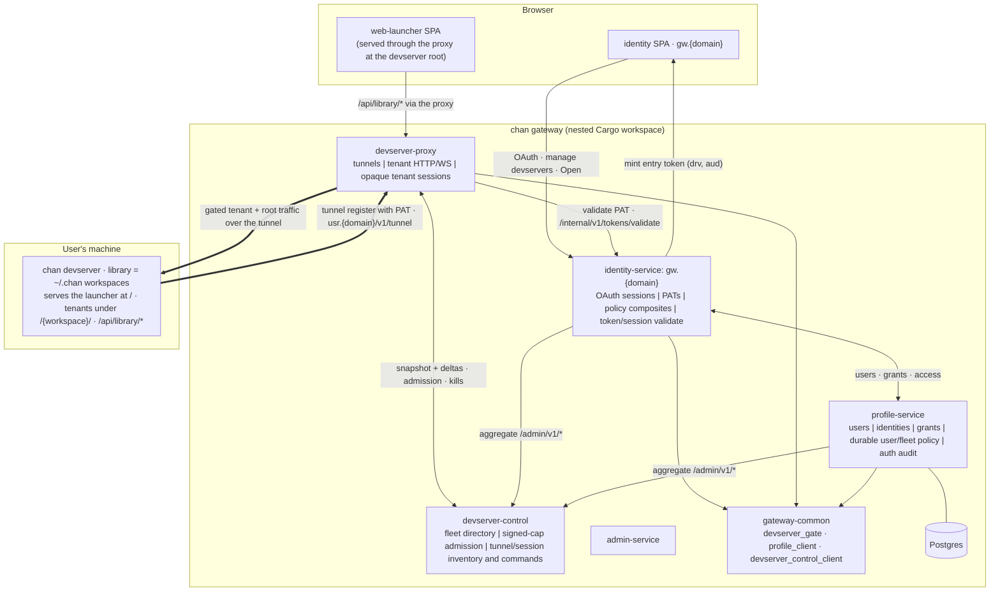

# Gateway

The account, sign-in, and reverse-proxy surface for chan.app, a separate nested Cargo workspace. This glossary fixes the domain language; decisions and their rationale live in `docs/adr/`.

## Topology

`admin-service` is the operator console; `gateway-common` holds the `devserver_gate` JWT type and the profile/devserver-control clients. devserver-control owns the aggregate `/admin/v1/*` tree: identity, profile, and the admin CLI read one coherent fleet view from it, and every tunnel admission is its decision. devserver-proxy renders no UI of its own -- it forwards the launcher that the devserver serves at its root.

## The devserver model

**devserver**: The single, gateway-exposed `chan devserver` process a user runs; it hosts a library and holds one tunnel registration. One per user is reachable through the gateway at a time. _Avoid_: remote, instance, node

**library**: The set of workspaces a devserver hosts (the `~/.chan` workspace registry on that machine). The devserver is the process; the library is its contents. _Avoid_: collection, registry

**workspace**: A single project directory; the tenant unit inside a library. It is not a permission or sharing unit. _Avoid_: project, folder, drive

**tenant**: A workspace as routed and served inside the devserver, mounted at a route slug. _Avoid_: site, app

## Gate and identity

**devserver-proxy**: The gateway reverse-proxy service at `{proxy}.usr.{domain}` (node apex) and `*.{proxy}.usr.{domain}` (wildcard), and the fleet data plane: many provisioned nodes can run it, each with a stable node id. _Avoid_: workspace-proxy, tenant-proxy

**devserver-control**: The singleton, database-free control plane. Owns the dynamic proxy directory, the aggregate tunnel view, fleet admission, and command routing; serves `/admin/v1/*` to identity, profile, and the admin CLI. Every proxy node holds one authenticated h2 control session to it. _Avoid_: controller-service, fleet-db

**devserver token**: The owner PAT (`chan_pat_*`) that authorizes a devserver to register over the tunnel. One token identifies one devserver; the backend resolves the devserver from the token's hash. The PAT stays opaque. _Avoid_: tunnel-name, api-key

**devserver_gate**: The host-only opaque browser-session gate on the wildcard host. Sessions are proxy-local, scoped to one devserver and `Path=/`, and capped at one hour. Renamed from workspace_gate. _Avoid_: workspace_gate, auth-cookie

**devserver grant**: A profile record that a caller may access an owner's devserver, meaning its whole library. The sharing unit. Replaces the per-workspace grant. _Avoid_: workspace-grant, share, ACL

**entry credential**: The short-lived, single-use Ed25519 credential that identity mints after a devserver access check. The browser submits it in the body of the fixed `POST /_chan/entry` exchange; it never belongs in a URL. _Avoid_: handoff-token

## Session terminology

**OAuth session**: The identity-service account session behind `__Host-id_session` and `tower_sessions`. Its operator id is `identity_session_index.admin_session_id`; the secret tower store id is never serialized. _Avoid_: browser session, tenant session

**tenant session**: The proxy-local opaque authorization behind `__Host-devserver_gate`. Its separate admin UUID is published to devserver-control for inventory and revocation. _Avoid_: OAuth session, cookie id

**tunnel**: One live `chan devserver` registration and yamux transport, keyed by owner plus devserver id and addressed for commands by registration UUID. A tunnel is not a session count. _Avoid_: session
