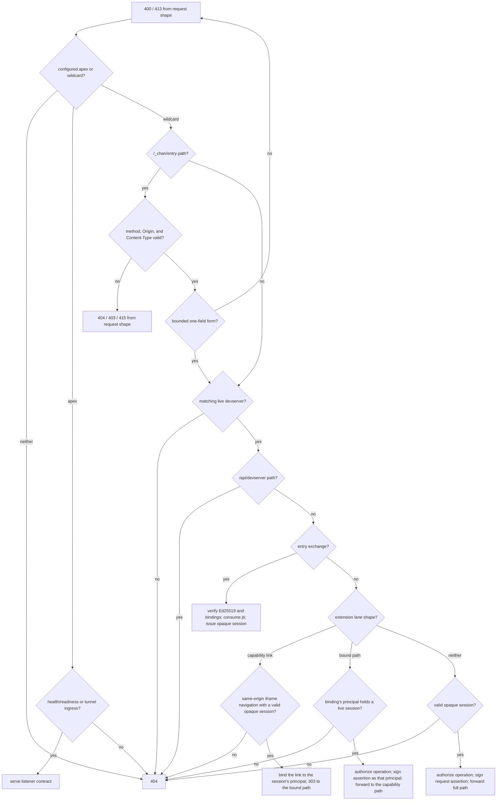

# devserver-proxy design

## Responsibility

`devserver-proxy` is the public data-plane edge for tunneled `chan devserver` instances. It has four jobs:

1. validate a tunnel PAT and obtain an identity-signed admission lease;
2. hold the tunnel handshake until `devserver-control` admits the exact immutable owner, devserver, registration, and proxy tuple;
3. exchange a short-lived identity credential for a revocable, proxy-local browser session; and
4. forward authenticated HTTP and WebSocket traffic to the exact live tunnel, with a per-request assertion the devserver independently verifies.

The service has no database, SPA, OAuth credential, profile policy, or local admin API. Identity owns entry decisions, profile owns durable denial and revocation jobs, and devserver-control owns fleet state and command routing.

## Listeners and routing

One process owns two listeners and one in-memory registry:

- `BIND_ADDR` is the public HTTP listener. The configured tunnel apex serves `/healthz` and `/readyz`; node wildcard hosts serve authenticated devserver content. `/readyz` is healthy only after the current control session reaches `FleetReady`.
- `TUNNEL_BIND_ADDR` is raw h2c tunnel ingress for `POST /v1/tunnel`. A TLS edge exposes that path with h2 in production. Cleartext is supported only on loopback or when the deployment explicitly asserts an authenticated, encrypted overlay.

The wildcard host is `{owner}--{disc}.<node-base>`, where `disc` is the first 12 lowercase hex characters of the devserver id. A bare owner host remains a bounded compatibility path: ordinary requests may resolve one live devserver, but entry exchange is refused unless the route is unambiguous. The full `/{workspace}/...` path is tenant routing owned by chan-server; the proxy never uses the workspace segment as an authorization key.

Public wildcard routing is deliberately small:

- `/_chan/entry` validates method, exact Origin, exact Content-Type, and a form no larger than 8 KiB containing exactly one nonempty `credential` field before consulting the live registry;
- `/api/devserver/*` is always 404 because that management API is local-only;
- an extension capability link (`/{tenant}/_chan/extensions/{id}/{64-hex}/...`) is never forwarded, and a signed-in iframe navigation to it is answered with a redirect to a bound path (see [Extension links](#extension-links));
- an extension bound path (`/{tenant}/_chan/extensions/{id}/{96-hex}/...`) requires a binding whose principal still holds a live session;
- an ordinary path requires a valid opaque `__Host-devserver_gate` cookie;
- unauthenticated bare `/` redirects to the identity dashboard; and
- every other unauthenticated or mismatched request returns the same 404 shape.

The aggregate `/admin/v1/*` tree exists only on devserver-control.

## Tunnel registration and admission

The tunnel listener runs `ThrottlingValidator -> IdentityValidator` before controller admission. Identity validation returns immutable `owner_user_id`, canonical username and devserver id, a short-lived admission lease bound to the proposed registration and proxy, the signed positive `max_connected_devservers`, and the per-tunnel assertion authority. The proxy verifies the admission lease locally under `DEVSERVER_ADMISSION_VERIFYING_KEYS` before publishing any row. The raw PAT is used only during validation and lease refresh; it is never sent to devserver-control or retained as a proxy-wide credential.

The listener generates the registration UUID. The control session sends the lease and exact registration tuple to devserver-control and waits. Only an `Admit` decision permits `HelloAck::Ok` and registry insertion. `AtCapacity` maps to `too_many_workspaces`; warming, stale, or unavailable authority maps to `control_unavailable`. There is no local admission fallback.

The registry keys live rows by immutable owner plus devserver identity and retains the controller registration UUID. Snapshot and contiguous delta events feed the control session. Controller kills address registration UUIDs, so a predecessor teardown cannot remove its successor.

Admission leases expire unless the client re-presents its PAT over the dedicated refresh stream and identity returns a fresh signed lease. A proxy may forward the lease but cannot renew one from a proxy-held fleet secret.

## Browser entry exchange

Identity performs the binary owner-or-grantee access check and signs a 30-second Ed25519 entry credential. The claims bind:

- purpose `chan.devserver.entry`, protocol version, issuer, and type;
- immutable caller `sub` and immutable `owner_user_id`;
- the `client` the credential was minted for (`desktop` from the desktop entry route, `browser` from the share landings);
- exact devserver id, canonical audience, and provisioned proxy id;
- a random single-use `jti`;
- the relative clean navigation path; and
- exact 30-second lifetime with five seconds of clock skew.

The browser or Desktop posts one URL-encoded `credential` field to the fixed exchange path. Before reading registry state, the proxy requires POST, exactly one canonical content type, exactly one `Origin` equal to identity's configured public origin, a body no larger than 8 KiB, and exactly one nonempty form field named `credential`. The resulting 404, 403, 415, 400, and 413 response tuples therefore depend only on request shape, not whether zero, one, or several devservers are live. Every entry-specific 404 is the same JSON response regardless of `Accept`. The later candidate-count guard still rejects ambiguous bare hosts before signature verification. Credentials in query strings are not accepted.

The proxy verifies the signature under a one-or-two-key rotation ring and checks every binding against the live tunnel and inbound host. A credential with no `client`, which an identity that predates the claim signs, or with a value this build does not recognise, is exchanged like any other and opens a session whose client is `unknown`; the entry version is unchanged, so identity and the proxy may deploy in either order without refusing credentials in flight. It atomically retains the `jti` through `exp + skew`; replay or replay-cache pressure fails closed. Replay state is bounded globally and to 64 unexpired entries per subject. It is process-local, so restart clears it, but the credential's maximum acceptance window remains 40 seconds.

Successful exchange returns 303 to the signed relative path and sets:

- `__Host-devserver_gate=<random 256-bit id>; Path=/; HttpOnly; Secure; SameSite=Lax`
- `__Host-devserver_csrf=<random 256-bit value>; Path=/; Secure; SameSite=Lax`

Both cookies are host-only. The entry credential never appears in browser history, a redirect, or the clean URL.

## Opaque sessions and revocation

The gate cookie is an opaque lookup key, not a self-contained authorization token. A session record contains a separate random `admin_session_id`, the immutable caller, owner, devserver and audience, the client its entry credential was minted for, monotonic and wall-clock creation/expiry, a cancellation token, and the set of active bridge tasks admitted under it.

The client is an attribute of the session, not part of its principal. A user's desktop session and browser session on one devserver are the same `(subject, owner, devserver, audience)` principal: they share its session quota and its extension bindings, and every revocation form below that reaches the principal reaches both.

Bounds are fail-closed:

- `SESSION_MAX_ACTIVE` limits the process, default 10,000;
- one subject may hold at most 64 sessions;
- one exact subject/owner/devserver/audience principal may hold at most 16;
- `SESSION_LIFETIME_SECS` defaults to and cannot exceed one hour; and
- proxy restart clears every session.

The session store publishes a redacted snapshot and `Up`/`Down` events to the control supervisor. Snapshot chunks and tunnel/session deltas share one connection-local generation, so a gap retracts both authorities and forces a full resync. The public admin view contains only admin id, subject user, owner user, devserver id, proxy id, creation, and expiry.

`RevokeSessions` supports exact `(subject, owner, devserver)`, subject, admin session id, owner, and all forms. The proxy first makes matching records lookup-dead, cancels their HTTP and WebSocket tasks, and waits for every registered operation guard to drop before acknowledging. A drain timeout leaves a tombstone in the store, so a retried command cannot observe zero records and falsely confirm. New session issuance is suspended during control-loss cleanup and resumes only after a fresh `FleetReady`.

Profile persists revocation work transactionally with each grant delete, block, PAT revoke, or account delete. Its first confirmed fleet cut starts a 40-second quiet window covering entry lifetime and symmetric skew; a later same-generation cut settles the job. The controller reports partial failure while any connected proxy has not confirmed or any disconnected proxy authority marker remains. Absolute one-hour expiry is the final backstop after the bounded retry window is exhausted and audited.

## Request authorization

For an ordinary request the proxy resolves the opaque session against the exact live tunnel and canonical audience. Lookup is repeated for every HTTP request and WebSocket upgrade. An expired, cancelled, wrong-host, wrong-owner, or wrong-devserver record returns the indistinguishable 404 path.

Before transport starts, the request registers an operation guard with the session. No operation may register after revocation. Every forwarded request also carries `X-Chan-Gateway-Assertion`, a 60-second HMAC assertion containing only immutable caller, owner, audience, and devserver authority, plus the session's client type. Its key is derived independently from the tunnel PAT by the client and proxy validation path. chan-server verifies it against its configured tunnel origin and owner; missing assertion authority fails closed.

This is intentionally not owner-equals-caller authorization. A grantee's `sub` differs from `owner_user_id`, while the exact owner/devserver/audience bindings confine that caller to the one accepted share.

## Browser boundaries

All methods except `GET`, `HEAD`, and `OPTIONS` require `X-Chan-CSRF` to match the readable CSRF cookie with a timing-safe comparison. This includes extension methods such as `PROPFIND` and `TRACE`. The header and all inbound cookies are stripped before the tunnel hop.

A cookie-authenticated WebSocket additionally requires exactly one `Origin` equal to the canonical externally visible origin. Missing, multiple, opaque, wrong-scheme, wrong-port, and sibling origins are rejected before a substream opens. The bridge closes on session cancellation, absolute session expiry, or 300 seconds with no frame in either direction. That window starts before the upstream is connected: the 101 is already sent, so a substream open waiting on the tunnel's substream budget, or an upstream handshake the devserver never answers, that outlasts it ends the client socket with a 1011 Close. Revocation waits for the bridge task to stop before command acknowledgement.

Every credentialed response receives `Cache-Control: private, no-store`, `X-Content-Type-Options: nosniff`, `Referrer-Policy: no-referrer`, and a CSP `frame-ancestors 'none'` directive. The sole framing exception is Chan's capability-scoped `/_chan/extensions/` proxy namespace, which receives `frame-ancestors 'self'` so the owning tenant can host it in an opaque sandboxed iframe; no other tenant content becomes frameable. Upstream cookies with a `Domain` attribute, or names reserved for the gateway session and CSRF cookies, are dropped.

## Extension links

A workspace tenant's extension tab is an iframe with `sandbox="allow-forms allow-scripts"`, so its document has an opaque origin and the requests it makes carry no cookie. chan-server gives each ready extension a 64-hex path capability, and the workspace app points the frame at `/{tenant}/_chan/extensions/{id}/{capability}/...`. The proxy never forwards that capability link, and nobody reaches an extension without signing in. It binds the link to the signed-in user on the frame's navigation instead, which needs nothing from the workspace app, so a devserver serving any version of it works behind this proxy:

- A `GET` carrying exactly `Sec-Fetch-Site: same-origin`, `Sec-Fetch-Mode: navigate` and `Sec-Fetch-Dest: iframe`, plus a session cookie valid for the host, devserver and owner, mints a binding for that session's principal and is answered 303 to `/{tenant}/_chan/extensions/{id}/{binding}/...`, keeping the rest of the path and the query. The parent page starts that navigation, so the browser attaches the `SameSite=Lax` cookie despite the sandbox. Fetch Metadata cannot be set by page script, so the frame's own fetch, a subresource, a WebSocket, a top-level open, a navigation the sandboxed document starts itself (`cross-site`, and cookieless), a frame on a sibling tenant (`same-site`), and a browser that sends no Fetch Metadata all get the ordinary 404, cookie or not.
- A binding token is 96 lowercase hex: a 128-bit selector the store looks up, then a 256-bit verifier compared in constant time. It resolves to the principal (subject, owner, devserver, audience), the tenant, the extension id and the devserver capability, and the path's tenant, extension id and host must match. A bound request, HTTP or WebSocket, is forwarded to the devserver's capability path with an assertion naming the principal's real subject. Its client is the client of the session that minted the binding while that client still holds a live session for the principal, and `unknown` otherwise, so a binding another client's session keeps alive never claims a client that is not there. It needs no cookie, CSRF header or WebSocket Origin, none of which the frame can present. A `Location` the devserver answers on its capability path is rewritten back onto the bound path.
- A binding belongs to its principal rather than to the session that minted it, so an open extension tab survives the user signing in again before the first session's hour ends. It lives only while the principal holds a live session without a gap: when the principal's last session is removed, by expiry or revocation, its bindings go with it, and a lapsed binding does not return with a later session. Every revocation that reaches the principal, an admin-session revocation of any one of its sessions included, deletes its bindings, cancels the transports admitted through them, and waits for those to drain before acknowledging, with the same tombstone-on-timeout rule as sessions. A bound request runs until the principal's latest-expiring live session expires.
- A request on either shape whose path holds a dot segment, a segment that is exactly `.` or `..`, is answered with the lane's 404 before any session or binding is consulted, and is never forwarded. The check looks for one raw, then percent-decodes the whole path and looks again, until decoding changes nothing, splitting on `/` and `\` each time. It reads at least as much into a path as the devserver does: its extension route percent-decodes the path capture once and hands it to a WHATWG URL parser, which takes `%2e` for a dot and `\` for a separator, so `..%2f`, `.%2E`, `..%5c` and a double-encoded `%252e%252e` are all dot segments there. A path still changing after four decoding rounds is refused too. `...`, `.hidden` and `a..b` are ordinary segments. No browser sends a dot segment, since it resolves them before sending, so this refuses only hand-built requests, and it keeps a bound path inside its extension whatever the devserver does with the path.
- A principal holds at most 32 bindings; minting another evicts its least recently used one, so reloading frames rotates rather than accumulates. The proxy holds at most four bindings per `SESSION_MAX_ACTIVE` slot, 40,000 by default, and answers 503 when that is full rather than evict another principal's binding.

Every response on either shape carries the extension response policy (`Access-Control-Allow-Origin: null`, no-store, nosniff, no-referrer, no `Set-Cookie`), refusals included, so the frame reads true statuses. Both shapes keep the extension's path depth, so the frame's relative URLs resolve as they would on the capability path, and the trace span redacts either credential segment.

## Reverse-proxy hygiene

The proxy strips the fixed RFC hop-by-hop set on both legs and every header named by every `Connection` field value. It removes inbound `Host`, `Cookie`, `Authorization`, `X-Chan-CSRF`, and any client-supplied gateway assertion. `X-Forwarded-Host` and `X-Forwarded-Proto` are recomputed from the routed host and configured edge scheme; inbound forwarded host/scheme headers are never routing authority.

HTTP request and response bodies default to 100 MiB bounds. The default 60-second request deadline covers headers and streaming response body, and dropping or timing out a response aborts its upstream connection task. Multipart upload and file or archive download routes receive explicit 100 GiB bounds and a 24-hour deadline; the server-side copy route receives the long deadline while retaining the general JSON body bounds. Transfer classification requires the exact method and path, and a download requires exactly one form-decoded truthy `download` field. A non-HEAD response whose declared length exceeds its effective cap is refused with 502 before body forwarding; HEAD has no response body, and unknown-length responses remain bounded while streaming. The full inbound path and query are forwarded unchanged except that the fixed entry exchange is handled locally.

The proxy opens a fresh yamux substream for each HTTP request or WebSocket. WebSockets perform their handshake directly on that substream and share one both-directions idle deadline; traffic in either direction refreshes it.

## Control failure semantics

The proxy has one authenticated h2 control session using its provisioned per-proxy credential. It refuses new admissions immediately when that session is unavailable, while existing authority has bounded retention:

- a normal healthy-session disconnect arms a 30-second grace;
- if a reconnect snapshot is accepted but `FleetReady` has not arrived, a distinct hard 45-second convergence deadline applies;
- a disconnect in that state cannot reset or extend authority indefinitely;
- grace expiry atomically suspends session issuance, evicts tunnels, cancels sessions, and waits for admitted bridges to drain; and
- only `FleetReady` cancels cleanup and resumes admission/session issuance.

The controller retains disconnected `(proxy_id, boot_id)` authority for 60 seconds, longer than every proxy-side retention path. Session revocation therefore cannot report full confirmation during the double-disconnect window where a proxy could still serve old authority.

## Trust boundary and residuals

A proxy node is credential-poor relative to identity and profile, but it is still a data-plane trust boundary. A fully compromised assigned proxy can see a transient PAT during validation and can mint per-request assertions for tunnels currently assigned to it. The protocol prevents that node from joining as another provisioned proxy, fabricating an identity-signed admission or entry credential, or turning one node credential into fleet authority. Node isolation, deprovisioning, and PAT rotation remain the incident response for a compromised assigned node; this design is not a trusted execution environment.

An extension bound path carries its binding in the URL, because the opaque-origin frame can present no cookie. A leaked bound path is therefore usable as that user, from any client, until the user holds no live session or a revocation reaches them. The capability link on its own grants nothing.

The replay cache, opaque sessions, extension bindings, registry, and controller fleet view are memory-only by design. Restart fails tunnels and sessions closed. Controller HA, durable fleet state, automatic DNS/certificate provisioning, and proxy-to-proxy traffic are outside this component.

## Invariants

- No tunnel enters the registry before identity validation and synchronous controller admission of its signed immutable tuple.
- Entry credentials are body-only, single-use, short-lived, and bound to the exact proxy, audience, owner, devserver, caller, and clean path.
- Entry method, Origin, Content-Type, body-limit, and form-shape failures are answered before registry lookup, and every entry-specific 404 has one shape, so their response tuples reveal no live-devserver state.
- Browser sessions are opaque, bounded, revocable, lookup-checked on every request, and expire absolutely within one hour.
- Browser-session publication never contains the cookie id, replay id, audience, assertion, peer address, or cancellation internals.
- Revocation acknowledgement means every registered matching transport has stopped; timeouts remain visible to retries.
- Every tunnel-bound HTTP request and WebSocket carries a fresh per-tunnel gateway assertion; the client cannot supply one.
- Unsafe browser methods require CSRF and cookie-authenticated WebSockets require exact Origin; the cookieless extension bound path is the one exception, and it requires a live binding instead.
- No request reaches a tunnel without a signed-in principal, and every assertion names that principal's real subject: an extension capability link is never forwarded, and a bound path forwards only while its principal holds a live session.
- No extension lane path with a dot segment, raw or percent-encoded, is forwarded or mints a binding.
- The public wildcard never exposes `/api/devserver/*` or an admin route.
- Request paths remain segment-preserving; chan-server is the sole workspace tenant router.
- Control loss cannot retain data-plane authority past its hard deadline, and controller disconnected-authority markers outlive proxy retention.
