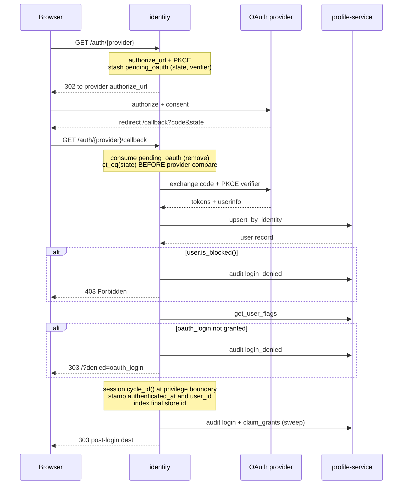
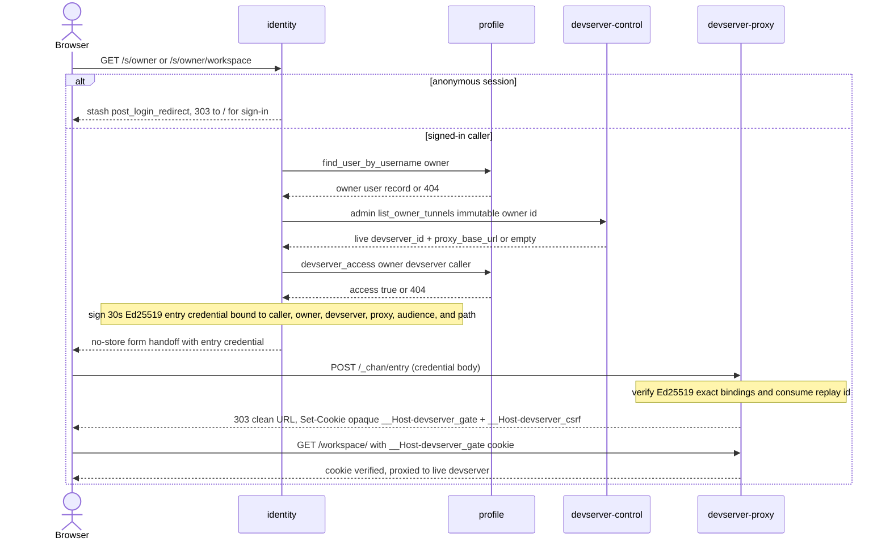

# identity-service: design

## Problem

Public sign-in surface plus the only user-facing UI in the chan-gateway suite. Owns:

- OAuth2 + PKCE sign-in against multiple providers.
- The session cookie. Host-only on the identity origin, `gw.{domain}` (ex `gw.chan.app`); it never spans subdomains.
- Personal access tokens for the chan CLI / chan-tunnel.
- The dashboard: profile management plus the live-devserver list.
- Devserver-gate entry-token mint for the cross-origin handoff to the proxy fleet's per-tenant origins.

Profile data (canonical user record, identities, audit) lives in profile-service; identity must not race with itself or duplicate user rows on concurrent first-time logins.

## Architecture

axum HTTP server with five routing surfaces:

1. `/auth/*`: pre-session OAuth flow. Sets a transient session key (`pending_oauth`) carrying CSRF state and the PKCE verifier; the callback consumes it and either upgrades the session to authenticated (`user_id`) or fails.
2. `/api/*`: session-gated JSON API for the embedded SPA. Covers `me`, profile management, PAT lifecycle, the devserver lists (`/api/devservers/owned|incoming`), and the sharing grants. The devserver-gate mint lives on the share landings and the desktop entry, not under `/api/*`.
3. `/internal/v1/*`: PAT validation uses `IDENTITY_INTERNAL_TOKEN`; OAuth-session `whoami` uses `IDENTITY_SESSION_INTERNAL_TOKEN`. This listener never loads caller cookies implicitly.
4. `/admin/v1/*`: Operator routes use `IDENTITY_ADMIN_TOKEN`; access revoke, profile delete, and per-user devserver policy additionally accept `IDENTITY_ACCOUNT_ADMIN_TOKEN`.
5. Public discovery and desktop endpoints: `GET /.well-known/chan-gateway` returns unauthenticated discovery JSON (`kind`, `api_version: 1`, `identity_origin`, `desktop_authorize_url`, `desktop_entry_url`, `roster_url`, `devserver_proxy_origin`, `devserver_proxy_host_depth: 2` -- tenant hosts sit two labels below the proxy apex -- and `tunnel_url`). The PAT-gated desktop surface is `/desktop/authorize`, `POST /desktop/v1/devserver/entry` (below), and `GET /desktop/v1/devservers`, the roster: Bearer PAT with `desktop.account`, ETag/If-None-Match 304 polling; 401 is terminal for the desktop, 502 means keep the last roster.

Static SPA assets are baked in at build time via `rust_embed` and served by `gateway_common::static_files::serve`. Anything not matched by an explicit route falls through to the static handler; paths without an extension serve `index.html` (SPA fallback).

The session layer (`SessionManagerLayer` from `tower_sessions`) sits at the outermost edge of the public listener and applies to every public route; the internal listener never mounts it. **Cookie scope is host-only on the identity origin, `gw.{domain}` (ex `gw.chan.app`).** No `Domain` attribute. devserver-proxy does not share this cookie.

## User-facing flows

### OAuth flow

*Sign-in flow: stash `pending_oauth`, consume it on callback, constant-time state check and the `oauth_login` gate run before `cycle_id`, then upsert and claim grants.*

`IDENTITY_OAUTH_ENDPOINTS_BASE` (env, unset in production) points the GitHub provider's OAuth + API endpoints at an alternate origin so a local test harness can stub the sign-in flow end to end; absent means the stock github.com / api.github.com endpoints (unit-test pinned) and nothing but the endpoint URLs ever changes.

`/auth/{provider}` (GET):

1. Look up the provider config. Unknown provider returns 404.
2. Generate `(authorize_url, csrf_state, pkce_verifier)`.
3. Validate optional `return_to` as one same-origin, origin-relative path and store it separately from provider state. Absolute, scheme-relative, encoded-slash/backslash, fragment, control-character, and malformed-percent forms return 400.
4. Insert `PendingOauth { provider, state, verifier }` into the session under `pending_oauth`.
5. Redirect to `authorize_url`.

`/auth/{provider}/callback` (GET):

1. Read `code` and `state` from query params; refuse on `?error=...`.
2. Remove `pending_oauth` from the session (consume on read).
3. Compare `state` with `pending.state` constant-time. State check runs before the non-constant-time provider compare so timing on the provider field cannot be used to oracle the session's expected provider.
4. Compare `provider` (URL path) with `pending.provider`.
5. Exchange the code at the provider with the PKCE verifier.
6. Fetch user info from the provider's REST endpoint.
7. `profile.upsert_by_identity` (one HTTP round trip, one Postgres transaction). Returns the user record.
8. If `user.is_blocked()`, write a `login_denied` audit row and return 403 (`Error::Forbidden`).
9. Resolve `profile.get_user_flags(user.id)`. If `oauth_login` resolves false, write a `login_denied` audit row (with note `oauth_login flag not granted`) and 303 to `/?denied=oauth_login`. The SPA's Login view reads the query param and renders a "sign-in is closed" panel. The gate runs *before* `cycle_id` so a denied callback never carries an authenticated session.
10. **Rotate the session id (`session.cycle_id()`)** at the privilege boundary.
11. Stamp microsecond-normalized `authenticated_at`, insert `user_id`, and upsert `identity_session_index` with the post-cycle tower store id. Pre-index sessions fail `whoami` closed.
12. Write a `login` audit row, claim pending grants, consume `return_to` exactly once, and 303 there (or `/`). An `oauth_login` denial appends its stable marker to the same validated target.

### PAT lifecycle

PAT shape: `chan_pat_<32 random bytes, base64url, no pad>`.

- Random bytes from `rand::rngs::OsRng`.
- Hash: `SHA-256(token)` stored in `api_tokens.token_hash`. Plaintext leaves on the create response and is never persisted.
- Scopes: each token carries a scope list (`api_tokens.scopes`), defaulting to `["tunnel"]` (dial chan-tunnel). `tunnel` is the only live tunnel scope; the desktop-authorize flow additionally mints `desktop.connect` / `desktop.account`. Validate returns the list and chan-tunnel-server enforces it.
- Origin: mints record `created` (SPA), `created_via_desktop` (desktop-authorize flow), or `created_via_admin` (operator) in `api_token_audit`, so operators can tell them apart.
- Validate (`/internal/v1/tokens/validate`):
  - Per-token-fingerprint throttle (4 rps refill, 16 burst, 4096-entry LRU map). Throttled requests return 401, identical on the wire to an unknown token.
  - One statement joins the user, seeded fleet singleton, and optional user policy while bumping `last_used_at`. Blocked, paused, disabled, required-but-missing, unreadable, and invalid-limit states all preserve the uniform 401.
  - A successful admission validation signs the positive finite user limit into the 120-second admission lease. No-policy compatibility mode signs the protocol maximum, leaving `MAX_DEVSERVERS_PER_USER` as the effective controller ceiling.
  - Append `used` to `api_token_audit`.
- Revoke (`DELETE /api/tokens/{id}`):
  - Profile atomically verifies ownership, marks the row revoked, writes its audit row, and reserves a durable subject-revocation generation.
  - Identity makes a best-effort immediate owner-tunnel/session cut and returns `202`; profile's worker confirms a post-commit first cut and a second fleet cut after the full entry-credential quiet window. Per-PAT tunnel eviction is not possible because registrations do not retain a token id, so the conservative scope is the subject.

PAT minting uses the same policy projection. The insert locks the canonical user and fleet singleton, so concurrent block, suspend, or pause has a linear serialization point. Public mint returns 403 `devserver_access_disabled`; admin mint returns 409 with the same stable reason. Listing and revoking existing PATs remain available.

### OAuth-session and product control plane

Every successful post-cycle OAuth session has a random public `admin_session_id` mapped to its secret tower `store_id`. Inventory joins the index to live, unexpired tower rows and returns only admin id, user id, authentication time, and expiry. List/revoke lazily prune missing or expired tower rows. Exact and user-wide revoke delete both records and are idempotent. Logout removes its own index row.

Identity is the composition boundary for product mutations:

- user policy persists to profile first; disable and non-increasing retries revoke owner tenant sessions and kill owner tunnels;
- fleet pause persists `admissions_enabled=false`, then revokes every tenant session and kills every tunnel; resume only persists true;
- access revoke durably revokes PATs/audits in profile, then revokes OAuth and subject tenant sessions and kills owner tunnels; and
- admin delete establishes pending-delete denial, performs the same live cut, and waits for profile's quiet-window worker to remove the row.

Durable state is never rolled back after a partial drain. A 502 contains only the durable projection and confirmed counts, making a retry convergent without exposing a downstream body.

### Dashboard

`/api/me`:

1. Resolve `user_id` from the session.
2. `profile.get_user(uid)`. Flush session and 401 if the user is gone underneath the cookie.
3. Call devserver-control admin `GET /admin/v1/owners/{owner_user_id}/tunnels` (immutable owner id, not username) for the live-devserver list (one row per live devserver; a user can hold several). Empty for blocked users, and empty (with a log line, not a 500) on a devserver-control outage so the rest of the dashboard still loads from profile.
4. Return `{user, devservers: [{devserver_id, status}], flags}`, where `flags` is the per-user resolved feature-flag map.

The dashboard renders one card per devserver and flips it online/offline against that list. The card's "Open" navigates to `/s/{username}?d=<disc>` (the whole-devserver share landing, below, qualified with the card's devserver); the entry token is minted server-side at click time, not at page render, so a short-exp token can't go stale before the click.

### Devserver-gate mint

*Share-landing handoff: resolve owner and live devserver, run the profile access check, mint a 30s entry JWT, then devserver-proxy verifies it and sets the gate cookies.*

The share-landing handlers (below) mint the entry token; there is no standalone open endpoint. The mint targets one of the owner's live devservers (`?d=` selector, single live, else first accessible):

1. Resolve session; refuse if anonymous or blocked.
2. Resolve the owner handle to a user record via profile `GET /v1/users/by-username`. Unknown handle returns 404 (same shape as no-access).
3. Resolve the owner's live devserver id from devserver-control's immutable per-owner endpoint; no live devserver returns 404. Every row must carry a valid signed admission lease and the owning proxy's `proxy_base_url`, which anchors the handoff origin below.
4. Call profile `GET /v1/users/{owner_id}/devservers/{devserver_id}/access?as={session.user_id}`. The owner or an accepted grantee returns binary `access: true`; anything else is 404. A grant is whole-devserver, so the `{workspace}` segment never enters the access check.
5. Sign a 30s Ed25519 `entry` credential with `{sub: session.user_id, owner_user_id: owner_id, drv: <devserver_id>, aud: "{owner}--{disc}.{proxy}.<proxy-apex>", proxy_id, next_path, jti, iat, exp}`. The `aud` authority is built from the controller row's `proxy_base_url`: `{owner}--{disc}.` prefixed to the node base host, scheme and effective port preserved, canonicalized lowercase with default ports stripped. The node base must validate as a canonical origin exactly one DNS label below the configured `DEVSERVER_PROXY_ORIGIN` apex with matching scheme and effective port; a row that fails the check is a 502 upstream error, never a fallback to the shared apex. `sub` is the *caller's* id, not the owner's, so the opaque session minted on the next leg carries the right identity for upstream collab attribution. The mint also attaches the caller's display identity as optional claims, best-effort; they are never an authorization input.
6. Return a no-store HTML handoff whose nonce-bound script POSTs the credential to `{tenant-origin}/_chan/entry`; the proxy can redirect only to the credential's signed clean path.

devserver-proxy verifies and consumes the Ed25519 entry credential, creates a bounded revocable opaque session (maximum one hour), sets the host-only `__Host-devserver_gate` (HttpOnly) and readable `__Host-devserver_csrf` cookies, and 303s to the signed clean path. The shared entry envelope lives in `gateway_common::devserver_gate`.

### Share landing

`GET /s/{owner}/{workspace}` is the public entry for copied share links. It is intentionally unauthenticated at the door so the owner can mint a URL that works for any recipient.

1. Validate `owner` (username shape) and `workspace` (1-64 lowercase alnum + `[._-]`); malformed values 404. An optional `?d=<disc-or-full-id>` (lowercase hex) picks one of the owner's devservers; malformed selectors 404.
2. No session: stash `/s/{owner}/{workspace}` (with the sanitized `?d=` when present) under `post_login_redirect` and 303 to `/`. The SPA renders the OAuth picker; on callback, the stash is consumed and the user lands back here with a fresh session.
3. With a session: resolve owner -> pick the target devserver (`?d=` match, single live, or the first live one the caller can access) -> profile access check -> mint entry JWT -> 303 to the owning node's tenant origin (`{owner}--{disc}.{proxy}.<proxy-apex>`). This is the devserver-gate mint above; the `{workspace}` is only the redirect path, not part of the access check.

The post-login redirect is validated to start with a single `/` and to contain no `:` or `//` prefix, so a hostile stash cannot point the callback at another origin.

`GET /s/{owner}` is the whole-devserver open: it lands the caller on the launcher served at the devserver root instead of a single workspace. Same shape as the per-workspace landing -- validate `owner`, stash + login if unauthenticated, then pick the target devserver (`?d=` or single/first-accessible live), mint a 30s entry credential bound to `/`, and return the body-only exchange handoff. It is restricted to the **owner**: the caller must equal `{owner}`, otherwise 404 (the same shape as an unknown handle, so it does not reveal ownership). The launcher's `/api/library/*` surface is gated only at the proxy edge, so grantees use the per-workspace landing (`/s/{owner}/{workspace}`).

### Devserver sharing grants (SPA surface)

The owner manages grants from the dashboard. A grant is whole-devserver -- the sharing unit -- giving the grantee the owner's entire library. A devserver is not created or deleted from the dashboard: it appears when a `chan devserver` registers over the tunnel and goes offline when it disconnects. Routes (all session-gated; the session user is implicitly the owner):

- `POST /api/devservers/{devserver_id}/grants` body `{grantee_email}` (idempotent create)
- `GET  /api/devservers/{devserver_id}/grants`
- `DELETE /api/grants/{id}`
- `GET  /api/devservers/owned` (devservers I own, with grant counts)
- `GET  /api/devservers/incoming` (devservers shared with me)

All forward to profile-service over the service bearer. Validation re-runs in profile; identity does only the cheap shape check before the round trip.

### Feature flags

identity reads the per-user resolved flag map from profile (`GET /v1/users/{id}/flags`) at two points:

- OAuth callback (`oauth_login`): the allowlist gate described in the callback flow above. Fresh deploys ship `default_enabled = false`, so the operator must `chan-gateway-admin flag grant oauth_login <ident>` for the first user before they can sign in.
- `/api/me` (full map): the SPA gates UI affordances on the resolved values. Today that's `share_workspaces` (hides the Devservers tab and the share panel when off). The map is re-fetched on every `/api/me`, so a rollout takes effect on the next dashboard reload -- no SPA logout / login dance.

Profile errors on either call degrade-soft: identity falls back to an empty flag map, which is the safe default (every flag off = no sign-in, no UI features). Tracing log captures the failure so the operator can see why callers were getting denied.

### Claim sweep on OAuth callback

After `upsert_by_identity`, identity calls `POST /v1/users/{id}/grants/claim` with the user's primary email plus the freshly-observed provider email (deduped). Pending grants whose `grantee_email` matches any of those addresses are assigned to `{id}` and stamped `accepted_at = now()`. Best-effort: a failure logs and continues so an unhealthy profile call does not block sign-in. Previous providers' emails are not resent -- they were swept on their own callbacks.

### Desktop authorize (PAT mint for chan-desktop)

OAuth-style consent flow at `/desktop/authorize` (entry, validates the query and stashes it in the session), `/desktop/authorize/consent` (server-rendered HTML consent page, CSRF nonce), and `POST /desktop/authorize/confirm` (allow / deny). The desktop is an RFC 8252 loopback client: it binds an ephemeral `127.0.0.1` listener and passes `redirect_uri=http://127.0.0.1:<port>/auth/callback` plus a PKCE `code_challenge` (`code_challenge_method=S256`). On allow, a PAT is minted with `TokenOrigin::Desktop`, and confirm answers 200 with a handoff page that navigates the browser to `http://127.0.0.1:<port>/auth/callback?code=...&state=...` via a zero-delay meta refresh plus a manual fallback link -- a 3xx answering the form POST would put the hop under the page's `form-action` CSP in Chrome, so the handoff never rides a form redirect chain. The `code` in the query is a single-use server-minted redemption code, NOT the PAT secret: the desktop exchanges it at `POST /desktop/authorize/redeem` with `{code, code_verifier}`, and the store returns the PAT only when `SHA256(code_verifier)` matches the stored challenge (constant-time). The PAT secret never rides the browser. Deny and blocked-on-confirm answer the same handoff shape with a stable `error=` reason; the GET-path denies (blocked at entry or at the consent render, `oauth_denied` / `account_blocked` in the OAuth callback) still 303 straight to the loopback target with the `error=` query. Both server-rendered pages share the `pages` module's shell (SPA palette, inline CSS) under one strict CSP (`default-src 'none'` + `img-src 'self'`, `style-src 'unsafe-inline'`, `form-action 'self'`, `frame-ancestors 'none'`). The `redirect_uri` is validated as a loopback URI by `validate_loopback_redirect_uri` (parsed-enum `127.0.0.1`/`[::1]` host equality, `http` scheme, exact `/auth/callback` path, `port > 0`, no query/fragment/userinfo) rather than an exact literal; `expires_in` is required and clamped to 90 days; and scopes are checked against a strict allowlist (`tunnel`, `desktop.connect`, `desktop.account`, the last of which must be the sole scope). PKCE binds the redemption but does NOT close the login-CSRF residual that the argv-leaked challenge enables on a shared multi-user host -- the consent copy therefore presents the requester as an unverifiable local app, and the `desktop_authorize` module doc carries the full hardening posture. Unauthenticated entries bounce through the SPA sign-in; the OAuth callback resumes the flow at the consent page.

### Desktop devserver entry

`POST /desktop/v1/devserver/entry` (Bearer PAT carrying `desktop.connect` or `desktop.account`) is how chan-desktop opens a devserver through the gateway. The body optionally carries `{owner_user_id, owner, devserver_id}` to target an explicit devserver (its owner's, or one shared with the caller); absent, the caller's own live list resolves as in the share landings (single live, else first accessible). It runs the same `devserver_access` check and returns `{owner_user_id, username, devserver_id, proxy_origin, entry_exchange_url, entry_credential, expires_at}` -- `username` is the devserver OWNER, while the two URLs are pinned to the exact tenant origin built from the controller row's node base (the same `{owner}--{disc}.{proxy}.<proxy-apex>` construction as the share landings). The fresh 30s credential is returned in JSON and chan-desktop exchanges it in a POST body; it never appears in a navigation URL. A controller row whose node base fails the proxy-namespace check is a 502 upstream error, never a mint. An explicit target that is not live 404s with reason `devserver_offline`; a target the caller cannot access 404s with reason `access_denied`.

Failures keep HTTP 404 but the body is a superset of the plain `{"error": msg}` shape: `{"error": "not found", "reason": <token>, "username": <caller>, "label": <owned label>}` with `label` present only for `devserver_offline`. The reason tokens are a stable desktop-facing contract (like the `desktop_authorize` `?error=` reasons): `no_devserver` (nothing registered), `devserver_offline` (registered, no live tunnel; `label` is the first owned row's), `access_denied` (`devserver_access` refused). Classification is best-effort: a profile failure on the owned-devserver lookup degrades to the plain 404 body. This narration is safe because the surface is self-scoped (a PAT-authenticated caller asking about their own account); the cross-user share-landing 404s stay uniform on purpose.

### Account delete

`DELETE /api/profile`:

1. Profile atomically blocks the user, revokes every PAT, audits the pending deletion, and reserves a durable `AccountDelete` revocation job. The user and dependent rows remain present.
2. Identity makes a best-effort immediate tunnel/session cut to reduce latency and returns `202 Accepted` after flushing the web session.
3. Profile's durable worker confirms a first post-commit fleet cut, waits the full entry-credential lifetime plus symmetric clock skew, then requires a second fleet-wide cut before deleting the user. The FK cascades happen only at that confirmed finalization point.
4. Generic admin unblock refuses the account while the `AccountDelete` job exists; deletion cancellation requires a future explicit transaction.

## Key decisions

### Pluggable providers

A small `Provider` trait (authorize_url, exchange, fetch user info) backs each one. Adding a new provider is one new file plus wiring in `Config::from_env`.

Not wired:

- **Microsoft**: tenant admins can mint accounts whose verified email is unverifiable from the SaaS side. Email-based linking (used by `upsert_by_identity`) would let those accounts attach to existing users.
- **Apple**: high setup friction (signing key + team id + key id + JWT rotation) for the projected user share.

### Email-based identity linking lives in profile

Handled by profile-service's `upsert_by_identity`. identity passes the email along; profile decides whether the provider context warrants linking. Server-side decision blocks two identity callers from racing on the link.

### Username rules

`valid_username` (shared, in `gateway_common::validators`):

- 3-32 chars total
- first and last char in `[a-z0-9]`
- inner chars in `[a-z0-9-]`
- no `--` anywhere (reserved as the `{user}--{disc}` separator in devserver wildcard hosts)

Additional username guards:

- `RESERVED_USERNAMES` blocks anything that could collide with a top-level path under `gw.{domain}/` (ex `gw.chan.app`). Sorted alphabetically (test-pinned); checked with `binary_search`.
- `rustrict` filter blocks profanity / leet-speak heuristically. False positives surface as 400; users can unblock specific handles via the `RUSTRICT_ALLOWLIST` env var (comma-separated, case-insensitive).

### Session contract

- Cookie name `__Host-id_session` (`id_session_insecure_dev` when `COOKIE_SECURE=false`: browsers reject `__Host-` names without Secure). **Host-only on `gw.{domain}` (ex `gw.chan.app`).** No `Domain` attribute.
- `HttpOnly`, `SameSite=Lax`, 30-day inactivity expiry.
- `Secure` follows the `COOKIE_SECURE` env var.
- devserver-proxy does **not** read this cookie. Cross-service auth uses a short-lived Ed25519 entry credential, not cookie sharing.
- Authenticated sessions are indexed only after `cycle_id`; the index's secret `store_id` is database-only and never appears in serialization, debug output, or tracing.
- `/internal/v1/sessions/whoami` accepts the raw cookie only over the internal bearer surface and treats every invalid/pre-auth/pre-index/blocked/deleted case as the same 401.

### Session id rotates on login

`session.cycle_id()` runs immediately before storing `user_id` on a successful OAuth callback. Prevents an attacker-planted session cookie from being carried into the authenticated state.

### Constant-time everywhere

- OAuth `state` compared with `subtle::ConstantTimeEq`.
- Internal validate bearer compared the same way.
- PAT validate compares hashes (the upstream lookup is a parameterised SQL query, not a string compare).

### Devserver-gate mint, not session sharing

Identity alone holds `DEVSERVER_ENTRY_SIGNING_KEY`; proxy nodes receive only the matching `DEVSERVER_ENTRY_VERIFYING_KEYS` public-key ring. Identity signs a 30-second, single-use entry credential after verifying the controller's admission lease and profile authorization. The browser submits it only in the body of `POST /_chan/entry`. The proxy consumes its `jti` and replaces it with an opaque, proxy-local session cookie capped at one hour.

### Identity bearer scopes are disjoint

The bearer devserver-proxy presents on `/internal/v1/tokens/validate` is `IDENTITY_INTERNAL_TOKEN`; the account session lookup presents `IDENTITY_SESSION_INTERNAL_TOKEN`; operators present `IDENTITY_ADMIN_TOKEN`; and the account composite caller presents `IDENTITY_ACCOUNT_ADMIN_TOKEN`. Validation is required. Each narrow token is optional and an empty value disables that scope with a not-found posture when no operator credential also authorizes the route. Every configured value must be pairwise distinct or identity refuses startup. Wrong-scope and unknown bearers share the same authorization failure shape.

### PAT validate runs its own throttle

Mirror of devserver-proxy's `ThrottlingValidator`. Throttled requests return 401, identical on the wire to an unknown token, so the throttle is not observable from the outside. The devserver-proxy throttle catches the typical case; this one catches a leaked internal bearer being used to brute-force PATs directly.

### Public origins are explicit config

The public origins are explicit deployment configuration, each required and validated as a canonical origin at startup: `BASE_URL` (identity's own origin, also the OAuth-callback base), `DEVSERVER_PROXY_ORIGIN` (the proxy namespace apex advertised by discovery, e.g. `https://usr.chan.app`), and `DEVSERVER_TUNNEL_ORIGIN` (tunnel ingress). identity never derives a tenant host from the apex alone: entry origins are built from the controller-reported node base after checking it sits exactly one DNS label below the `DEVSERVER_PROXY_ORIGIN` host with matching scheme and effective port. The entry credential's `aud` is the exact inbound authority: if identity and the proxies disagreed on the namespace, the handoff would fail closed.

The origin strings stay coupled to DNS, the per-node wildcard TLS certificates, and the controller's node base template, so they are deploy-time config, not runtime knobs.

## Invariants

- A signed-in session always carries `user_id: Uuid` under `KEY_USER`.
- `pending_oauth` is removed on the first read in the callback. A cold-reloaded callback (missing pending) returns 400, not a fresh flow.
- Blocked accounts cannot start a session: the login flow writes `login_denied` and returns 403.
- Accounts whose `oauth_login` flag resolves to false cannot start a session either: the login flow writes `login_denied` and 303s to `/?denied=oauth_login` so the SPA can explain why.
- PATs hash to `SHA-256(token)`; plaintext is never persisted.
- Session id rotates on every successful sign-in.
- `authenticated_at` and the final rotated store id are committed to `identity_session_index` before callback success.
- Devserver PAT mint and validation both require readable enabled fleet/user policy; required-mode absence fails closed.
- The `gw.{domain}` session cookie has no `Domain` attribute; it never spans subdomains.
- Bearer comparisons run at constant time.

## Error model

`identity::Error`:

| Variant              | HTTP | Notes                                       |
|----------------------|------|---------------------------------------------|
| Unauthorized         | 401  | session missing or invalid                  |
| Forbidden            | 403  | account blocked                             |
| BadRequest           | 400  | input or OAuth-flow failure                 |
| NotFound             | 404  | unknown provider, missing user / token      |
| DesktopEntryNotFound | 404  | desktop entry only: reason body (see above) |
| DevserverAccessDisabled | 403 | body `devserver_access_disabled`          |
| AdminDevserverAccessDisabled | 409 | same body, admin policy path         |
| Gone                 | 410  | consumed / expired desktop redemption code  |
| Conflict             | 409  | username taken, rename cap reached          |
| Upstream             | 502  | profile / devserver-control unhappy         |
| Unavailable          | 503  | dependency temporarily unavailable          |
| Anyhow               | 500  | startup or unexpected                       |
| Reqwest              | 502  | network failure to a sibling service        |
| Database             | 500  | sqlx failure                                |

`From<gateway_common::profile_client::ProfileError>` and `From<gateway_common::devserver_control_client::DevserverControlError>` plug sibling-service errors into the local enum so request handlers can `?` straight through.

## What is not wired

- WebAuthn / passkeys
- Magic-link sign-in
- Device flow (RFC 8628) for browserless clients -- chan-desktop's `/desktop/authorize` flow still rides the user's browser
- Transparent browser-only renewal for share-link sessions; chan-desktop refreshes its opaque session proactively from the PAT before expiry
