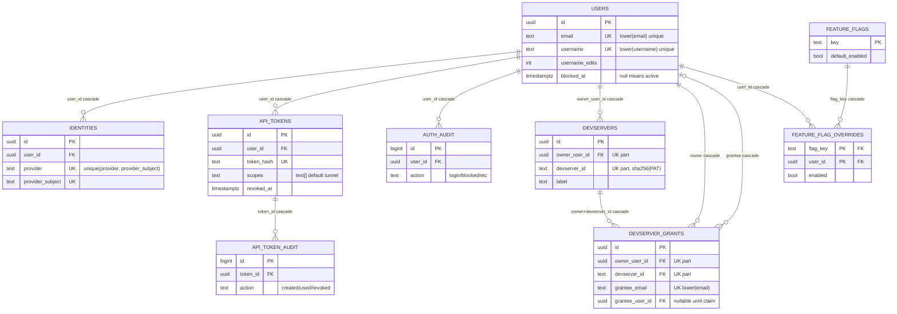

# profile-service: design

This document owns profile-service's component boundaries, invariants, rationale, and failure behavior. The route and environment-variable catalogs live in [`README.md`](README.md) and are not repeated here.

## Problem

Other gateway services need a single, authoritative store for user identity. Two writers must not race when a user signs in for the first time on two providers concurrently; an admin block must revoke every live PAT in one transaction and durably schedule the fleet-wide cut of the user's live tunnels and browser sessions through devserver-control; renames must be capped so the public username namespace (`gw.{domain}/s/{username}`, the `{owner}--{disc}` host labels) doesn't churn.

## Architecture

Small axum service in front of Postgres. Schema:

- `users (id, email, display_name, username, username_edits, created_at, updated_at, blocked_at, block_reason, avatar_url)`
- `identities (id, user_id, provider, provider_subject, email, created_at)` with `UNIQUE (provider, provider_subject)`
- `api_tokens (id, user_id, label, token_hash, expires_at, created_at, revoked_at, last_used_at, scopes)`
- `api_token_audit (id, ts, token_id, action, ip, user_agent)`
- `auth_audit (id, ts, user_id, action, ip, user_agent, note)`
- `devservers (id, owner_user_id, devserver_id, label, created_at, last_seen_at)` with `UNIQUE (owner_user_id, devserver_id)`. First-class entity for an owner's shareable devserver: lets the dashboard list a devserver that has no grants and no live tunnel yet, and acts as the FK target for grants. `devserver_id` is the lowercase hex SHA-256 of the owner's PAT (produced by identity); `label` mirrors the PAT label. A registry sweeper marks rows from the controller's live-tunnel snapshot once a minute and deletes rows offline longer than `DEVSERVER_RETENTION_MINUTES` (default 15m; 0 disables). Rows carrying grants are never swept, and a tick that cannot fetch the snapshot deletes nothing.
- `devserver_grants (id, owner_user_id, devserver_id, grantee_email, grantee_user_id, created_at, accepted_at)` with `UNIQUE (owner_user_id, devserver_id, lower(grantee_email))` and an FK on `(owner_user_id, devserver_id)` -> `devservers` (cascade delete). A grant is one binary, shell-equivalent authority; there is no role column.
- `feature_flags (key PK, description, default_enabled, created_at, updated_at)`: registry of named flags.
- `feature_flag_overrides (flag_key, user_id, enabled, set_at, PRIMARY KEY (flag_key, user_id))`: per-user explicit enable/disable rows. The effective value for `(flag, user)` is the override row when present, else `default_enabled`.
- `devserver_user_policies (user_id, enabled, max_connected_devservers, updated_at)`: durable, product-agnostic per-user tunnel policy. No row is the compatibility default; identity can require a row at deployment time.
- `devserver_fleet_policy (singleton, admissions_enabled, updated_at)`: seeded singleton for a persistent fleet pause. Missing or unreadable state is an authorization failure.
- `identity_session_index (admin_session_id, user_id, store_id, authenticated_at, created_at)`: identity-owned index stored in the shared database. `store_id` is a bearer secret used only to delete the matching tower session and is never returned.

*Gateway Postgres schema: table relationships and key constraints; the bullet list above stays the authoritative column and constraint detail.*

The service never migrates the schema at serve time. `CHAN_GATEWAY_MIGRATIONS=only` applies the sqlx migrations under `gateway/migrations/` and exits (the packaged migrate oneshot and the kube migrate job run this mode with the database-owner credential); `CHAN_GATEWAY_MIGRATIONS=external` serves without touching DDL. An unset or otherwise shaped value fails startup.

The router splits into three sub-routers:

- `/v1/users/*` and `/v1/auth-audit`: gated by `auth` middleware. Either `PROFILE_AUTH_TOKEN` or `PROFILE_ADMIN_TOKEN` admits.
- `/v1/admin/*`: gated by `admin_auth` middleware. Only `PROFILE_ADMIN_TOKEN` admits.
- `/healthz`: no auth.

All bearer comparisons run through `subtle::ConstantTimeEq` via the shared `bearer_eq` helper. Both checks always run on the service API so a wrong token cannot oracle which leg matched first.

profile-service requires a `DevserverControlClient` configured with `DEVSERVER_ADMIN_URL` and the profile-scoped `DEVSERVER_PROFILE_ADMIN_TOKEN`. Denial mutations write their primary state, audit record, and a durable revocation-outbox generation in one transaction. The background worker then runs the data-plane cut against devserver-control (`kill_owner_tunnels` plus `revoke_subject_sessions` for a subject or account-delete job, `revoke_sessions_exact` for a single-grant job), confirms a post-commit first cut, waits the full entry-credential quiet window (40 seconds: entry lifetime plus symmetric clock skew), and makes a second cut before settling the job. Attempts retry with backoff up to a five-minute deadline; exhaustion writes a `session_revoke_failed` audit row and drops the job. The outbox row survives profile restarts.

## Key decisions

### Two-tier auth, single-token-friendly

Routes split into "service" and "admin" tiers, each gated by a distinct env var. The service-tier middleware also accepts the admin token, so a single-token deployment (one secret in vault, both env vars set to it) works without code changes. Deployments that want independent rotation set the env vars to different values; the gate logic does not care.

`bearer_eq` runs both checks unconditionally to avoid leaking which-token-matched timing.

### Atomic upsert by identity

`POST /v1/users/upsert-by-identity` is one transaction:

1. Look up `(provider, provider_subject)` in `identities`.
2. If found, update `users.avatar_url` if it changed and return the user with `user_created=false, identity_created=false`.
3. If not, look up `users` by email (case-insensitive). If found, insert a new `identities` row pointing at the existing user.
4. If still nothing, insert the user (with placeholder username) and the identity row in the same transaction.

The single transaction is what closes the orphan window when two browser tabs race a first-time login. Concurrent calls can still collide on the unique indexes; the handler retries internally (up to 3 attempts) on `23505` and converges on step 1 or 2.

### Deterministic placeholder usernames

New users get `u<12 hex chars from the row id>` as a placeholder handle. identity-service renames on first sign-in (the SPA prompts for one). The `u`-prefix shape lets future admin queries identify never-renamed accounts trivially. Real users cannot collide because the unique index plus the rename CAS prevent it.

### Rename cap of 4

`update_username` performs the compare-and-swap update and the "rename to current value" no-op case in one statement.

When the CTE returns no rows the handler runs one follow-up SELECT to distinguish "user not found" (404) from "rename cap reached" (409). Collapsing the original two-statement diagnosis into the CTE closes the TOCTOU window where a concurrent rename could change state between the CAS UPDATE and the diagnostic SELECT. The unique index on `lower(username)` still raises `23505` on the rare name collision, which surfaces as 409 with the database's error message.

### Durable devserver policy and access denial

User policy PUT is one lock-coupled upsert: it locks the canonical user row, serializes with block and PAT minting, and inserts or replaces the one policy row. The API accepts limits from 1 through 1,000,000; the controller still applies its lower deployment safety ceiling. The fleet singleton is updated independently and defaults to admissions enabled.

Profile does not perform the product-facing drain inside policy PUT. Identity first persists through these routes, then confirms owner-session revocation and owner-tunnel eviction. A failed drain cannot roll policy back, and an equal stricter retry repeats the drain until the fleet converges.

`POST /v1/admin/users/{id}/access/revoke` locks the user, revokes every live PAT, and writes one canonical `access_revoked` row. Identity adds OAuth-session, tenant-session, and tunnel cuts through its composite admin route.

### Block and delete use durable revocation

`POST /v1/admin/users/{id}/block`:

1. Set `users.blocked_at = now()` and `block_reason` in one transaction with the next two steps.
2. Update `api_tokens` to set `revoked_at = now()` for every live PAT belonging to the user.
3. Append an `auth_audit` row with action `blocked`.
4. Reserve a durable subject-revocation generation in the same transaction.

The handler returns 202 as soon as the transaction commits; the background worker performs the fleet cut as described above, so a down devserver-control delays the cut but never rolls back `blocked_at`. The operator CLI follows a block with identity's composite access-revoke route, which synchronously revokes OAuth sessions and tenant sessions and kills owner tunnels; partial confirmation there surfaces as a retryable 502 from the CLI's perspective.

Unblock clears `blocked_at` and `block_reason` only: PATs revoked at block time stay revoked, and the route answers 409 while an account-delete job is pending for the user.

Account deletion uses the dominant `AccountDelete` outbox job. The initial transaction blocks the user and revokes PATs but retains the profile row. Only after the quiet-window cuts settle does the worker delete the user and let foreign-key cascades remove identities, indexed OAuth sessions, tokens, and grants.

### Email rewrite is admin-only

`PATCH /v1/users/{id}` (the service-tier route) accepts only `display_name` and `avatar_url`. Email is the identity-linking key in `upsert_by_identity` branch (b): a service-bearer holder that could rewrite email could pivot account ownership to any account whose verified OAuth email matched the new value. Email mutation therefore lives behind the admin bearer on `POST /v1/admin/users/{id}/email`, runs in a single transaction with an `auth_audit` row of action `email_changed` (note carries the old + new addresses), and surfaces unique-constraint conflicts as 409.

### Devservers are first-class

A devserver is a row in `devservers` keyed on `(owner_user_id, devserver_id)`, where `devserver_id` is the lowercase hex SHA-256 of the owner's PAT (ADR-0001: the devserver is the unit of registration, gate, and sharing). identity-service creates the row at PAT-create time (it holds the raw token to compute the id) before either grants land or `chan devserver` registers a live tunnel, so the offline state is always representable. Live tunnels (held in devserver-proxy's in-memory Registry) reference the same `(owner, devserver_id)` pair; the FK from `devserver_grants` -> `devservers` makes devserver deletion atomic (cascading every grant on it).

`POST /v1/users/{owner}/devservers` is idempotent: 201 on insert, 200 when the id already existed (a blank/absent label on a re-issue leaves the stored label untouched). `POST .../grants` upserts the parent `devservers` row in the same transaction (so a caller that pre-seeds a grant before the devserver registers still produces a valid graph and the FK never fires).

### Per-devserver sharing grants

A grant gives a collaborator the WHOLE devserver (the whole library), not a single workspace: under ADR-0001 the path `{workspace}` segment is tenant routing only and never gates. A user shares their devserver with another user by email. Grants live in `devserver_grants` keyed on `(owner_user_id, devserver_id, lower(grantee_email))`:

- The owner pre-seeds grants from the gateway dashboard SPA on `gw.{domain}` *before* (or alongside) running `chan devserver run --tunnel-token <pat>`. The grant row exists independently of any live tunnel.
- `grantee_user_id` is `NULL` until a sign-in is observed with a verified email matching `grantee_email`. Two resolution paths: (a) at grant-create time, if `users` already has a row for the email; (b) at OAuth-callback time, via `POST /v1/users/{id}/grants/claim` which identity-service calls with the union of the user's verified emails.
- Re-adding the same email on the same `(owner, devserver)` is idempotent: `INSERT ... ON CONFLICT DO UPDATE` preserves `grantee_user_id` and `accepted_at` via `COALESCE`, so a re-add never re-pends a claimed grant. There are no roles.

Access decisions: identity-service calls `GET /v1/users/{owner}/devservers/{devserver_id}/access?as=<caller_user_id>` before minting a devserver-gate entry JWT, passing the devserver_id of the owner's live registration. The response is `{access: true}` on access, 404 otherwise. The 404 shape is shared with "unknown devserver": neither the access endpoint nor the share landing page leaks which devservers an owner is sharing. One `devserver_access` call is the single authorization assertion the gate needs.

devserver_id normalization: handler lowercases + trims and rejects anything that is not exactly 64 hex chars, the canonical SHA-256(PAT) shape. Email uniqueness is case-insensitive via a functional `lower(grantee_email)` index; display preserves the as-typed casing. Token rotation mints a new PAT and thus a new devserver_id, so existing grants do not survive rotation (re-share required); this is the settled trade-off in ADR-0001.

Listings: `GET /v1/users/{id}/grants/owned` returns `(owner_user_id, devserver_id, label, grant_count)` for every devserver the user owns (zero-grant rows included); `GET /v1/users/{id}/grants/incoming` returns devservers shared *with* the user (claimed grants only). FK cascades on `users(id)` drop grants when either the owner or the grantee is deleted.

### Feature flags

Two-tier table layout (`feature_flags` + `feature_flag_overrides`) behind admin endpoints. Resolution is `COALESCE(override.enabled, flag.default_enabled, false)` so unknown flags are closed by default. identity-service reads the resolved map for a user via `GET /v1/users/{id}/flags` (service tier). Neither seeded flag is enforced inside profile: `oauth_login` gates identity's OAuth callback, and `share_workspaces` is an SPA-only UI toggle shipped in `/api/me`.

The seeded flags ship `default_enabled = false`, so a fresh deploy refuses every sign-in at the identity callback until an operator grants `oauth_login` on at least one user. Override-or-default keeps the rollout knob simple: flip the default once the feature is ready for everyone; revoke the per-user override for a deny rule. Audit-style history is the `set_at` column on each override; full audit is deferred.

### All SQL is parameterized

Column lists are constants `format!`'d into queries; user input always rides through `.bind()` at `$N`. Substring search on email in the admin list endpoint uses `position($1 in lower(email)) > 0` with the substring as a bound parameter.

## Invariants

- `users.email` is `NOT NULL`, indexed by `lower(email)`.
- `identities` has `UNIQUE (provider, provider_subject)`.
- `users.username_edits` only increases; never reset.
- `users.blocked_at` is `NULL` or a timestamp; `NULL` means active.
- `api_token_audit.action` is one of `created`, `created_via_desktop`, `created_via_admin`, `desktop.redeem`, `used`, `revoked`.
- Block always: revokes every active PAT, appends one `auth_audit` row, and reserves durable fleet revocation in the same transaction.
- User-policy writes serialize with PAT mint and block on the canonical user row.
- The fleet policy singleton always exists after migration; an unreadable row is never interpreted as enabled.
- Access revoke and pending delete establish durable denial before any live-data-plane acknowledgement.
- Bearer comparisons run at constant time.
- `accepted_at` is `NULL` iff `grantee_user_id` is `NULL`; both flip together at claim time.

## Error model

`profile::Error`:

| Variant       | HTTP | Notes                              |
|---------------|------|------------------------------------|
| Unauthorized  | 401  | bearer missing or wrong            |
| NotFound      | 404  | user / token id missing            |
| BadRequest    | 400  | input validation                   |
| Conflict      | 409  | unique violation, rename cap       |
| Db (sqlx)     | 500  | logged at error level; 23505 answers 409 `{"error":"conflict"}` |
| Unavailable   | 503  | fleet policy unreadable            |

Database errors are logged with `tracing::error!(error = ?e, ...)`; clients see a generic `internal error` message.

## What is not wired

- mTLS (auth is Bearer only)
- Soft deletes (delete cascades via FK)
- Rate limiting on the service API (mitigated at the network layer; admin tree is bearer-gated by a separate token)
