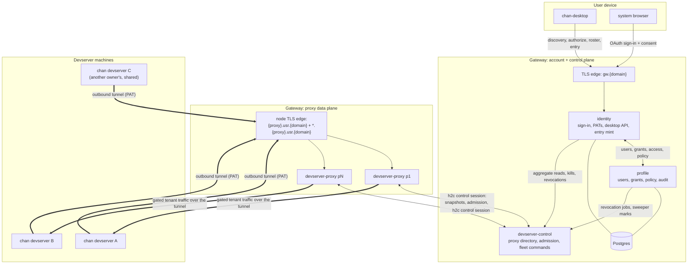
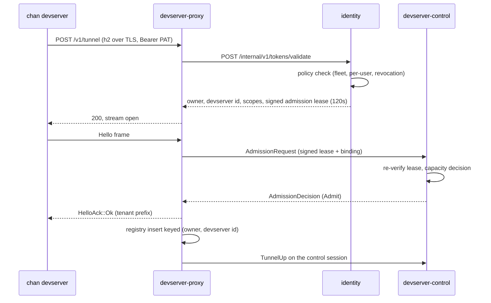
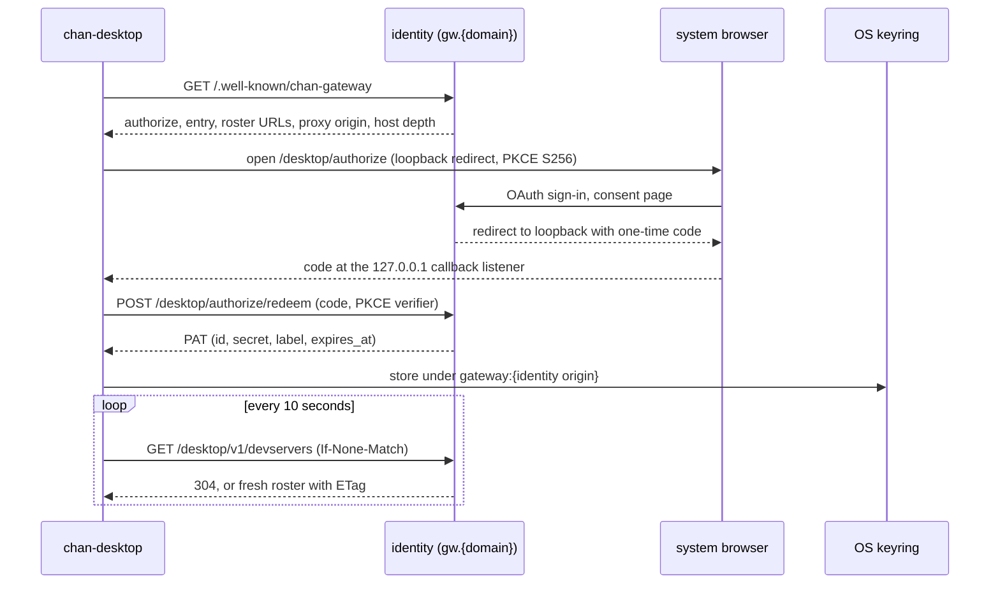
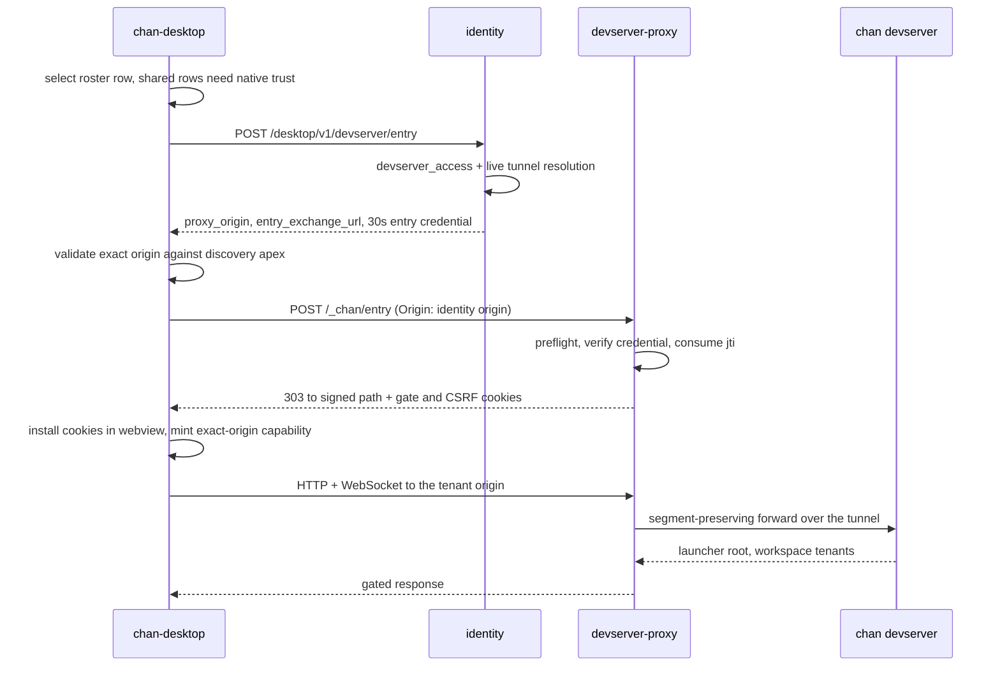

# Gateway design

The canonical system-level design for the chan gateway: how one `chan-desktop` account discovers a gateway, signs in, receives a roster of owned and shared devservers, and enters a selected devserver through its exact proxy origin, and how each devserver publishes itself through an outbound tunnel. Component-level contracts (routes, configuration, CLI surface) live in each crate's `README.md`; component boundaries and rationale live in each crate's `design.md`. This document ties them together and does not repeat their catalogs.

The gateway exposes, gates, and shares the **devserver**: one `chan devserver` process, resolved from the owner's PAT, hosting a library of workspaces. An account may own several devservers and hold grants on several more; every rostered devserver is reachable at the same time, capped only at tunnel admission. The `{workspace}` path segment is tenant routing inside a devserver, never a permission key. [`CONTEXT.md`](CONTEXT.md) fixes this vocabulary.

## Deployment boundaries

The gateway splits into an account and control plane and a proxy data plane:

- **identity** answers the public browser origin `gw.{domain}`: OAuth sign-in, the account SPA, PAT lifecycle, the desktop API (authorize, roster, entry), and the share-landing routes. A separate internal listener serves PAT validation to the proxies and the scoped admin trees; it is never published.
- **profile** is internal only and is the only crate that touches the sharing tables. It owns users, OAuth identities, devservers and grants, durable per-user and fleet policy, feature flags, and the auth audit in Postgres.
- **devserver-control** is a singleton, database-free control plane: the dynamic proxy directory, signed-lease admission, the aggregate tunnel and tenant-session inventory, and command routing. No tenant data crosses it.
- **devserver-proxy** nodes are the data plane. Each node terminates outbound devserver tunnels on an h2c listener behind its TLS edge and serves gated tenant traffic on one public listener that dispatches the node apex and the tenant wildcard on the raw `Host` header. A proxy holds no database and no signing keys.
- **Postgres** backs identity and profile only.

Every service listener binds loopback by default; a cleartext non-loopback bind requires the explicit `CHAN_GATEWAY_INTERNAL_TRANSPORT=protected-overlay` assertion, valid only behind an authenticated, encrypted overlay. TLS edges front exactly two surfaces: the identity public origin and each proxy node (its tunnel apex and its tenant wildcard). Database migrations are a dedicated step (`CHAN_GATEWAY_MIGRATIONS=only`, run with the owner credential); every runtime service boots with `=external` and never applies DDL.

## Devserver publication

A devserver publishes itself with nothing but an outbound connection and a PAT; no inbound port, DNS, or TURN/STUN stack is involved. The PAT is the only credential the devserver holds: the devserver id is the lowercase hex SHA-256 of the raw PAT, so one token identifies one devserver and the raw token never leaves the owner's side of identity.

The ordered gates:

1. **Tunnel dial.** The devserver opens TLS with ALPN h2 to the node's tunnel apex and sends one stream, `POST /v1/tunnel` with the PAT as bearer.
2. **PAT validation.** Before any 200, the proxy asks identity's internal listener (throttled per token fingerprint). Identity checks the token hash, the durable policy (fleet admissions, per-user enabled flag, suspension), and returns the owner, the devserver id, the scopes, and a 120-second Ed25519 admission lease that binds owner, devserver id, registration id, and proxy id and carries the signed `max_connected_devservers`.
3. **Admission.** The proxy admits nothing unless its control session is at `FleetReady`. devserver-control re-verifies the lease signature and binding, then decides: `Admit`, `AtCapacity` (the per-owner connected-devserver cap is `min(MAX_DEVSERVERS_PER_USER, the signed policy value)`), `Stale`, or `ControlWarming`. Refusals reach the client as `HelloAck::Refused` with a machine-readable code.
4. **Registration and readiness.** On `Admit` the client sees `HelloAck::Ok` with its tenant prefix, the registration enters the proxy registry keyed by `(owner, devserver id)`, and the tunnel becomes a yamux transport. The proxy publishes the row to devserver-control, so the fleet view and the entry path agree on liveness.

The whole path fails closed: a proxy whose control session is down admits nothing, and when the controller stays unreachable past the bounded grace window the proxy evicts every tunnel and clears every browser session rather than serving stale authority. Once registered, the devserver serves the launcher SPA at its root and each workspace tenant at `/{slug}-{8hex}/`; the proxy forwards the tenant host's path unchanged.

## Desktop account lifecycle

A desktop learns everything it needs from one discovery document; no gateway URL is compiled in. Gateways are user-added entries in the desktop configuration, each holding the public identity origin.

- **Discovery.** `GET {gateway}/.well-known/chan-gateway` returns the desktop authorize, entry, and roster URLs, the devserver proxy origin, and its host depth. The desktop rejects any answer whose URLs are not same-origin with the configured gateway, and requires https outside loopback.
- **Browser authorization with PKCE.** Sign-in opens the system browser at `/desktop/authorize` with a loopback redirect (`http://127.0.0.1:<port>/auth/callback`), a PKCE S256 challenge, and a scope request (`desktop.account` for account mode; `tunnel` for a CLI PAT). The user completes ordinary OAuth sign-in, which the `oauth_login` feature flag gates, and a server-rendered consent page. Approval yields a one-time, 120-second code delivered to the loopback listener, never a URL fragment or a registered scheme.
- **Redemption and storage.** The desktop redeems code plus verifier at `/desktop/authorize/redeem` (any failure is a uniform 410) for a PAT (`chan_pat_...`, scoped, expiry clamped to 90 days), and stores it in the OS keyring keyed by the gateway's identity origin.
- **Roster polling.** Every 10 seconds the desktop GETs the roster URL with the PAT bearer and the last seen ETag. The roster lists every devserver the account may enter, owned and shared, each with its immutable identity (owner user id, owner username, devserver id), a label, liveness, and its exact proxy origin while online. A 401 is terminal (the credential is cleared locally); any other failure keeps the last roster, and three consecutive failures mark the gateway unreachable. The server answers 304 on an `If-None-Match` hit and never degrades to a partial 200.

## Entering a selected devserver

Entry is where the desktop's explicit, immutable roster identity meets the proxy's exact-origin gate. The browser never sees a credential in a URL, and the Tauri webview never performs the exchange itself.

1. **Selection and shared-devserver trust.** The roster row's identity is explicit and immutable: owner user id, owner username, and full devserver id. Entering a devserver owned by someone else first requires persisted native trust keyed by that owner UUID and devserver id, never by labels or origins, which can change.
2. **Entry authorization.** The desktop POSTs `{path, owner_user_id, devserver_id}` to the entry URL. Identity runs the profile `devserver_access` check, resolves the named live devserver (404 with `no_devserver`, `devserver_offline`, or `access_denied` otherwise), and mints a 30-second Ed25519 entry credential: `drv` is the devserver id, `aud` is the exact tenant origin built from the controller-reported node base, `proxy_id` pins the node, a random `jti` makes it single-use, and `next_path` is the signed redirect target. The response (`proxy_origin`, `entry_exchange_url`, the credential) is `Cache-Control: no-store`.
3. **Exact-origin validation.** Before using the answer, the desktop verifies `proxy_origin` against the discovery document: same scheme and effective port as the proxy apex, exactly two labels below it, and a first label equal to `{owner}--{disc}` where `disc` is the first 12 hex characters of the requested devserver id. `entry_exchange_url` must be exactly `{proxy_origin}/_chan/entry`, and a later entry for the same devserver may not move the pinned origin.
4. **Cookie exchange.** The desktop's Rust side, not the webview, POSTs the credential as the single field of a bounded form to `/_chan/entry` with the identity origin as the exact `Origin` header. The proxy preflights method, Origin, Content-Type, and body shape before consulting its registry (so probes learn nothing), verifies the credential against its public key ring, consumes the `jti` in a proxy-local replay cache, and answers 303 to the signed `next_path` with two host-only cookies: `__Host-devserver_gate` (HttpOnly, the opaque proxy-local session, at most one hour) and `__Host-devserver_csrf` (readable by same-origin JS, mirrored into `X-Chan-CSRF` on unsafe methods).
5. **Capability minting.** The desktop installs both cookies into the webview's cookie store, mints a runtime Tauri capability whose remote URLs are exactly that one origin (no wildcards), and navigates the window to the clean path.
6. **The data path.** Every request to the tenant origin passes the proxy gate in order: a live session record matching the audience, the devserver id, and the owner; an exact-Origin check on WebSocket upgrades; the CSRF mirror on unsafe methods. What passes is forwarded unchanged (the path is segment-preserving) over the yamux tunnel with a per-tunnel HMAC gateway assertion, and the devserver routes the tenant internally. Sessions re-mint on expiry by repeating the exchange.

The browser counterpart shares the same machinery: the dashboard's Open action and the `/s/{owner}/{workspace}` share links mint the same credential at click time and hand the browser an auto-submitting form that POSTs the same exchange, so the credential never rides a URL there either. `/s/{owner}` is owner-only; the `?d=` selector names one devserver when several are live, and an ambiguous selector is a 404, not a guess.

## Control plane and data plane

devserver-control owns everything about the fleet that must be coherent: the proxy directory (each proxy node dials out to it and holds one authenticated h2 control session), admission authority, the aggregate tunnel and tenant-session inventory, and command routing. Proxies push a full snapshot plus generation-stamped deltas; after a convergence window the controller declares `FleetReady`, and only then do proxies admit. Version lockstep is enforced at the control handshake. Tenant bytes never cross the controller: it carries metadata and commands only, which is why a singleton suffices (ADR 0002).

identity, profile, and the admin CLI read the aggregate `/admin/v1/*` view from the controller under per-caller scoped credentials, never a query-time fan-out to proxy-local state. Revocation rides the same authority:

- **PAT revocation** durably revokes the token in profile, then identity best-effort cuts the owner's live tunnels and browser sessions through the controller. Because registrations do not retain which PAT backed them, one revocation pulls down all of the caller's tunnels; other PATs simply redial.
- **Blocking a user** is one profile transaction (block marker, every PAT revoked, audit row, durable outbox job); a background worker retries the fleet cut to a deadline and settles before reporting completion. Unblocking restores none of it: tokens stay revoked.
- **Operator session and tunnel commands** are acknowledged distributed operations: the controller answers only when every addressed proxy has confirmed the kill or the session drain, and reports a partial failure explicitly instead of pretending coherence.

## Isolation model

Cross-tenant isolation rests on three pillars, all visible in the lifecycles above:

- **No shared cookies.** identity's `__Host-id_session` is host-only on `gw.{domain}`; the proxy's gate cookies are host-only on the exact tenant origin. No parent-domain cookie exists, so a browser never auto-attaches an account session to a sibling tenant. The gate cookie's whole-host `Path=/` scope is safe precisely because a grant covers the whole devserver: there is no non-granted tenant on the same host to isolate it from.
- **Signed, bound credentials.** The entry credential binds subject, owner, devserver id, exact audience, and proxy id, lives 30 seconds, and succeeds once. The admission lease binds the tunnel registration the same way for 120 seconds. Proxies hold only verifying keys; a compromised node cannot mint entries or admissions.
- **A hostile-network proxy.** The proxy trusts no inbound forwarding header, strips hop-by-hop headers and the inbound `Host`, `Cookie`, `Authorization`, and `X-Chan-CSRF` before forwarding, recomputes `X-Forwarded-*` itself, and answers the unknown, the unauthenticated, and the unauthorized with one negotiated 404 shape so probes cannot enumerate registrations.

## Documentation map

| Document                            | Role                                          |
|-------------------------------------|-----------------------------------------------|
| `gateway/README.md`                 | Front door: overview, component index, links  |
| `gateway/design.md`                 | This document: system design and lifecycles   |
| `gateway/CONTEXT.md`                | Glossary of current terms                     |
| `gateway/docs/dev-setup.md`         | Gateway-specific contributor setup            |
| `gateway/docs/adr/`                 | Durable decisions and rejected alternatives   |
| `gateway/crates/*/README.md`        | Run, configuration, route, and CLI contracts  |
| `gateway/crates/*/design.md`        | Boundaries, invariants, rationale, failures   |
| `packaging/gateway/scripts/dev/`    | Local runner (canonical for the dev stack)    |
| `packaging/kube/README.md`          | Kubernetes and sdme deployment (canonical)    |
