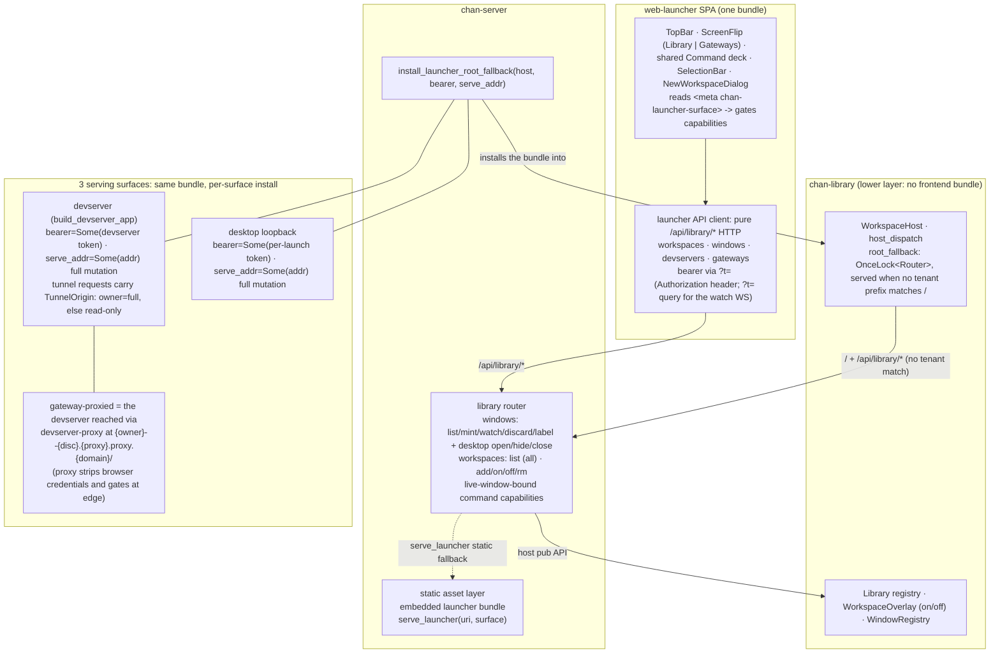
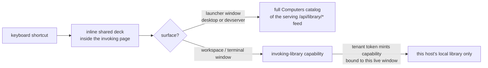
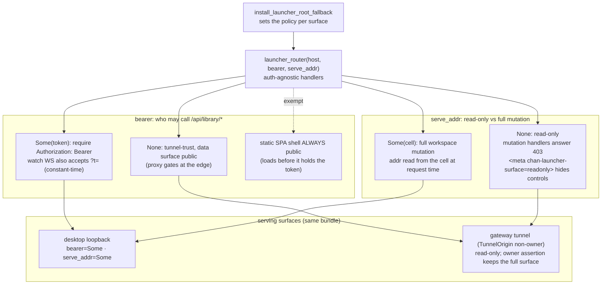

# web-launcher design

How the launcher is built and reached. The [`README`](README.md) covers the stack and the dev loop; this file is the design of record for *where* the launcher is served and *how* its `/api/library/*` surface is authorized. Ground every change here against the launcher client wire, the server library API, the static bundle embed, and the `WorkspaceHost` root-fallback hook. Those four boundaries are the contract; individual source-file ownership belongs in code review, not in this design doc.

## Diagram

## What the launcher is

In its ordinary launcher-window role, the SPA is a pure `/api/library/*` HTTP client: it never opens native windows, never dials a devserver, and never parses an opaque window or workspace id. Every type mirrors a struct the library serializes; the field names *are* the wire, pinned by server byte-tests. It is served at the devserver/library root `/`, and the bundle uses a relative asset base so assets resolve under any mount. It renders four registries: workspaces, windows, devservers, and gateways.

## One command deck, two authority hosts

The command launcher is one product and one shared Svelte component, rendered inline inside the page that invoked it on every surface; there is no native launcher window. Its empty query is the **contextual deck**: focused tab actions first, then pane, window, and Computers. Each surface exposes the scopes it has commands for (this bundle exposes Computers only), and the scope orbs stay visible for direct keyboard navigation. Typed deep search may jump directly to a permitted nested target while retaining the trusted breadcrumb and any confirmation step.

In this bundle the deck's Computers scope rides the same `/api/library/*` feed the screens render, so the launcher window's deck carries the full Computers catalog of the surface that serves it. Workspace and standalone-terminal windows run the workspace app's own inline deck with a narrower Computers scope: `POST /api/library/command-capabilities` accepts a tenant token only when the claimed `window_id` has live `/ws` presence in that exact tenant. The opaque capability has a five-minute sliding expiry and dies immediately when that window disappears. Its snapshot omits tenant tokens, route prefixes, and aggregate remote-feed rows. Owner capabilities may create/focus/hide/show/close browser windows in that library; readonly tunnel capabilities may inspect and focus only. Launch redirects revalidate liveness, are `no-store`, and send `Referrer-Policy: no-referrer`. The desktop-side authority split across window classes is [ADR 0001](../../../docs/adr/0001-desktop-owns-aggregate-launcher-authority.md).

### Keyboard and draft contract

- macOS Desktop: `Cmd+K` contextual, `Cmd+Shift+K` Computers.
- Web and non-macOS: `Ctrl+Alt+K` contextual; Desktop also exposes `Ctrl+Alt+Shift+K` for Computers.
- `Up`/`Down` move through results and into the scope rail; `Left`/`Right` move between scopes or back/forward through levels; `Enter` enters or executes; empty-query `Backspace` goes back; `Escape` hides.
- Each window keeps separate contextual and Computers drafts in its own session storage, holding visibility, query, path, selection, and recoverable operation state. Reload and hide preserve the draft; successful execution, window close, and app exit clear it.
- Theme is a live input: an open deck follows the page's light/dark theme immediately.

## The `/api/library/*` surface

- **workspaces**: `GET` list (`{workspace_id, path, label, on, status, error?, library_id, devserver_id, prefix}`; a local row's `prefix` equals its `workspace_id`, a devserver row carries its remote mount prefix), `POST {path}` add, `POST /{id}/{on|off}` toggle, `DELETE /{id}` remove.
- **windows**: `GET` list, `POST {kind, workspace_path?, origin?, acting_window_id?}` mint, `GET .../windows/watch` (a WebSocket that pushes the full window set plus per-tenant leaders on every change), `DELETE /{id}` discard, `POST /{id}/{open|hide|close}` (desktop-bridge ops), `POST /{id}/visibility`, and `PUT /{id}/label {label, acting_window_id?}`. `label` is separately persisted optional user text (at most 64 characters) for any non-control terminal or workspace window; it never mutates or gets parsed from the library-owned title/ordinal.
- **command capabilities**: `POST /command-capabilities` mints from the invoking tenant token and live window; capability-authenticated `GET /{capability}` returns a token-redacted local snapshot, `POST /{capability}/actions` executes the approved owner subset, and `GET /{capability}/windows/{id}/launch` revalidates then redirects into the target tenant.
- **devservers**: full CRUD plus desktop-bridge ops (connect/disconnect, native-trust, terminal, workspace open/on/off/forget); a registry-less surface returns an empty list, and bridge ops answer `NO_DESKTOP`/409 with no desktop attached.
- **gateways**: CRUD plus connect/disconnect; roster rows synthesize read-only devserver entries.

The Computers tree carries machine health on the machine glyph itself: green is
connected/local, orange is a pending connection, red is lost/unreachable, and
muted is disconnected. There is no sibling machine-status dot (the Gateways
registry keeps its own independent dots). Ordinary terminal and workspace rows
render their generated ordinal plus optional caption as
`Terminal Window N [caption]` / `Window N [caption]`; clicking that label edits
only the caption. The command launcher's Computers scope uses the same shared action
wrappers as the card controls and completes over live computers, workspaces,
and windows for New terminal/window, Focus, Hide, Show, Close, Connect,
Disconnect, Turn on/off, Quit, and New devserver. Window completion search
includes the optional caption.

The SPA reads its bearer from `?t=` in its own URL and presents it as `Authorization: Bearer` on fetch and as `?t=` on the watch WebSocket (a browser WebSocket cannot set headers).

## Three-surface serving via the `WorkspaceHost` root fallback

`host_dispatch` matches only workspace-tenant prefixes, so the root `/` returned 404. `WorkspaceHost` carries an install-once `root_fallback: OnceLock<Router>` that `host_dispatch` serves when no tenant prefix matches a request. chan-library defines the slot; chan-server fills it with the launcher bundle (`serve_launcher` plus the `/api/library/*` routes) through `install_launcher_root_fallback`. The direction matters: chan-server depends on chan-library, so the launcher bundle, a frontend artifact, lives in chan-server and is injected down into the host, never the reverse. The same bundle is installed on each surface:

1. **devserver** (`build_devserver_app`): served over the tunnel to the gateway proxy and on the box's `127.0.0.1` bind;
2. **desktop loopback** through the embedded `WorkspaceHost`;
3. **gateway-proxied**: the devserver reached through `devserver-proxy` at `{owner}--{disc}.{proxy}.proxy.{domain}/` (ex `{owner}--{disc}.{region}.proxy.chan.app/`).

## Per-surface auth and the read-only / mutation split

*The two policy knobs the installer sets per surface: `bearer` (who may call `/api/library/*`) and `serve_addr` (read-only vs full mutation).*

`launcher_router(host, bearer, serve_addr)` is auth-agnostic in its handlers; the installer sets the policy per surface:

- **`bearer`** gates `/api/library/*`. `Some(token)` requires `Authorization: Bearer` (the watch WebSocket also accepts `?t=`), constant-time compared; `None` is tunnel-trust. The static SPA shell is always public so it loads before it holds the token.
- **`serve_addr`** (`Option<Arc<OnceLock<SocketAddr>>>`) is both the read-only/full discriminator and the mount enabler. `Some(cell)` is the loopback: workspace mutation is served, and the mount path reads the listen address from the cell, which the embedder fills *after* it binds, so it is read at request time rather than install time. `None` is the tunnel-trust surface: workspaces are read-only: the mutation handlers answer `403`, and the shell carries `<meta name="chan-launcher-surface" content="desktop|devserver|readonly">`; tunnel non-owners are downgraded to `readonly` per request, and on readonly the SPA hides the mutation controls (the New-workspace button, the row checkboxes and bulk bar, and the on/off toggle, which becomes a static state badge) and shows a "manage from the desktop app or the CLI" hint instead of buttons that fail.

On the gateway surface the proxy strips browser `Cookie` and `Authorization` credentials and forwards a signed gateway assertion; owner assertions mutate over the tunnel, missing/non-owner assertions may read but not mutate (403). Query parameters are ordinary tenant application data; proxy entry credentials are accepted only at the fixed body-only exchange endpoint. A collaborator holding a `__Host-devserver_gate` cookie must not unmount or remove the owner's workspaces. Window mint/discard follow the same split (per-view state, low-risk): owners on every surface, 403 for tunnel non-owners. Owners manage a headless devserver's workspaces over the bearer-gated `/api/devserver/*` management API and `cs`/CLI.

An unforced off answers `409 {error:"live_terminals", active_terminals:N}` on this surface; the launcher confirms and retries the same route with `force: true`.

## Build integration

The launcher bundle is embedded beside the main workspace bundle and follows the same rebuild contract: fresh checkouts and isolated gate worktrees compile before the frontend artifact exists, while a rebuilt launcher forces the embedding server crate to relink. The top-level web targets build the launcher before any CLI, desktop, packaging, or release consumer embeds the server bundle, so every distribution path ships the same launcher without per-consumer wiring.

## Devserver registry and gateway assertion

- **Devservers registry bridge** (`/api/library/devservers*`). The registry is desktop-side config, CRUD-able over HTTP; the desktop-bridge ops (connect/disconnect, native-trust, terminal, workspace open/on/off/forget) dispatch to the attached desktop, and a registry-less surface lists empty.
- **Proxy-injected signed role assertion.** devserver-proxy signs a gateway assertion (`chan_tunnel_proto::gateway_assertion`) with a per-tunnel key after its gate; the devserver verifies it, marks the request `TunnelOrigin`, and grants owner assertions the full launcher over the tunnel.
