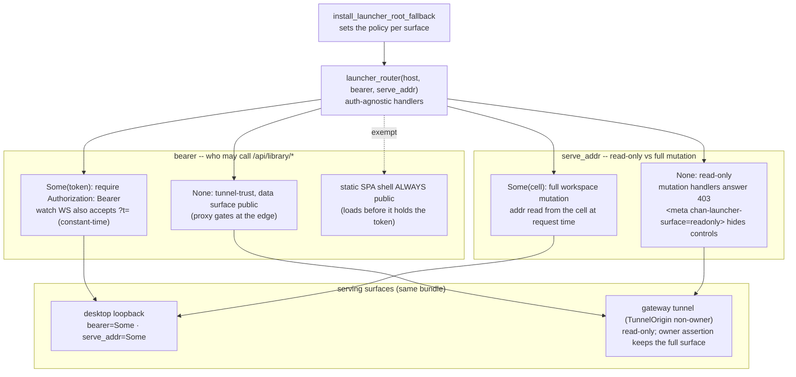

# web-launcher: the launcher SPA and its three-surface serving

How the launcher is built and reached. The [`README`](README.md) covers the stack and the dev loop; this file is the design of record for *where* the launcher is served and *how* its `/api/library/*` surface is authorized. Ground every change here against the launcher client wire, the server library API, the static bundle embed, and the `WorkspaceHost` root-fallback hook. Those four boundaries are the contract; individual source-file ownership belongs in code review, not in this design doc.

## Diagram

## What the launcher is

The launcher is a pure `/api/library/*` HTTP client: it never opens native windows, never dials a devserver, and never parses an opaque window or workspace id. Every type mirrors a struct the library serializes -- the field names *are* the wire, pinned by server byte-tests. It is served at the devserver/library root `/`, and the bundle uses a relative asset base so assets resolve under any mount. It renders four registries: workspaces, windows, devservers, and gateways.

## Unified command launcher authority

The **command launcher** is the searchable command deck rendered inside a SPA. The **launcher SPA** is this package's Computers/library application. They are distinct concepts even though the launcher SPA hosts one command launcher.

There is no native command-launcher window. `@chan/web-shared` owns one `CommandDeck` presentation and interaction model, while each SPA adapts commands it already has authority to execute:

- The launcher SPA supplies the full library snapshot already authorized by its `/api/library/*` bearer. On the desktop loopback that is Chan Desktop's aggregate Computers inventory, including connected devservers and gateways.
- A workspace or terminal SPA supplies its contextual command registry plus a scoped snapshot of only the library serving that window. It mints a short-lived command capability with its tenant bearer and live `window_id`; the capability expires with that window's `/ws` presence and never includes another library.
- A direct `chan open --standalone` tenant has no `WorkspaceHost` root launcher API. Its workspace adapter degrades to two same-tenant browser navigations, `New terminal` and `New window`, and exposes no roster or window-management actions.
- A remotely served workspace therefore cannot enumerate or control Chan Desktop's other libraries. Desktop-wide commands remain in the trusted launcher SPA.

Window affinity follows the invoking record. A browser-origin window creates browser-origin records and opens them with `window.open`; a native-origin window creates native-origin records and lets the existing desktop watcher reconcile them into Tauri windows. The command deck itself owns no native geometry, focus handoff, transparent surface, or cross-window draft state.

## The `/api/library/*` surface

- **workspaces** -- `GET` list (`{workspace_id, path, label, on, status, error?, library_id, devserver_id, prefix}`; a local row's `prefix` equals its `workspace_id`, a devserver row carries its remote mount prefix), `POST {path}` add, `POST /{id}/{on|off}` toggle, `DELETE /{id}` remove.
- **windows** -- `GET` list, `POST {kind, workspace_path?, origin?, acting_window_id?}` mint, `GET .../windows/watch` (a WebSocket that pushes the full window set plus per-tenant leaders on every change), `DELETE /{id}` discard, `POST /{id}/{open|hide}` (desktop-bridge ops), `POST /{id}/visibility`.
- **devservers** -- full CRUD plus desktop-bridge ops (connect/disconnect, native-trust, terminal, workspace open/on/off/forget); a registry-less surface returns an empty list, and bridge ops answer `NO_DESKTOP`/409 with no desktop attached.
- **gateways** -- CRUD plus connect/disconnect; roster rows synthesize read-only devserver entries.

The SPA reads its bearer from `?t=` in its own URL and presents it as `Authorization: Bearer` on fetch and as `?t=` on the watch WebSocket (a browser WebSocket cannot set headers).

## Three-surface serving via the `WorkspaceHost` root fallback

`host_dispatch` matches only workspace-tenant prefixes, so the root `/` returned 404. `WorkspaceHost` carries an install-once `root_fallback: OnceLock<Router>` that `host_dispatch` serves when no tenant prefix matches a request. chan-library defines the slot; chan-server fills it with the launcher bundle (`serve_launcher` plus the `/api/library/*` routes) through `install_launcher_root_fallback`. The direction matters: chan-server depends on chan-library, so the launcher bundle -- a frontend artifact -- lives in chan-server and is injected down into the host, never the reverse. The same bundle is installed on each surface:

1. **devserver** (`build_devserver_app`) -- served over the tunnel to the gateway proxy and on the box's `127.0.0.1` bind;
2. **desktop loopback** through the embedded `WorkspaceHost`;
3. **gateway-proxied** -- the devserver reached through `devserver-proxy` at `{owner}--{disc}.{proxy}.usr.{domain}/` (ex `{owner}--{disc}.{region}.usr.chan.app/`).

## Per-surface auth and the read-only / mutation split

*The two policy knobs the installer sets per surface: `bearer` (who may call `/api/library/*`) and `serve_addr` (read-only vs full mutation).*

`launcher_router(host, bearer, serve_addr)` is auth-agnostic in its handlers; the installer sets the policy per surface:

- **`bearer`** gates `/api/library/*`. `Some(token)` requires `Authorization: Bearer` (the watch WebSocket also accepts `?t=`), constant-time compared; `None` is tunnel-trust. The static SPA shell is always public so it loads before it holds the token.
- **`serve_addr`** (`Option<Arc<OnceLock<SocketAddr>>>`) is both the read-only/full discriminator and the mount enabler. `Some(cell)` is the loopback: workspace mutation is served, and the mount path reads the listen address from the cell, which the embedder fills *after* it binds, so it is read at request time rather than install time. `None` is the tunnel-trust surface: workspaces are read-only -- the mutation handlers answer `403`, and the shell carries `<meta name="chan-launcher-surface" content="desktop|devserver|readonly">`; tunnel non-owners are downgraded to `readonly` per request, and on readonly the SPA hides the mutation controls (the New-workspace button, the row checkboxes and bulk bar, and the on/off toggle, which becomes a static state badge) and shows a "manage from the desktop app or the CLI" hint instead of buttons that fail.

On the gateway surface the proxy strips browser `Cookie` and `Authorization` credentials and forwards a signed gateway assertion; owner assertions mutate over the tunnel, missing/non-owner assertions may read but not mutate (403). Query parameters are ordinary tenant application data; proxy entry credentials are accepted only at the fixed body-only exchange endpoint. A collaborator holding a `__Host-devserver_gate` cookie must not unmount or remove the owner's workspaces. Window mint/discard follow the same split (per-view state, low-risk): owners on every surface, 403 for tunnel non-owners. Owners manage a headless devserver's workspaces over the bearer-gated `/api/devserver/*` management API and `cs`/CLI.

An unforced off answers `409 {error:"live_terminals", active_terminals:N}` on this surface; the launcher confirms and retries the same route with `force: true`.

## Build integration

The launcher bundle is embedded beside the main workspace bundle and follows the same rebuild contract: fresh checkouts and isolated gate worktrees compile before the frontend artifact exists, while a rebuilt launcher forces the embedding server crate to relink. The top-level web targets build the launcher before any CLI, desktop, packaging, or release consumer embeds the server bundle, so every distribution path ships the same launcher without per-consumer wiring.

## Devserver registry and gateway assertion

- **Devservers registry bridge** (`/api/library/devservers*`). The registry is desktop-side config, CRUD-able over HTTP; the desktop-bridge ops (connect/disconnect, native-trust, terminal, workspace open/on/off/forget) dispatch to the attached desktop, and a registry-less surface lists empty.
- **Proxy-injected signed role assertion.** devserver-proxy signs a gateway assertion (`chan_tunnel_proto::gateway_assertion`) with a per-tunnel key after its gate; the devserver verifies it, marks the request `TunnelOrigin`, and grants owner assertions the full launcher over the tunnel.
