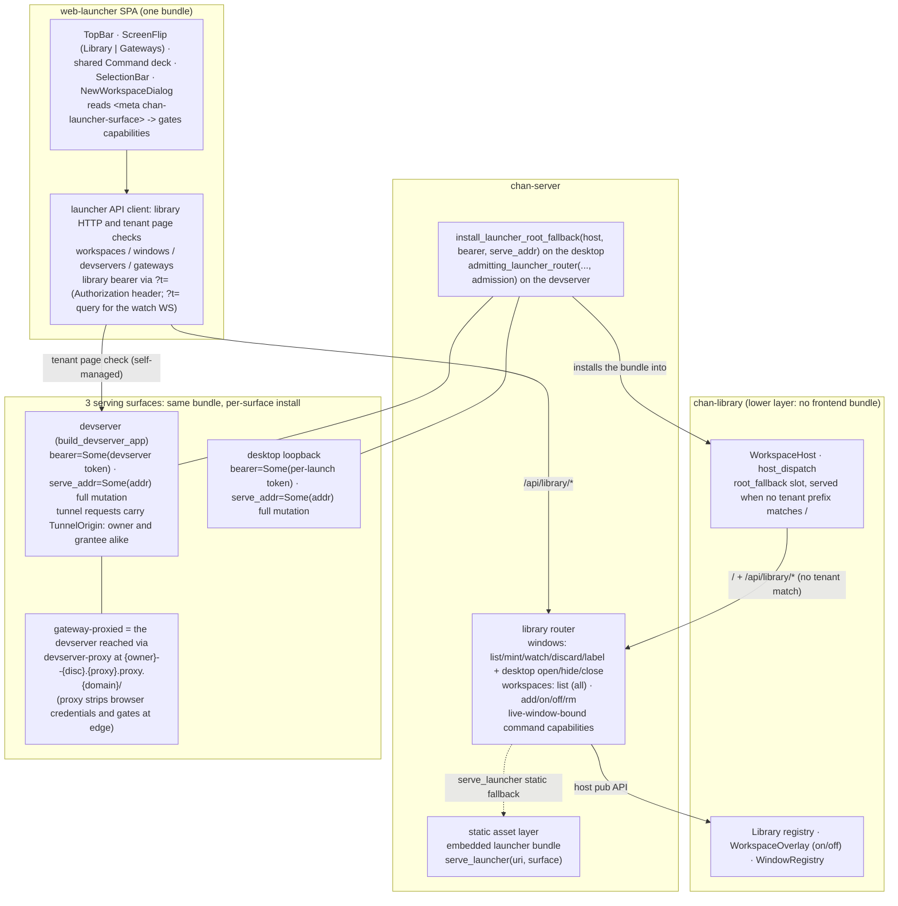
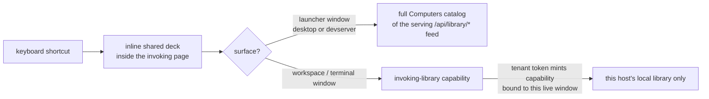
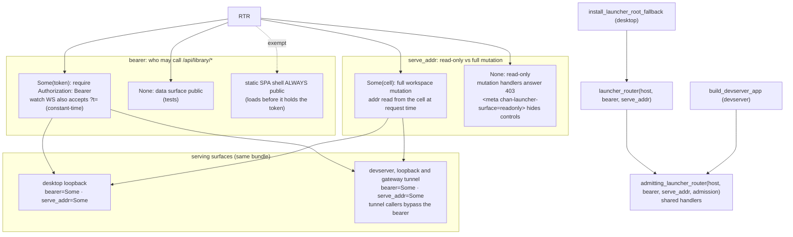

# web-launcher design

How the launcher is built and reached. The [`README`](README.md) covers the stack and the dev loop; this file is the design of record for *where* the launcher is served and *how* its `/api/library/*` surface is authorized. Ground every change here against the launcher client wire, the server library API, the static bundle embed, and the `WorkspaceHost` root-fallback hook. Those four boundaries are the contract; individual source-file ownership belongs in code review, not in this design doc.

## Diagram

```mermaid
flowchart TB
    subgraph spa["web-launcher SPA (one bundle)"]
        LIB["launcher API client: library HTTP and tenant page checks<br/>workspaces / windows / devservers / gateways<br/>library bearer via ?t= (Authorization header; ?t= query for the watch WS)"]
        UI["TopBar · ScreenFlip (Library | Gateways) · shared Command deck · SelectionBar · NewWorkspaceDialog<br/>reads &lt;meta chan-launcher-surface&gt; -> gates capabilities"]
    end

    subgraph cs["chan-server"]
        SL["static asset layer<br/>embedded launcher bundle<br/>serve_launcher(uri, surface)"]
        LR["library router<br/>windows: list/mint/watch/discard/label + desktop open/hide/close<br/>workspaces: list (all) · add/on/off/rm<br/>live-window-bound command capabilities"]
        IRF["install_launcher_root_fallback(host, bearer, serve_addr) on the desktop<br/>admitting_launcher_router(..., admission) on the devserver"]
    end

    subgraph lib["chan-library (lower layer: no frontend bundle)"]
        HOST["WorkspaceHost · host_dispatch<br/>root_fallback slot, served when no tenant prefix matches /"]
        REG["Library registry · WorkspaceOverlay (on/off) · WindowRegistry"]
    end

    UI --> LIB
    LIB -->|"/api/library/*"| LR
    IRF -->|installs the bundle into| HOST
    LR -.->|serve_launcher static fallback| SL
    LR -->|host pub API| REG
    HOST -->|"/ + /api/library/* (no tenant match)"| LR

    subgraph surfaces["3 serving surfaces: same bundle, per-surface install"]
        direction LR
        DEV["devserver (build_devserver_app)<br/>bearer=Some(devserver token) · serve_addr=Some(addr) full mutation<br/>tunnel requests carry TunnelOrigin: owner and grantee alike"]
        GW["gateway-proxied = the devserver reached via<br/>devserver-proxy at {owner}--{disc}.{proxy}.proxy.{domain}/<br/>(proxy strips browser credentials and gates at edge)"]
        LOOP["desktop loopback<br/>bearer=Some(per-launch token) · serve_addr=Some(addr) full mutation"]
    end
    LIB -->|"tenant page check (self-managed)"| DEV
    DEV --- GW
    IRF --- DEV
    IRF --- LOOP
```

## What the launcher is

In its ordinary launcher-window role, the SPA is an HTTP client of the serving library: it never opens native windows, never dials a devserver, and never parses an opaque window or workspace id. Every type mirrors a struct the library serializes; the field names *are* the wire, pinned by server byte-tests. It is served at the devserver/library root `/`, and the bundle uses a relative asset base so assets resolve under any mount. It renders four registries: workspaces, windows, devservers, and gateways.

On a self-managed devserver surface, creating a workspace or terminal window opens a blank browser window synchronously in the user's gesture. After the library mints its record, the launcher names the window by its record id and stores its handle before waiting. Re-opening a record acquires its named window without a URL. The launcher builds every tenant URL it sends a window to itself, with no launch route between, and adds `h`, the 32-hex-digit tag minted once for this load of the launcher page by [window-holder](../web-shared/src/window-holder.ts). Open and Focus decide by the tag read from the window's own URL when the record held at the gesture lists holders: a nonblank page is on the window when its tag is among them, and an unreadable location is not held. A record without the list, or a readable window URL with no tag, leaves the decision to `connected`. A nonblank page held by this rule is focused without a check or navigation. Otherwise the page is checked and its window is navigated whatever it shows, including HTML refusals, JSON viewers, engine error pages and another site, unless the record read again when the check answers holds its page. Content type decides nothing. A blank window without a live mark is checked and navigated even when its record lists the page's tag or reads connected. An unreadable location is not blank.

The check fetches the same-origin tenant URL with `cache: "no-store"`, carrying the same URL and same-origin cookies as the navigation. Only a blank document receives the waiting line. Document access is guarded: an unreadable window gets no mark or line, but its location can still be assigned. A refused repair closes only a blank that its own gesture opened, one whose document carries no mark of any age or form. A blank that an earlier wait left carries that wait's mark, so it stays open with its waiting line until its user closes it or a later gesture repairs it; a nonblank window keeps its page. Either way the refusal is reported once through the caller's error surface.

When the check answers, a window that is not blank is read again before it is navigated: the launcher looks its record up in the last feed it was delivered and reads the window's current tag. A record that holds that page by the same rule leaves the window on it with its waiting mark removed, and counts as success, so Focus and Show still unhide it. A record missing from the feed ends the wait as a closed window does: nothing is navigated, marked or unhidden. A record that does not hold that page is navigated, and so is any window of a launcher that has had no feed yet. A window that is blank, then or once the reading answers, is navigated whatever the reading says. The reading is a lookup in memory and sends no request. It is only as fresh as the feed, which redials from half a second up to fifteen seconds after it drops.

A 503 retries according to `Retry-After` (seconds or an HTTP date), with at least one second after each answer, including zero or fractional seconds and dates in the past. A missing or invalid header also waits one second. The wait is bounded at sixty seconds, including a stalled request or body, and stops when the user closes the window. Repeated calls from one page share a pending answer and navigate once.

A readable document carries a mark that says until when it holds: a waiting mark for the wait's sixty seconds, and a navigating mark for ten seconds after the location is assigned, on the document the window holds then. The ten seconds are a policy that no measured commit stands behind: a slower commit can be navigated twice by a later gesture, and a stopped one keeps callers out that long. A mark past its time, or one promising more than its phase allows, as after the clock is set back, reads as no mark, so a stopped navigation or an owner page that was reloaded is repaired by the next gesture once its mark runs out. A caller that finds a live navigating mark answers success at once. One that finds a live waiting mark, from another page or left by an owner that went away, follows it: it focuses the window once unless its caller asked for no focus, as a Show does, sends nothing, and looks every 100 ms until the other wait navigates or the document is replaced (success), the window closes (closed), or the mark is removed or runs out (it decides again, with a wait of its own on an unmarked window). A Focus or Show therefore un-hides nothing before that wait is decided, and its pending card can last the owner's remaining lease and then its own sixty seconds. A window its user reloads while another page waits on it reads to a follower as that wait's navigation, so a Focus or Show can un-hide a record whose window still shows what it showed before. A wait whose window another page took after its mark ran out, as when its timers fire late in a background tab, navigates nothing and rejects nothing: it answers what that page makes of the window. A wait that ends without navigating puts back the mark it replaced, spent if that value still reads live, so a blank that carried a mark keeps one.

A successful check navigates the window. A refusal reaches the caller through `ApiError`; the shared deck chooses its owned card or the host callback as described below. The bound reports the last refusal's sentence, or a timeout message if no refusal arrived. Cancellation or refusal discards a newly minted record unless a replacement window holds it; re-opening an existing record keeps that record. The check cannot make the later navigation atomic: a devserver that starts stopping between them can still refuse the navigation.

Browser Show, from both the command deck and the row's eye, repairs a disconnected browser-origin record through the same path as Focus before clearing hidden state. For a native-origin record, Show changes visibility and nothing else: chan-desktop owns that window and opens it again itself once it is shown, and a window acquired here would be a second live window on its id. Open and Focus acquire a window for any record, which a browser with no desktop needs for a devserver's first terminal. Show makes no explicit focus call, but acquiring a named window can raise it according to the browser. A connected Show changes visibility without acquiring a window. For a browser window a page already holds, the launcher does nothing to that page: the server tells the page's own socket that its record is shown, and the page takes down the hidden-by-the-leader cover it raised at Hide, then checks that the server behind it is the one it loaded from and reloads itself only when it is not; a page whose socket was down when the record was shown keeps its cover until it is reloaded or reopened. Focus and Show leave visibility alone when their repair returns closed, finds the record gone or is refused, and un-hide a window another page is opening only once that page's wait has navigated. A popup the browser blocks is reported once, by Open, Focus and Show alike, with the sentence "The browser blocked the Chan window": the deck shows it on its card and no success, and nothing is unhidden. Hide is a visibility change, and native desktop actions use their native paths.

Reconciliation retains a browser record that has neither a local handle nor a connection. Visible records without a handle request an Open click; reconciliation opens nothing. Rows for windows that are gone, and rows whose popup the browser blocked, stay until the user closes them. A locally observed closed handle is kept while its record reads connected: closing one of two windows on an id leaves the record and the other window's terminal sessions intact. The first push that reads the record not connected discards it and forgets the handle. A live-handle query returns false for a kept closed handle without forgetting it. The row's Close discards at once. An Open of that record still deciding owns its answer: a window closed under a pending Open, as when another page's refusal closes a blank that Open follows, is that Open's answer, and the next push flags the record. Removal of a record from the feed closes its local handle. A kept row flashes in every launcher tab that holds no handle for it, and nothing ages it out. A workspace window's record ends when it is closed or its workspace is forgotten; turning the workspace off keeps the record and leaves it out of the feed while the workspace is off. A terminal window's record ends when it is closed or when its shell exits with no client attached, and until then a kept terminal record keeps its sessions running. A terminal record that was minted and never attached holds only its row and a mark in the terminal tenant, and no shell.

The holder rule has costs. A tag names a load of the page that opened the window, not one browser tab: a tab that takes a tagged window URL, as a duplicated tab does, presents the same tag and can keep a broken tab from being repaired. A tag is a claim any page able to open that window's socket can present. `connected` still decides for a library that lists no holders, for a readable window URL with no tag (from an opener that tags nothing or a pasted link), and for Show and reconciliation, which ask whether anyone holds the window; another tab's socket can therefore keep a broken untagged page from being repaired. A kept closed handle and its record remain until a push reads the record not connected; even the closing window's own socket can delay that push. The other window's socket dropping for any reason can produce it while that page is still open, discarding the record and its sessions then. Reloading the launcher loses the kept handle, so that row stays until its user closes it. A connected record whose window this page cannot reach by name gets a new blank window from Open or Focus, and a blank window is always repaired, so it becomes a second live window on that id. A reading that says the window's page is not held reloads it, on a decision taken when the check answers, up to sixty seconds after the gesture. Where the record lists holders, a tagged page that is still booting loses its elapsed boot because its tag has not joined them, even while another holder keeps the record connected. A loaded page whose socket is down, including one that has reconnected since the feed's last push or whose window another tab or client holds, is reloaded under its user and loses what it held in memory. A transfer in it meets the browser's leave prompt: Leave ends the transfer, and Stay cancels the navigation and leaves the page marked as navigating for ten seconds, after which the next gesture repairs it again. A deliberate Open or Focus takes back a named window its user moved to another site whenever the record lists holders, since its location cannot be read; Show, and Open or Focus on a record without the list, take it back only when the record reads disconnected. A Show on a connected record repairs nothing, whoever holds it.

Only 503 is retried. A gateway whose tunnel is gone answers 404, with JSON for the check and HTML for a navigation. A gateway that retains the tunnel handle can answer 502 for a failed request or 504 for a timeout. Those statuses, other non-503 refusals, and transport failures end the check immediately.

A waiting tab that the user takes to another address is navigated to the requested page when the check succeeds. Several callers sharing one wait can report the same refusal as several notices. Reloading or closing the launcher destroys its wait, but leaves the child and its record available. A mark left by that owner keeps other callers following it until it runs out, at most sixty seconds. A new tab that its user closes before the mint answers cancels the mint, and its record is discarded. One that its user takes to another page before then, of this origin or another, is left as it is: it is not named, marked, checked, navigated or closed, its record is discarded, and the mint rejects with "The new window was not opened because its tab was taken to another page." That discard is awaited so that the sentence can say whether it worked; a refused one says that the record could not be removed, and its row stays flagged until it is closed. The sentence therefore shows only once the discard answers, and that request has no timeout of its own, so a server that does not answer keeps the pending card until its user releases it. A refused mint or check closes the new tab only while it is still the unmarked blank its gesture opened. The look cannot see a typed address that has not committed when the mint answers: that tab still reads blank, so it is named, marked and checked, and its user's navigation races the wait's. A check that cannot reach the server ends the wait immediately and reports the browser's own transport-error text.

## One command deck, two authority hosts

```mermaid
flowchart LR
    KEY["keyboard shortcut"] --> DECK["inline shared deck<br/>inside the invoking page"]
    DECK --> HOST{"surface?"}
    HOST -->|"launcher window<br/>desktop or devserver"| AGG["full Computers catalog<br/>of the serving /api/library/* feed"]
    HOST -->|"workspace / terminal window"| INLINE["invoking-library capability"]
    INLINE -->|"tenant token mints capability<br/>bound to this live window"| LOCAL["this host's local library only"]
```

The command launcher is one product and one shared Svelte component, rendered inline inside the page that invoked it on every surface; there is no native launcher window. Its empty query is the **contextual deck**: focused tab actions first, then pane, window, and Computers. Each surface exposes the scopes it has commands for (this bundle exposes Computers only), and the scope orbs stay visible for direct keyboard navigation. Typed deep search may jump directly to a permitted nested target while retaining the trusted breadcrumb and any confirmation step.

The deck owns the destination of each command rejection. It shows an error card only while open on the draft that ran the command, with that command still owning the card and no intervening close observed. Every execution takes a token; another execution, a confirmation preparation, or releasing the operation revokes it. Awaited commands must also retain their own pending card. The deck observes closes through its open effect and reads `open` immediately after dispatch, covering a host that closes synchronously and reopens before that effect runs. It does not inspect how a host clears its draft.

Otherwise the deck retires only that command's pending card and calls the required `onError(item, error)` once with the original rejection. The launcher prefixes the command title and reports to its notice ring; the workspace app prefixes the title and reports to its status line. Dispatch itself does not report. This is one destination per command invocation: a host-reported error is never stored in a draft for the next open or reload. An error shown on an owned card remains recoverable in the saved draft, with its title separate from its message.

A success belongs to the command that still holds the deck, and only an awaited command shows one. The deck paints the success card for 260 ms, or nothing for a command that dismisses at once, and calls `onSuccess(item)` only while it is open on the draft that ran the command and the command holds its token, read when the command answers and again when the 260 ms end. A command the user left shows its success nowhere: one whose card was released or taken by a newer command or a question, one that answers a hidden deck, and one left on a replaced draft. The deck retires that command's own card if the draft still holds it and calls nothing, so the deck stays open on what it shows and keeps its draft. Unlike an error, a success does not ask for the card. A host clears the card itself when the command's own effect changes what the deck lists, as when a Close chosen from a window's actions removes that window and the deck falls back to the window list, and such a command still shows its success. A hide is not a release either: a deck hidden and reopened under a command's own pending card shows that command's success, where the same command's error would go to `onError`. Both hosts' `onSuccess` closes the deck and clears its draft.

In this bundle the deck's Computers scope rides the same `/api/library/*` feed the screens render, so the launcher window's deck carries the full Computers catalog of the surface that serves it. Workspace and standalone-terminal windows run the workspace app's own inline deck with a narrower Computers scope: `POST /api/library/command-capabilities` accepts a tenant token only when the claimed `window_id` has live `/ws` presence in that exact tenant. The opaque capability has a five-minute sliding expiry and dies immediately when that window disappears. Its snapshot omits tenant tokens, route prefixes, and aggregate remote-feed rows. A capability may create/focus/hide/show/close browser windows in that library, and a grantee's capability is the owner's. Launch redirects revalidate liveness, are `no-store`, and send `Referrer-Policy: no-referrer`. The desktop-side authority split across window classes is [ADR 0001](../../../docs/adr/0001-desktop-owns-aggregate-launcher-authority.md).

### Keyboard and draft contract

- macOS Desktop: `Cmd+K` contextual, `Cmd+Shift+K` Computers.
- Web and non-macOS: `Ctrl+Alt+K` contextual; Desktop also exposes `Ctrl+Alt+Shift+K` for Computers.
- `Up`/`Down` move through results and into the scope rail; `Left`/`Right` move between scopes or back/forward through levels; `Enter` enters or executes; empty-query `Backspace` goes back; `Escape` hides.
- A confirmation opened by pointer accepts the first Enter, with Cancel selected by default. A confirmation opened by Enter waits for that key's release, including a release during asynchronous preparation.
- The open deck handles keys from its own controls and from page focus, before the app's handlers. It leaves other focused controls alone and yields to visible modal dialogs. Hidden dialogs claim no keys, and a closed deck takes none.
- Each window keeps separate contextual and Computers drafts in its own session storage, holding visibility, query, path, selection, and recoverable operation state. Reload and hide preserve the draft. Window close and app exit clear it, and so does a successful command: a plain one always, an awaited one only when the deck shows its success.
- Theme is a live input: an open deck follows the page's light/dark theme immediately.

The launcher's New Workspace and Confirm dialogs share focus entry, Tab wrapping, Escape containment and focus return with the workspace app through `@chan/web-shared/modal-focus`; each keeps its own markup and styles.

## The `/api/library/*` surface

- **workspaces**: `GET` list (`{workspace_id, path, label, on, status, error?, library_id, devserver_id, prefix}`; a local row's `prefix` equals its `workspace_id`, a devserver row carries its remote mount prefix), `POST {path}` add, `POST /{id}/{on|off}` toggle, `DELETE /{id}` remove.
- **windows**: `GET` list, `POST {kind, workspace_path?, origin?, acting_window_id?}` mint, `GET .../windows/watch` (a WebSocket that pushes the full window set plus per-tenant leaders on every change), `DELETE /{id}` discard, `POST /{id}/{open|hide|close}` (desktop-bridge ops), `POST /{id}/visibility`, and `PUT /{id}/label {label, acting_window_id?}`. `label` is separately persisted optional user text (at most 64 characters) for any non-control terminal or workspace window; it never mutates or gets parsed from the library-owned title/ordinal.
- **command capabilities**: `POST /command-capabilities` mints from the invoking tenant token and live window; capability-authenticated `GET /{capability}` returns a token-redacted local snapshot, `POST /{capability}/actions` executes the approved owner subset, and `GET /{capability}/windows/{id}/launch` revalidates then redirects into the target tenant.
- **devservers**: full CRUD plus desktop-bridge ops (connect/disconnect, native-trust, terminal, workspace open/on/off/forget); a registry-less surface returns an empty list, and bridge ops answer `NO_DESKTOP`/409 with no desktop attached. `workspaces/on` answers 200 with the workspace's row, the shape the local `on` answers with, so a turn-on reports a healthy or degraded mount without a second request, and 204 where the desktop holds no row to report, which includes a devserver that answered the turn-on without one; `workspaces/off` and `workspaces/forget` answer 204, or 409 `{error, active_terminals}` when an unforced one would kill live terminals.
- **gateways**: CRUD plus connect/disconnect; roster rows synthesize read-only devserver entries.

The Computers tree carries machine health on the machine glyph itself: green is
connected/local, orange is a pending connection, red is lost/unreachable, and
muted is disconnected. There is no sibling machine-status dot (the Gateways
registry keeps its own independent dots). Ordinary terminal and workspace rows
render their generated ordinal plus optional caption as
`Terminal Window N [caption]` / `Window N [caption]`; clicking that label edits
only the caption. The command launcher's Computers scope uses the same shared action
wrappers as the card controls and completes over live computers, workspaces,
and windows for New terminal/window, Focus, Hide, Show, Close, Connect,
Disconnect, Turn on/off, Quit, and New devserver. Window completion search
includes the optional caption.

Workspace cards keep their expansion state per local or served row, including the serving devserver's identity. Expanding one card leaves a namesake on another machine unchanged; feed updates preserve each card's state.

While visible, a live launcher re-lists workspaces every two seconds to refresh foreign writer-lock status, which the host probes on list without a window-feed signal; host-owned lifecycle changes refresh through the feed, and the demo installs no poll. Refreshes after workspace mutations share the live refresh's ordered, coalesced request loop. A mutation waits for the queued snapshot and receives refresh errors; background refresh errors remain best effort. An older live or mutation response cannot overwrite a newer response from that loop.

The SPA reads its bearer from `?t=` in its own URL and presents it as `Authorization: Bearer` on fetch and as `?t=` on the watch WebSocket (a browser WebSocket cannot set headers).

## Three-surface serving via the `WorkspaceHost` root fallback

`host_dispatch` routes matching workspace-tenant prefixes to their tenants and unmatched paths to the root fallback. `WorkspaceHost` carries a `root_fallback` slot that `host_dispatch` serves when no tenant prefix matches a request, and holds what is installed there until the last router built from the host is dropped. chan-library defines the slot; chan-server fills it with the launcher bundle (`serve_launcher` plus the `/api/library/*` routes): the desktop loopback through `install_launcher_root_fallback`, and the devserver through `admitting_launcher_router`, which adds the mount admission its stop refuses the launcher's add and on by. The direction matters: chan-server depends on chan-library, so the launcher bundle, a frontend artifact, lives in chan-server and is injected down into the host, never the reverse. The same bundle is installed on each surface:

1. **devserver** (`build_devserver_app`): served over the tunnel to the gateway proxy and on the box's `127.0.0.1` bind;
2. **desktop loopback** through the embedded `WorkspaceHost`;
3. **gateway-proxied**: the devserver reached through `devserver-proxy` at `{owner}--{disc}.{proxy}.proxy.{domain}/` (ex `{owner}--{disc}.{region}.proxy.chan.app/`).

## Per-surface auth and the read-only / mutation split

```mermaid
flowchart TB
    DESKTOP["install_launcher_root_fallback (desktop)"]
    ROUTER["launcher_router(host, bearer, serve_addr)"]
    DEVSERVER["build_devserver_app (devserver)"]
    ADMIT["admitting_launcher_router(host, bearer, serve_addr, admission)<br/>shared handlers"]
    DESKTOP --> ROUTER --> ADMIT
    DEVSERVER --> ADMIT

    subgraph authx["bearer: who may call /api/library/*"]
        BTOK["Some(token): require Authorization: Bearer<br/>watch WS also accepts ?t= (constant-time)"]
        BNONE["None: data surface public<br/>(tests)"]
        SHELL["static SPA shell ALWAYS public<br/>(loads before it holds the token)"]
    end

    subgraph mutx["serve_addr: read-only vs full mutation"]
        AFULL["Some(cell): full workspace mutation<br/>addr read from the cell at request time"]
        ARO["None: read-only<br/>mutation handlers answer 403<br/>&lt;meta chan-launcher-surface=readonly&gt; hides controls"]
    end

    RTR --> BTOK
    RTR --> BNONE
    RTR -.->|exempt| SHELL
    RTR --> AFULL
    RTR --> ARO

    subgraph surfx["serving surfaces (same bundle)"]
        LOOP["desktop loopback<br/>bearer=Some · serve_addr=Some"]
        DEV["devserver, loopback and gateway tunnel<br/>bearer=Some · serve_addr=Some<br/>tunnel callers bypass the bearer"]
    end

    BTOK --> LOOP
    AFULL --> LOOP
    BTOK --> DEV
    AFULL --> DEV
```

*The two policy knobs the installer sets per surface: `bearer` (who may call `/api/library/*`) and `serve_addr` (read-only vs full mutation).*

`launcher_router(host, bearer, serve_addr)` is auth-agnostic in its handlers; the installer sets the policy per surface:

- **`bearer`** gates `/api/library/*`. `Some(token)` requires `Authorization: Bearer` (the watch WebSocket also accepts `?t=`), constant-time compared; `None` leaves the data surface public (tests). The static SPA shell is always public so it loads before it holds the token.
- **`serve_addr`** (`Option<Arc<OnceLock<SocketAddr>>>`) is both the read-only/full discriminator and the mount enabler. `Some(cell)` is the loopback: workspace mutation is served, and the mount path reads the listen address from the cell, which the embedder fills *after* it binds, so it is read at request time rather than install time. `None` is a surface with nowhere to mount a workspace: workspaces are read-only: the mutation handlers answer `403`, and the shell carries `<meta name="chan-launcher-surface" content="desktop|devserver|readonly">`, the router's own surface for every caller; on readonly the SPA hides the mutation controls (the New-workspace button, the row checkboxes and bulk bar, and the on/off toggle, which becomes a static state badge) and shows a "manage from the desktop app or the CLI" hint instead of buttons that fail.

On the gateway surface the proxy strips browser `Cookie` and `Authorization` credentials and forwards a signed gateway assertion, and the devserver refuses a tunnel request without a verifiable one (401). A grant is all-or-nothing on the devserver: a grantee's assertion mutates `/api/library/*` over the tunnel exactly as the owner's does, windows and workspaces included, and gets the owner's surface meta; the reverse-tunnel legs are the one launcher route a grantee does not share. Query parameters are ordinary tenant application data; proxy entry credentials are accepted only at the fixed body-only exchange endpoint. Owners also manage a headless devserver's workspaces over the bearer-gated `/api/devserver/*` management API and `cs`/CLI.

An unforced off answers `409 {error, code:"live_terminals", active_terminals:N}` on this surface, with a sentence in `error`; the launcher branches on the code, confirms and retries the same route with `force: true`.

Bulk removal names workspace refusals for live terminals and opens the launcher confirm with their workspace count. Confirmation retries only those refused local and served workspaces, using the local DELETE route's existing `?force=true` query or the served forget route's `force` field. Ordinary local removal sends the bare DELETE. Successful rows leave the selection; other failures and locked or unknown rows stay selected. Selected devserver and gateway removals wait until the terminal refusals are confirmed and their retries succeed, so the retry retains its connections. Cancel leaves the refused workspaces and those deferred servers selected, with the reason in the bulk bar; a failed forced retry keeps its failed rows and the deferred servers selected. The confirm retains its Cancel focus default.

Launcher gates and handler refusals use the server's JSON envelope: a display sentence in `error`, without a code. This covers bearer and capability gates, desktop and session-leader gates, window operations, workspace lifecycle, registry mutations, folder picking, and the local-color, local-theme and collapsed-machine stores. The 409 for a workspace whose writer lock another chan process holds carries one sentence, whichever of the add, the on and the delete asks: "This workspace is open in another chan process. Quit it and try again." Missing workspace, window, devserver and gateway rows have a sentence naming what was not found; an absent registry or store says that the service is unavailable on the serving surface.

The launcher's `ApiError` unwraps its API responses, including "window not found" for window actions and "workspace not found" for workspace lifecycle actions; `reportError` sends action errors to the corner notice. The workspace app alone calls the command capability routes, and its own transport and `ApiError` unwrap their missing-window and missing-workspace refusals. Both apps' terminal-count readers catch failures and retain the generic close warning. The workspace app checks a capability launch before navigating its popup, waits on a 503, and throws other launch refusals to the opener's command deck. The launcher's theme and collapsed-machine writes fetch directly and discard the response; those refusals do not reach an error bubble.

No launcher route is exempt from the refusal checker. The live-terminals 409 is the envelope with the code `live_terminals` and its count. A request the framework's extractors reject answers in the envelope with the framework's status and sentence. Once its gates admit the request, a method a route does not serve answers 405 with `method not allowed`, as described in [HTTP refusals](../../../crates/chan-server/design.md#http-refusals).

## A degraded workspace row

`status: "unavailable"` is a tenant that is mounted over a root it can no longer read: a network mount whose client stalled, or a directory that was removed or replaced while the tenant held it open. Such a row carries `on: true`, because the mount is up and turning it off is the action that helps, and an `error` string built by the server. The launcher renders the reason on any row that carries one and never matches on its text: it differs between the two conditions and between platforms. The row reads as degraded rather than healthy or failed, so the power control keeps its enabled shape in the attention amber instead of the accent, offers **Turn off**, and the read-only surface's static badge says `Degraded`. `New window` stays disabled, because the library mints a window only over a running mount and refuses every other status with `409 workspace is not running`.

`POST /{id}/on` answers `200` with the workspace's row, in the same shape a row of the list carries: a healthy mount comes back `running`, a mount whose root is not usable comes back `on: true`, `unavailable`, and the reason in `error`. The verb succeeded either way, so no error bubble opens; the launcher discards that body and re-lists, the way it does after an add, and the degraded row reaches the screen with its reason. The `409` for a workspace another Chan process holds reaches the bubble as the sentence in its JSON `error` field.

## A workspace row's name

A row shows its workspace's label and, when the label is empty, `rootName` of its root (`lib/windowLabel.ts`): the root's last component on its host, cut at `/` alone. A Windows root with no label therefore reads whole. The server fills a label it was not given from the root's last component by its own host's path rules, so a local row's label is empty only for a root with no last component or one that is not UTF-8; a devserver's row carries its whole root as the label in that case.

Both command decks name a row the same way, and name a workspace window by the row that lists its workspace: the row whose `path` equals the record's `workspace_path`, in the same library here and among the one library's rows in the workspace app's deck. A window whose workspace no row lists is named from its own `workspace_path` by the same cut at `/` alone, or `Workspace` when that leaves nothing, so a Windows root no row lists reads whole in both decks. Neither deck cuts at `\`, which a Unix directory's name may hold.

## Build integration

The launcher bundle is embedded beside the main workspace bundle and follows the same rebuild contract: fresh checkouts and isolated gate worktrees compile before the frontend artifact exists, while a rebuilt launcher forces the embedding server crate to relink. The top-level web targets build the launcher before any CLI, desktop, packaging, or release consumer embeds the server bundle, so every distribution path ships the same launcher without per-consumer wiring.

## Devserver registry and gateway assertion

- **Devservers registry bridge** (`/api/library/devservers*`). The registry is desktop-side config, CRUD-able over HTTP; the desktop-bridge ops (connect/disconnect, native-trust, terminal, workspace open/on/off/forget) dispatch to the attached desktop, and a registry-less surface lists empty.
- **Proxy-injected signed role assertion.** devserver-proxy signs a gateway assertion (`chan_tunnel_proto::gateway_assertion`) with a per-tunnel key after its gate; the devserver verifies it, marks the request `TunnelOrigin`, and grants owner assertions the full launcher over the tunnel.
