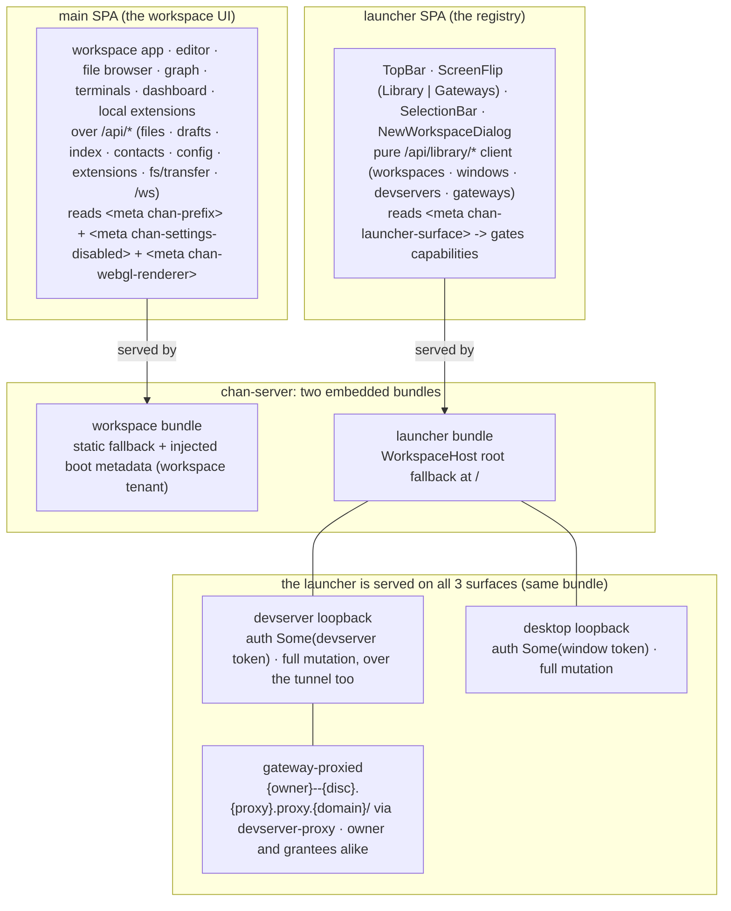
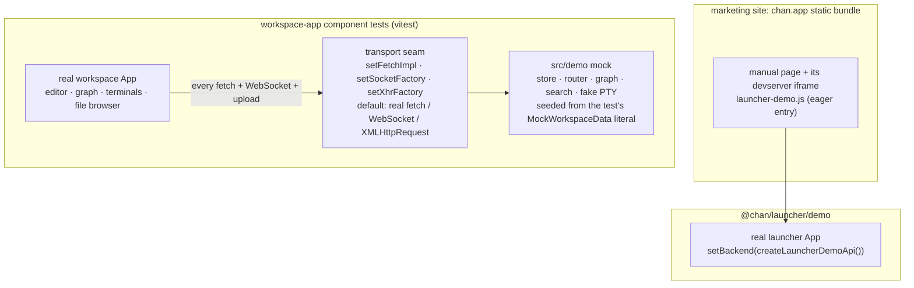
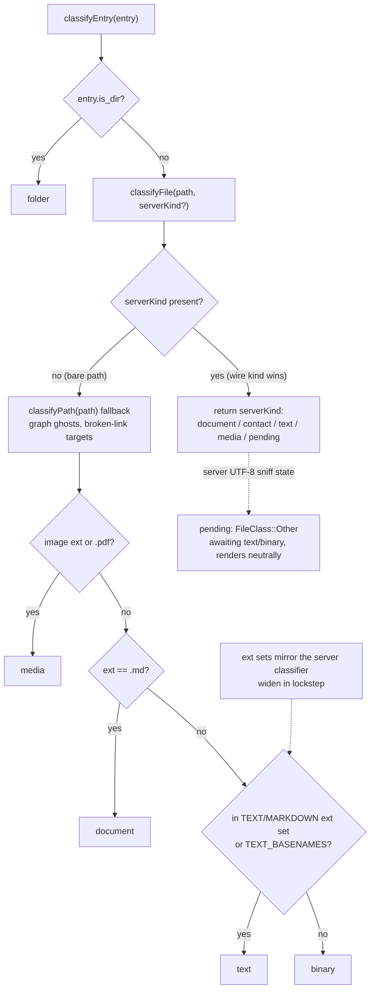

# chan web frontend design

Design reference for the chan web frontend: first the two web SPAs and how each is served, then the frontend-only launcher embed on the marketing site and the workspace app's in-memory test transport, then the color system all share. Update this file with changes to the frontend serving topology (including the marketing launcher embed), palette variable model, editor theme contract, syntax highlight palette, or kind taxonomy.

## Two web frontends

chan ships **three** Svelte 5 + Vite web SPAs: the gateway profile SPA (`@chan/profile`, served by the gateway identity service), plus the two below, embedded into chan-server as bundles and built on the color system below:

- **The main SPA** is served as the workspace tenant fallback. The server stamps boot metadata for the URL mount prefix, whether Settings is disabled, and an optional desktop terminal-renderer capability, so a reverse-proxied instance builds correct `/api` URLs, can grey restricted controls, and follows the native WebKit process's renderer decision.
- **The launcher SPA** is served at the host/library root `/` through the `WorkspaceHost` root fallback. It reads `<meta name="chan-launcher-surface">` to derive registry-mutation, desktop-bridge, and self-managed-window capabilities. The launcher is reached on **all three surfaces**: devserver/tunnel, gateway-proxied (`{owner}--{disc}.{proxy}.proxy.{domain}/`), and desktop loopback. The same bundle is installed per surface, with three surfaces (desktop / devserver / readonly) derived from that meta; over the gateway the owner and a grantee get the same surface, since a grant is all-or-nothing. Its serving and auth contract is documented in the launcher design doc.

The two are complementary: the launcher is the cross-workspace registry (pick / add / toggle a workspace, mint a window), and opening a workspace window lands the user in the main SPA. Both honor the theme axes + canonical palette below, so a launcher served over a tunnel and the workspace UI on loopback read identically.

chan-desktop appends `chan-renderer=webgl|dom` to a workspace URL only when it has decided whether that WebKit process has the accelerated path. A Linux AppImage carries its GUI-bootstrap decision and non-Linux desktops carry WebGL; other Linux packages emit no signal and therefore stay on DOM. The serving tenant converts the last recognized value into `<meta name="chan-webgl-renderer" content="1|0">`, including when the tenant runs behind a tunnel on another machine. The main SPA uses that signal for xterm.js on native windows, treats a missing or invalid native signal as DOM, and ignores it in ordinary browsers, which keep WebGL. The `chan:terminal-webgl` localStorage override remains the diagnostic hatch in both directions.

Both SPAs mount the same `@chan/web-shared/CommandDeck`, rendered inline inside the page that invoked it on every surface; there is no native launcher window. When hosted by a `WorkspaceHost`, the workspace adapter may mint a live-window-bound capability for the one library serving it. That capability's deck neither shows workspace state nor turns a workspace on or off, so the one question it asks of a workspace's lifecycle status is whether a window may be opened over it: only a `running` mount qualifies, and a mount that is up while its root cannot be read (`unavailable`) is left out along with every other status, because the library refuses the mint for all of them. A direct `chan serve --standalone` tenant has no root launcher router; after that route answers 404/405, its adapter exposes only same-tenant browser navigation for `New terminal` and `New window`, with a fresh `w` each time. It never fabricates a library roster or window controls. A remote workspace never receives the desktop launcher's aggregate bearer, inventory, or query.

The browser deck opens a blank popup synchronously for New terminal and New window, and acquires a named popup synchronously for Focus and Show. After creation returns a launch path, it checks that path with an uncached GET that follows the capability redirect to the tenant page. For an existing window, the record held at the gesture decides: a nonblank popup whose record reads `connected` is focused or unhidden without checking, reading its document, writing or navigating. A disconnected record is checked, and its popup is navigated whatever its document shows, including HTML or JSON refusals, engine error pages and another site, unless its record read again when the check answers says otherwise. A blank popup with no live mark is checked even if its record reads connected. An unreadable location is not blank. The invoking window itself is focused without a check for either connection value, because it is already executing the app. Native desktop actions use their native commands and open no browser popup.

When the check answers, a popup that is not blank is read again before it is navigated. The deck asks for a snapshot of its own: one GET of the whole scoped snapshot per repair, carrying the wait's signal and inside its sixty seconds, joining no display poll and never shown. A window that reads connected by then keeps its page and counts as success, so Focus and Show unhide it. A window missing from the snapshot ends the wait as a closed popup does, with nothing navigated or unhidden. One that still reads disconnected is navigated. A failed read rejects once and leaves the popup and its visibility as they were. A popup that is blank, then or once the read answers, is navigated whatever the read says. The GET goes through the capability, so a missing capability is minted first, with up to four POSTs while the server answers 403, and a revoked one is minted again and the GET sent once more. Each request is capped at ten seconds, and the wait's deadline still ends the whole repair at sixty.

The capability in the launch path is the credential; a stale path's 401 is returned to the caller without minting again. The check reads each refusal body once through the same reader as the app's JSON requests and streams. Only a blank document receives the waiting line; content type decides nothing. Guarded access leaves an unreadable document without a mark or line while allowing its location to be assigned. A refused repair closes only a blank popup that its own gesture opened, one with no mark of any age or form. A blank that an earlier wait left keeps that wait's mark and stays open with its waiting line until its user closes it or a later gesture repairs it. A nonblank popup keeps its page, and the rejection reaches the shared deck once, for its card or the host's status line. When the helper runs, Focus and Show unhide only after it returns success, and a repair that returns closed, finds the record gone or is refused changes no visibility. A connected popup that is not blank, and the invoking window, are unhidden without the helper.

Both browser hosts use the [shared window-page wait](../../web-shared/src/window-page.ts). A 503 retries according to `Retry-After`, with at least one second after each answer and a sixty-second total bound, including a stalled request or body. Closing the popup cancels the wait. The bound returns the last refusal's sentence, or a timeout sentence if no refusal arrived. Calls from one page share a pending answer. The helper's mark on a readable document says until when it holds: sixty seconds for a wait, and ten seconds after a navigation's assignment, a policy rather than a measurement. A mark past its time, or one promising more than that, reads as none, so a stopped navigation or an exited owner is repaired by the next gesture once its mark runs out. A live navigating mark is answered with success at once. A live waiting mark is followed: the caller focuses the popup, sends nothing, and looks every 100 ms until the other wait navigates or replaces the document, the popup closes, or the mark is removed or runs out, and then decides from what the popup holds. So Focus and Show unhide nothing before another page's wait is decided, and the pending card can last the owner's remaining lease and then the caller's own sixty seconds. A popup its user reloads while another page waits on it reads to a follower as that wait's navigation, so a Focus or Show can unhide a record whose popup still shows what it showed before. A wait whose popup another page took after its mark ran out answers what that page makes of it and closes nothing. A wait that ends without navigating puts back the mark it replaced, spent if that value still reads live. The launcher retains its handle-less record for an explicit Open or Close, including records whose popup was blocked, and a closed popup discards nothing while a launcher Open of it is still deciding.

The connection rule has costs. A live socket belongs to a window id, not to a particular browser tab, so another tab on that id can keep a broken one from being repaired. A connected record whose window this page cannot reach by name gets a new blank popup from Focus or Show, which is always repaired and so becomes a second live window on that id. The deck's snapshot decides whether a window is repaired at all, and it is as fresh as its last successful poll: the deck polls when it opens and every 2.5 seconds while it shows, a reopened deck shows the previous opening's records until its first poll answers, and a failing poll keeps the old snapshot for as long as it fails. A record that reads connected there is trusted with no read, so a popup whose socket has dropped since is focused as it is. A read that still says disconnected reloads the popup, on a decision taken when the check answers, up to sixty seconds after the gesture. A page that is still booting loses its elapsed boot. A loaded page whose socket is down, including one about to reconnect, is reloaded under its user and loses what it held in memory. A transfer in it meets the browser's leave prompt: Leave ends the transfer, and Stay cancels the navigation and leaves the page marked as navigating for ten seconds, after which the next gesture repairs it again. A deliberate Focus or Show on a disconnected record takes back a named window its user moved to another site; the launcher's Open follows the same rule. A user move during a pending check can also be taken back on success. A create discards the record it minted whenever no window will show it: when the check is refused or runs past its sixty seconds, when the popup is closed before or during the wait, and when its user took the popup elsewhere, each through a `close_window` action. Except for the last, those discards run in the background, so the deck reports why the create ended and a refused discard leaves the record listed for a Close. A popup that its user takes to another page before creation answers, of this origin or another, is left as it is: it is not named, marked, checked, navigated or closed, and the deck says "The new window was not opened because its tab was taken to another page." That discard is awaited so that the sentence can say whether it worked, and a refused one says that the record could not be removed. The sentence shows once the discard answers. Each request through the capability is capped at ten seconds, as for the repair's read, and a missing or revoked capability is minted first, so that wait is bounded but can take more than one request. A refused creation or check, or a refresh that rejects after the page opened, closes the popup only while it is still the unmarked blank its gesture opened. The look cannot see a typed address that has not committed when creation answers: that popup still reads blank, so it is named, marked and checked, and its user's navigation races the wait's.

The launcher's browser Show repairs disconnected browser-origin records from both its deck and its row before unhiding, without an explicit focus call; acquiring the named window may still raise it. A launcher Show on a connected or native-origin record changes visibility without opening a window. A popup the browser blocks is reported by the launcher's Open, Focus and Show with the same sentence as here. Its Hide and native desktop paths keep their separate visibility and native actions.

The check and navigation are separate requests: the server can still refuse the navigation after a successful check. Only 503 is retried; other refusals and transport failures end the wait immediately. A gateway whose tunnel is gone answers 404, as JSON to the check and HTML to a navigation. It answers 502 for a failed request or 504 for a timeout while it still holds the tunnel handle.

The shared deck shows a command's error on a card only while open on the command's draft, with the command still owning the card and no intervening close observed. Every execution has a token, including commands without a pending card; a later execution, confirmation preparation or release takes ownership away. An awaited command must still hold its pending card. The deck observes its own open/close state, including a synchronous host close immediately after dispatch, without relying on the representation of a cleared draft. In every other case it clears only that run's pending card and passes the original item and rejection to the host's required `onError` callback. This host shows one status message led by the command title; the launcher host uses its notice ring. A reported failure never becomes a card on reopen or reload. Only a failure actually shown on a card is kept as an error in the saved draft.

Contextual commands close and clear the deck before running so their overlays and focus targets can take over. This includes the global system/light/dark theme commands and the light/dark theme commands for editor, file browser, terminal, dashboard and graph surfaces. A refused preference write rolls back its optimistic value and reaches the status line through the same callback, once per invocation. Scoped library actions stay in the deck while pending and use its card while they retain ownership.

Local extensions are a main-SPA-only surface. Bootstrap fetches the process-ready catalog from `/api/extensions`, registers one late-bound Apps command per stable extension ID, replacing them all on each refresh so a removed or renamed extension leaves no row behind, and opens a keep-alive `extension` tab containing an opaque-origin sandboxed iframe. The in-memory catalog carries only a random tenant-relative proxy path; Chan keeps the subprocess port and token private and serves the iframe through the workspace's existing IP, port, and prefix in standalone, desktop, devserver, and tunnel modes. Only the ID and display title enter tab serialization or cross-window drag payloads. The iframe sends no referrer and relays only the host shell chords Chan advertises through the versioned keyboard `postMessage` contract. Terminal-only windows skip discovery, and the in-memory test transport serves no extension catalog.

## Workspace input

User-assigned shortcuts require Mod, Ctrl, Cmd or Alt; Shift alone does not make a key assignable. The predicate beside the grammar in `state/shortcuts.ts` is shared by key capture and config hydration. Rejected capture leaves the assignment dialog composing, and hydration drops rejected slots so a command inherits its built-in chord. The registry's own chords and keyboard-event resolution are independent of this assignment rule.

Search advances its request token on every input change, including a cleared query. Content, language and path results, errors and loading completion are accepted only for the current token, so an in-flight request cannot refill a cleared panel or report an error for the discarded query.

Rich Prompt tracks recall on the terminal tab with the message id and original text. Both a pending card and an empty composer recalling its last queued message stay locked in the `recalling` phase while cancellation waits. A queue refusal settles recall as rejected, restores the saved text for editing and shows "queue full, try again". Consuming the rejection clears the pending message, so the later cancellation reply does nothing. Queue and delivery frames do not settle the recalling phase. A successful removal restores the text for editing; an already-delivered reply clears the composer and shows "already sent". Cancellation has the same five-second acknowledgement bound as submission. A timeout, failed cancel send or closed socket fails the prompt and preserves its text with the existing warning that it may still be queued. The terminal socket's wire messages are shared by both recall paths.

## Frontend-only launcher demo and the workspace test transport

The launcher SPA also runs with **no backend** on the public marketing site (`@chan/marketing`), so the `chan.app` manual shows a live launcher instead of a screenshot. This is a third serving path: not chan-server, but the static site embedding the *same* Svelte app against an in-memory backend. Nothing is extracted or forked. `@chan/launcher/demo` renders the real launcher `App` with `setBackend(createLauncherDemoApi())`, a backend-interface swap; the marketing build bundles it as `launcher-demo.js` under `/assets/` and scopes its global CSS to the embed frame. The launcher is mounted without an `onOpenWindow` hook, so a window tile opens nothing: the workspace app is not on the site.

The workspace app has no single backend interface (it hits `fetch` and WebSocket across ~70 endpoints and six sockets), so its in-memory backend swaps one level lower, at the **transport seam**: `api/transport.ts` routes every HTTP call through `chanFetch`, every socket through `createSocket` and every multipart upload through an XHR factory, all defaulting to the real browser globals. The seam is a test fixture, not a serving path. `src/demo/install.ts` installs the in-memory mock (`src/demo/`: store, router, graph, search, fake PTY) before a component test mounts the real `App`, seeded from the `MockWorkspaceData` literal the test builds; the sync, heartbeat and upload unit tests swap one primitive at a time through the same setters. The default path is unchanged, so the chan-server-embedded bundle never carries a mock. `src/demo/graph.ts` reproduces chan-server's `/api/graph` node/edge id schemes and directory spine so the graph view cannot tell the sources apart.

## Terminal replay recovery

A terminal session frame names the byte cursor at the end of the attach replay. If the socket closes before `ready`, the client marks the replay cut and the next dial asks for the whole retained ring, ignoring both its live cursor and its cached snapshot. A numeric `replay_bytes` above zero arms a screen reset immediately before the first replay byte. Zero preserves the screen and normal scrollback while an alternate-screen prelude and private-mode reassert pass through. The mouse filter and OSC 52 observer discard their partial sequence tails on either kind of redial. The reset write's completion restores the saved keyboard protocol in place after xterm's RIS handler has cleared it and before the replay's queued bytes are parsed.

A reset can repaint only what the ring retains: if the ring has dropped bytes, history older than its first byte is lost from the client, and a line above the replay reports the missed byte count. With an older server that omits `replay_bytes`, the client keeps its screen and still asks for the whole ring, so history may repeat rather than be erased. The snapshot guard covers replay frame arrival through `ready`; it does not wait for every queued renderer write to finish parsing.

## Transfer teardown and native upload routing

Page teardown saves transfer records as they stood before cancellation and then suspends all storage writes until `pageshow`. Transport cancellation still settles the in-memory rows; its promise callbacks, pending progress timers and bubble changes cannot replace the teardown record. Reload turns a saved active row into an interrupted one, with Retry for a download. A page restored without reloading retains its cancelled in-memory rows and resumes persistence on its next transfer change.

In a standalone window, the native Upload and Replace pickers opt into the standalone Files upload contract with `app=files` and the window id. A native `cs upload` command omits the app marker and uses the terminal transfer contract, which follows linked destination directories. Workspace windows do not emit the Files marker. Browser upload routing uses its existing Files contract.

## Backlinks after a rename

The note status bar queries a path after 600 ms. On a path change it keeps the displayed count until a second query, scheduled 2.6 seconds after the change, answers. The filesystem watch notification and graph-cache invalidation precede indexing, so neither proves completion; the second query allows the longest configured debounce of two seconds and the 200 ms worker tick to pass. Replies and timers from an abandoned path are discarded. A busy indexer can still finish later than this delay; the bar does not poll indexing completion.

## Paths

A workspace path is what the server sends for an entry under the workspace root: its components joined by `/`, with no leading or trailing `/`. `/` is its only separator. On a Unix server `\` is an ordinary character of a name, so a file named `a\b.md` is listed, opened and titled as `a\b.md`; a Windows server spells every path with `/`, so none of them holds a `\`. `basename` and `parentDir` in `state/format.ts` name a workspace path's last component and its parent by that rule. The demo transport's in-memory server names an entry with a cut of its own, as the server does, but takes an entry's parent from `parentDir`, so a test over the demo follows a change to `parentDir`. The path classifier in `state/fileTypes.ts` also cuts a name of its own, at `/` alone, because the file-classes check compiles that module by itself and it imports nothing.

A host's path is not a workspace path. A workspace's root (`WorkspaceInfo.root`, a registry row's path) is spelled as its host spells it, and the web app does not know the host's platform where it shows one. The workspace's display name and a dashboard's workspace slot cut a root's last component at `/` or `\`, which misreads a Unix root whose last directory holds a `\` by naming it after the `\`. The command deck cuts a registry row's root at `/` alone, as the launcher does, so a Windows root with no label reads whole there. A path a user types in the path prompt is checked before it is sent, and a `\` is refused there with `:`, `?` and the other characters Windows does not allow in a name, so that a workspace still opens on Windows.

## Colors and themes

The rest of this document is the single reference for the chan frontend color system: two theme axes, one canonical semantic palette, and a fixed syntax-highlight palette for code.

## Two theme axes

The frontend has two independent theme dimensions. Both can change at runtime.

1. **Color scheme** (`data-theme="light"` or `data-theme="dark"`). Controls the entire CSS-variable palette: backgrounds, text, accents, pill hues, graph node hues, etc. The dark scheme is the default variable block and light is an override block. App state applies the resolved choice to `<html>`. Because the blocks key off the *attribute* (not the `html` element), a Hybrid surface can re-apply a scheme to its own subtree: each surface root (editor, browser, graph, terminal, dashboard) sets `data-theme={surfaceThemeOverride(kind)}` from the `hybrid_surface_themes` preference, overriding the global pick for just that surface.

2. **Editor theme** (`data-editor-theme="github"`, `"google_docs"`, or `"word"`). Controls the editor surface only: body font, heading scale, code font, link color, code-block slab bg, table borders, blockquote rule. It is expressed as `--chan-editor-*` variables with neutral defaults and per-theme overrides. Dark variants must support both root-level and descendant `data-theme="dark"` selectors so a per-surface dark override restyles the editor too. App state applies the editor-theme attribute to `<html>` (default `github`); the preference (`editor_theme`) lives server-side and propagates to every open window via the WS `config_changed` event. The picker is the editor surface's config flip-side.

The axes are orthogonal. Any combination of color scheme by editor theme is valid (6 combinations total). Only the color-scheme axis affects app chrome (panes, status bar, file tree, panels, modals); the editor-theme axis is scoped to the editor surface.

A third, fixed dimension is the **syntax-highlight palette**. It is GitHub Primer (light or dark, branched off the color scheme) and is shared across all three editor themes, so a python snippet reads identically regardless of which document chrome is active. It paints fenced code blocks (per-language packs lazy-load) and whole files in Source mode. One deliberate Primer divergence is part of the contract: plain identifiers get no color because Primer's orange collides with chan's brand orange.

## Canonical semantic palette

Each concept gets one hue across surfaces (graph node, file-tree row, info-pane accents, editor pill). Picking a hue per concept means the same item reads the same color whether you see it in the graph, the editor, or the inspector.

Concept hues are stable across surfaces: document orange, media purple, tag green, contact/warning yellow, date/folder neutral grey, broken/error red, source royalblue, binary dark grey, language pink, and drafts yellow tint.

## Resolved values per surface

Graph nodes, file-tree icons, and editor pills read from the same concept palette rather than inventing local hues. Some concepts have no representation on a given surface (for example tags do not have file-tree icons, and folders do not have editor pills).

The graph reads `--g-contact` for contact and mention nodes. It defaults to `var(--warn-text)` and is settable per theme mode as part of the graph palette (`editor.graph_colors.*`).

`--chan-color-language` is the source token for the language hue; `--g-language` and `--chan-color-code` alias it.

Pill backgrounds (`--pill-*-bg`) are alpha tints of the concept hue (~0.15-0.20 dark, ~0.10-0.14 light). Foregrounds split by scheme: dark mode uses `var(--text)` for every pill (the tinted background alone carries the hue); light mode uses the deep hue as ink (`#c25a1f` wiki, `#7a4cd8` image, `#2f9444` tag, `#9a6700` contact, `#6c6c70` date, `#c93232` broken). Wiki and tag pills also define `--pill-*-bg-hover` because they are click targets.

## Kind taxonomy

The frontend defines one unified taxonomy used by every chip, tree icon, and inspector header glyph. Three families:

- **FileKind**: things that exist as files in the workspace. `document` | `contact` | `text` | `media` | `binary` | `pending`.
- **EntityKind**: graph-only entities (tokens extracted from markdown bodies, no file backing). `tag` | `mention` | `date`.
- **ContainerKind**: `folder` (directory rows in the file tree).

`classifyEntry`/`classifyFile` resolve a workspace entry to one kind:

`classifyEntry(entry)` / `classifyFile(path, serverKind?)` is the single classifier. The server projects a `kind` discriminator on every regular file it lists, and that wire value wins whenever present. The path-only fallback runs only for bare paths held outside a tree listing (graph ghost rows, broken-link targets): images + PDFs are `media`, `.md` is `document`, `.txt` plus the source/config/shell extension set and well-known basenames (Makefile, LICENSE, ...) are `text`, everything else is `binary`. The extension sets mirror the server classifier and must be widened in lockstep. `pending` is a server-side state for unknown extensions awaiting the UTF-8 content sniff; it only reaches the SPA from the recursive whole-tree listing and renders neutrally.

One chip component renders every kind. Inspector headers pass `block` (flex:1 fill); the search results list passes `compact` (smaller font + fixed-width column). `ghost` and `dim` modify opacity for graph ghost rows and search filename-match rows respectively. Passing `onClick` renders the chip as a button (the "scope the graph to this file" affordance).

### Per-kind mapping

Documents and source-like text share the document hue family but use different icons and labels. Contacts and mentions share the warning/contact palette; media, binary, tags, dates, and folders each use their corresponding concept hue and glyph.

`text` aliases the document orange in `colorVarFor`; the two share the hue family and the visual distinction is icon + label, not color. The graph's source-file nodes use `--g-source` royalblue; the graph renderer owns that mapping, not the chip.

A `mention` shares the contact palette by design: a resolved mention points at a contact file, an unresolved mention is the same concept without a backing file. Distinguishing the two is the role of the inspector, not the chip.

## Functional and chrome variables

The color-scheme axis owns app chrome: surfaces, text, lines, hover/selection states, functional colors, buttons, bubbles, shadows, and drafts tint. The editor-theme axis owns document chrome: body, headings, code, inline links, and block elements. Keep the axes separate so a color-scheme change does not imply a document-theme change.

## Axis intersection

Slab bg and the H1/H2 hairline rule track the editor theme; the syntax palette only tracks the color scheme.

## Adding a new concept

1. Pick a hue family. Try to reuse an existing one (document orange, media purple, tag green, contact yellow, source royalblue, language pink, neutral grey, error red) before introducing a new hue. Each new hue has to defend its hue distance from those already in use.
2. Add the dark + light hex to the color-scheme palette blocks under domain-specific variable names (`--<concept>-fg`, `--<concept>-bg`, etc.).
3. Pipe the new variable into every surface that should display the concept (graph node, file tree row, info accents, editor pill, etc.). Each surface reads its own variable name so a future hue swap is a one-line palette edit.
4. Add the row(s) to this document.

## Adding a new editor theme

1. Add a named editor-theme stylesheet. Override only the `--chan-editor-*` tokens that should diverge from the neutral base; missing tokens fall through to the color-scheme palette.
2. Light goes under `:root[data-editor-theme="<name>"]`; dark goes under `:root[data-editor-theme="<name>"][data-theme="dark"]` plus the descendant `[data-theme="dark"]` form for per-surface overrides.
3. Register the stylesheet with app startup.
4. Add the value to the API type contract and register the option in the editor config picker.
5. Decide whether the theme wants the GitHub-style H1/H2 rule; opt in by setting `--chan-editor-h{1,2}-border-bottom` and `--chan-editor-h{1,2}-padding-bottom` (the neutral base defaults these to `none` / `0`).

The new theme inherits the GitHub Primer syntax-highlight palette automatically; it is not part of the editor-theme contract.

## Change discipline

Palette, editor-theme, syntax-highlight, serving-topology, and kind-taxonomy changes update this document in the same commit. When widening text/source extension handling, update the server classifier and frontend fallback together.
