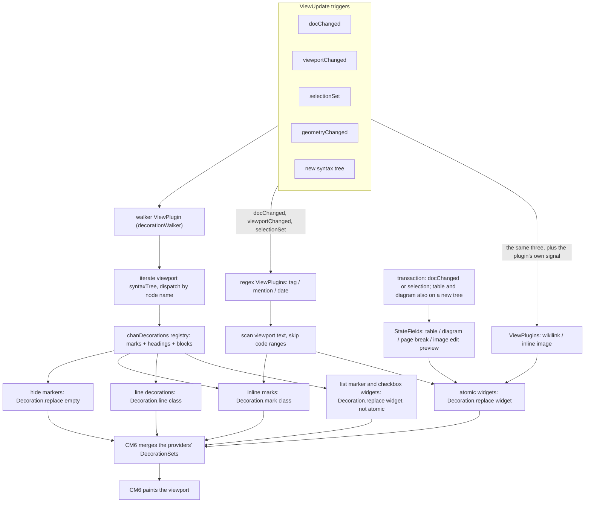
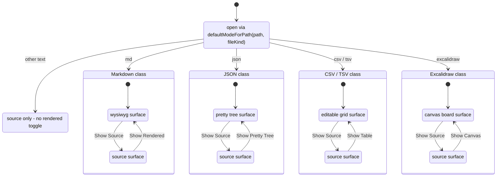
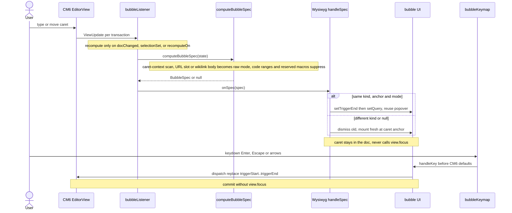
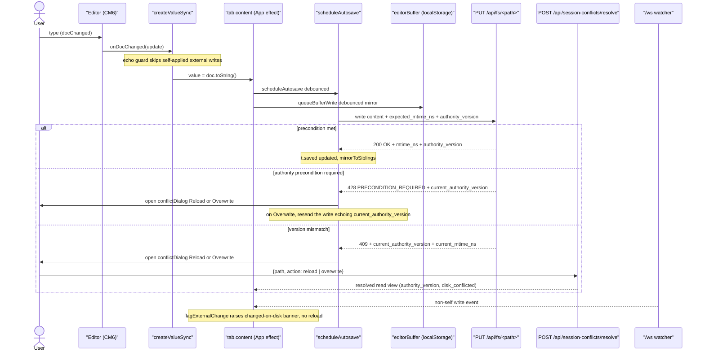

# chan editor (CM6) design

Load-bearing reference for the chan editor. Mirrors the workspace design doc's role for the editor surface.

## Model

The document text IS the markdown source. `view.state.doc.toString()` is the file on disk; there is no separate rendered tree and no serialization layer. The editor decorates the source in place (hide markers, render widgets) so it reads like rendered markdown while every character stays editable. This is the Live Preview model, the same architecture as Obsidian's.

Because the source is the single source of truth, the editor sidesteps a class of structural bugs a rendered-tree model is prone to: editing 1-char marks like `*a*`, flickering pending-mark heuristics, and markdown round-trip escape gymnastics. See "Why 1-char marks work" below.

## The contract (10 invariants)

1. **Doc invariant.** `view.state.doc.toString()` is the markdown source. Always. No transform layer. Autosave writes it directly.

2. **Token detection.** `syntaxTree(state).iterate({from, to, enter})` from `@codemirror/lang-markdown` + GFM, extended with three custom lezer extensions: `[[wikilink]]` (inline), YAML frontmatter (block-start, so headings inside `---...---` are not promoted), and a ref-aware link interceptor so `[label with [inner]](path)` still forms the outer link. Fenced code bodies parse with lazy-loaded per-language packs. Tokens that are not lezer nodes - `#tag`, `@@mention`, dates - are matched by regex in their own ViewPlugins, skipping code ranges.

3. **Decoration taxonomy.**
   - **Hide markers**: `Decoration.replace({})` over `*`, `**`, `~~`, `` ` ``, an external link's `[`, `](`, `)` and URL, an autolink's `<` and `>`, `# ` heading prefixes, ```` ``` ```` fences with the language text beside the opener, the whitespace around a list marker and after a task's `[ ]`, and a task item's bullet. Every other list marker is replaced by a marker widget rather than hidden (a `Decoration.replace({widget})` that is not atomic). Blockquote `>` and `---` rules are never hidden or replaced: `>` is the visual cue that a line is quoted (Obsidian convention), and replacing `---` with a rendered rule makes the markdown harder to edit.
   - **Inline marks**: `Decoration.mark({class})` over the *content* between markers - emphasis, strong, strike, inline-code, link-label.
   - **Line decorations**: heading levels (`cm-md-h1..6`), list lines, blockquote lines, fence opener/content/closer rows - CSS paints size, indent, borders, slab background.
   - **Atomic widgets**: `Decoration.replace({widget})` over the *whole* range - wikilink/internal-link pill, image, date pill, GFM table grid, mermaid diagram, page break. `EditorView.atomicRanges` registered for each so caret motion skips them in one keystroke. The task checkbox is a replace widget over just the `[ ]` / `[x]` marker (not atomic; the click toggles the source).

4. **Visibility rule (per token kind).**
   - **Marks** (bold/italic/strike/code/link markers): hide unless the active selection intersects the OUTER token range `[from, to]`. Equality at the boundary counts as intersection, and the outer-range rule (not per-marker) means a caret near `*a*` reveals both `*` together instead of `*a` then `a*`.
   - **Heading prefixes** (`# `): hide unless the caret line intersects the heading's line. Selection-intersect alone causes flicker as the caret crosses the prefix mid-line.
   - **Atom widgets**: each widget runs its own test. The wikilink pill, the date pill, the table grid and a diagram show unless a selection range touches the range they replace, its two ends included; on a touch the widget is suppressed and the source shows, so the user can edit it literally. An image tests the strict interior instead: a caret at either end of its source selects the image and keeps the widget, and only a caret inside the source, or a non-empty range overlapping it, enters edit mode, where the source shows beside a block preview. A page break shows its source while a selection range's lines overlap its line.
   - **Fences**: the ```` ``` ```` markers and the language text beside the opener are hidden unless a selection range's lines overlap the block's lines; an unclosed fence has no closing marker, so its block runs to the end of the parsed node. While revealed, the language text carries a mark, and the badge on the opener row shows the language either way.
   - **List markers**: no selection test, so they render the same with the caret on the item. A marker is replaced by a widget: `-` and an ordered number show their literal text, `*` and `+` show a glyph picked by nesting depth. The indentation before the marker and the whitespace after it are hidden. A task item's `[ ]` / `[x]` is replaced by the checkbox; its bullet is hidden, while an ordered task keeps its number in front of the checkbox.
   - **Always-visible markers** (`>`, `---`): never hidden. A quoted line gets a line decoration; `---` has no handler, so it shows as typed.

5. **Atom strategy (split by token type).** A widget dispatches a document change only into a view the user can edit, and `widgets/writable.ts` is the one predicate that answers it: read-only is spelled two ways, `EditorState.readOnly` for the prompt composer and the `EditorView.editable` facet for the document surfaces, and CodeMirror enforces neither against a programmatic dispatch. Selection and effect dispatches are not writes and do not consult it.
   - **Wikilinks (`[[note|alias#anchor]]` and `[label](path)` where `path` is internal)**: atomic pill widget. Pill kind (file / contact / image / broken) resolves via `GET /api/resolve-link`, cached per target. Editing means caret-adjacent reveals raw text, OR click pill -> wiki bubble.
   - **External markdown links `[label](https://...)`**: `link` mark on the label. Unless a selection range touches the link's outer range, the markers (`[`, `](`, `)`) and the URL are hidden; a link with an empty label keeps its URL visible, marked as the link text. A range touching the link reveals the whole source, the URL dimmed, for editing in place.
   - **Naked URLs**: mark only, no hide.
   - **Tables**: read-only grid widget; click drops the caret at the source start, which reveals the pipe form for editing.
   - **Diagrams (mermaid, mermaid-to-excalidraw)**: a closed ```` ```mermaid ```` or ```` ```mermaid-to-excalidraw ```` fence renders as a diagram atom while the caret is outside; caret inside reveals source. A hover "View" button opens a fullscreen pan/zoom overlay, always on a light panel with a light render so a dark-theme diagram never vanishes on the dark backdrop. Both fences share one widget (`widgets/diagram.ts`, one decoration field per fence language with its own caches) over per-renderer render modules (`mermaid_render.ts`, `excalidraw_render.ts`); each library is dynamic-imported on first render.
   - **Tag `#word` / mention `@@{name}` pills**: mark-based (no replace), with click handling delegated through one content-DOM listener.

6. **Selection rule for ranges.** A non-empty selection has no reveal rule of its own. Each visibility test in invariant 4 runs over every range of the selection, so a token kind answers a range as it answers a caret: marks and external links reveal when a range touches the token's outer range, heading prefixes and fences when a range's lines overlap theirs, and an atom by its own widget's test. List markers, task checkboxes, `>` and `---` take no selection test and render the same under any selection.

7. **Bubbles** (`[[`, `![`, `@@`, `@`, `#`) open/close from `computeBubbleSpec`, which inspects the doc text around `state.selection.main.head` on every document or selection change via `bubbleListener`; the editor host mounts/reuses the bubble UI. Triggers also fire in "raw" mode when the caret sits inside an existing Link/Image URL slot or `[[...]]` body, so commit replaces the right range. Triggers never fire inside code ranges, and the reserved macro words (`@today`, `@date`, `@pagebreak`, `@break`) suppress the contact bubble. The bubble keymap intercepts before CM6's defaults via a high-precedence `keymap.of`. Bubbles must NOT call `view.focus()` mid-flow - the caret stays in the document and the popover runs alongside it.

8. **Find** uses one shared `scanMatches` pipeline. The `findField` and `FindAdapter` shape are shared by both Source and WYSIWYG modes.

9. **Fold** is a custom heading gutter over `@codemirror/language`'s fold state (`codeFolding`), folding the range a heading-aware computer returns. Heading detection has one source of truth: the lezer syntax tree. A line is a heading iff the tree resolves it to a non-empty `ATXHeading1..6` node, so a `#` inside a fenced block, a tilde fence, an indented fence, an inline code span, or frontmatter is never a heading; the gutter marker and the gutter click read `headingLevelAt`, and the click folds the range `headingFoldRange` returns. A heading folds end-of-line -> start of the next `ATXHeading{<=n}` line (or doc end); the forward scan runs to doc end so it forces the parse past the lazy viewport (`ensureSyntaxTree`). Three recorded decisions: indented ATX headings (up to three leading spaces, CommonMark) fold, matching the tree; an empty heading (a bare `#` with no text, which lezer still parses as `ATXHeading1`) does not fold, since it has no section under it; and Setext headings (`===` / `---` underlines) are out of the fold gutter. The chevron gutter is custom (headings only): `foldGutter()` would chevron every foldable block because lang-markdown marks paragraphs, quotes, and fences foldable too. The same tree-based code-node guard stops the block-formatting chords (`setBlockKind`, `toggleLinePrefix` in `commands/format.ts`) from rewriting a fenced `#` comment.

10. **Autosave** writes `view.state.doc.toString()` on `update.docChanged` to the bindable `value` prop. The echo guard prevents prop write-back from clobbering the caret, and the debounced autosave pipeline owns the server write. No serialize step. While a tab is attached to its doc session (`/api/doc/ws`), edits ride `@codemirror/collab` update logs (remote peers paint as cursors) and saves are flush confirmations; the debounced autosave + CAS `PUT` below is the fallback when the channel is unavailable. The write contract on `PUT /api/fs/<path>` is server-authority per path: a read of the path returns `authority_version` + `disk_conflicted`, and a changed-content write echoes the `authority_version` it last saw (alongside `expected_mtime_ns`). The server answers `428 PRECONDITION_REQUIRED` when that authority precondition is required but missing, and `409` on a version mismatch, carrying `current_authority_version` + `current_mtime_ns`. Both are the refusal envelope with the code `write_conflict`: the save path opens the conflict dialog on that code, and a 409 or 428 without it is a failed save. A watcher event for a non-self write flags a "changed on disk" banner instead of auto-reloading; once a session goes dirty/conflicted, the divergence is resolved explicitly via `POST /api/session-conflicts/resolve` with `{action: reload | overwrite}`. A debounced localStorage mirror keyed by path is kept for hang-recovery.

## Decoration pipeline

The decorations come from several providers, each with its own DecorationSet and its own recompute test, and CM6 merges the sets when it paints. The walker re-walks the viewport syntax tree on a document, viewport, selection or geometry change, or when the parser hands it a new tree; its registry yields the hide markers, the inline marks, the line decorations, and the list marker and checkbox widgets. The atomic widgets are not the walker's: the wikilink pill, the inline image and the date pill each come from a ViewPlugin, and the table, the diagram, the page break and the image's edit preview each from a StateField. The tag and mention plugins scan the viewport text and add marks.



## Why 1-char marks work

`*a*` is three real characters in the doc: `*`, `a`, `*`. The emphasis token's outer range is `[0, 3]`, with its `*` markers at `[0, 1]` and `[2, 3]`, and both markers get hide-decorations whenever no selection range touches `[0, 3]`, its two ends included. A caret at offset 1 (between `*` and `a`) is inside `[0, 3]`, so both markers reveal together, as they do at offsets 0, 2 and 3. No special case. Backspace deletes a real `*` character the user can see, and round-trip is the identity function. A rendered-tree model that represents `*a*` as a single marked node has no integer caret position satisfying `from < caret < to` when `to - from == 1`, which is the structural reason that model needs a per-pattern boundary patch and this one does not.

## Modes

The file editor host owns a per-tab mode: `wysiwyg` | `source` | `pretty` | `table` | `canvas`. Markdown (.md) pairs WYSIWYG with source; Excalidraw scenes open as the interactive canvas board; JSON opens as a collapsible tree and CSV/TSV as an editable grid, each with source as the toggle. Any other text-kind file (.txt included) is source-only - source IS the sensible surface for a .py / .toml / Makefile. Source mode highlights by extension via the same lazy language packs.

A drawing's canvas (`ExcalidrawCanvas.svelte`) writes the tab's buffer only from a seeded board. Seeded means the drawing library, past its own init, holds the whole buffer of a finished load as its init would restore it (the elements, the files, and the part of the appState its serializer keeps: the grid and the background; a file whose id the board already holds keeps its bytes), and the canvas holds the library's serialization of it as the baseline. The canvas seeds when the library first reports that its loading state has cleared, which is its init's own change, and after that whenever the tab's load finishes or its buffer changes without the board, as a reload, a conflict's resolution or a sibling pane's mirror does. Every seed puts the buffer on the board through the library's restore, whatever the board was built from, and takes the baseline in the same synchronous run, so no stroke lands between them; a stroke begun before the seed is replaced by it. The library shows an update's appState only at its next render, which for a seed made outside the library's own change comes in a later task, so the canvas keeps the appState a seed handed until the library shows it and lays it over what the library reports in every serialization, the baseline's and every flush's alike: a flush between the seed and that render publishes nothing. A handed key is dropped when the library shows another value for it than it showed when the key was handed, so a change the library reports first, as a click's or a key's own render does, leaves it handed. Until the library hands its API over, which its App's constructor does in the same synchronous commit in which the App mounts and reads its initial data, every render of the board carries the buffer as its initial data, so the App is built from the buffer whichever render it mounts with; that decides what the first frame shows, and nothing rests on it. The canvas publishes a serialization only while it is seeded and its tab is not loading, and only one that differs from the baseline or from the last it published, so a board nobody drew on writes nothing and never dirties its tab: neither the empty scene of a load in flight nor the library's rewrite of a file it did not write. The library marks an image whose file fails to decode after the load; a scene that differs from the baseline by such marks alone joins the baseline and is neither published nor offered to a live session, and the mark is written with the user's next edit. A load in flight unseeds the board, which keeps the drawing on screen in view mode until the load ends and seeds it again, and a tab reopened after a close during its load reads its file again. The library's order of events this rests on (the imperative API handed over before the init, the App built with the props of the render in effect when it mounts, the init replacing every element set before it, no change reported before it, an update's appState shown at the next render) is read from `@excalidraw/excalidraw` 0.18.1's source and was not run in a browser; `src/__tests__/excalidrawLibrary.ts` models it, and a test fails when the installed version is another. If the drawing library fails during a render, a React boundary clears the canvas API and seed, cancels the pending serialization and shows a loss and recovery alert; the failed canvas renders no new library board, and a Source-to-canvas switch or a tab reopen mounts one from the buffer. Its scene binding remains bound after failure, so a live frame arriving then is dropped at the canvas until a new mount binds and replays it.

A board writes the library's changes into its tab's buffer once 200 ms pass with no new one: the wait starts again at every change the library reports, so what waits is everything drawn since the last such pause. The flush the host registers for the tab in the tabs' store commits a change still waiting, and every way a drawing's tab or its window goes that runs page code runs it first, a forced close aside. A tab's own close, the close of a pane or of its tabs, a move to another window and a layout reconcile commit it before they read the buffer, so it counts as any unsaved edit does. The control client's `cs pane close-tab`, `cs pane close` and `cs pane close-all` commit it before they ask each tab whether it has unsaved changes, so a stroke inside the wait blocks the close with unsaved changes and the command closes nothing; the same command closes the tab once an autosave, or on a live board the push's ack, has come. With `--force` they commit nothing and close at once; a pane's close leaves a live board's scene session to linger, so what the board commits as it is torn down can still reach the authority, where a tab's close releases the session first. A move to another pane, by its tab strip or a drop on its edge, commits it before the tab is copied there. A reorder within a pane and a move to the pane's other side keep the board, whose tab becomes the copy, and commit it before the copy as well: where the copy's buffer is not the board's own last serialization, as before the first change after the drawing opened, the board reseeds from that buffer, which then holds the change. Hybrid Nav commits each file tab's waiting input before copying the live layout into its displayed draft and before copying that draft back into the live layout, so both replacements carry the board's first stroke. Every way the page asks the desktop to hide or close its window (the red dot's prompt with its Hide and its Close, the red dot at once while the window reconnects or holds no tab, the hide-window and close-window commands from a chord, the host or the command deck, and a chord a user assigned to either) and an unload run no tab's close: they commit every board's waiting change, run the effects that queue each tab's recovery write, and write every queued recovery write, a text tab's included. A way a window goes that runs no page code commits nothing: `cs window hide`, the launcher's hide, and a desktop window the desktop destroys on its own, as at its quit or a devserver's disconnect, unless the webview fires an unload event then, which is not known. The recovery buffer is not a save, and it is the browser's storage for the page's origin: a local window on the desktop is served from a loopback port the desktop picks at each launch, so its entries last as long as the desktop's run. The next page load's open of the file offers an entry only when the file was not written after the entry's stamp, by anyone: a live board's authority writes the file as soon as its last window detaches, so an entry whose last push never left the window can be retired by the authority's write of what did arrive. A file replace's refresh commits a waiting stroke before it checks whether the tab is clean, and Reload from disk commits one before it asks whether to discard it. The watcher's missing-file check and the tab menu's Reload, changed-on-disk banner's Reload and conflict dialog's Reload commit nothing first; a load's end reseeds the board and can lose that stroke.

With a live scene session, the board takes the authority's appState from a snapshot or an update as the library keeps it: the canvas restores and serializes that appState as the seed does a buffer's, so only the grid and the background reach the board, each at the library's default where the file lacks it (and the grid's size and step also where they are not finite numbers, then rounded and clamped to 1..100), and a view key in a file's appState never does. That value becomes, at once, the appState the authority is known to hold, the appState the next push offers, and the appState laid over the board's in every serialization until the library shows it, so a flush or a push made before the library renders the adopt sends nothing older over it. The canvas pushes an appState only when the board's, as the serializer keeps it, differs from the authority's as a value, both compared as JSON with sorted keys, so the authority is not handed, and does not write, an appState nobody changed on the board, whether the file's is `{}`, carries keys the serializer drops, or lists its keys in another order; a change of the grid or the background is pushed. While this window's own appState push is on the wire, or queued behind one, the session hands the canvas an update's elements and files and withholds its appState: the authority applies that push after the update, so this window's value is the one that stands. A peer's edit reaches the tab's buffer only through the canvas's flush, and no push-ok follows it, so after each flush that writes the buffer and leaves none of its appState unpushed the canvas asks the session to mark the buffer saved, which the session does only while attached and with nothing of this window on the wire, queued or not yet handed over; a local change keeps waiting for its own push-ok.

A live board binds to its scene session once it has taken its first seed, and not before: the library hands its API over before its init, whose apply replaces every element put on the board before it, and the seed at the init's first change then hands the buffer's appState. Until the bind, every snapshot and update waits in the session's scene, which holds those frames and this window's own pushes, each with its elements, its appState and its files, taken when the session takes the push. The bind replays that scene onto the seeded board as an adopt, so the board shows what the session holds beyond the file, an older copy the file carries loses to the session's, and a board nobody touched pushes nothing, except when the file holds an image the authority does not hold. A first seed at the library's change runs in the library's task and the bind in the microtask after it; a first seed made when a tab's load ends after the library's init is followed by the bind in a later pass of the same flush. No frame lands between them in either. The bind depends on the session and that first seed alone: it binds again when the session is replaced or its prop goes through null and back, and not when the roster or the tab changes, though the replay reads both. A board that has not taken its first seed pushes nothing. A later reseed keeps the binding: a conflict's resolution or a sibling's mirror reseeds from the buffer and replays nothing, so no replay brings back an element that buffer deleted, and a reload releases the session while the tab loads and binds it again when the load ends. That leaves a reseed from a buffer older than the authority, which a conflict's resolution answered before a peer's push can hand a bound board, on the board with the scene's marks: its older elements are offered, the authority discards them and the canvas marks them as sent, so the board shows them until their next update, and its older appState is pushed over the peer's. While this window's appState claim stands, an update's appState stays out of the scene as it stays off the board, since the claim is what the authority keeps. A snapshot belongs to the socket it came on: until the current socket's has landed, the session takes no push and replays nothing, so no push that leaves on a socket is handed back by that socket's first snapshot, which hands back as unaccepted only what an earlier socket carried, and a push discarded with a bound canvas is handed back to that canvas, while a push discarded without one is held outside the shadow until a fresh snapshot and a later bind can replay and offer its missing elements, appState and files. The server also fans a snapshot to every attachment, on the socket each has, when a conflict's resolution leaves the scene unchanged or overwrites the disk. Such a later snapshot ends none of this window's pushes, since the authority applies those it reads after it and acks them on that socket: they stay claimed, their parts stay in the scene over the snapshot's but for an element the snapshot holds that the authority keeps against the push's, a newer one or one of the same version with the lower nonce, and while this window's appState claim stands the snapshot's appState stays off the board, as an update's does. The claim then ends as any push on the wire ends: at its push-ok, at the socket's close, or at the next socket's first snapshot.

That has three costs. An appState this window picks between a socket's opening and its snapshot, like one picked while the socket is down, is replaced by the snapshot's when the snapshot is applied; elements and files that stayed local are reconciled with the snapshot and pushed. A save that waits on such a push waits for the snapshot for at most `SCENE_FLUSH_TIMEOUT_MS` (4 s), after which the session degrades and the save falls back to the classic PUT, or until the socket closes and the reconnect's grace (two attempts or 3 s) runs out, which degrades the session with its socket down: the save then writes nothing, as a save does during any outage that is still retrying, and the tab reads unsaved until the reattach pushes the elements and files that stayed local. And a tab can hold a session with no seeded board: a board whose library never reports its init's change never seeds, and a restored drawing tab that was never brought to the front has a session and no board, since the host loads the canvas at the tab's first showing and acquires the session whether or not it is shown. Neither binds, pushes or publishes, and an explicit save of such a tab whose session flush fails, by the timeout or a flush error, falls back to the classic PUT of the buffer, which is the load's text, with the tokens of the session's last frame. The server applies such a PUT to the live scene when those tokens pass its check, and its replace makes a deletion of every element the text lacks, so a peer's edit made after the load can be deleted; that path is read and not run.

One thing stays open. A grid or background changed while the network is down, or in the moment it drops, turns back when the network returns, and the tab reads saved: the authority never took it, the reattach's snapshot carries the older value, the session hands the canvas that snapshot before it takes a push, and an appState is one value with no version, so nothing offers the change again; the elements drawn with it are pushed.

`FileEditorTab` picks the initial mode by file class, then toggles source against the single rendered surface each class pairs with; plain text is source-only.



## Bubbles

A document or selection change recomputes the bubble spec; the host mounts or reuses one popover and commits a range replace through a high-precedence keymap, never stealing focus from the document. A bubble that closes itself (Escape, a click away, a pick) is not opened again while the caret stays in the trigger that opened it, since the next keystroke there only changes the query; a caret that leaves that trigger, or a new trigger, clears that memory. The closes the host makes for its own reasons (another trigger, no trigger, a read-only flip) are not remembered.



## Server contract

The editor relies on three server contracts: file reads/writes with optimistic CAS, picker/classification lookups for links, contacts, tags, headings, and images, and a watch stream whose self-write filtering keeps autosave from reloading the buffer it just wrote.

## Autosave and conflicts

This is the detached/fallback path; an attached doc session replaces the PUT with collab pushes and flush confirmations. A keystroke flows through the echo guard and debounced autosave to `PUT /api/fs/<path>`, carrying `expected_mtime_ns` + the last-read `authority_version`; a missing authority precondition returns 428 and a version mismatch returns 409, each with the code `write_conflict`, and either opens the conflict dialog; a non-self `/ws` event only raises the changed-on-disk banner. A dirty/conflicted session is resolved explicitly through `POST /api/session-conflicts/resolve` (`reload` | `overwrite`).

An attached document or scene session writes through its authority. A flush the server cannot make (a full disk, a permission) keeps the editor: the session writes the error as the tab's save error, which the toolbar shows as not saved while the tab is dirty or the session holds what the file lacks (a live tab's confirmed text counts as saved, so the tab stays clean), and a flush that lands clears its own error. A failed live save degrades the session and waits at most `DOC_FALLBACK_SETTLE_MS` or `SCENE_FALLBACK_SETTLE_MS` for pending pushes. A positive answer for every relevant push permits the classic PUT with the latest authority token; timeout, socket closure and a later snapshot on the same socket leave the PUT withheld, the buffer marked unsaved and the close warning active. A fresh socket snapshot reopens live synchronization with retained local edits; a confirmed live flush or a guarded classic PUT clears the unsaved mark.

A classic save request that fails also keeps the text editor or drawing board and shows "Not saved" with the failure reason on the toolbar. A later request that writes the buffer or meets a conflict clears that reason; a load failure still replaces the editor because there is no complete buffer to show. Closing a dirty file after a failed save asks whether to keep editing or close without saving. A draft's close or promotion and a move to another window instead leave the tab open and give one notice; failures of draft inspection, discard, promotion or the path prompt give their own notice without claiming a save failed. A thrown write does not set the refusal hold that keeps a drawing off its live session.

A drawing's save checks its text first. Text that does not parse is not written: the tab keeps its editor with the text as typed and says on its toolbar that the file was not saved and why, and in board mode the placeholder says the drawing has not been saved and points to Show source code. The toolbar gives the parse reason for invalid text; when the text parses, that reason clears on the next autosave check, but the board placeholder can still hold valid text awaiting a write or conflict resolution. A successful write or an edit back to the saved text clears the hold; a load or rename out of the check clears it too. While that hold remains, the tab takes no live document or scene session, so the write carries the tokens of its load and meets the conflict check; the cost is that the tab shows no peer's cursors and merges no live edits until then. A close of such a tab asks whether to keep editing or close without saving, and a close that also ends a running terminal asks "Close tabs?". A draft has its own close flow: with unsaved text that does not parse its close runs no save and opens the draft's dialog, which then names no destination, gives the parse reason and offers Discard Draft and Cancel alone, with focus on Cancel. Discard removes the draft with nothing written first, and Cancel keeps the tab with the text as typed. A draft whose text on disk does not parse and has no unsaved edit keeps the dialog that saves it. A move to another window stays open instead and says that the file was not saved, and so does a draft's Save to Workspace.



## Implementation notes

- List continuation and indent/outdent match the current line with a regex, not the syntax tree, so the edit stays cheap and local.
- Heavy or optional modules load lazily on first use: mermaid and mermaid-to-excalidraw + excalidraw (diagram render; excalidraw carries React, so both are dynamic-imported and code-split out of the eager editor bundle), turndown (HTML-paste -> markdown), HEIC -> WebP conversion before image upload, and the per-language code packs (one vite chunk each).

## Out of scope

- In-cell table editing: the grid atom is read-only; edits happen in the revealed pipe/dash source.
- YAML highlighting inside frontmatter: the block is isolated and dimmed, the body is unstyled.
